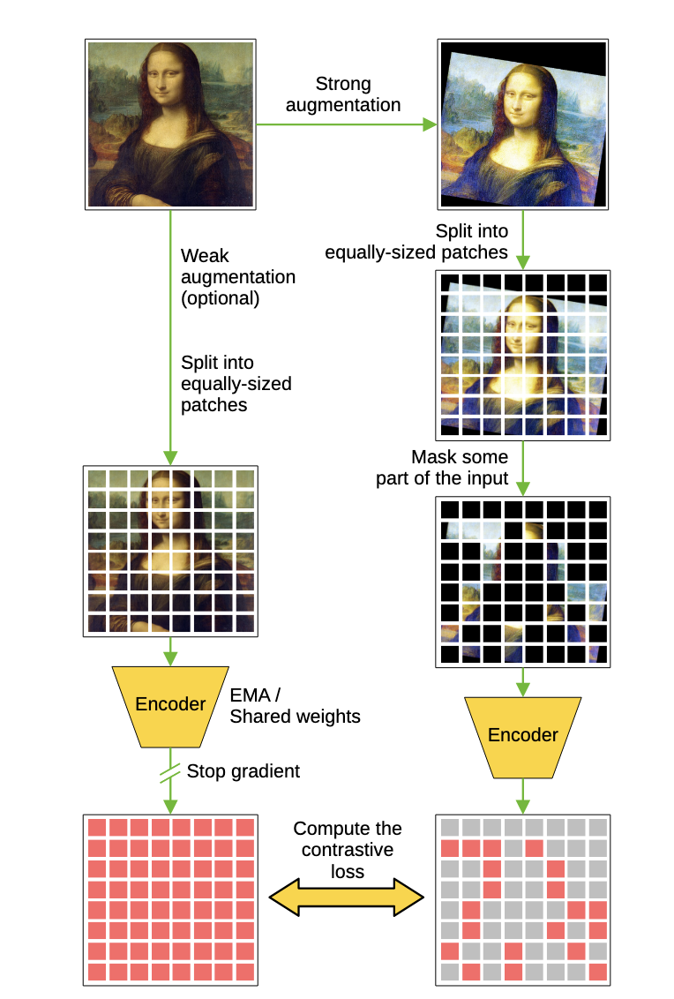

# Code for bachelor thesis

This repository contains the code for my bachelor thesis. It is a PyTorch implementation of ViLBERT, a model that combines visual and language understanding.
I'm currently working on it, so it is not yet complete.

## Installation & Usage

To install:
```bash
git clone https://github.com/cesipy/bsc-code
cd bsc-code

# in virtual env:
pip install -r requirements.txt
```

To run the code, you have to set the following environment variable:
```bash
export PYTHONPATH="${PYTHONPATH}:$(pwd)/src"
```


For the basic evaluation program `argcomplete` is installed. This is for tab completion.  Its included in the `requirements.txt` file, to install run:
```bash
activate-global-python-argcomplete
```


## Optuna parameter tuning
To perform either hyperparam-optimization or neural architecture search (NAS), simply run:
```bash
python src/hyperparameter_optimizer.py

#opt: to see visualizations via dashboard:
optuna-dashboard sqlite:///res/hyperparameter_optimization/optuna_study.db
```


## Implementation Decisions

This section covers implementation decisions.

### Datasets

the pretraining dataset is downloaded using `src/download_cc.py`. It tries to download and open pictures from the conceptual captions dataset (`res/data/conceptual-captions/Train_GCC-training.tsv`). Some links are invalid and some images not openable, those are not saved.
In the downloading step, I already resize to 224x224, in order to save memory.

In the dataset handling in `src/datasets.py`, transformations for the timm-vit are applied.
```python
vit_transform = create_transform(**config)        # this was used before
vit_transform: Compose(
    Resize(size=256, interpolation=bicubic, max_size=None, antialias=True)
    CenterCrop(size=(224, 224))
    MaybeToTensor()
    Normalize(mean=tensor([0.4850, 0.4560, 0.4060]), std=tensor([0.2290, 0.2240, 0.2250]))
)
```

But as I already resize the images to 224x224, I don't need the resizing and cropping anymore.
=>
```python
from timm.data import IMAGENET_DEFAULT_MEAN, IMAGENET_DEFAULT_STD
vit_transform = transforms.Compose([
    transforms.ToTensor(),
    transforms.Normalize(mean=IMAGENET_DEFAULT_MEAN, std=IMAGENET_DEFAULT_STD)
])
```

This generates the correct input for ViT. In the dataset, then the transformations are done. for pretraining, masking the language tokens, masking the vision tokens and creating the correct task for alignment prediction.


The custom datasets inherit from `torch.utils.data.dataset` and return the following dictionary:
```python
{
	"task": task.value,  # Task enum value
	"img": img_embedding,  # Image embedding as tensor
	"masked_img": masked_img,  # Masked image as tensor
	"masked_patches_idxs": masked_patches_idxs,  # Indices of the masked patches
	"text": text_embeddings,  # Text embeddings as tensor
}
```

If alignment on new datasets should be tested, it should have the form of:
```python
{"img": ..., "text": ..., "label": ...}
```


### Optimization
The optimization for this thesis consists of two task. i) to get the best hyperparams for a given depth (lr, epochs, dropout_pro) and ii) to optimize with those hyperparams using neural architecture search for the best coattn configuration.

currently those parts are seperated by modules (might be different in newer implementations). `hyperparameter_optimizer.py` is used for hyperparam optimization and `experiment_tracker.py` for neural architecture search.


### Pretraining

There are three pretraining tasks in ViLBERT: Masked Language Modelling, Masked Image Modelling, Alignment Prediction

### MLM
for 15% of all tokens:
- 80% replaced with [MASK]
- 10% replaced with random token
- 10% unchanged

array of length of tokens is returned. if masked: masked token, if not `token[i] = -100`(value for lossfunction to ignore it)

### Alignment Prediction
predict if images and caption are aligned. Is a dataset of 50/50 balance.
- "research has been focused on two main schemes, either reconstructing the masked signal, or comparing two latent representations, one for the unaltered input signal and one for the masked input."


### MIM

Two options: reconstruct masked patches, contrastive comparision of hidden representations.

Basd on my research I go for the contrastice approach, as this seems more interesting for me to implement.

<figure>
    
</figure>

the workflow is the following:
1) augment the data. Not yes timplemented
2) mask image => (image, masked_image)
3) encode(masked_image); encode(image)
4) compute infoNCE on the representations, ONLY FOR UNMASKED tokens.


dataset returned from dataloader/dataset:
```python
{
    "task": task.value,
    "img" : img_embedding,      # og img, as tensor
    "masked_img": masked_img, # masked image as tensor
    "masked_patches_idxs": masked_patches_idxs, # indices of the masked patches,
    "text": text_embeddings,
}
```

## ViLBERT
original [vilbert](https://github.com/facebookresearch/vilbert-multi-task) under `vilbert/vilbert.py`.


---


## TODO
**today**:
- [ ] differences in alignment metrics for different num_samples
- [ ] differences in alignment metrics for differen K_KNN
- [ ] aligned sim & cosine sim implementation + correlations


**immediate:**
- [ ] pretrain vs non-pretrain: run the same experiments on finetune-only!
- [ ] update `all_finetune_logs` with new finetunes. currently includes up to late fusion
- [ ] test acc und loss für finetunes, wo noch nicht geändert und in `all_finetune_logs.txt` inkludieren. Nur für `upmc_food, mm_imdb` Für
    - [ ] pretrain_early_fusion
    - [ ] pretrain_middle_fusion

- [ ] pretrain für starke MM-imdb. optuna 1 ist stark für hateful_memes, optuna2 ist guter kompromiss => optuna 3 fehlt!
- [ ] still optuna 3 needed! good archicture for mm_imdb alone!

- [ ] correlation analysis of metrics on all new architectures
- [ ] is finetuned good performance indicator for pretraining good performance?
- [ ] convert all torchvision to albuminations + seeding

- [ ] https://docs.pytorch.org/tutorials/recipes/recipes/tuning_guide.html
- [ ] fix coattentions not really saved in intermediate_representations,
	- [ ] better logic for that

- [ ] analysis of pretrained models: discrepancies in end representation of streams

- [ ] experiment_tracker:
	- [ ] implement other tasks in run experiment
- [ ] implement baseline - early concat
- [ ] fix intermediate collection

- [ ] alignment analysis:
    - [ ] compare bs-analysis-sizes: same config, different seeds and analysis - size
    - [ ] test set in hm instead of train: even if val -loss declines, alignment still increases (with train loss decreasing)
    - [ ] normalize all the metrics
- [ ] compare KNN_K
- [ ] compare correlation of the measures


- [ ] baselines:
    - [ ] no coattn- is my code working?
    - [ ] early fusion
    - [ ] nocoattn with more layers to account for additional parameters in vilbert => vilbert #params == baseline #params

- [x] implement baseline - t_biattn_id=[], v_biattn_id=[]
- [x] larger k in mknn
- [x] correlation analysis: not for all tasks, architectures and epochs, only focussing on one
- [x] visualization for svvca
- [x] visualizations with KNNK=32
- [x] check new measures with contrastive loss ON! and directly compare.
    - maybe also contrastive pretraining
    - also normal pretraining!
- [x] fix testset handling...
- [x] try running on mm_imdb with slightly bigger lr, more epochs, when does it plateau?
    - [x] report for hm; this is pretty known, as most of the current progress is for HM.
    - [x] report for upmcfood
- [x] run visualization and alignment for trained model.
    - needs to restore model with highest acc/ lowest loss
- [x] include test set for:
    - [x] upmc food
    - [x] mm imdb
    - [x] hateful memes	- problem here, there are no labels
- [x] seed from config, not global var