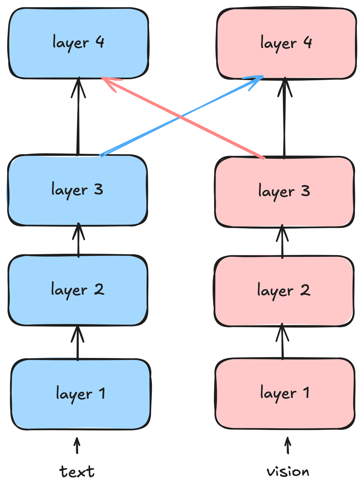
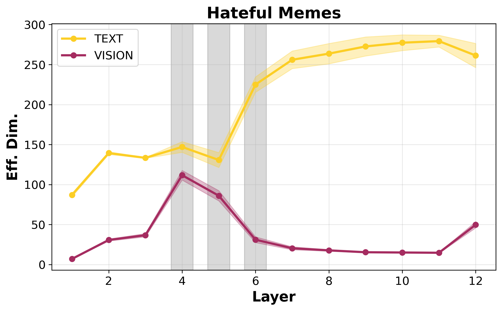
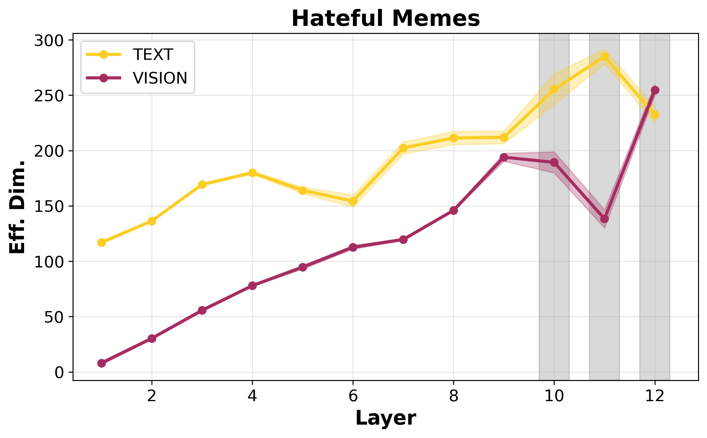
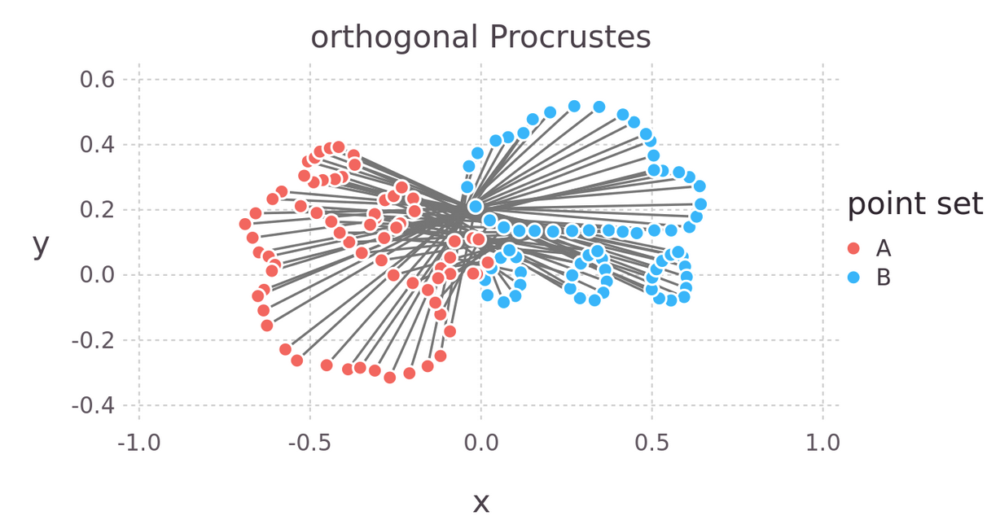
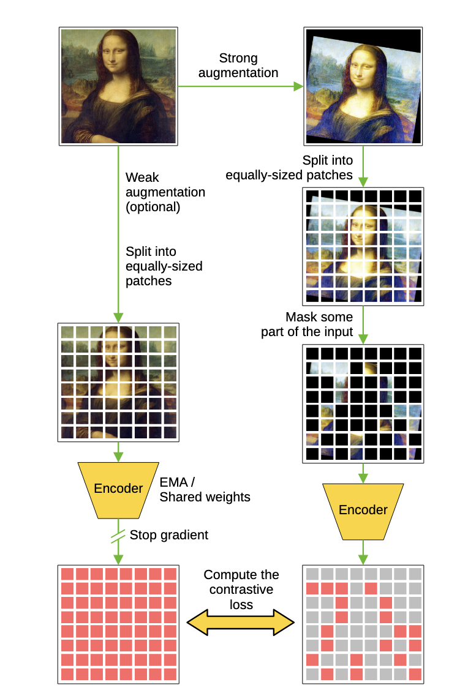

# Code for bachelor thesis

This repository contains the code for my bachelor thesis: Probing Layer-wise Alignment Depth in Multimodal Transformers. It is a PyTorch implementation of ViLBERT, a model that combines visual and language understanding.

## Overview
This thesis investigates representational alignment in the dual-stream architecture [ViLBERT](https://github.com/facebookresearch/vilbert-multi-task).
This is a encoder-only transformer architecture, transforming input pairs $(img, text)$ to a final vector of dimensionality $n=768$

Basically, ViLBERT consists of one stream per modality:
- BERT for text
- ViT for vision


Specifically, this work probes the effect of cross-attention placement (Early, Middle, Late Fusion) between the two streams.
Here, representational alignment is analyzed using metrics like CKA, SVCCA, mkNN, and Orthogonal Procrustes.
<br>

<figure>

</figure>

### Key Findings
- late Fusion consistently outperforms Early and Middle Fusion across downstream tasks.
- mechanistic analysis shows that Early Fusion forces a Dimensionality Collapse in the vision stream (~87% reduction), permanently constraining the model's capacity to extract rich semantic features. Vision patches need time to develop abstract representations before cross-modal interaction.
- there is a correlation between representational alignment and performance, dependent on the redundancy of the two modalities, as proposed by [Tjandrasuwita](https://arxiv.org/abs/2502.16282)
- directly optimizing for CKA does not improve performance and can destabilize training.

### Results

| Model | HM AUROC | MM-IMDb F1 | UPMC Acc |
|---|---|---|---|
| Baseline | 0.654 | 0.483 | 0.887 |
| Early Fusion | 0.723 | 0.512 | 0.893 |
| Middle Fusion | 0.750 | 0.533 | 0.918 |
| **Late Fusion** | **0.764** | **0.545** | **0.928** |

Dimensionality Collapse (Early vs Late Fusion)
<figure>


</figure>


---
Read my blog article explaining the intuition for it [here](https://cesipy.github.io/posts/bachelor-thesis.html).
The full thesis can be viewed [here](./res/thesis_et_slides/thesis.pdf)
For a short overview, refer to my defensio's slides [here](./res/thesis_et_slides/slides.pdf)

## Repository Structure
this project is organized into several directories to separate data, models, and analysis scripts:

- `src/vilbert.py`: the main vilbert implementation.
- `src/attention.py`: custom implementation of cross-attention and transformer blocks.
- `src/trainer/`: task-specific training logic (hateful memes, mm-imdb, upmc-food101).
- `src/datasets/`: data loading and preprocessing for each benchmark.
- `src/analyses/`: scripts for computing alignment metrics (cka, svcca, etc.).
- `res/`: data samples, checkpoints and the thesis pdf.


## Model & Training
- vilbert implementation: found in `src/vilbert.py`. it coordinates the two streams and handles the cross-modal interaction.
- vit and bert: the vision stream uses a vit-base model from the [timm library](https://github.com/huggingface/pytorch-image-models/tree/main/timm), while the text stream uses a pretrained bert-base-uncased from huggingface. both are instantiated in `src/vilbert.py`.
- pretraining: implemented in `src/pretrain.py`. it trains the model on conceptual captions using masked language modeling (mlm), alignment prediction (ap), and a contrastive masked image modeling (mim) task.
- finetuning: handled via `src/finetune.py`. it adapts the pretrained weights to specific downstream tasks using the modular trainers in `src/trainer/`.


## Installation & Usage
For this project, it is recommended to use Python 3.10, as some torch functionalities are not stable in later versions yet.


To install:
```bash
git clone https://github.com/cesipy/bsc-code
cd bsc-code

# in virtual env:
pip install -r requirements.txt
```

To run the code, you have to set the following environment variable:
```bash
export PYTHONPATH="${PYTHONPATH}:$(pwd)/src"
```

For the basic evaluation program `argcomplete` is installed. This is for tab completion. Its included in the `requirements.txt` file, to install run:
```bash
activate-global-python-argcomplete
```

### Pretraining

The main scripts used for all experiments in this thesis are `src/pretraining_experiments.py` and `src/finetune_experiments.py`. These orchestrate the full pipeline across all fusion configurations and downstream tasks via `ExperimentTracker`. The lower-level `src/pretrain.py` and `src/finetune.py` exist as standalone entry points but were not the primary way experiments were run.

**Dataset:** Conceptual Captions — `res/data/conceptual-captions/train.csv` (images in `res/data/conceptual-captions/images/`)
**Downloader:** `src/download_cc.py`

Three pretraining tasks are trained jointly:
- `MASKED_LM` — 15% of tokens masked (80% → `[MASK]`, 10% random, 10% unchanged)
- `MASKED_IM` — contrastive InfoNCE loss on masked vs. unmasked image patches
- `ALIGNMENT_PREDICTION` — binary classification of whether an image and caption are aligned

```bash
# run all pretraining experiments across fusion configurations (early / middle / late / hybrid)
python src/pretraining_experiments.py

# or run a single pretraining directly
python src/pretrain.py           # all three tasks
python src/pretrain.py --no-mim  # disable Masked Image Modeling
python src/pretrain.py --no-mlm  # disable Masked Language Modeling
python src/pretrain.py --no-ap   # disable Alignment Prediction
```

Checkpoints are saved to `res/checkpoints/pretrains/`. Key hyperparameters are in `src/config.py`:
- `PRETRAIN_EPOCHS = 5`, `PRETRAIN_LEARNING_RATE = 1e-4`
- `BATCH_SIZE_PRETRAIN = 20` (remote) / `8` (local), `GRADIENT_ACCUMULATION = 26` / `64`


### Fine-tuning

**Main script:** `src/finetune_experiments.py`
**Task-specific trainers:** `src/trainer/hm_trainer.py`, `src/trainer/mm_imdb_trainer.py`, `src/trainer/upmc_trainer.py`, `src/trainer/vqa_trainer.py`

All downstream experiments were run via `src/finetune_experiments.py`, which uses `ExperimentTracker` to run multi-seed finetuning across tasks and pretrained checkpoints.

The three downstream tasks used in the thesis:

| Task | Dataset | Task type |
|---|---|---|
| `hateful_memes` | Hateful Memes (`res/data/hateful_memes_data/`) | Binary classification |
| `mm_imdb` | MM-IMDB (`res/data/mm-imdb/`) | Multi-label classification (23 genres) |
| `upmc_food` | UPMC Food-101 (`res/data/UPMC_Food-101/`) | 101-class classification |

```bash
# run all finetuning experiments (multi-seed, all tasks)
python src/finetune_experiments.py

# or finetune a single task directly
python src/finetune.py --task hateful_memes
python src/finetune.py --task hateful_memes --path res/checkpoints/pretrains/<checkpoint>.pt
```

Key hyperparameters in `src/config.py`:
- `DOWNSTREAM_EPOCHS = 9`, `DOWNSTREAM_LR = 3.4e-5`
- `BATCH_SIZE_DOWNSTREAM = 24` / `8`, early stopping with `PATIENCE = 3`


## Implementation Decisions

This section covers implementation ⁊ research decisions.


### Representational Alignment Analysis
In order to analyze representational alignment in the two streams similarity metrics $\varphi$ were utilized.
$\varphi:(X, Y )\rightarrow [0,1]$

Centered Kernal Alignment measures structural between the feature spaces and sample spaces, Singular Vector Canonical Correlation Analysis measures correlations in the principal components of both modalities.
Orthogonal Procrustes is a similarity metric based on geometric properties of two representation spaces $X,Y$

For instance, Orthogonal Procrustes is defined as:
$\varphi(\mathbf{X}, \mathbf{Y}) = \min_{\mathbf{Q}} \| \mathbf{X}\mathbf{Q} - \mathbf{Y} \|_F$,
where $Q$ is an orthogonal transformation.

<figure>

</figure>

This measures how much the representations are apart, after optimizing for rotation ⁊ translation.


### Datasets

the pretraining dataset is downloaded using `src/download_cc.py`. It tries to download and open pictures from the conceptual captions dataset (`res/data/conceptual-captions/Train_GCC-training.tsv`). Some links are invalid and some images not openable, those are not saved.
In the downloading step, I already resize to 224x224, in order to save memory.

In the dataset handling in `src/datasets.py`, transformations for the timm-vit are applied.
```python
vit_transform = create_transform(**config)        # this was used before
vit_transform: Compose(
    Resize(size=256, interpolation=bicubic, max_size=None, antialias=True)
    CenterCrop(size=(224, 224))
    MaybeToTensor()
    Normalize(mean=tensor([0.4850, 0.4560, 0.4060]), std=tensor([0.2290, 0.2240, 0.2250]))
)
```

But as I already resize the images to 224x224, I don't need the resizing and cropping anymore.
=>
```python
from timm.data import IMAGENET_DEFAULT_MEAN, IMAGENET_DEFAULT_STD
vit_transform = transforms.Compose([
    transforms.ToTensor(),
    transforms.Normalize(mean=IMAGENET_DEFAULT_MEAN, std=IMAGENET_DEFAULT_STD)
])
```

This generates the correct input for ViT. In the dataset, then the transformations are done. for pretraining, masking the language tokens, masking the vision tokens and creating the correct task for alignment prediction.


The custom datasets inherit from `torch.utils.data.dataset` and return the following dictionary:
```python
{
	"task": task.value,  # Task enum value
	"img": img_embedding,  # Image embedding as tensor
	"masked_img": masked_img,  # Masked image as tensor
	"masked_patches_idxs": masked_patches_idxs,  # Indices of the masked patches
	"text": text_embeddings,  # Text embeddings as tensor
}
```

If alignment on new datasets should be tested, it should have the form of:
```python
{"img": ..., "text": ..., "label": ...}
```


### Optimization
The optimization for this thesis consists of two task. i) to get the best hyperparams for a given depth (lr, epochs, dropout_pro) and ii) to optimize with those hyperparams using neural architecture search for the best coattn configuration.

currently those parts are seperated by modules (might be different in newer implementations). `hyperparameter_optimizer.py` is used for hyperparam optimization and `experiment_tracker.py` for neural architecture search.


### Pretraining

There are three pretraining tasks in ViLBERT: Masked Language Modelling, Masked Image Modelling, Alignment Prediction.

### MLM
for 15% of all tokens:
- 80% replaced with [MASK]
- 10% replaced with random token
- 10% unchanged

array of length of tokens is returned. if masked: masked token, if not `token[i] = -100`(value for lossfunction to ignore it)

### Alignment Prediction
predict if images and caption are aligned. Is a dataset of 50/50 balance.
- "research has been focused on two main schemes, either reconstructing the masked signal, or comparing two latent representations, one for the unaltered input signal and one for the masked input."


### MIM

Two options: reconstruct masked patches, contrastive comparision of hidden representations.

Based on my research I go for the contrastive approach, as this seems more interesting for me to implement.

<figure>
    
</figure>

the workflow is the following:
1) augment the data.
2) mask image => (image, masked_image)
3) encode(masked_image); encode(image)
4) compute infoNCE on the representations, ONLY FOR UNMASKED tokens.


dataset returned from dataloader/dataset:
```python
{
    "task": task.value,
    "img" : img_embedding,      # og img, as tensor
    "masked_img": masked_img, # masked image as tensor
    "masked_patches_idxs": masked_patches_idxs, # indices of the masked patches,
    "text": text_embeddings,
}
```

## Optuna parameter tuning
To perform either hyperparam-optimization or neural architecture search (NAS), simply run:
```bash
python src/hyperparameter_optimizer.py

#opt: to see visualizations via dashboard:
optuna-dashboard sqlite:///res/hyperparameter_optimization/optuna_study.db
```


## Next Steps

This thesis produced interesting results, that can be used for further experimentation.

