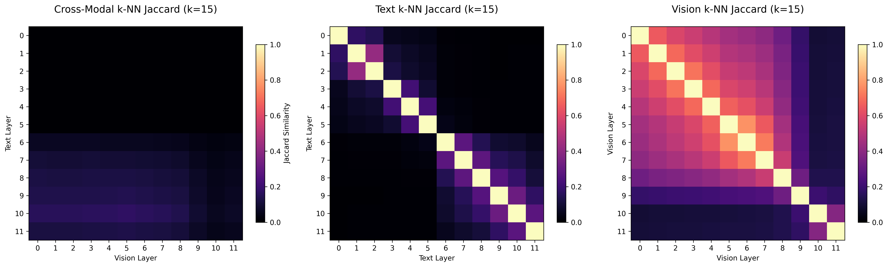
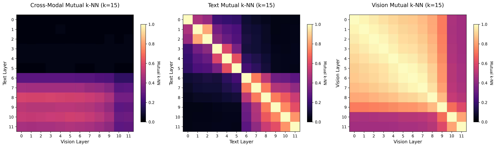
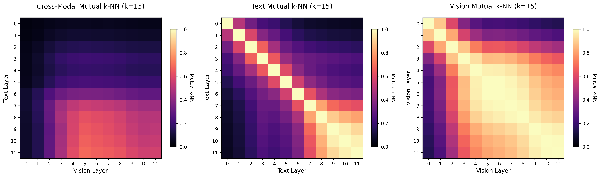
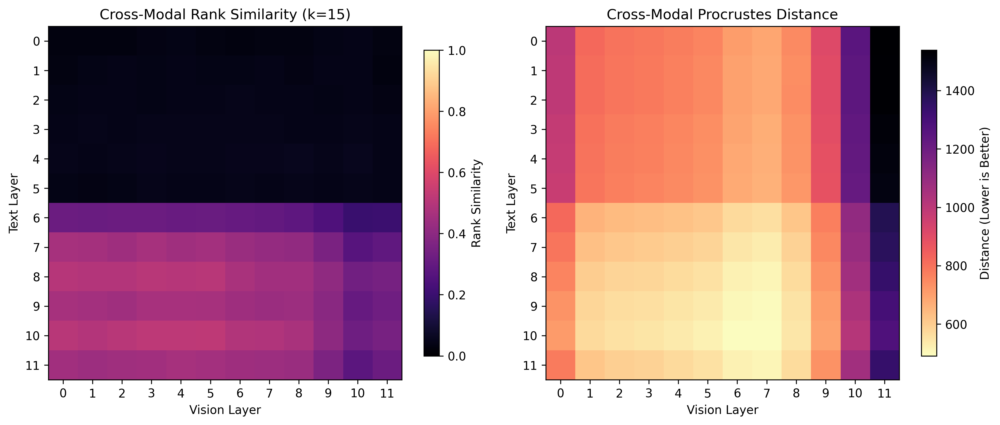
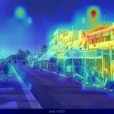
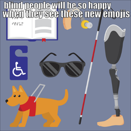
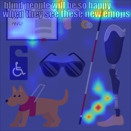
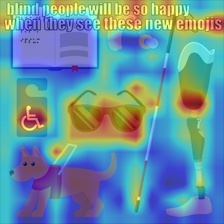
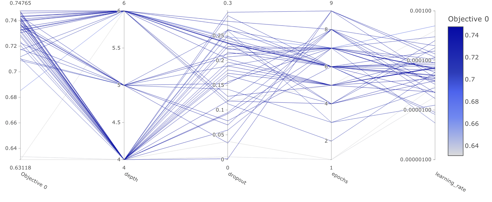
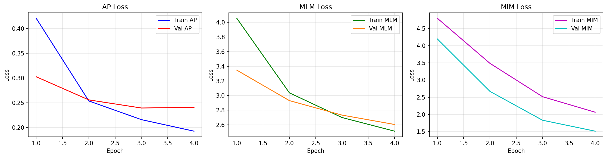

# Code for bachelor thesis

This repository contains the code for my bachelor thesis. It is a PyTorch implementation of ViLBERT, a model that combines visual and language understanding.
I'm currently working on it, so it is not yet complete.

## Installation & Usage

To install:
```bash
git clone https://github.com/cesipy/bsc-code
cd bsc-code

# in virtual env:
pip install -r requirements.txt
```

To run the code, you have to set the following environment variable:
```bash
export PYTHONPATH="${PYTHONPATH}:$(pwd)/src"
```


For the basic evaluation program `argcomplete` is installed. This is for tab completion.  Its included in the `requirements.txt` file, to install run:
```bash
activate-global-python-argcomplete
```


## Optuna parameter tuning
To perform either hyperparam-optimization or neural architecture search (NAS), simply run:
```bash
python src/hyperparameter_optimizer.py

#opt: to see visualizations via dashboard:
optuna-dashboard sqlite:///res/hyperparameter_optimization/optuna_study.db
```


## Implementation Decisions

This section covers implementation decisions.

### Datasets

the pretraining dataset is downloaded using `src/download_cc.py`. It tries to download and open pictures from the conceptual captions dataset (`res/data/conceptual-captions/Train_GCC-training.tsv`). Some links are invalid and some images not openable, those are not saved.
In the downloading step, I already resize to 224x224, in order to save memory.

In the dataset handling in `src/datasets.py`, transformations for the timm-vit are applied.
```python
vit_transform = create_transform(**config)        # this was used before
vit_transform: Compose(
    Resize(size=256, interpolation=bicubic, max_size=None, antialias=True)
    CenterCrop(size=(224, 224))
    MaybeToTensor()
    Normalize(mean=tensor([0.4850, 0.4560, 0.4060]), std=tensor([0.2290, 0.2240, 0.2250]))
)
```

But as I already resize the images to 224x224, I don't need the resizing and cropping anymore.
=>
```python
from timm.data import IMAGENET_DEFAULT_MEAN, IMAGENET_DEFAULT_STD
vit_transform = transforms.Compose([
    transforms.ToTensor(),
    transforms.Normalize(mean=IMAGENET_DEFAULT_MEAN, std=IMAGENET_DEFAULT_STD)
])
```

This generates the correct input for ViT. In the dataset, then the transformations are done. for pretraining, masking the language tokens, masking the vision tokens and creating the correct task for alignment prediction.


The custom datasets inherit from `torch.utils.data.dataset` and return the following dictionary:
```python
{
	"task": task.value,  # Task enum value
	"img": img_embedding,  # Image embedding as tensor
	"masked_img": masked_img,  # Masked image as tensor
	"masked_patches_idxs": masked_patches_idxs,  # Indices of the masked patches
	"text": text_embeddings,  # Text embeddings as tensor
}
```

If alignment on new datasets should be tested, it should have the form of:
```python
{"img": ..., "text": ..., "label": ...}
```


### Optimization
The optimization for this thesis consists of two task. i) to get the best hyperparams for a given depth (lr, epochs, dropout_pro) and ii) to optimize with those hyperparams using neural architecture search for the best coattn configuration.

currently those parts are seperated by modules (might be different in newer implementations). `hyperparameter_optimizer.py` is used for hyperparam optimization and `experiment_tracker.py` for neural architecture search.


### Pretraining

There are three pretraining tasks in ViLBERT: Masked Language Modelling, Masked Image Modelling, Alignment Prediction

### MLM
for 15% of all tokens:
- 80% replaced with [MASK]
- 10% replaced with random token
- 10% unchanged

array of length of tokens is returned. if masked: masked token, if not `token[i] = -100`(value for lossfunction to ignore it)

### Alignment Prediction
predict if images and caption are aligned. Is a dataset of 50/50 balance.
- "research has been focused on two main schemes, either reconstructing the masked signal, or comparing two latent representations, one for the unaltered input signal and one for the masked input."


### MIM

Two options: reconstruct masked patches, contrastive comparision of hidden representations.

Basd on my research I go for the contrastice approach, as this seems more interesting for me to implement.

<figure>
    
</figure>

the workflow is the following:
1) augment the data. Not yes timplemented
2) mask image => (image, masked_image)
3) encode(masked_image); encode(image)
4) compute infoNCE on the representations, ONLY FOR UNMASKED tokens.


dataset returned from dataloader/dataset:
```python
{
    "task": task.value,
    "img" : img_embedding,      # og img, as tensor
    "masked_img": masked_img, # masked image as tensor
    "masked_patches_idxs": masked_patches_idxs, # indices of the masked patches,
    "text": text_embeddings,
}
```

## ViLBERT
original [vilbert](https://github.com/facebookresearch/vilbert-multi-task) under `vilbert/vilbert.py`.


---


## TODO
**immediate:**

- [ ] fix pretraining, several things are wrong
	- [ ] compare ap contrastive with the contrastive in downstream
	- [ ] pretraining problem with contrastive learning


- [ ] double and triple check if new architecture-fix is correct, because alignment visualizations look off

- [ ] seed from config, not global var
	- [ ] convert all torchvision to albuminations + seeding

- [ ] https://docs.pytorch.org/tutorials/recipes/recipes/tuning_guide.html
- [ ] fix coattentions not really saved in intermediate_representations,
	- [ ] better logic for that
- [ ] fix vilbert architecture
- [ ] upmc datatset
- [x] vqa
- [ ] wasserstein
- [x] optuna- remove pruning, not necessary
	- [x] optuna rerun wit smaller lr range
	- [ ] include easyvqa in optuna

- [ ] analysis of pretrained models: discrepancies in end representation of streams

- [ ] experiment_tracker:
	- [ ] run different configs, predetermined, so i can run several finetunes.
	- [ ] run from json files
		- [ ] implement run from config
		- [ ] test if impl is correct.
	- [ ] save everything that is necessary, is vi_biattention_ids, currently correct?
	- [ ] adapt finetune module to use experiment tracker.
	- [ ] implement other tasks in run experiment


- [x] pretrainAP is wrong for my alignment analysis. half of the time it switches (like in the pretrain task). create separate class for analysis on conceptual captions.
	- [x] current workaround: probab in get_items is at 0
	-             if random.random() < 0.0:       # TODO: remove
- [x] mixed saving of intermediates: sometimes cls, sometimes full_seq


**other**
- [ ] adamw adjusted to the typical vilbert params: https://github.com/facebookresearch/vilbert-multi-task/blob/f22b84a9918a9aea2106e14ac1f6b32ad71492e3/train_concap.py#L465

- [ ] Statistical test: do cross-attention layers have significantly lower entropy (more focused)?
- [ ] attn entropy:
- Analyzing Multi-Head Self-Attention
- What Does BERT Look At?
- Is Attention Interpretable?
- Probing Multimodal Embeddings for Linguistic Properties

- [ ] gradient based attribution
- Grad-CAM: Visual Explanations from Deep Networks
- Generic Attention-model Explainability for Interpreting Bi-Modal Transformers
- Transformer Interpretability Beyond Attention Visualization"

- [ ] uinfy weighted loss for infonce in trainers
- [ ] tools to look into:
	- [ ] captum
	- [ ] alibi
	- [ ] bertviz
		```python
		from bertviz import head_view
		head_view(model, tokenizer, text_inputs, layer=4)  # visualize cross-attention
		```
- [ ] captum?
	- [ ] https://captum.ai/tutorials/Multimodal_VQA_Captum_Insights
- [ ] optuna:
	- [ ] run optuna for acc on both sets (mmimdb + hateful memes)
	- [ ] pruning
	- [ ] in ep_tracker: disable multiobjective or disable pruning

	- [ ] is my current setup even the right one?
		- [ ] optimize for alignment, not for loss


- [ ] arparse for experimenttracker: whenever I want to test alignment


- [x] implement experiment tracker
	- [ ] use test sets for alignment; no training on it. - currently on mmimdb, not on hm, still TODO!
	- [x] abstract class für trainer; hm, und mmimdb anpassen


- [ ] check if cka is right..
	- [ ] try with bigger bs for the data collection
- [x] self.fc outside of forward - refactor
- [x] add parameter how many samples to collect for visualization
	- [ ] more runs and avg out
- [ ] comparison of full-seq to cls.
	- [ ] training seemed to be more centered towards cls token alignment


- [ ] problem with contrastive term in pretraining: combined approach!


- [x] add dropout in attention
- [ ] caching , [mmap](https://github.com/DACUS1995/pytorch-mmap-dataset/blob/main/pytorch_mmap_dataset/dataset.py)

- [ ] is residual handling in crossattention correct?
- [ ] other datasets implement
	- [ ] find alignment datasets in literature

- [ ] data augmentation for AP pretraining
- [ ] implement further alignment measures
	- [x] cca
	- [ ] wasserstein distance
	- [x] svcca
	- [ ] sae (maybe)


### opts $\lor$ ideas
- [ ] investigating platonic representation hypothesis:
	- simply concat represetnations of bert + vit: use as baseline.
- [ ] pytorch hooks for intermediate layers
	- quite hard to implement, plus there is not much documentation on this topic.
- [ ] different batchsizes for tasks
	- maybe too difficult to implement!


### past TODOs
- [x] variable cka in analysis.
- [x] fix the alignment string to have same lenght
- [x] `src/evaluate.py` more flexible
	- [x] contrastive loss for other datasets; include in trainer
- [x] implement further datasets for alignment evaluation
	- [x] vqa
	- [x] mm-imbd
- [x] finetune bert and vit alone, without additional layers of vilbert
	- [x] abstr class for model, include all the heads.

- [x] unify hyperparam_optimizer and experiment_tracker.
- [x] is `num_samples=1000` still correct? should be controlled using GLOBAL VARS
- [x] better seeding
- [x] fix spelling issue in "costrative"
- [x] visualization of all the other measueres
	- [x] mknn
	- [x] jaccard - add to analysis
	- [x] rank - add to analysis
- [x] visualization of pretraining tasks - like acc, loss, etc
- [x] cosine scheduler
- [x] implement gradient accum.
- [x] use albuminations
- [x] easier dataset handling
- [x] add this to readme: `export PYTHONPATH="${PYTHONPATH}:$(pwd)/src"`
- [x] visualization of cka, mutual knns
	- [x] implement a data collection pipeline
		- [ ] improve memory with `del`- in original pipeline=> better CKA estimations
- [x] mmimdb alignment vis
- [x] fix problem with ap pretraining only - has really bad performance, slightly worse than guessing!
	- 2025-08-23 22:35:30 - INFO  - trainer.py:train:691 - Epoch 4/4,
	```
	train loss MLM: 0.0000,
	test loss MLM: 10.5104,
	train loss AP: 0.6946,
	test loss AP: 0.6946,
	accuracy AP: 0.4986
	train loss MIM: 0.0000,
	test loss MIM: 8.8669
	```
- [x] Tokenizer for text dependency injected
- [x] pretrain dataset fix: filter out images that are not working
- [x] pretrain dataset mlm task
- [x] apparently there is a problem with the `transformers` library, where ViT implementation causes 10x-40x? https://x.com/jbohnslav/status/1950550831381782798, => own implementation of ViT (maybe adapt from dl VU, assignment 03)
- [x] fix problem with compile and saving

- [x] log everything
- [x] complete mim
    - [x] data augmentation pipeline.
    - [x] teacher, student ? this is to avoid moving target problem, but is it necessary? - not using this
    - [x] gradient stopping - not used, would require teacher-student setup

- [x] better config handling
- [x] infonce review

- [x] evaluate functino for measuring avg alignment measures.
- [x] complete pipeline for running experiments
- [x] hateful memes downsize to 224
- [x] unify the alignment measurements


## Results


## 29.09

### current progress and plan
two main experiments for my thesis:
1) use optuna to optimize for alignment or loss. Run only on one task, like 300 configs runnable, should take only a few days

2) use best configurations and do pretrain + finetune on all tasks
	- 5 pretrains;
	- compute full alignment metrics
	- correlation between evaluation metrics (acc) and alignment (pearson matrix for each task)
	- grad-cam investigation of data
		- alignment for each image + text in layer, maybe also a plot for both
		- alignment vs performance


3) (maybe alternative to point 1) compare performance vs representational alignment. Find best configuration of layers to get highest ( or lowest ) metric (loss or acc)
	- compare good performing representational alignment with bad performing, also baseline
	- what are the correlations? maybe with matrix (pearson correlation m.)


4) are representational alignment measures directly after coattention always higher/better in terms of alignment


---

**comparision representational measures**

comparison of representational measures for different tasks.
configuration: `VISION_CROSS_ATTENTION_LAYERS = [0,1,2,3,4,5]`
`TEXT_CROSS_ATTENTION_LAYERS   = [6,7,8,9, 10,11]`

<figure>

**jaccard-matrix**:
initialized vs trained<br>

<br>


**mutual knn**:
initialized vs trained<br>

<br>

</figure>

**rank similarity&procrustes**:
initialized vs trained<br>

<br>


---

comparison with pretrained model. first attn plots on pretrained+fnetuned model:
for the image
with text "restaurants and coffee shops at the seafront of town"
<figure>
input image: <br>
<br><br>
</figure>

**avg over all layers:**
<figure>
finetuned vs untrained: <br>

</figure>


<!-- ## 23.09 -->
today I implemented grad-cam to follow gradients of activations on multimidal input. Here I compared the attention maps of a finetuned model vs. an untrained model.

results are pretty good for some inputs, for other not so. Note that coattention-config is `vi_biattention_ids = [4,8]`, `t_biattention_ids = [10,11]`.

<figure>
input image: <br>
<br><br>
</figure>

**layer4**:
<figure>
finetuned vs untrained: <br>



</figure>

**layer11:**
<figure>
finetuned vs untrained: <br>


</figure>

**avg over all layers:**
<figure>
finetuned vs untrained: <br>


</figure>


## 24.09
hm hyperparam optim on lr and fusion strat in `res/experiments/multi_task_optim_20250922-205905.db`.

## 22.09
finished run for hyperparam optim for hm and mm-imdb in `res/experiments/multi_task_optim_20250918-134352.db`.

## 15.09
**interesting observation**:
baseline (only hadamard between vit and BERT) has really high performance in comparison to the more complex vilbert!

baseline:
```bash
before training, evaluating on uninitialized model
alignment for hateful memes:
layer layer0 (co-attn-False): cosine=-0.0055, CKA=0.0618, SVCCA=0.0000, mknn=0.0956, rank=0.0711, procrustes=1948.8162
simulated batchsize: 512, actual batchsize: 8
training: 100%|█████████████████████████████████████████████████████| 850/850 [02:42<00:00,  5.24it/s]
Epoch 1/4, train loss: 0.6449, test loss: 0.5963,  accuracy: 0.7082
alignment for hateful memes:
layer layer0 (co-attn-False): cosine=-0.0107, CKA=0.0621, SVCCA=0.0000, mknn=0.0592, rank=0.0674, procrustes=1049.5791
simulated batchsize: 512, actual batchsize: 8
training: 100%|█████████████████████████████████████████████████████| 850/850 [02:42<00:00,  5.24it/s]
Epoch 2/4, train loss: 0.5617, test loss: 0.5412,  accuracy: 0.7306
alignment for hateful memes:
layer layer0 (co-attn-False): cosine=-0.0012, CKA=0.0823, SVCCA=0.0000, mknn=0.0639, rank=0.0710, procrustes=1270.4775
simulated batchsize: 512, actual batchsize: 8
training: 100%|█████████████████████████████████████████████████████| 850/850 [02:42<00:00,  5.23it/s]
Epoch 3/4, train loss: 0.5074, test loss: 0.5379,  accuracy: 0.7341
alignment for hateful memes:
layer layer0 (co-attn-False): cosine=0.0095, CKA=0.0818, SVCCA=0.0000, mknn=0.0675, rank=0.0678, procrustes=1502.3615
simulated batchsize: 512, actual batchsize: 8
training: 100%|█████████████████████████████████████████████████████| 850/850 [02:42<00:00,  5.23it/s]
Epoch 4/4, train loss: 0.4817, test loss: 0.5386,  accuracy: 0.7394
alignment for hateful memes:
layer layer0 (co-attn-False): cosine=0.0056, CKA=0.0822, SVCCA=0.0000, mknn=0.0673, rank=0.0757, procrustes=1581.5077
```

*vs:*

vilbert:
```bash
python src/evaluate.py
Pretrained model path None does not exist, using fresh model.
trainable params: 296755552/296755552
bs_alignment_analysis: 128, batchsize: 8
dirname:  res/data/hateful_memes_data
dirname:  res/data/hateful_memes_data
using contrastive: False


before training, evaluating on uninitialized model
alignment for hateful memes:
layer layer0 (co-attn-True): cosine=-0.0056, CKA=0.0628, SVCCA=0.0000, mknn=0.3674, rank=0.3002, procrustes=889.1853
layer layer1 (co-attn-True): cosine=-0.0049, CKA=0.0625, SVCCA=0.0000, mknn=0.4345, rank=0.3842, procrustes=839.5596
layer layer2 (co-attn-False): cosine=-0.0029, CKA=0.0615, SVCCA=0.0000, mknn=0.4267, rank=0.3579, procrustes=841.2892
layer layer3 (co-attn-False): cosine=-0.0006, CKA=0.0624, SVCCA=0.0000, mknn=0.4204, rank=0.3894, procrustes=845.1613
layer layer4 (co-attn-True): cosine=-0.0033, CKA=0.0625, SVCCA=0.0000, mknn=0.4759, rank=0.4327, procrustes=797.9229
simulated batchsize: 512, actual batchsize: 8
training:   0%|                                                               | 0/850 [00:00<?, ?it/s]/home/cedric/coding/github/bachelor-thesis/bsc-code/venv310/lib/python3.10/site-packages/torch/_inductor/compile_fx.py:236: UserWarning: TensorFloat32 tensor cores for float32 matrix multiplication available but not enabled. Consider setting `torch.set_float32_matmul_precision('high')` for better performance.
  warnings.warn(
W0915 19:05:54.854000 40049 torch/_inductor/utils.py:1250] [0/2] Not enough SMs to use max_autotune_gemm mode
training: 100%|█████████████████████████████████████████████████████| 850/850 [04:52<00:00,  2.91it/s]
Epoch 1/4, train loss: 0.6306, test loss: 0.6117,  accuracy: 0.6535
alignment for hateful memes:
layer layer0 (co-attn-True): cosine=-0.0316, CKA=0.0489, SVCCA=0.0000, mknn=0.1419, rank=0.1735, procrustes=947.6616
layer layer1 (co-attn-True): cosine=-0.0228, CKA=0.0484, SVCCA=0.0000, mknn=0.1749, rank=0.1994, procrustes=870.5939
layer layer2 (co-attn-False): cosine=-0.0345, CKA=0.0475, SVCCA=0.0000, mknn=0.1820, rank=0.2260, procrustes=833.2436
layer layer3 (co-attn-False): cosine=-0.0228, CKA=0.0483, SVCCA=0.0000, mknn=0.1871, rank=0.2318, procrustes=795.6479
layer layer4 (co-attn-True): cosine=-0.0336, CKA=0.0476, SVCCA=0.0000, mknn=0.2268, rank=0.2759, procrustes=697.4583
simulated batchsize: 512, actual batchsize: 8
training: 100%|█████████████████████████████████████████████████████| 850/850 [04:34<00:00,  3.09it/s]
Epoch 2/4, train loss: 0.5227, test loss: 0.5356,  accuracy: 0.7465
alignment for hateful memes:
layer layer0 (co-attn-True): cosine=-0.0172, CKA=0.0540, SVCCA=0.0000, mknn=0.1589, rank=0.1660, procrustes=1058.3779
layer layer1 (co-attn-True): cosine=-0.0166, CKA=0.0536, SVCCA=0.0000, mknn=0.1990, rank=0.1759, procrustes=982.0504
layer layer2 (co-attn-False): cosine=-0.0314, CKA=0.0529, SVCCA=0.0000, mknn=0.2046, rank=0.2072, procrustes=949.4791
layer layer3 (co-attn-False): cosine=-0.0272, CKA=0.0540, SVCCA=0.0000, mknn=0.2137, rank=0.2014, procrustes=917.3548
layer layer4 (co-attn-True): cosine=-0.0396, CKA=0.0535, SVCCA=0.0000, mknn=0.2601, rank=0.2679, procrustes=813.4399
simulated batchsize: 512, actual batchsize: 8
training: 100%|█████████████████████████████████████████████████████| 850/850 [04:34<00:00,  3.09it/s]
Epoch 3/4, train loss: 0.4364, test loss: 0.5425,  accuracy: 0.7453
alignment for hateful memes:
layer layer0 (co-attn-True): cosine=-0.0219, CKA=0.0534, SVCCA=0.0000, mknn=0.1808, rank=0.1645, procrustes=1047.8995
layer layer1 (co-attn-True): cosine=-0.0203, CKA=0.0532, SVCCA=0.0000, mknn=0.2207, rank=0.1923, procrustes=976.6376
layer layer2 (co-attn-False): cosine=-0.0323, CKA=0.0526, SVCCA=0.0000, mknn=0.2253, rank=0.2112, procrustes=951.6035
layer layer3 (co-attn-False): cosine=-0.0296, CKA=0.0537, SVCCA=0.0000, mknn=0.2303, rank=0.2133, procrustes=927.0833
layer layer4 (co-attn-True): cosine=-0.0454, CKA=0.0533, SVCCA=0.0000, mknn=0.2810, rank=0.2693, procrustes=828.4471
simulated batchsize: 512, actual batchsize: 8
training: 100%|█████████████████████████████████████████████████████| 850/850 [04:34<00:00,  3.09it/s]
Epoch 4/4, train loss: 0.3921, test loss: 0.5487,  accuracy: 0.7394
alignment for hateful memes:
layer layer0 (co-attn-True): cosine=-0.0220, CKA=0.0540, SVCCA=0.0000, mknn=0.1748, rank=0.1499, procrustes=1048.1293
layer layer1 (co-attn-True): cosine=-0.0210, CKA=0.0538, SVCCA=0.0000, mknn=0.2150, rank=0.1910, procrustes=978.0315
layer layer2 (co-attn-False): cosine=-0.0330, CKA=0.0532, SVCCA=0.0000, mknn=0.2178, rank=0.2080, procrustes=954.5532
layer layer3 (co-attn-False): cosine=-0.0299, CKA=0.0543, SVCCA=0.0000, mknn=0.2269, rank=0.2106, procrustes=931.1603
layer layer4 (co-attn-True): cosine=-0.0462, CKA=0.0539, SVCCA=0.0000, mknn=0.2760, rank=0.2586, procrustes=834.6483
```


hateful memes: contrastive vs. non-contrastive training (with alignment analysis):
```
❯ python src/evaluate.py
Pretrained model path None does not exist, using fresh model.
trainable params: 297148768/297148768
bs_alignment_analysis: 128, batchsize: 8
dirname:  res/data/hateful_memes_data
dirname:  res/data/hateful_memes_data
using contrastive: False


before training, evaluating on uninitialized model
alignment for hateful memes:
layer layer0 (co-attn-True): cosine=-0.0111, CKA=0.0647, SVCCA=0.0000, mknn=0.3555, rank=0.3063, procrustes=889.0625
layer layer1 (co-attn-True): cosine=-0.0158, CKA=0.0634, SVCCA=0.0000, mknn=0.4302, rank=0.3481, procrustes=837.0211
layer layer2 (co-attn-False): cosine=0.0037, CKA=0.0629, SVCCA=0.0000, mknn=0.4402, rank=0.3542, procrustes=837.7579
layer layer3 (co-attn-False): cosine=-0.0094, CKA=0.0631, SVCCA=0.0000, mknn=0.4275, rank=0.3582, procrustes=840.1173
layer layer4 (co-attn-True): cosine=-0.0193, CKA=0.0620, SVCCA=0.0000, mknn=0.5005, rank=0.4117, procrustes=780.5077
simulated batchsize: 512, actual batchsize: 8
training:   0%|                                                                                                                | 0/850 [00:00<?, ?it/s]W0915 12:53:39.220000 13388 torch/_inductor/utils.py:1250] [0/2] Not enough SMs to use max_autotune_gemm mode
training: 100%|██████████████████████████████████████████████████████████████████████████████████████████████████████| 850/850 [03:36<00:00,  3.92it/s]
Epoch 1/4, train loss: 0.6406, test loss: 0.5981,  accuracy: 0.6912
alignment for hateful memes:
layer layer0 (co-attn-True): cosine=-0.0172, CKA=0.0694, SVCCA=0.0000, mknn=0.2463, rank=0.2246, procrustes=940.3904
layer layer1 (co-attn-True): cosine=-0.0278, CKA=0.0686, SVCCA=0.0000, mknn=0.3056, rank=0.2745, procrustes=883.2986
layer layer2 (co-attn-False): cosine=-0.0064, CKA=0.0675, SVCCA=0.0000, mknn=0.3123, rank=0.2872, procrustes=872.7472
layer layer3 (co-attn-False): cosine=-0.0143, CKA=0.0676, SVCCA=0.0000, mknn=0.3109, rank=0.2876, procrustes=864.3787
layer layer4 (co-attn-True): cosine=-0.0222, CKA=0.0661, SVCCA=0.0000, mknn=0.3793, rank=0.3351, procrustes=797.9633
simulated batchsize: 512, actual batchsize: 8
training: 100%|██████████████████████████████████████████████████████████████████████████████████████████████████████| 850/850 [03:16<00:00,  4.33it/s]
Epoch 2/4, train loss: 0.5507, test loss: 0.5576,  accuracy: 0.7206
alignment for hateful memes:
layer layer0 (co-attn-True): cosine=-0.0064, CKA=0.0774, SVCCA=0.0000, mknn=0.2041, rank=0.1798, procrustes=997.1100
layer layer1 (co-attn-True): cosine=-0.0159, CKA=0.0767, SVCCA=0.0000, mknn=0.2514, rank=0.2290, procrustes=931.9759
layer layer2 (co-attn-False): cosine=-0.0001, CKA=0.0753, SVCCA=0.0000, mknn=0.2544, rank=0.2226, procrustes=925.4233
layer layer3 (co-attn-False): cosine=-0.0040, CKA=0.0752, SVCCA=0.0000, mknn=0.2544, rank=0.2176, procrustes=927.3590
layer layer4 (co-attn-True): cosine=-0.0125, CKA=0.0742, SVCCA=0.0000, mknn=0.3194, rank=0.2590, procrustes=861.3385
simulated batchsize: 512, actual batchsize: 8
training: 100%|██████████████████████████████████████████████████████████████████████████████████████████████████████| 850/850 [03:16<00:00,  4.32it/s]
Epoch 3/4, train loss: 0.4926, test loss: 0.5535,  accuracy: 0.7218
alignment for hateful memes:
layer layer0 (co-attn-True): cosine=-0.0074, CKA=0.0771, SVCCA=0.0000, mknn=0.1935, rank=0.1762, procrustes=1000.3672
layer layer1 (co-attn-True): cosine=-0.0166, CKA=0.0764, SVCCA=0.0000, mknn=0.2453, rank=0.2207, procrustes=935.7963
layer layer2 (co-attn-False): cosine=-0.0022, CKA=0.0752, SVCCA=0.0000, mknn=0.2498, rank=0.2243, procrustes=932.4207
layer layer3 (co-attn-False): cosine=-0.0047, CKA=0.0750, SVCCA=0.0000, mknn=0.2487, rank=0.2137, procrustes=938.6042
layer layer4 (co-attn-True): cosine=-0.0138, CKA=0.0741, SVCCA=0.0000, mknn=0.3141, rank=0.2649, procrustes=875.0054
simulated batchsize: 512, actual batchsize: 8
training: 100%|██████████████████████████████████████████████████████████████████████████████████████████████████████| 850/850 [03:16<00:00,  4.32it/s]
Epoch 4/4, train loss: 0.4747, test loss: 0.5541,  accuracy: 0.7282
alignment for hateful memes:
layer layer0 (co-attn-True): cosine=-0.0064, CKA=0.0770, SVCCA=0.0000, mknn=0.1983, rank=0.1767, procrustes=1003.5676
layer layer1 (co-attn-True): cosine=-0.0154, CKA=0.0763, SVCCA=0.0000, mknn=0.2444, rank=0.2203, procrustes=939.5178
layer layer2 (co-attn-False): cosine=-0.0013, CKA=0.0751, SVCCA=0.0000, mknn=0.2536, rank=0.2170, procrustes=936.4628
layer layer3 (co-attn-False): cosine=-0.0037, CKA=0.0750, SVCCA=0.0000, mknn=0.2496, rank=0.2193, procrustes=943.2543
layer layer4 (co-attn-True): cosine=-0.0139, CKA=0.0742, SVCCA=0.0000, mknn=0.3127, rank=0.2676, procrustes=880.3727
❯ python src/evaluate.py --use-constrastive
Pretrained model path None does not exist, using fresh model.
trainable params: 297148768/297148768
bs_alignment_analysis: 128, batchsize: 8
dirname:  res/data/hateful_memes_data
dirname:  res/data/hateful_memes_data
using contrastive: True
using contrastive loss: True, using cosine loss: False


before training, evaluating on uninitialized model
alignment for hateful memes:
layer layer0 (co-attn-True): cosine=-0.0111, CKA=0.0647, SVCCA=0.0000, mknn=0.3555, rank=0.3063, procrustes=889.0625
layer layer1 (co-attn-True): cosine=-0.0158, CKA=0.0634, SVCCA=0.0000, mknn=0.4302, rank=0.3481, procrustes=837.0211
layer layer2 (co-attn-False): cosine=0.0037, CKA=0.0629, SVCCA=0.0000, mknn=0.4402, rank=0.3542, procrustes=837.7579
layer layer3 (co-attn-False): cosine=-0.0094, CKA=0.0631, SVCCA=0.0000, mknn=0.4275, rank=0.3582, procrustes=840.1173
layer layer4 (co-attn-True): cosine=-0.0193, CKA=0.0620, SVCCA=0.0000, mknn=0.5005, rank=0.4117, procrustes=780.5077
simulated batchsize: 512, actual batchsize: 8
training:   0%|                                                                                                                | 0/850 [00:00<?, ?it/s]W0915 13:20:15.148000 14098 torch/_inductor/utils.py:1250] [0/2] Not enough SMs to use max_autotune_gemm mode
training: 100%|██████████████████████████████████████████████████████████████████████████████████████████████████████| 850/850 [03:35<00:00,  3.95it/s]
Epoch 1/4, train loss: 1.2018, test loss: 0.6125,  accuracy: 0.6606
alignment for hateful memes:
layer layer0 (co-attn-True): cosine=0.0195, CKA=0.0732, SVCCA=0.0000, mknn=0.3556, rank=0.2702, procrustes=899.3615
layer layer1 (co-attn-True): cosine=0.0291, CKA=0.0717, SVCCA=0.0000, mknn=0.4185, rank=0.2961, procrustes=844.7163
layer layer2 (co-attn-False): cosine=0.0652, CKA=0.0706, SVCCA=0.0000, mknn=0.4246, rank=0.3090, procrustes=845.7498
layer layer3 (co-attn-False): cosine=0.0856, CKA=0.0705, SVCCA=0.0000, mknn=0.4250, rank=0.3107, procrustes=848.6807
layer layer4 (co-attn-True): cosine=0.1310, CKA=0.0696, SVCCA=0.0000, mknn=0.4873, rank=0.3411, procrustes=792.5574
simulated batchsize: 512, actual batchsize: 8
training: 100%|██████████████████████████████████████████████████████████████████████████████████████████████████████| 850/850 [03:16<00:00,  4.32it/s]
Epoch 2/4, train loss: 0.8464, test loss: 0.5748,  accuracy: 0.7147
alignment for hateful memes:
layer layer0 (co-attn-True): cosine=0.0551, CKA=0.0756, SVCCA=0.0000, mknn=0.4521, rank=0.3073, procrustes=833.6205
layer layer1 (co-attn-True): cosine=0.0963, CKA=0.0744, SVCCA=0.0000, mknn=0.5226, rank=0.3633, procrustes=773.4784
layer layer2 (co-attn-False): cosine=0.1747, CKA=0.0729, SVCCA=0.0000, mknn=0.5431, rank=0.3657, procrustes=771.3981
layer layer3 (co-attn-False): cosine=0.2642, CKA=0.0727, SVCCA=0.0000, mknn=0.5533, rank=0.3839, procrustes=771.6022
layer layer4 (co-attn-True): cosine=0.4028, CKA=0.0719, SVCCA=0.0000, mknn=0.6259, rank=0.4472, procrustes=713.6843
simulated batchsize: 512, actual batchsize: 8
training: 100%|██████████████████████████████████████████████████████████████████████████████████████████████████████| 850/850 [03:17<00:00,  4.31it/s]
Epoch 3/4, train loss: 0.6900, test loss: 0.5619,  accuracy: 0.7200
alignment for hateful memes:
layer layer0 (co-attn-True): cosine=0.0590, CKA=0.0756, SVCCA=0.0000, mknn=0.4637, rank=0.3183, procrustes=823.3411
layer layer1 (co-attn-True): cosine=0.1091, CKA=0.0746, SVCCA=0.0000, mknn=0.5353, rank=0.3590, procrustes=759.4251
layer layer2 (co-attn-False): cosine=0.1972, CKA=0.0730, SVCCA=0.0000, mknn=0.5620, rank=0.3776, procrustes=757.6245
layer layer3 (co-attn-False): cosine=0.3008, CKA=0.0728, SVCCA=0.0000, mknn=0.5747, rank=0.4059, procrustes=758.6730
layer layer4 (co-attn-True): cosine=0.4565, CKA=0.0721, SVCCA=0.0000, mknn=0.6460, rank=0.4579, procrustes=696.7313
simulated batchsize: 512, actual batchsize: 8
training: 100%|██████████████████████████████████████████████████████████████████████████████████████████████████████| 850/850 [03:17<00:00,  4.31it/s]
Epoch 4/4, train loss: 0.6611, test loss: 0.5607,  accuracy: 0.7218
alignment for hateful memes:
layer layer0 (co-attn-True): cosine=0.0624, CKA=0.0756, SVCCA=0.0000, mknn=0.4728, rank=0.3157, procrustes=824.0780
layer layer1 (co-attn-True): cosine=0.1136, CKA=0.0746, SVCCA=0.0000, mknn=0.5496, rank=0.3581, procrustes=759.1529
layer layer2 (co-attn-False): cosine=0.2032, CKA=0.0730, SVCCA=0.0000, mknn=0.5776, rank=0.3800, procrustes=756.7299
layer layer3 (co-attn-False): cosine=0.3075, CKA=0.0728, SVCCA=0.0000, mknn=0.5919, rank=0.3883, procrustes=758.0289
layer layer4 (co-attn-True): cosine=0.4631, CKA=0.0722, SVCCA=0.0000, mknn=0.6614, rank=0.4299, procrustes=695.6163
```

## 13.09
Implemented optuna param optimization aswell as an experiment tracker to track all experiments wit proper directories.
Currently running on two gpus, two experiments:

i) hyperparam optimization with fixed depth

ii) optimization for coattns for different depths but fixed hyperparams. Takes way longer, as both models are evaluated.

Today a run from yesterday finished for hyperparam optim. here are the results:
<figure>
	<br>
	- learning_rate 5.8761790368610554e-05<br>
	- dropout 0.04505446623027967<br>
	- epochs 8<br>
	- depth 6<br><br>
	<br>
	- learning_rate 4.4085342730658045e-05<br>
	- dropout 0.23424687497949043<br>
	- epochs 6<br>
	- depth 6<br>
</figure>


**from the paper "understanding the emergence of multimodal representation alignment**:
its not simply *bigger models/more params => better alignment**

its more nuanced:
- performance and alignment are dependent on task. some tasks dont need strong alignment to perform well on downstream tasks. Others are extremly reliant on the alignment.
- models capture multi-modal correspondence when there is shared information. They measured heterogenity of modalities using uniqueness $U$.
$U$ increases $\rightarrow$ alignment decreases

$\Rightarrow$ increasing alignment is not always good.


## 04.09

```bash
2025-09-03 20:18:33 - INFO  - trainer.py:train:841 - training with tasks: [<Task.MASKED_IM: 3>, <Task.MASKED_LM: 2>, <Task.ALIGNMENT_PREDICTION: 1>]
2025-09-03 21:03:36 - INFO  - trainer.py:train:890 - Epoch 1/4,
	train loss MLM: 6.7365,
	test loss MLM: 5.5988,
	train loss AP: 1.3250,
	test loss AP: 0.3271,
	accuracy AP: 0.9998
	train loss MIM: 6.4775,
	test loss MIM: 5.4615
2025-09-03 21:04:06 - INFO  - trainer.py:__save_checkpoint:957 - Checkpoint saved to res/checkpoints/pretrained_epoch1_task123.pt
2025-09-03 21:04:06 - INFO  - trainer.py:train:915 - alignment for hateful memes:
2025-09-03 21:04:19 - INFO  - analysis.py:analyse:556 - layer layer0 (co-attn-False): cosine=-0.0354, CKA=0.0494, max_sim_tp=0.0310, max_sim_pt=0.0672, SVCCA=0.0000, mknn_full_epoch=0.0280
2025-09-03 21:04:19 - INFO  - analysis.py:analyse:556 - layer layer1 (co-attn-True): cosine=0.4888, CKA=0.0459, max_sim_tp=0.4816, max_sim_pt=0.4745, SVCCA=0.0000, mknn_full_epoch=0.5510
2025-09-03 21:04:19 - INFO  - analysis.py:analyse:556 - layer layer2 (co-attn-False): cosine=0.6984, CKA=0.0393, max_sim_tp=0.6926, max_sim_pt=0.6853, SVCCA=0.0000, mknn_full_epoch=0.6374
2025-09-03 21:04:19 - INFO  - analysis.py:analyse:556 - layer layer3 (co-attn-True): cosine=0.9364, CKA=0.0370, max_sim_tp=0.8760, max_sim_pt=0.8870, SVCCA=0.0000, mknn_full_epoch=0.9070
2025-09-03 21:04:19 - INFO  - trainer.py:train:920 - alignment for conceptual captions:
2025-09-03 21:04:32 - INFO  - analysis.py:analyse:556 - layer layer0 (co-attn-False): cosine=0.0052, CKA=0.0724, max_sim_tp=0.0400, max_sim_pt=0.0570, SVCCA=0.0000, mknn_full_epoch=0.0166
2025-09-03 21:04:32 - INFO  - analysis.py:analyse:556 - layer layer1 (co-attn-True): cosine=0.5594, CKA=0.0718, max_sim_tp=0.5201, max_sim_pt=0.5009, SVCCA=0.0000, mknn_full_epoch=0.5683
2025-09-03 21:04:32 - INFO  - analysis.py:analyse:556 - layer layer2 (co-attn-False): cosine=0.7489, CKA=0.0689, max_sim_tp=0.7242, max_sim_pt=0.7110, SVCCA=0.0000, mknn_full_epoch=0.6108
2025-09-03 21:04:32 - INFO  - analysis.py:analyse:556 - layer layer3 (co-attn-True): cosine=0.9553, CKA=0.0648, max_sim_tp=0.9092, max_sim_pt=0.9123, SVCCA=0.0000, mknn_full_epoch=0.9645
2025-09-03 21:49:35 - INFO  - trainer.py:train:890 - Epoch 2/4,
	train loss MLM: 5.2464,
	test loss MLM: 5.0590,
	train loss AP: 0.5156,
	test loss AP: 0.2663,
	accuracy AP: 1.0000
	train loss MIM: 5.5609,
	test loss MIM: 5.2549
2025-09-03 21:50:05 - INFO  - trainer.py:__save_checkpoint:957 - Checkpoint saved to res/checkpoints/pretrained_epoch2_task123.pt
2025-09-03 21:50:05 - INFO  - trainer.py:train:915 - alignment for hateful memes:
2025-09-03 21:50:18 - INFO  - analysis.py:analyse:556 - layer layer0 (co-attn-False): cosine=0.0277, CKA=0.0283, max_sim_tp=0.0514, max_sim_pt=0.0737, SVCCA=0.0000, mknn_full_epoch=0.0316
2025-09-03 21:50:18 - INFO  - analysis.py:analyse:556 - layer layer1 (co-attn-True): cosine=0.6144, CKA=0.0266, max_sim_tp=0.5220, max_sim_pt=0.4824, SVCCA=0.0000, mknn_full_epoch=0.6469
2025-09-03 21:50:18 - INFO  - analysis.py:analyse:556 - layer layer2 (co-attn-False): cosine=0.8265, CKA=0.0246, max_sim_tp=0.7570, max_sim_pt=0.7115, SVCCA=0.0000, mknn_full_epoch=0.7800
2025-09-03 21:50:18 - INFO  - analysis.py:analyse:556 - layer layer3 (co-attn-True): cosine=0.9615, CKA=0.0249, max_sim_tp=0.8930, max_sim_pt=0.8774, SVCCA=0.0000, mknn_full_epoch=0.9477
2025-09-03 21:50:18 - INFO  - trainer.py:train:920 - alignment for conceptual captions:
2025-09-03 21:50:31 - INFO  - analysis.py:analyse:556 - layer layer0 (co-attn-False): cosine=0.0156, CKA=0.0308, max_sim_tp=0.0501, max_sim_pt=0.0675, SVCCA=0.0000, mknn_full_epoch=0.0164
2025-09-03 21:50:31 - INFO  - analysis.py:analyse:556 - layer layer1 (co-attn-True): cosine=0.6589, CKA=0.0307, max_sim_tp=0.5852, max_sim_pt=0.5363, SVCCA=0.0000, mknn_full_epoch=0.6040
2025-09-03 21:50:31 - INFO  - analysis.py:analyse:556 - layer layer2 (co-attn-False): cosine=0.8524, CKA=0.0281, max_sim_tp=0.8001, max_sim_pt=0.7547, SVCCA=0.0000, mknn_full_epoch=0.7573
2025-09-03 21:50:31 - INFO  - analysis.py:analyse:556 - layer layer3 (co-attn-True): cosine=0.9744, CKA=0.0270, max_sim_tp=0.9205, max_sim_pt=0.9007, SVCCA=0.0000, mknn_full_epoch=0.9784
2025-09-03 22:35:34 - INFO  - trainer.py:train:890 - Epoch 3/4,
	train loss MLM: 4.8794,
	test loss MLM: 4.7345,
	train loss AP: 0.4102,
	test loss AP: 0.2216,
	accuracy AP: 1.0000
	train loss MIM: 5.3468,
	test loss MIM: 5.1598
2025-09-03 22:36:04 - INFO  - trainer.py:__save_checkpoint:957 - Checkpoint saved to res/checkpoints/pretrained_epoch3_task123.pt
2025-09-03 22:36:04 - INFO  - trainer.py:train:915 - alignment for hateful memes:
2025-09-03 22:36:17 - INFO  - analysis.py:analyse:556 - layer layer0 (co-attn-False): cosine=0.0273, CKA=0.0167, max_sim_tp=0.0624, max_sim_pt=0.0836, SVCCA=0.0000, mknn_full_epoch=0.0268
2025-09-03 22:36:17 - INFO  - analysis.py:analyse:556 - layer layer1 (co-attn-True): cosine=0.6496, CKA=0.0159, max_sim_tp=0.5326, max_sim_pt=0.4747, SVCCA=0.0000, mknn_full_epoch=0.6815
2025-09-03 22:36:17 - INFO  - analysis.py:analyse:556 - layer layer2 (co-attn-False): cosine=0.8502, CKA=0.0146, max_sim_tp=0.7471, max_sim_pt=0.6955, SVCCA=0.0000, mknn_full_epoch=0.8310
2025-09-03 22:36:17 - INFO  - analysis.py:analyse:556 - layer layer3 (co-attn-True): cosine=0.9679, CKA=0.0148, max_sim_tp=0.8706, max_sim_pt=0.8531, SVCCA=0.0000, mknn_full_epoch=0.9636
2025-09-03 22:36:17 - INFO  - trainer.py:train:920 - alignment for conceptual captions:
2025-09-03 22:36:31 - INFO  - analysis.py:analyse:556 - layer layer0 (co-attn-False): cosine=0.0126, CKA=0.0140, max_sim_tp=0.0498, max_sim_pt=0.0706, SVCCA=0.0000, mknn_full_epoch=0.0133
2025-09-03 22:36:31 - INFO  - analysis.py:analyse:556 - layer layer1 (co-attn-True): cosine=0.6781, CKA=0.0142, max_sim_tp=0.5799, max_sim_pt=0.5300, SVCCA=0.0000, mknn_full_epoch=0.6561
2025-09-03 22:36:31 - INFO  - analysis.py:analyse:556 - layer layer2 (co-attn-False): cosine=0.8708, CKA=0.0128, max_sim_tp=0.7858, max_sim_pt=0.7458, SVCCA=0.0000, mknn_full_epoch=0.8142
2025-09-03 22:36:31 - INFO  - analysis.py:analyse:556 - layer layer3 (co-attn-True): cosine=0.9773, CKA=0.0134, max_sim_tp=0.8948, max_sim_pt=0.8789, SVCCA=0.0000, mknn_full_epoch=0.9849
2025-09-03 23:21:36 - INFO  - trainer.py:train:890 - Epoch 4/4,
	train loss MLM: 4.6339,
	test loss MLM: 4.6339,
	train loss AP: 0.3408,
	test loss AP: 0.1895,
	accuracy AP: 1.0000
	train loss MIM: 5.2118,
	test loss MIM: 5.0339
2025-09-03 23:22:07 - INFO  - trainer.py:__save_checkpoint:957 - Checkpoint saved to res/checkpoints/pretrained_epoch4_task123.pt
2025-09-03 23:22:07 - INFO  - trainer.py:train:915 - alignment for hateful memes:
2025-09-03 23:22:20 - INFO  - analysis.py:analyse:556 - layer layer0 (co-attn-False): cosine=0.0248, CKA=0.0131, max_sim_tp=0.0600, max_sim_pt=0.0854, SVCCA=0.0000, mknn_full_epoch=0.0273
2025-09-03 23:22:20 - INFO  - analysis.py:analyse:556 - layer layer1 (co-attn-True): cosine=0.6576, CKA=0.0127, max_sim_tp=0.5013, max_sim_pt=0.4317, SVCCA=0.0000, mknn_full_epoch=0.6533
2025-09-03 23:22:20 - INFO  - analysis.py:analyse:556 - layer layer2 (co-attn-False): cosine=0.8523, CKA=0.0117, max_sim_tp=0.7057, max_sim_pt=0.6458, SVCCA=0.0000, mknn_full_epoch=0.8238
2025-09-03 23:22:20 - INFO  - analysis.py:analyse:556 - layer layer3 (co-attn-True): cosine=0.9676, CKA=0.0126, max_sim_tp=0.8401, max_sim_pt=0.8162, SVCCA=0.0000, mknn_full_epoch=0.9621
2025-09-03 23:22:20 - INFO  - trainer.py:train:920 - alignment for conceptual captions:
2025-09-03 23:22:34 - INFO  - analysis.py:analyse:556 - layer layer0 (co-attn-False): cosine=0.0141, CKA=0.0125, max_sim_tp=0.0499, max_sim_pt=0.0721, SVCCA=0.0000, mknn_full_epoch=0.0134
2025-09-03 23:22:34 - INFO  - analysis.py:analyse:556 - layer layer1 (co-attn-True): cosine=0.6770, CKA=0.0129, max_sim_tp=0.5449, max_sim_pt=0.4896, SVCCA=0.0000, mknn_full_epoch=0.5926
2025-09-03 23:22:34 - INFO  - analysis.py:analyse:556 - layer layer2 (co-attn-False): cosine=0.8696, CKA=0.0116, max_sim_tp=0.7468, max_sim_pt=0.7020, SVCCA=0.0000, mknn_full_epoch=0.7874
2025-09-03 23:22:34 - INFO  - analysis.py:analyse:556 - layer layer3 (co-attn-True): cosine=0.9742, CKA=0.0125, max_sim_tp=0.8639, max_sim_pt=0.8460, SVCCA=0.0000, mknn_full_epoch=0.9718
2025-09-03 23:22:34 - INFO  - utils.py:plot_losses:358 - saved plot to res/plots/training_losses-1756934554.png
2025-09-03 23:22:34 - INFO  - main.py:pretrain_:164 - finished training.

 --------------------
2025-09-03 23:23:26 - INFO  - evaluate.py:train_and_eval_on_downstream_task:53 - Loaded model from res/checkpoints/pretrained_epoch1_task123.pt with config: {'embedding_dim': 768, 'vocab_size': 30522, 'num_hidden_layers': 12, 'num_attention_heads': 12, 'dropout_prob': 0.4, 'learning_rate': 3e-06, 'img_size': (224, 224), 'preprocessed_path': 'res/preprocessed.pkl', 'train_test_ratio': 0.8, 'batch_size': 48, 'depth': 4, 'pretraining_tasks': [3, 2, 1], 'cross_attention_layers': [1, 3]}
2025-09-03 23:23:36 - INFO  - trainer.py:train:289 -

before training, evaluating on uninitialized model
2025-09-03 23:23:36 - INFO  - trainer.py:train:292 - alignment for hateful memes:
2025-09-03 23:23:49 - INFO  - analysis.py:analyse:556 - layer layer0 (co-attn-False): cosine=-0.0337, CKA=0.0436, max_sim_tp=0.0322, max_sim_pt=0.0675, SVCCA=0.0000, mknn_full_epoch=0.0283
2025-09-03 23:23:49 - INFO  - analysis.py:analyse:556 - layer layer1 (co-attn-True): cosine=0.4902, CKA=0.0398, max_sim_tp=0.4820, max_sim_pt=0.4745, SVCCA=0.0000, mknn_full_epoch=0.5365
2025-09-03 23:23:49 - INFO  - analysis.py:analyse:556 - layer layer2 (co-attn-False): cosine=0.6996, CKA=0.0328, max_sim_tp=0.6933, max_sim_pt=0.6857, SVCCA=0.0000, mknn_full_epoch=0.6315
2025-09-03 23:23:49 - INFO  - analysis.py:analyse:556 - layer layer3 (co-attn-True): cosine=0.9362, CKA=0.0302, max_sim_tp=0.8751, max_sim_pt=0.8861, SVCCA=0.0000, mknn_full_epoch=0.9089
2025-09-03 23:23:49 - INFO  - trainer.py:train:297 - alignment for conceptual captions:
2025-09-03 23:24:03 - INFO  - analysis.py:analyse:556 - layer layer0 (co-attn-False): cosine=0.0052, CKA=0.0724, max_sim_tp=0.0399, max_sim_pt=0.0560, SVCCA=0.0000, mknn_full_epoch=0.0155
2025-09-03 23:24:03 - INFO  - analysis.py:analyse:556 - layer layer1 (co-attn-True): cosine=0.5591, CKA=0.0715, max_sim_tp=0.5195, max_sim_pt=0.4988, SVCCA=0.0000, mknn_full_epoch=0.5853
2025-09-03 23:24:03 - INFO  - analysis.py:analyse:556 - layer layer2 (co-attn-False): cosine=0.7501, CKA=0.0672, max_sim_tp=0.7252, max_sim_pt=0.7105, SVCCA=0.0000, mknn_full_epoch=0.6359
2025-09-03 23:24:03 - INFO  - analysis.py:analyse:556 - layer layer3 (co-attn-True): cosine=0.9556, CKA=0.0622, max_sim_tp=0.9089, max_sim_pt=0.9112, SVCCA=0.0000, mknn_full_epoch=0.9629
2025-09-03 23:24:03 - INFO  - trainer.py:train:302 - finished!
--------------------
2025-09-03 23:25:50 - INFO  - trainer.py:train:309 - Epoch 1/9, train loss: 0.6562, test loss: 0.6617,  accuracy: 0.6182
2025-09-03 23:25:50 - INFO  - trainer.py:train:314 - alignment for hateful memes:
2025-09-03 23:26:04 - INFO  - analysis.py:analyse:556 - layer layer0 (co-attn-False): cosine=-0.0307, CKA=0.0474, max_sim_tp=0.0276, max_sim_pt=0.0607, SVCCA=0.0000, mknn_full_epoch=0.0272
2025-09-03 23:26:04 - INFO  - analysis.py:analyse:556 - layer layer1 (co-attn-True): cosine=0.5113, CKA=0.0432, max_sim_tp=0.4987, max_sim_pt=0.4881, SVCCA=0.0000, mknn_full_epoch=0.5716
2025-09-03 23:26:04 - INFO  - analysis.py:analyse:556 - layer layer2 (co-attn-False): cosine=0.7166, CKA=0.0361, max_sim_tp=0.7022, max_sim_pt=0.6955, SVCCA=0.0000, mknn_full_epoch=0.6683
2025-09-03 23:26:04 - INFO  - analysis.py:analyse:556 - layer layer3 (co-attn-True): cosine=0.9399, CKA=0.0329, max_sim_tp=0.8702, max_sim_pt=0.8836, SVCCA=0.0000, mknn_full_epoch=0.9300
2025-09-03 23:26:04 - INFO  - trainer.py:train:319 - alignment for conceptual captions:
2025-09-03 23:26:19 - INFO  - analysis.py:analyse:556 - layer layer0 (co-attn-False): cosine=0.0019, CKA=0.0753, max_sim_tp=0.0358, max_sim_pt=0.0523, SVCCA=0.0000, mknn_full_epoch=0.0196
2025-09-03 23:26:19 - INFO  - analysis.py:analyse:556 - layer layer1 (co-attn-True): cosine=0.5555, CKA=0.0754, max_sim_tp=0.5096, max_sim_pt=0.4881, SVCCA=0.0000, mknn_full_epoch=0.5960
2025-09-03 23:26:19 - INFO  - analysis.py:analyse:556 - layer layer2 (co-attn-False): cosine=0.7530, CKA=0.0726, max_sim_tp=0.7196, max_sim_pt=0.7090, SVCCA=0.0000, mknn_full_epoch=0.6491
2025-09-03 23:26:19 - INFO  - analysis.py:analyse:556 - layer layer3 (co-attn-True): cosine=0.9544, CKA=0.0690, max_sim_tp=0.8964, max_sim_pt=0.9042, SVCCA=0.0000, mknn_full_epoch=0.9680
2025-09-03 23:28:05 - INFO  - trainer.py:train:309 - Epoch 2/9, train loss: 0.6346, test loss: 0.6279,  accuracy: 0.6629
2025-09-03 23:28:05 - INFO  - trainer.py:train:314 - alignment for hateful memes:
2025-09-03 23:28:20 - INFO  - analysis.py:analyse:556 - layer layer0 (co-attn-False): cosine=-0.0388, CKA=0.0506, max_sim_tp=0.0304, max_sim_pt=0.0656, SVCCA=0.0000, mknn_full_epoch=0.0250
2025-09-03 23:28:20 - INFO  - analysis.py:analyse:556 - layer layer1 (co-attn-True): cosine=0.4700, CKA=0.0462, max_sim_tp=0.4627, max_sim_pt=0.4574, SVCCA=0.0000, mknn_full_epoch=0.5244
2025-09-03 23:28:20 - INFO  - analysis.py:analyse:556 - layer layer2 (co-attn-False): cosine=0.6862, CKA=0.0388, max_sim_tp=0.6691, max_sim_pt=0.6685, SVCCA=0.0000, mknn_full_epoch=0.6144
2025-09-03 23:28:20 - INFO  - analysis.py:analyse:556 - layer layer3 (co-attn-True): cosine=0.9209, CKA=0.0349, max_sim_tp=0.8417, max_sim_pt=0.8589, SVCCA=0.0000, mknn_full_epoch=0.8916
2025-09-03 23:28:20 - INFO  - trainer.py:train:319 - alignment for conceptual captions:
2025-09-03 23:28:34 - INFO  - analysis.py:analyse:556 - layer layer0 (co-attn-False): cosine=-0.0072, CKA=0.0810, max_sim_tp=0.0368, max_sim_pt=0.0548, SVCCA=0.0000, mknn_full_epoch=0.0189
2025-09-03 23:28:34 - INFO  - analysis.py:analyse:556 - layer layer1 (co-attn-True): cosine=0.5275, CKA=0.0803, max_sim_tp=0.4853, max_sim_pt=0.4661, SVCCA=0.0000, mknn_full_epoch=0.5808
2025-09-03 23:28:34 - INFO  - analysis.py:analyse:556 - layer layer2 (co-attn-False): cosine=0.7351, CKA=0.0758, max_sim_tp=0.7021, max_sim_pt=0.6936, SVCCA=0.0000, mknn_full_epoch=0.6478
2025-09-03 23:28:34 - INFO  - analysis.py:analyse:556 - layer layer3 (co-attn-True): cosine=0.9430, CKA=0.0721, max_sim_tp=0.8811, max_sim_pt=0.8918, SVCCA=0.0000, mknn_full_epoch=0.9614
2025-09-03 23:30:21 - INFO  - trainer.py:train:309 - Epoch 3/9, train loss: 0.6075, test loss: 0.6256,  accuracy: 0.6571
2025-09-03 23:30:21 - INFO  - trainer.py:train:314 - alignment for hateful memes:
2025-09-03 23:30:35 - INFO  - analysis.py:analyse:556 - layer layer0 (co-attn-False): cosine=-0.0398, CKA=0.0558, max_sim_tp=0.0302, max_sim_pt=0.0672, SVCCA=0.0000, mknn_full_epoch=0.0289
2025-09-03 23:30:35 - INFO  - analysis.py:analyse:556 - layer layer1 (co-attn-True): cosine=0.4621, CKA=0.0507, max_sim_tp=0.4582, max_sim_pt=0.4538, SVCCA=0.0000, mknn_full_epoch=0.5374
2025-09-03 23:30:35 - INFO  - analysis.py:analyse:556 - layer layer2 (co-attn-False): cosine=0.6783, CKA=0.0426, max_sim_tp=0.6611, max_sim_pt=0.6632, SVCCA=0.0000, mknn_full_epoch=0.6290
2025-09-03 23:30:35 - INFO  - analysis.py:analyse:556 - layer layer3 (co-attn-True): cosine=0.9100, CKA=0.0383, max_sim_tp=0.8262, max_sim_pt=0.8466, SVCCA=0.0000, mknn_full_epoch=0.9003
2025-09-03 23:30:35 - INFO  - trainer.py:train:319 - alignment for conceptual captions:
2025-09-03 23:30:49 - INFO  - analysis.py:analyse:556 - layer layer0 (co-attn-False): cosine=-0.0100, CKA=0.0800, max_sim_tp=0.0390, max_sim_pt=0.0561, SVCCA=0.0000, mknn_full_epoch=0.0167
2025-09-03 23:30:49 - INFO  - analysis.py:analyse:556 - layer layer1 (co-attn-True): cosine=0.5032, CKA=0.0783, max_sim_tp=0.4624, max_sim_pt=0.4451, SVCCA=0.0000, mknn_full_epoch=0.5923
2025-09-03 23:30:49 - INFO  - analysis.py:analyse:556 - layer layer2 (co-attn-False): cosine=0.7209, CKA=0.0728, max_sim_tp=0.6834, max_sim_pt=0.6769, SVCCA=0.0000, mknn_full_epoch=0.6524
2025-09-03 23:30:49 - INFO  - analysis.py:analyse:556 - layer layer3 (co-attn-True): cosine=0.9319, CKA=0.0693, max_sim_tp=0.8599, max_sim_pt=0.8765, SVCCA=0.0000, mknn_full_epoch=0.9576
2025-09-03 23:32:36 - INFO  - trainer.py:train:309 - Epoch 4/9, train loss: 0.5824, test loss: 0.5939,  accuracy: 0.6906
2025-09-03 23:32:36 - INFO  - trainer.py:train:314 - alignment for hateful memes:
2025-09-03 23:32:50 - INFO  - analysis.py:analyse:556 - layer layer0 (co-attn-False): cosine=-0.0259, CKA=0.0607, max_sim_tp=0.0427, max_sim_pt=0.0688, SVCCA=0.0000, mknn_full_epoch=0.0292
2025-09-03 23:32:50 - INFO  - analysis.py:analyse:556 - layer layer1 (co-attn-True): cosine=0.4277, CKA=0.0552, max_sim_tp=0.4250, max_sim_pt=0.4220, SVCCA=0.0000, mknn_full_epoch=0.4784
2025-09-03 23:32:50 - INFO  - analysis.py:analyse:556 - layer layer2 (co-attn-False): cosine=0.6403, CKA=0.0465, max_sim_tp=0.6156, max_sim_pt=0.6219, SVCCA=0.0000, mknn_full_epoch=0.5650
2025-09-03 23:32:50 - INFO  - analysis.py:analyse:556 - layer layer3 (co-attn-True): cosine=0.8816, CKA=0.0407, max_sim_tp=0.7870, max_sim_pt=0.8095, SVCCA=0.0000, mknn_full_epoch=0.8594
2025-09-03 23:32:50 - INFO  - trainer.py:train:319 - alignment for conceptual captions:
2025-09-03 23:33:04 - INFO  - analysis.py:analyse:556 - layer layer0 (co-attn-False): cosine=0.0090, CKA=0.0819, max_sim_tp=0.0467, max_sim_pt=0.0553, SVCCA=0.0000, mknn_full_epoch=0.0167
2025-09-03 23:33:04 - INFO  - analysis.py:analyse:556 - layer layer1 (co-attn-True): cosine=0.4976, CKA=0.0798, max_sim_tp=0.4476, max_sim_pt=0.4349, SVCCA=0.0000, mknn_full_epoch=0.6039
2025-09-03 23:33:04 - INFO  - analysis.py:analyse:556 - layer layer2 (co-attn-False): cosine=0.7043, CKA=0.0756, max_sim_tp=0.6581, max_sim_pt=0.6572, SVCCA=0.0000, mknn_full_epoch=0.6797
2025-09-03 23:33:04 - INFO  - analysis.py:analyse:556 - layer layer3 (co-attn-True): cosine=0.9206, CKA=0.0713, max_sim_tp=0.8393, max_sim_pt=0.8615, SVCCA=0.0000, mknn_full_epoch=0.9576
2025-09-03 23:34:51 - INFO  - trainer.py:train:309 - Epoch 5/9, train loss: 0.5551, test loss: 0.5925,  accuracy: 0.6929
2025-09-03 23:34:51 - INFO  - trainer.py:train:314 - alignment for hateful memes:
2025-09-03 23:35:05 - INFO  - analysis.py:analyse:556 - layer layer0 (co-attn-False): cosine=-0.0332, CKA=0.0682, max_sim_tp=0.0376, max_sim_pt=0.0698, SVCCA=0.0000, mknn_full_epoch=0.0289
2025-09-03 23:35:05 - INFO  - analysis.py:analyse:556 - layer layer1 (co-attn-True): cosine=0.4270, CKA=0.0626, max_sim_tp=0.4285, max_sim_pt=0.4243, SVCCA=0.0000, mknn_full_epoch=0.4902
2025-09-03 23:35:05 - INFO  - analysis.py:analyse:556 - layer layer2 (co-attn-False): cosine=0.6411, CKA=0.0536, max_sim_tp=0.6250, max_sim_pt=0.6299, SVCCA=0.0000, mknn_full_epoch=0.5990
2025-09-03 23:35:05 - INFO  - analysis.py:analyse:556 - layer layer3 (co-attn-True): cosine=0.8816, CKA=0.0474, max_sim_tp=0.7952, max_sim_pt=0.8176, SVCCA=0.0000, mknn_full_epoch=0.8679
2025-09-03 23:35:05 - INFO  - trainer.py:train:319 - alignment for conceptual captions:
2025-09-03 23:35:20 - INFO  - analysis.py:analyse:556 - layer layer0 (co-attn-False): cosine=0.0008, CKA=0.0875, max_sim_tp=0.0434, max_sim_pt=0.0551, SVCCA=0.0000, mknn_full_epoch=0.0175
2025-09-03 23:35:20 - INFO  - analysis.py:analyse:556 - layer layer1 (co-attn-True): cosine=0.4889, CKA=0.0858, max_sim_tp=0.4423, max_sim_pt=0.4320, SVCCA=0.0000, mknn_full_epoch=0.5805
2025-09-03 23:35:20 - INFO  - analysis.py:analyse:556 - layer layer2 (co-attn-False): cosine=0.7024, CKA=0.0819, max_sim_tp=0.6597, max_sim_pt=0.6615, SVCCA=0.0000, mknn_full_epoch=0.6588
2025-09-03 23:35:20 - INFO  - analysis.py:analyse:556 - layer layer3 (co-attn-True): cosine=0.9177, CKA=0.0781, max_sim_tp=0.8421, max_sim_pt=0.8664, SVCCA=0.0000, mknn_full_epoch=0.9503
2025-09-03 23:37:07 - INFO  - trainer.py:train:309 - Epoch 6/9, train loss: 0.5344, test loss: 0.5698,  accuracy: 0.7235
2025-09-03 23:37:07 - INFO  - trainer.py:train:314 - alignment for hateful memes:
2025-09-03 23:37:20 - INFO  - analysis.py:analyse:556 - layer layer0 (co-attn-False): cosine=-0.0413, CKA=0.0668, max_sim_tp=0.0345, max_sim_pt=0.0677, SVCCA=0.0000, mknn_full_epoch=0.0290
2025-09-03 23:37:20 - INFO  - analysis.py:analyse:556 - layer layer1 (co-attn-True): cosine=0.3885, CKA=0.0618, max_sim_tp=0.4024, max_sim_pt=0.3995, SVCCA=0.0000, mknn_full_epoch=0.4995
2025-09-03 23:37:20 - INFO  - analysis.py:analyse:556 - layer layer2 (co-attn-False): cosine=0.5964, CKA=0.0537, max_sim_tp=0.5976, max_sim_pt=0.6036, SVCCA=0.0000, mknn_full_epoch=0.5840
2025-09-03 23:37:20 - INFO  - analysis.py:analyse:556 - layer layer3 (co-attn-True): cosine=0.8610, CKA=0.0477, max_sim_tp=0.7859, max_sim_pt=0.8094, SVCCA=0.0000, mknn_full_epoch=0.8509
2025-09-03 23:37:20 - INFO  - trainer.py:train:319 - alignment for conceptual captions:
2025-09-03 23:37:34 - INFO  - analysis.py:analyse:556 - layer layer0 (co-attn-False): cosine=0.0005, CKA=0.0781, max_sim_tp=0.0431, max_sim_pt=0.0557, SVCCA=0.0000, mknn_full_epoch=0.0188
2025-09-03 23:37:34 - INFO  - analysis.py:analyse:556 - layer layer1 (co-attn-True): cosine=0.4772, CKA=0.0776, max_sim_tp=0.4337, max_sim_pt=0.4238, SVCCA=0.0000, mknn_full_epoch=0.5982
2025-09-03 23:37:34 - INFO  - analysis.py:analyse:556 - layer layer2 (co-attn-False): cosine=0.6886, CKA=0.0748, max_sim_tp=0.6509, max_sim_pt=0.6538, SVCCA=0.0000, mknn_full_epoch=0.6771
2025-09-03 23:37:34 - INFO  - analysis.py:analyse:556 - layer layer3 (co-attn-True): cosine=0.9049, CKA=0.0727, max_sim_tp=0.8381, max_sim_pt=0.8636, SVCCA=0.0000, mknn_full_epoch=0.9409
2025-09-03 23:39:20 - INFO  - trainer.py:train:309 - Epoch 7/9, train loss: 0.5167, test loss: 0.6069,  accuracy: 0.6776
2025-09-03 23:39:20 - INFO  - trainer.py:train:314 - alignment for hateful memes:
2025-09-03 23:39:34 - INFO  - analysis.py:analyse:556 - layer layer0 (co-attn-False): cosine=-0.0281, CKA=0.0754, max_sim_tp=0.0410, max_sim_pt=0.0698, SVCCA=0.0000, mknn_full_epoch=0.0319
2025-09-03 23:39:34 - INFO  - analysis.py:analyse:556 - layer layer1 (co-attn-True): cosine=0.3889, CKA=0.0702, max_sim_tp=0.4004, max_sim_pt=0.3978, SVCCA=0.0000, mknn_full_epoch=0.4945
2025-09-03 23:39:34 - INFO  - analysis.py:analyse:556 - layer layer2 (co-attn-False): cosine=0.5997, CKA=0.0618, max_sim_tp=0.5940, max_sim_pt=0.6013, SVCCA=0.0000, mknn_full_epoch=0.5852
2025-09-03 23:39:34 - INFO  - analysis.py:analyse:556 - layer layer3 (co-attn-True): cosine=0.8510, CKA=0.0551, max_sim_tp=0.7736, max_sim_pt=0.7982, SVCCA=0.0000, mknn_full_epoch=0.8506
2025-09-03 23:39:34 - INFO  - trainer.py:train:319 - alignment for conceptual captions:
2025-09-03 23:39:49 - INFO  - analysis.py:analyse:556 - layer layer0 (co-attn-False): cosine=0.0011, CKA=0.0832, max_sim_tp=0.0397, max_sim_pt=0.0551, SVCCA=0.0000, mknn_full_epoch=0.0174
2025-09-03 23:39:49 - INFO  - analysis.py:analyse:556 - layer layer1 (co-attn-True): cosine=0.4540, CKA=0.0813, max_sim_tp=0.4160, max_sim_pt=0.4099, SVCCA=0.0000, mknn_full_epoch=0.5856
2025-09-03 23:39:49 - INFO  - analysis.py:analyse:556 - layer layer2 (co-attn-False): cosine=0.6656, CKA=0.0773, max_sim_tp=0.6304, max_sim_pt=0.6377, SVCCA=0.0000, mknn_full_epoch=0.6806
2025-09-03 23:39:49 - INFO  - analysis.py:analyse:556 - layer layer3 (co-attn-True): cosine=0.8904, CKA=0.0728, max_sim_tp=0.8191, max_sim_pt=0.8495, SVCCA=0.0000, mknn_full_epoch=0.9386
2025-09-03 23:41:35 - INFO  - trainer.py:train:309 - Epoch 8/9, train loss: 0.5003, test loss: 0.5989,  accuracy: 0.7000
2025-09-03 23:41:35 - INFO  - trainer.py:train:314 - alignment for hateful memes:
2025-09-03 23:41:49 - INFO  - analysis.py:analyse:556 - layer layer0 (co-attn-False): cosine=-0.0269, CKA=0.0780, max_sim_tp=0.0396, max_sim_pt=0.0687, SVCCA=0.0000, mknn_full_epoch=0.0326
2025-09-03 23:41:49 - INFO  - analysis.py:analyse:556 - layer layer1 (co-attn-True): cosine=0.3830, CKA=0.0733, max_sim_tp=0.3943, max_sim_pt=0.3903, SVCCA=0.0000, mknn_full_epoch=0.4883
2025-09-03 23:41:49 - INFO  - analysis.py:analyse:556 - layer layer2 (co-attn-False): cosine=0.5888, CKA=0.0654, max_sim_tp=0.5893, max_sim_pt=0.5944, SVCCA=0.0000, mknn_full_epoch=0.5856
2025-09-03 23:41:49 - INFO  - analysis.py:analyse:556 - layer layer3 (co-attn-True): cosine=0.8424, CKA=0.0598, max_sim_tp=0.7768, max_sim_pt=0.7985, SVCCA=0.0000, mknn_full_epoch=0.8561
2025-09-03 23:41:49 - INFO  - trainer.py:train:319 - alignment for conceptual captions:
2025-09-03 23:42:03 - INFO  - analysis.py:analyse:556 - layer layer0 (co-attn-False): cosine=0.0045, CKA=0.0861, max_sim_tp=0.0414, max_sim_pt=0.0554, SVCCA=0.0000, mknn_full_epoch=0.0171
2025-09-03 23:42:03 - INFO  - analysis.py:analyse:556 - layer layer1 (co-attn-True): cosine=0.4618, CKA=0.0849, max_sim_tp=0.4226, max_sim_pt=0.4125, SVCCA=0.0000, mknn_full_epoch=0.5877
2025-09-03 23:42:03 - INFO  - analysis.py:analyse:556 - layer layer2 (co-attn-False): cosine=0.6686, CKA=0.0807, max_sim_tp=0.6371, max_sim_pt=0.6399, SVCCA=0.0000, mknn_full_epoch=0.6783
2025-09-03 23:42:03 - INFO  - analysis.py:analyse:556 - layer layer3 (co-attn-True): cosine=0.8881, CKA=0.0776, max_sim_tp=0.8294, max_sim_pt=0.8531, SVCCA=0.0000, mknn_full_epoch=0.9440
2025-09-03 23:43:50 - INFO  - trainer.py:train:309 - Epoch 9/9, train loss: 0.4817, test loss: 0.6108,  accuracy: 0.6971
2025-09-03 23:43:50 - INFO  - trainer.py:train:314 - alignment for hateful memes:
2025-09-03 23:44:04 - INFO  - analysis.py:analyse:556 - layer layer0 (co-attn-False): cosine=-0.0290, CKA=0.0793, max_sim_tp=0.0394, max_sim_pt=0.0670, SVCCA=0.0000, mknn_full_epoch=0.0314
2025-09-03 23:44:04 - INFO  - analysis.py:analyse:556 - layer layer1 (co-attn-True): cosine=0.3614, CKA=0.0749, max_sim_tp=0.3821, max_sim_pt=0.3796, SVCCA=0.0000, mknn_full_epoch=0.4771
2025-09-03 23:44:04 - INFO  - analysis.py:analyse:556 - layer layer2 (co-attn-False): cosine=0.5628, CKA=0.0670, max_sim_tp=0.5753, max_sim_pt=0.5816, SVCCA=0.0000, mknn_full_epoch=0.5858
2025-09-03 23:44:04 - INFO  - analysis.py:analyse:556 - layer layer3 (co-attn-True): cosine=0.8260, CKA=0.0611, max_sim_tp=0.7697, max_sim_pt=0.7917, SVCCA=0.0000, mknn_full_epoch=0.8504
2025-09-03 23:44:04 - INFO  - trainer.py:train:319 - alignment for conceptual captions:
2025-09-03 23:44:18 - INFO  - analysis.py:analyse:556 - layer layer0 (co-attn-False): cosine=0.0142, CKA=0.0837, max_sim_tp=0.0494, max_sim_pt=0.0580, SVCCA=0.0000, mknn_full_epoch=0.0215
2025-09-03 23:44:18 - INFO  - analysis.py:analyse:556 - layer layer1 (co-attn-True): cosine=0.4581, CKA=0.0832, max_sim_tp=0.4218, max_sim_pt=0.4126, SVCCA=0.0000, mknn_full_epoch=0.5778
2025-09-03 23:44:18 - INFO  - analysis.py:analyse:556 - layer layer2 (co-attn-False): cosine=0.6632, CKA=0.0809, max_sim_tp=0.6334, max_sim_pt=0.6364, SVCCA=0.0000, mknn_full_epoch=0.6660
2025-09-03 23:44:18 - INFO  - analysis.py:analyse:556 - layer layer3 (co-attn-True): cosine=0.8763, CKA=0.0796, max_sim_tp=0.8243, max_sim_pt=0.8481, SVCCA=0.0000, mknn_full_epoch=0.9312
2025-09-03 23:44:18 - INFO  - evaluate.py:train_and_eval_on_downstream_task:166 - Training and evaluation on downstream task finished, cleaning up memory
```

problem here: way bigger loss on other tasks  => contrastive term in ap is too strong!
```
2025-08-17 13:32:24 - INFO  - trainer.py:train:519 - training with tasks: [<Task.MASKED_IM: 3>, <Task.MASKED_LM: 2>, <Task.ALIGNMENT_PREDICTION: 1>]
2025-08-17 14:58:02 - INFO  - trainer.py:train:567 - Epoch 1/4,
	train loss MLM: 4.0558,
	test loss MLM: 3.3473,
	train loss AP: 0.4205,
	test loss AP: 0.3026,
	accuracy AP: 0.8753
	train loss MIM: 4.7985,
	test loss MIM: 4.1964
2025-08-17 14:58:27 - INFO  - trainer.py:__save_checkpoint:613 - Checkpoint saved to res/checkpoints/pretrained_1.pt
2025-08-17 16:23:56 - INFO  - trainer.py:train:567 - Epoch 2/4,
	train loss MLM: 3.0375,
	test loss MLM: 2.9314,
	train loss AP: 0.2538,
	test loss AP: 0.2559,
	accuracy AP: 0.8925
	train loss MIM: 3.4866,
	test loss MIM: 2.6705
2025-08-17 16:24:28 - INFO  - trainer.py:__save_checkpoint:613 - Checkpoint saved to res/checkpoints/pretrained_2.pt
2025-08-17 17:49:49 - INFO  - trainer.py:train:567 - Epoch 3/4,
	train loss MLM: 2.7003,
	test loss MLM: 2.7334,
	train loss AP: 0.2161,
	test loss AP: 0.2396,
	accuracy AP: 0.9009
	train loss MIM: 2.5160,
	test loss MIM: 1.8306
2025-08-17 17:50:15 - INFO  - trainer.py:__save_checkpoint:613 - Checkpoint saved to res/checkpoints/pretrained_3.pt
2025-08-17 19:15:31 - INFO  - trainer.py:train:567 - Epoch 4/4,
	train loss MLM: 2.5139,
	test loss MLM: 2.6055,
	train loss AP: 0.1928,
	test loss AP: 0.2409,
	accuracy AP: 0.9085
	train loss MIM: 2.0645,
	test loss MIM: 1.5126
2025-08-17 19:15:57 - INFO  - trainer.py:__save_checkpoint:613 - Checkpoint saved to res/checkpoints/pretrained_4.pt
2025-08-17 19:15:57 - INFO  - utils.py:plot_losses:356 - saved plot to res/training_losses-1755450957.png
2025-08-17 19:15:57 - INFO  - main.py:pretrain_:245 - finished training.
```

#### plots on this issue:
<figure>
	<br>
	vs. <br>
	<br>


</figure>

## 24.08
pretraining with ap alone does not work. over 300k samples and 4 epochs it does not learn anything:

```bash
2025-08-23 22:35:30 - INFO  - trainer.py:train:691 - Epoch 4/4,
	train loss MLM: 0.0000,
	test loss MLM: 10.5104,
	train loss AP: 0.6946,
	test loss AP: 0.6946,
	accuracy AP: 0.4986
	train loss MIM: 0.0000,
	test loss MIM: 8.8669
```

Suspicion: AP alone is too hard to train for. needs the other pretraining tasks!

## 22.08
```bash
(venv310) cedric.sillaber@c703i-gpu10:~/coding/bsc-code$ python src/evaluate.py
Pretrained model path None does not exist, using fresh model.
trainable params: 280982844/280982844
dirname:  res/data/hateful_memes_data
32
bs_alignment_analysis: 100
dirname:  res/data/hateful_memes_data
Epoch 1/5, train loss: 0.6454, test loss: 0.6212,  accuracy: 0.6535
CKA alignment analysis on CC dataset:
Analyzing layer-wise alignment with ckatorch...
| Computing CKA |: 100%|█████████████████████████████████████████████| 3/3 [00:12<00:00,  4.07s/it]
Layer 0 CKA alignment score: 0.0704
Layer 0 (cross-attn: False): CKA = 0.0704
| Computing CKA |: 100%|█████████████████████████████████████████████| 3/3 [00:11<00:00,  3.97s/it]
Layer 1 CKA alignment score: 0.0727
Layer 1 (cross-attn: True): CKA = 0.0727
| Computing CKA |: 100%|█████████████████████████████████████████████| 3/3 [00:11<00:00,  3.98s/it]
Layer 2 CKA alignment score: 0.0731
Layer 2 (cross-attn: False): CKA = 0.0731
| Computing CKA |: 100%|█████████████████████████████████████████████| 3/3 [00:11<00:00,  3.97s/it]
Layer 3 CKA alignment score: 0.0720
Layer 3 (cross-attn: True): CKA = 0.0720
Epoch 2/5, train loss: 0.5965, test loss: 0.5645,  accuracy: 0.7229
CKA alignment analysis on CC dataset:
Analyzing layer-wise alignment with ckatorch...
| Computing CKA |: 100%|█████████████████████████████████████████████| 3/3 [00:11<00:00,  3.97s/it]
Layer 0 CKA alignment score: 0.0759
Layer 0 (cross-attn: False): CKA = 0.0759
| Computing CKA |: 100%|█████████████████████████████████████████████| 3/3 [00:11<00:00,  3.97s/it]
Layer 1 CKA alignment score: 0.0746
Layer 1 (cross-attn: True): CKA = 0.0746
| Computing CKA |: 100%|█████████████████████████████████████████████| 3/3 [00:11<00:00,  3.97s/it]
Layer 2 CKA alignment score: 0.0779
Layer 2 (cross-attn: False): CKA = 0.0779
| Computing CKA |: 100%|█████████████████████████████████████████████| 3/3 [00:11<00:00,  3.97s/it]
Layer 3 CKA alignment score: 0.0776
Layer 3 (cross-attn: True): CKA = 0.0776
Epoch 3/5, train loss: 0.5528, test loss: 0.5626,  accuracy: 0.7412
CKA alignment analysis on CC dataset:
Analyzing layer-wise alignment with ckatorch...
| Computing CKA |: 100%|█████████████████████████████████████████████| 3/3 [00:11<00:00,  3.97s/it]
Layer 0 CKA alignment score: 0.0787
Layer 0 (cross-attn: False): CKA = 0.0787
| Computing CKA |: 100%|█████████████████████████████████████████████| 3/3 [00:11<00:00,  3.98s/it]
Layer 1 CKA alignment score: 0.0817
Layer 1 (cross-attn: True): CKA = 0.0817
| Computing CKA |: 100%|█████████████████████████████████████████████| 3/3 [00:11<00:00,  3.97s/it]
Layer 2 CKA alignment score: 0.0811
Layer 2 (cross-attn: False): CKA = 0.0811
| Computing CKA |: 100%|█████████████████████████████████████████████| 3/3 [00:11<00:00,  3.97s/it]
Layer 3 CKA alignment score: 0.0760
Layer 3 (cross-attn: True): CKA = 0.0760
Epoch 4/5, train loss: 0.5223, test loss: 0.5519,  accuracy: 0.7353
CKA alignment analysis on CC dataset:
Analyzing layer-wise alignment with ckatorch...
| Computing CKA |: 100%|█████████████████████████████████████████████| 3/3 [00:11<00:00,  3.97s/it]
Layer 0 CKA alignment score: 0.0811
Layer 0 (cross-attn: False): CKA = 0.0811
| Computing CKA |: 100%|█████████████████████████████████████████████| 3/3 [00:11<00:00,  3.97s/it]
Layer 1 CKA alignment score: 0.0862
Layer 1 (cross-attn: True): CKA = 0.0862
| Computing CKA |: 100%|█████████████████████████████████████████████| 3/3 [00:11<00:00,  3.97s/it]
Layer 2 CKA alignment score: 0.0805
Layer 2 (cross-attn: False): CKA = 0.0805
| Computing CKA |: 100%|█████████████████████████████████████████████| 3/3 [00:11<00:00,  3.97s/it]
Layer 3 CKA alignment score: 0.0831
Layer 3 (cross-attn: True): CKA = 0.0831
Epoch 5/5, train loss: 0.4917, test loss: 0.5586,  accuracy: 0.7359
CKA alignment analysis on CC dataset:
Analyzing layer-wise alignment with ckatorch...
| Computing CKA |: 100%|█████████████████████████████████████████████████████████████████████| 3/3 [00:11<00:00,  3.97s/it]
Layer 0 CKA alignment score: 0.0868
Layer 0 (cross-attn: False): CKA = 0.0868
| Computing CKA |: 100%|█████████████████████████████████████████████████████████████████████| 3/3 [00:11<00:00,  3.97s/it]
Layer 1 CKA alignment score: 0.0841
Layer 1 (cross-attn: True): CKA = 0.0841
| Computing CKA |: 100%|█████████████████████████████████████████████████████████████████████| 3/3 [00:11<00:00,  3.97s/it]
Layer 2 CKA alignment score: 0.0875
Layer 2 (cross-attn: False): CKA = 0.0875
| Computing CKA |: 100%|█████████████████████████████████████████████████████████████████████| 3/3 [00:11<00:00,  3.97s/it]
Layer 3 CKA alignment score: 0.0848
Layer 3 (cross-attn: True): CKA = 0.0848
(venv310) cedric.sillaber@c703i-gpu10:~/coding/bsc-code$ python src/evaluate.py --path res/checkpoints/pretrained_epoch2_task123.pt
Model loaded from res/checkpoints/pretrained_epoch2_task123.pt, epoch 1
Loaded model from res/checkpoints/pretrained_epoch2_task123.pt with config: {'embedding_dim': 768, 'vocab_size': 30522, 'num_hidden_layers': 12, 'num_attention_heads': 12, 'dropout_prob': 0.4, 'learning_rate': 3e-05, 'img_size': (224, 224), 'preprocessed_path': 'res/preprocessed.pkl', 'train_test_ratio': 0.8, 'batch_size': 40, 'depth': 4, 'pretraining_tasks': [3, 2, 1], 'cross_attention_layers': [1, 3]}
trainable params: 280982844/280982844
dirname:  res/data/hateful_memes_data
48
bs_alignment_analysis: 100
dirname:  res/data/hateful_memes_data
Epoch 1/5, train loss: 0.6515, test loss: 0.6571,  accuracy: 0.6312
CKA alignment analysis on CC dataset:
Analyzing layer-wise alignment with ckatorch...
| Computing CKA |: 100%|█████████████████████████████████████████████████████████████████████| 3/3 [00:12<00:00,  4.02s/it]
Layer 0 CKA alignment score: 0.0153
Layer 0 (cross-attn: False): CKA = 0.0153
| Computing CKA |: 100%|█████████████████████████████████████████████████████████████████████| 3/3 [00:11<00:00,  3.98s/it]
Layer 1 CKA alignment score: 0.0183
Layer 1 (cross-attn: True): CKA = 0.0183
| Computing CKA |: 100%|█████████████████████████████████████████████████████████████████████| 3/3 [00:11<00:00,  3.99s/it]
Layer 2 CKA alignment score: 0.0179
Layer 2 (cross-attn: False): CKA = 0.0179
| Computing CKA |: 100%|█████████████████████████████████████████████████████████████████████| 3/3 [00:11<00:00,  3.98s/it]
Layer 3 CKA alignment score: 0.0157
Layer 3 (cross-attn: True): CKA = 0.0157
Epoch 2/5, train loss: 0.6348, test loss: 0.6428,  accuracy: 0.6359
CKA alignment analysis on CC dataset:
Analyzing layer-wise alignment with ckatorch...
| Computing CKA |:  67%|██████████████████████████████████████████████                       | 2/3 [00:07<00:03,  3.98s/it]
| Computing CKA epoch 2 |:  60%|████████████████████████████████████▌                        | 3/5
| Computing CKA epoch 2 |:  80%|████████████████████████████████████████████████▊            | 4/5
| Computing CKA epoch 2 |: 100%|█████████████████████████████████████████████████████████████| 5/5
| Computing CKA |: 100%|█████████████████████████████████████████████████████████████████████| 3/3 | Computing CKA |: 100%|█████████████████████████████████████████████████████████████████████| 3/3 [00:11<00:00,  3.99s/it]
Layer 0 CKA alignment score: 0.0162
Layer 0 (cross-attn: False): CKA = 0.0162
| Computing CKA |: 100%|█████████████████████████████████████████████| 3/3 [00:11<00:00,  3.98s/it]
Layer 1 CKA alignment score: 0.0186
Layer 1 (cross-attn: True): CKA = 0.0186
| Computing CKA |: 100%|█████████████████████████████████████████████| 3/3 [00:11<00:00,  3.99s/it]
Layer 2 CKA alignment score: 0.0154
Layer 2 (cross-attn: False): CKA = 0.0154
| Computing CKA |: 100%|█████████████████████████████████████████████| 3/3 [00:11<00:00,  3.98s/it]
Layer 3 CKA alignment score: 0.0159
Layer 3 (cross-attn: True): CKA = 0.0159
Epoch 3/5, train loss: 0.6070, test loss: 0.6238,  accuracy: 0.6647
CKA alignment analysis on CC dataset:
Analyzing layer-wise alignment with ckatorch...
| Computing CKA |: 100%|█████████████████████████████████████████████████████████████████████| 3/3 [00:11<00:00,  3.98s/it]
Layer 0 CKA alignment score: 0.0162
Layer 0 (cross-attn: False): CKA = 0.0162
| Computing CKA |: 100%|█████████████████████████████████████████████████████████████████████| 3/3 [00:11<00:00,  3.98s/it]
Layer 1 CKA alignment score: 0.0170
Layer 1 (cross-attn: True): CKA = 0.0170
| Computing CKA |: 100%|█████████████████████████████████████████████████████████████████████| 3/3 [00:11<00:00,  3.99s/it]
Layer 2 CKA alignment score: 0.0173
Layer 2 (cross-attn: False): CKA = 0.0173
| Computing CKA |: 100%|█████████████████████████████████████████████████████████████████████| 3/3 [00:11<00:00,  3.99s/it]
Layer 3 CKA alignment score: 0.0142
Layer 3 (cross-attn: True): CKA = 0.0142
Epoch 4/5, train loss: 0.5768, test loss: 0.6099,  accuracy: 0.6912
CKA alignment analysis on CC dataset:
Analyzing layer-wise alignment with ckatorch...
| Computing CKA |: 100%|█████████████████████████████████████████████████████████████████████| 3/3 [00:11<00:00,  3.99s/it]
Layer 0 CKA alignment score: 0.0148
Layer 0 (cross-attn: False): CKA = 0.0148
| Computing CKA |: 100%|█████████████████████████████████████████████████████████████████████| 3/3 [00:11<00:00,  4.00s/it]
Layer 1 CKA alignment score: 0.0190
Layer 1 (cross-attn: True): CKA = 0.0190
| Computing CKA |: 100%|█████████████████████████████████████████████████████████████████████| 3/3 [00:11<00:00,  3.99s/it]
Layer 2 CKA alignment score: 0.0164
Layer 2 (cross-attn: False): CKA = 0.0164
| Computing CKA |: 100%|█████████████████████████████████████████████████████████████████████| 3/3 [00:11<00:00,  3.99s/it]
Layer 3 CKA alignment score: 0.0150
Layer 3 (cross-attn: True): CKA = 0.0150
Epoch 5/5, train loss: 0.5560, test loss: 0.5981,  accuracy: 0.7018
CKA alignment analysis on CC dataset:
Analyzing layer-wise alignment with ckatorch...
| Computing CKA |: 100%|█████████████████████████████████████████████████████████████████████| 3/3 [00:11<00:00,  3.99s/it]
Layer 0 CKA alignment score: 0.0166
Layer 0 (cross-attn: False): CKA = 0.0166
| Computing CKA |: 100%|█████████████████████████████████████████████████████████████████████| 3/3 [00:11<00:00,  3.99s/it]
Layer 1 CKA alignment score: 0.0181
Layer 1 (cross-attn: True): CKA = 0.0181
| Computing CKA |: 100%|█████████████████████████████████████████████████████████████████████| 3/3 [00:11<00:00,  3.99s/it]
Layer 2 CKA alignment score: 0.0164
Layer 2 (cross-attn: False): CKA = 0.0164
| Computing CKA |: 100%|█████████████████████████████████████████████████████████████████████| 3/3 [00:11<00:00,  3.99s/it]
Layer 3 CKA alignment score: 0.0160
Layer 3 (cross-attn: True): CKA = 0.0160
```

lower alignment with pretraining! cosine similarity is higher after pretraining, also for hateful memes, where it was not pretrained, but cka is really lower.

Also implemented ckatorch integration.
the modules in `cka_wrapper.py`  wrap vilbert to one modality, so i can use ckatorch library. this library takes two models as input and calculates the batch cka for them. however, my tests found, that this is more or less the same as using cka_batch in my own implementation. the only point: they efficently use pytorch hooks to save memory.

## 18.08
easy similarity implementation with cosine-similarity lead to poor results on hatefulmemes:
```bash
2025-08-18 18:40:27 - INFO  - analysis.py:analyse:124 - Layer layer0 (cross attention): avg cosine similarity: -0.0169
2025-08-18 18:40:27 - INFO  - analysis.py:analyse:124 - Layer layer1 (cross attention): avg cosine similarity: -0.0050
2025-08-18 18:40:27 - INFO  - analysis.py:analyse:124 - Layer layer2 (cross attention): avg cosine similarity: 0.0123
2025-08-18 18:40:27 - INFO  - analysis.py:analyse:124 - Layer layer3 (cross attention): avg cosine similarity: 0.0212
2025-08-18 18:40:27 - INFO  - trainer.py:train:87 - Epoch 4/4, train loss: 0.4890, test loss: 0.5661,  accuracy: 0.7224
2025-08-18 18:40:27 - INFO  - evaluate.py:train_and_eval_on_downstream_task:118 - Training and evaluation on downstream task finished, cleaning up memory

```
- nearly no similarity, layers 0 and 2 are coattentions, the other dualselfattention
- tried comparison of cls and global avg pool => same bad results

=> problem of dataset? hateful memes might have complex alignment, more complex than conceptual captions?
- also: only small pretraining on home gpu, might need longer runs for real results; alignment might not happened yet?


### 17.08 - comparing different pretraining tasks
with frozen encoders in pretraining.


**Task Combinations Tested:**
1. **Baseline**: No pretraining
2. **All Tasks**: MIM + MLM + AP
3. **Two Tasks**: MLM + AP (no MIM)
4. **Single Task**: AP only

**Findings:**

| Pretraining Tasks | Downstream Accuracy (Final) | Improvement over Baseline |
|-------------------|----------------------------|--------------------------|
| **None (Baseline)** | 67.5% ± 0.7% | - |
| **All (MIM+MLM+AP)** | **69.7%** | **+2.2%** |
| **MLM + AP** | **71.0%** | **+3.5%** |
| **AP Only** | **70.8%** | **+3.3%** |


**Pretraining Task Analysis:**

**Alignment Prediction (AP) Performance:**
- All tasks: 80% → 86% accuracy
- MLM + AP: 82% → 87% accuracy
- AP only: 83% → **88%** accuracy (best)


running the pretraining on 125k images with all three pretraining tasks resulted in this pretraining loss:

<figure>

</figure>

```
2025-08-13 15:45:10 - INFO  - trainer.py:train:518 - training with tasks: [<Task.ALIGNMENT_PREDICTION: 1>, <Task.MASKED_LM: 2>, <Task.MASKED_IM: 3>]
2025-08-13 17:41:13 - INFO  - trainer.py:train:566 - Epoch 1/4,
	train loss MLM: 4.0114,
	test loss MLM: 3.4809,
	train loss AP: 0.4748,
	test loss AP: 0.3476,
	accuracy AP: 0.8484
	train loss MIM: 3.1180,
	test loss MIM: 1.0458
2025-08-13 17:41:16 - INFO  - trainer.py:__save_checkpoint:612 - Checkpoint saved to res/checkpoints/pretrained_1.pt
2025-08-13 19:37:17 - INFO  - trainer.py:train:566 - Epoch 2/4,
	train loss MLM: 3.1049,
	test loss MLM: 2.9979,
	train loss AP: 0.3050,
	test loss AP: 0.3105,
	accuracy AP: 0.8682
	train loss MIM: 0.8290,
	test loss MIM: 0.2725
2025-08-13 19:37:20 - INFO  - trainer.py:__save_checkpoint:612 - Checkpoint saved to res/checkpoints/pretrained_2.pt
2025-08-13 21:33:23 - INFO  - trainer.py:train:566 - Epoch 3/4,
	train loss MLM: 2.7849,
	test loss MLM: 2.8589,
	train loss AP: 0.2659,
	test loss AP: 0.3059,
	accuracy AP: 0.8666
	train loss MIM: 0.4698,
	test loss MIM: 1.0823
2025-08-13 21:33:26 - INFO  - trainer.py:__save_checkpoint:612 - Checkpoint saved to res/checkpoints/pretrained_3.pt
2025-08-13 23:29:30 - INFO  - trainer.py:train:566 - Epoch 4/4,
	train loss MLM: 2.6156,
	test loss MLM: 2.7057,
	train loss AP: 0.2426,
	test loss AP: 0.2943,
	accuracy AP: 0.8787
	train loss MIM: 0.3226,
	test loss MIM: 0.0857
```


on the downstream task it achieved, with encoders frozen:
```
❯ python src/evaluate.py --path res/checkpoints/pretrained_4.pt
Model loaded from res/checkpoints/pretrained_4.pt, epoch 3
Loaded model from res/checkpoints/pretrained_4.pt with config: {'embedding_dim': 768, 'vocab_size': 30522, 'num_hidden_layers': 12, 'num_attention_heads': 12, 'dropout_prob': 0.1, 'learning_rate': 3e-05, 'img_size': (224, 224), 'preprocessed_path': 'res/preprocessed.pkl', 'train_test_ratio': 0.8, 'batch_size': 32}
trainable params: 42705468/237986364
Epoch 1/4, train loss: 0.6365, test loss: 0.6183,  accuracy: 0.6576
Epoch 2/4, train loss: 0.5943, test loss: 0.5932,  accuracy: 0.6753
Epoch 3/4, train loss: 0.5659, test loss: 0.5823,  accuracy: 0.6818
Epoch 4/4, train loss: 0.5404, test loss: 0.5725,  accuracy: 0.7035
❯ python src/evaluate.py --path res/checkpoints/pretrained_1.pt
Model loaded from res/checkpoints/pretrained_1.pt, epoch 0
Loaded model from res/checkpoints/pretrained_1.pt with config: {'embedding_dim': 768, 'vocab_size': 30522, 'num_hidden_layers': 12, 'num_attention_heads': 12, 'dropout_prob': 0.1, 'learning_rate': 3e-05, 'img_size': (224, 224), 'preprocessed_path': 'res/preprocessed.pkl', 'train_test_ratio': 0.8, 'batch_size': 32}
trainable params: 42705468/237986364
dirname:  res/data/hateful_memes_data
Epoch 1/4, train loss: 0.6353, test loss: 0.6286,  accuracy: 0.6535
Epoch 2/4, train loss: 0.5980, test loss: 0.6170,  accuracy: 0.6665
Epoch 3/4, train loss: 0.5668, test loss: 0.5937,  accuracy: 0.7000
Epoch 4/4, train loss: 0.5389, test loss: 0.5853,  accuracy: 0.7041
```


Running `train_and_eval_on_downstream_task` with randomly initialized cross-attentions and 4 epochs gives the following results.
```
Epoch 1/4, train loss: 0.6354, test loss: 0.6107,  accuracy: 0.6829
Epoch 2/4, train loss: 0.5859, test loss: 0.5861,  accuracy: 0.6994
Epoch 3/4, train loss: 0.5509, test loss: 0.5803,  accuracy: 0.7076
Epoch 4/4, train loss: 0.5324, test loss: 0.5775,  accuracy: 0.7100
```


Then I pretrained on 200k subset from CC for 4 epochs.
Afterwards I trained again for 4 epochs on the downstream task, which gives the following results:
```
# pretrain
Epoch 4/4,
        train loss AP: 0.2628,
        train loss MLM: 3.2051,
        test loss AP: 0.2891,
        test loss MLM: 3.1713,
        accuracy AP: 0.8816
# finetune
Epoch 1/4, train loss: 0.6208, test loss: 0.5848,  accuracy: 0.6935
Epoch 2/4, train loss: 0.5514, test loss: 0.5547,  accuracy: 0.7118
Epoch 3/4, train loss: 0.5058, test loss: 0.5308,  accuracy: 0.7335
Epoch 4/4, train loss: 0.4704, test loss: 0.5292,  accuracy: 0.7371
```


