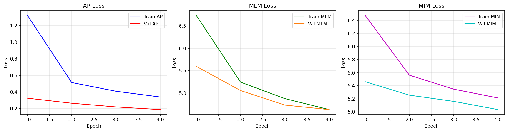

# Code for bachelor thesis

This repository contains the code for my bachelor thesis. It is a PyTorch implementation of ViLBERT, a model that combines visual and language understanding.
I'm currently working on it, so it is not yet complete.


## TODO
- [ ] bertviz
		```python
		from bertviz import head_view
		head_view(model, tokenizer, text_inputs, layer=4)  # visualize cross-attention
		```
- [ ] easier dataset handling
- [ ] is `num_samples=1000` still correct? should be controlled using GLOBAL VARS
- [ ] implement experiment tracker
	- [ ] for two tasks: mmimdb, hateful memes
	- [ ] proper config handling
- [ ] self.fc outside of forward - refactor
- [ ] add this to readme: `export PYTHONPATH="${PYTHONPATH}:$(pwd)/src"`
- [ ] mmimdb alignment vis
- [ ] check if cka is right..
	- [ ] try with bigger bs for the data collection
- [ ] add parameter how many samples to collect for visualization
	- [ ] more runs and avg out
- [ ] comparison of full-seq to cls.
	- [ ] training seemed to be more centered towards cls token alignment
	<details>
	Pretrained model path None does not exist, using fresh model.
	trainable params: 338879292/338879292
	dirname:  res/data/hateful_memes_data
	bs_alignment_analysis: 48, batchsize: 16
	dirname:  res/data/hateful_memes_data
	using contrastive: False
	full dataset analysis
	Layer 0: mKNN (CLS) = 0.0618, kNN Jaccard (CLS) = 0.0098
	Layer 1: mKNN (CLS) = 0.1248, kNN Jaccard (CLS) = 0.0224
	Layer 2: mKNN (CLS) = 0.1191, kNN Jaccard (CLS) = 0.0229
	Layer 3: mKNN (CLS) = 0.1842, kNN Jaccard (CLS) = 0.0378
	Layer 4: mKNN (CLS) = 0.1761, kNN Jaccard (CLS) = 0.0375
	Layer 5: mKNN (CLS) = 0.1742, kNN Jaccard (CLS) = 0.0369
	Layer 6: mKNN (CLS) = 0.2388, kNN Jaccard (CLS) = 0.0548
	Layer 7: mKNN (CLS) = 0.2247, kNN Jaccard (CLS) = 0.0535
	analysis with only 3*48 samples, full seq
	temp cls shape: torch.Size([144, 768])
	Layer 0: mKNN (CLS) = 0.2149, mKNN (Seq) = 0.1407
	Layer 1: mKNN (CLS) = 0.3194, mKNN (Seq) = 0.1425
	Layer 2: mKNN (CLS) = 0.3397, mKNN (Seq) = 0.1429
	Layer 3: mKNN (CLS) = 0.4071, mKNN (Seq) = 0.1440
	Layer 4: mKNN (CLS) = 0.3802, mKNN (Seq) = 0.1448
	Layer 5: mKNN (CLS) = 0.3813, mKNN (Seq) = 0.1448
	Layer 6: mKNN (CLS) = 0.4701, mKNN (Seq) = 0.1457
	Layer 7: mKNN (CLS) = 0.4415, mKNN (Seq) = 0.1456
	Layer 0: kNN Jaccard (CLS) = 0.0423, kNN Jaccard (Seq) = 0.0511
	Layer 1: kNN Jaccard (CLS) = 0.0678, kNN Jaccard (Seq) = 0.0520
	Layer 2: kNN Jaccard (CLS) = 0.0784, kNN Jaccard (Seq) = 0.0522
	Layer 3: kNN Jaccard (CLS) = 0.1020, kNN Jaccard (Seq) = 0.0526
	Layer 4: kNN Jaccard (CLS) = 0.1006, kNN Jaccard (Seq) = 0.0528
	Layer 5: kNN Jaccard (CLS) = 0.1015, kNN Jaccard (Seq) = 0.0528
	Layer 6: kNN Jaccard (CLS) = 0.1347, kNN Jaccard (Seq) = 0.0530
	Layer 7: kNN Jaccard (CLS) = 0.1352, kNN Jaccard (Seq) = 0.0529
	layer layer0 (co-attn-False): cosine=-0.0129, CKA=0.0651, max_sim_tp=0.0714, max_sim_pt=0.0520, SVCCA=0.0000, mknn_full_epoch=0.2149
	layer layer1 (co-attn-True): cosine=-0.0035, CKA=0.0649, max_sim_tp=0.0593, max_sim_pt=0.0475, SVCCA=0.0000, mknn_full_epoch=0.3194
	layer layer2 (co-attn-False): cosine=-0.0095, CKA=0.0639, max_sim_tp=0.0593, max_sim_pt=0.0467, SVCCA=0.0000, mknn_full_epoch=0.3397
	layer layer3 (co-attn-True): cosine=-0.0030, CKA=0.0637, max_sim_tp=0.0705, max_sim_pt=0.0508, SVCCA=0.0000, mknn_full_epoch=0.4071
	layer layer4 (co-attn-False): cosine=0.0014, CKA=0.0633, max_sim_tp=0.0654, max_sim_pt=0.0465, SVCCA=0.0000, mknn_full_epoch=0.3802
	layer layer5 (co-attn-False): cosine=0.0125, CKA=0.0636, max_sim_tp=0.0773, max_sim_pt=0.0544, SVCCA=0.0000, mknn_full_epoch=0.3813
	layer layer6 (co-attn-True): cosine=0.0120, CKA=0.0646, max_sim_tp=0.0598, max_sim_pt=0.0417, SVCCA=0.0000, mknn_full_epoch=0.4701
	layer layer7 (co-attn-False): cosine=0.0078, CKA=0.0646, max_sim_tp=0.0510, max_sim_pt=0.0401, SVCCA=0.0000, mknn_full_epoch=0.4415
	simulated batchsize: 512, actual batchsize: 16
	training: 100%|████████████████████████████████████████████████████████████████████████████████████████████████████| 425/425 [04:08<00:00,  1.71it/s]
	Epoch 1/5, train loss: 0.6735, test loss: 0.6320,  accuracy: 0.6312
	alignment for hateful memes:
	full dataset analysis
	Layer 0: mKNN (CLS) = 0.0552, kNN Jaccard (CLS) = 0.0103
	Layer 1: mKNN (CLS) = 0.0961, kNN Jaccard (CLS) = 0.0181
	Layer 2: mKNN (CLS) = 0.0915, kNN Jaccard (CLS) = 0.0189
	Layer 3: mKNN (CLS) = 0.1386, kNN Jaccard (CLS) = 0.0296
	Layer 4: mKNN (CLS) = 0.1346, kNN Jaccard (CLS) = 0.0303
	Layer 5: mKNN (CLS) = 0.1393, kNN Jaccard (CLS) = 0.0300
	Layer 6: mKNN (CLS) = 0.2014, kNN Jaccard (CLS) = 0.0467
	Layer 7: mKNN (CLS) = 0.1975, kNN Jaccard (CLS) = 0.0442
	analysis with only 3*48 samples, full seq
	temp cls shape: torch.Size([144, 768])
	Layer 0: mKNN (CLS) = 0.2080, mKNN (Seq) = 0.1367
	Layer 1: mKNN (CLS) = 0.2836, mKNN (Seq) = 0.1386
	Layer 2: mKNN (CLS) = 0.2784, mKNN (Seq) = 0.1391
	Layer 3: mKNN (CLS) = 0.3123, mKNN (Seq) = 0.1399
	Layer 4: mKNN (CLS) = 0.3362, mKNN (Seq) = 0.1405
	Layer 5: mKNN (CLS) = 0.3417, mKNN (Seq) = 0.1402
	Layer 6: mKNN (CLS) = 0.3828, mKNN (Seq) = 0.1412
	Layer 7: mKNN (CLS) = 0.3897, mKNN (Seq) = 0.1409
	Layer 0: kNN Jaccard (CLS) = 0.0500, kNN Jaccard (Seq) = 0.0503
	Layer 1: kNN Jaccard (CLS) = 0.0657, kNN Jaccard (Seq) = 0.0510
	Layer 2: kNN Jaccard (CLS) = 0.0742, kNN Jaccard (Seq) = 0.0511
	Layer 3: kNN Jaccard (CLS) = 0.0890, kNN Jaccard (Seq) = 0.0513
	Layer 4: kNN Jaccard (CLS) = 0.0932, kNN Jaccard (Seq) = 0.0515
	Layer 5: kNN Jaccard (CLS) = 0.0921, kNN Jaccard (Seq) = 0.0514
	Layer 6: kNN Jaccard (CLS) = 0.1145, kNN Jaccard (Seq) = 0.0517
	Layer 7: kNN Jaccard (CLS) = 0.1149, kNN Jaccard (Seq) = 0.0515
	layer layer0 (co-attn-False): cosine=0.0220, CKA=0.0765, max_sim_tp=0.0902, max_sim_pt=0.0668, SVCCA=0.0000, mknn_full_epoch=0.2080
	layer layer1 (co-attn-True): cosine=0.0351, CKA=0.0761, max_sim_tp=0.0802, max_sim_pt=0.0645, SVCCA=0.0000, mknn_full_epoch=0.2836
	layer layer2 (co-attn-False): cosine=0.0332, CKA=0.0761, max_sim_tp=0.0761, max_sim_pt=0.0604, SVCCA=0.0000, mknn_full_epoch=0.2784
	layer layer3 (co-attn-True): cosine=0.0372, CKA=0.0761, max_sim_tp=0.0790, max_sim_pt=0.0629, SVCCA=0.0000, mknn_full_epoch=0.3123
	layer layer4 (co-attn-False): cosine=0.0382, CKA=0.0755, max_sim_tp=0.0734, max_sim_pt=0.0588, SVCCA=0.0000, mknn_full_epoch=0.3362
	layer layer5 (co-attn-False): cosine=0.0369, CKA=0.0749, max_sim_tp=0.0704, max_sim_pt=0.0523, SVCCA=0.0000, mknn_full_epoch=0.3417
	layer layer6 (co-attn-True): cosine=0.0250, CKA=0.0761, max_sim_tp=0.0480, max_sim_pt=0.0335, SVCCA=0.0000, mknn_full_epoch=0.3828
	layer layer7 (co-attn-False): cosine=0.0289, CKA=0.0761, max_sim_tp=0.0476, max_sim_pt=0.0370, SVCCA=0.0000, mknn_full_epoch=0.3897
	simulated batchsize: 512, actual batchsize: 16
	training: 100%|████████████████████████████████████████████████████████████████████████████████████████████████████| 425/425 [04:08<00:00,  1.71it/s]
	Epoch 2/5, train loss: 0.6036, test loss: 0.6351,  accuracy: 0.7047
	alignment for hateful memes:
	full dataset analysis
	Layer 0: mKNN (CLS) = 0.0645, kNN Jaccard (CLS) = 0.0109
	Layer 1: mKNN (CLS) = 0.1367, kNN Jaccard (CLS) = 0.0254
	Layer 2: mKNN (CLS) = 0.1343, kNN Jaccard (CLS) = 0.0247
	Layer 3: mKNN (CLS) = 0.2355, kNN Jaccard (CLS) = 0.0496
	Layer 4: mKNN (CLS) = 0.2308, kNN Jaccard (CLS) = 0.0503
	Layer 5: mKNN (CLS) = 0.2441, kNN Jaccard (CLS) = 0.0494
	Layer 6: mKNN (CLS) = 0.3614, kNN Jaccard (CLS) = 0.0801
	Layer 7: mKNN (CLS) = 0.3594, kNN Jaccard (CLS) = 0.0791
	analysis with only 3*48 samples, full seq
	temp cls shape: torch.Size([144, 768])
	Layer 0: mKNN (CLS) = 0.1991, mKNN (Seq) = 0.1560
	Layer 1: mKNN (CLS) = 0.3219, mKNN (Seq) = 0.1566
	Layer 2: mKNN (CLS) = 0.3021, mKNN (Seq) = 0.1570
	Layer 3: mKNN (CLS) = 0.4582, mKNN (Seq) = 0.1578
	Layer 4: mKNN (CLS) = 0.4597, mKNN (Seq) = 0.1573
	Layer 5: mKNN (CLS) = 0.4579, mKNN (Seq) = 0.1574
	Layer 6: mKNN (CLS) = 0.6115, mKNN (Seq) = 0.1585
	Layer 7: mKNN (CLS) = 0.5915, mKNN (Seq) = 0.1579
	Layer 0: kNN Jaccard (CLS) = 0.0522, kNN Jaccard (Seq) = 0.0569
	Layer 1: kNN Jaccard (CLS) = 0.0845, kNN Jaccard (Seq) = 0.0572
	Layer 2: kNN Jaccard (CLS) = 0.0908, kNN Jaccard (Seq) = 0.0574
	Layer 3: kNN Jaccard (CLS) = 0.1468, kNN Jaccard (Seq) = 0.0576
	Layer 4: kNN Jaccard (CLS) = 0.1426, kNN Jaccard (Seq) = 0.0573
	Layer 5: kNN Jaccard (CLS) = 0.1361, kNN Jaccard (Seq) = 0.0573
	Layer 6: kNN Jaccard (CLS) = 0.2053, kNN Jaccard (Seq) = 0.0578
	Layer 7: kNN Jaccard (CLS) = 0.1973, kNN Jaccard (Seq) = 0.0573
	layer layer0 (co-attn-False): cosine=0.0176, CKA=0.0849, max_sim_tp=0.0789, max_sim_pt=0.0550, SVCCA=0.0000, mknn_full_epoch=0.1991
	layer layer1 (co-attn-True): cosine=0.0225, CKA=0.0840, max_sim_tp=0.0700, max_sim_pt=0.0559, SVCCA=0.0000, mknn_full_epoch=0.3219
	layer layer2 (co-attn-False): cosine=0.0013, CKA=0.0832, max_sim_tp=0.0570, max_sim_pt=0.0456, SVCCA=0.0000, mknn_full_epoch=0.3021
	layer layer3 (co-attn-True): cosine=0.0001, CKA=0.0832, max_sim_tp=0.0568, max_sim_pt=0.0439, SVCCA=0.0000, mknn_full_epoch=0.4582
	layer layer4 (co-attn-False): cosine=0.0110, CKA=0.0817, max_sim_tp=0.0545, max_sim_pt=0.0432, SVCCA=0.0000, mknn_full_epoch=0.4597
	layer layer5 (co-attn-False): cosine=0.0090, CKA=0.0812, max_sim_tp=0.0507, max_sim_pt=0.0370, SVCCA=0.0000, mknn_full_epoch=0.4579
	layer layer6 (co-attn-True): cosine=-0.0032, CKA=0.0813, max_sim_tp=0.0291, max_sim_pt=0.0205, SVCCA=0.0000, mknn_full_epoch=0.6115
	layer layer7 (co-attn-False): cosine=-0.0116, CKA=0.0806, max_sim_tp=0.0196, max_sim_pt=0.0126, SVCCA=0.0000, mknn_full_epoch=0.5915
	simulated batchsize: 512, actual batchsize: 16
	training: 100%|████████████████████████████████████████████████████████████████████████████████████████████████████| 425/425 [04:08<00:00,  1.71it/s]
	Epoch 3/5, train loss: 0.5457, test loss: 0.5983,  accuracy: 0.7235
	alignment for hateful memes:
	full dataset analysis
	Layer 0: mKNN (CLS) = 0.0583, kNN Jaccard (CLS) = 0.0102
	Layer 1: mKNN (CLS) = 0.1261, kNN Jaccard (CLS) = 0.0239
	Layer 2: mKNN (CLS) = 0.1277, kNN Jaccard (CLS) = 0.0250
	Layer 3: mKNN (CLS) = 0.2253, kNN Jaccard (CLS) = 0.0523
	Layer 4: mKNN (CLS) = 0.2257, kNN Jaccard (CLS) = 0.0513
	Layer 5: mKNN (CLS) = 0.2243, kNN Jaccard (CLS) = 0.0521
	Layer 6: mKNN (CLS) = 0.3351, kNN Jaccard (CLS) = 0.0839
	Layer 7: mKNN (CLS) = 0.3249, kNN Jaccard (CLS) = 0.0802
	analysis with only 3*48 samples, full seq
	temp cls shape: torch.Size([144, 768])
	Layer 0: mKNN (CLS) = 0.1456, mKNN (Seq) = 0.1484
	Layer 1: mKNN (CLS) = 0.2567, mKNN (Seq) = 0.1492
	Layer 2: mKNN (CLS) = 0.2607, mKNN (Seq) = 0.1493
	Layer 3: mKNN (CLS) = 0.3794, mKNN (Seq) = 0.1501
	Layer 4: mKNN (CLS) = 0.4068, mKNN (Seq) = 0.1500
	Layer 5: mKNN (CLS) = 0.4069, mKNN (Seq) = 0.1497
	Layer 6: mKNN (CLS) = 0.5212, mKNN (Seq) = 0.1504
	Layer 7: mKNN (CLS) = 0.5408, mKNN (Seq) = 0.1504
	Layer 0: kNN Jaccard (CLS) = 0.0317, kNN Jaccard (Seq) = 0.0549
	Layer 1: kNN Jaccard (CLS) = 0.0614, kNN Jaccard (Seq) = 0.0551
	Layer 2: kNN Jaccard (CLS) = 0.0630, kNN Jaccard (Seq) = 0.0552
	Layer 3: kNN Jaccard (CLS) = 0.1130, kNN Jaccard (Seq) = 0.0555
	Layer 4: kNN Jaccard (CLS) = 0.1189, kNN Jaccard (Seq) = 0.0554
	Layer 5: kNN Jaccard (CLS) = 0.1166, kNN Jaccard (Seq) = 0.0552
	Layer 6: kNN Jaccard (CLS) = 0.1638, kNN Jaccard (Seq) = 0.0554
	Layer 7: kNN Jaccard (CLS) = 0.1654, kNN Jaccard (Seq) = 0.0552
	layer layer0 (co-attn-False): cosine=0.0240, CKA=0.0838, max_sim_tp=0.0775, max_sim_pt=0.0560, SVCCA=0.0000, mknn_full_epoch=0.1456
	layer layer1 (co-attn-True): cosine=0.0166, CKA=0.0828, max_sim_tp=0.0657, max_sim_pt=0.0543, SVCCA=0.0000, mknn_full_epoch=0.2567
	layer layer2 (co-attn-False): cosine=-0.0042, CKA=0.0821, max_sim_tp=0.0534, max_sim_pt=0.0453, SVCCA=0.0000, mknn_full_epoch=0.2607
	layer layer3 (co-attn-True): cosine=-0.0056, CKA=0.0821, max_sim_tp=0.0569, max_sim_pt=0.0442, SVCCA=0.0000, mknn_full_epoch=0.3794
	layer layer4 (co-attn-False): cosine=-0.0046, CKA=0.0812, max_sim_tp=0.0482, max_sim_pt=0.0373, SVCCA=0.0000, mknn_full_epoch=0.4068
	layer layer5 (co-attn-False): cosine=-0.0039, CKA=0.0808, max_sim_tp=0.0426, max_sim_pt=0.0317, SVCCA=0.0000, mknn_full_epoch=0.4069
	layer layer6 (co-attn-True): cosine=-0.0124, CKA=0.0806, max_sim_tp=0.0222, max_sim_pt=0.0160, SVCCA=0.0000, mknn_full_epoch=0.5212
	layer layer7 (co-attn-False): cosine=-0.0174, CKA=0.0802, max_sim_tp=0.0116, max_sim_pt=0.0073, SVCCA=0.0000, mknn_full_epoch=0.5408
	simulated batchsize: 512, actual batchsize: 16
	training: 100%|████████████████████████████████████████████████████████████████████████████████████████████████████| 425/425 [04:08<00:00,  1.71it/s]
	Epoch 4/5, train loss: 0.5127, test loss: 0.6305,  accuracy: 0.7253
	alignment for hateful memes:
	full dataset analysis
	Layer 0: mKNN (CLS) = 0.0605, kNN Jaccard (CLS) = 0.0101
	Layer 1: mKNN (CLS) = 0.1308, kNN Jaccard (CLS) = 0.0240
	Layer 2: mKNN (CLS) = 0.1221, kNN Jaccard (CLS) = 0.0235
	Layer 3: mKNN (CLS) = 0.2211, kNN Jaccard (CLS) = 0.0497
	Layer 4: mKNN (CLS) = 0.2239, kNN Jaccard (CLS) = 0.0492
	Layer 5: mKNN (CLS) = 0.2281, kNN Jaccard (CLS) = 0.0498
	Layer 6: mKNN (CLS) = 0.3446, kNN Jaccard (CLS) = 0.0844
	Layer 7: mKNN (CLS) = 0.3370, kNN Jaccard (CLS) = 0.0809
	analysis with only 3*48 samples, full seq
	temp cls shape: torch.Size([144, 768])
	Layer 0: mKNN (CLS) = 0.1863, mKNN (Seq) = 0.1551
	Layer 1: mKNN (CLS) = 0.2884, mKNN (Seq) = 0.1580
	Layer 2: mKNN (CLS) = 0.3068, mKNN (Seq) = 0.1582
	Layer 3: mKNN (CLS) = 0.4568, mKNN (Seq) = 0.1593
	Layer 4: mKNN (CLS) = 0.4709, mKNN (Seq) = 0.1592
	Layer 5: mKNN (CLS) = 0.4775, mKNN (Seq) = 0.1591
	Layer 6: mKNN (CLS) = 0.5957, mKNN (Seq) = 0.1597
	^CTraceback (most recent call last):
	</details>
- [ ] fix spelling issue in "costrative"
- [x] implement gradient accum.
- [ ] problem with contrastive term in pretraining: combined approach!
- [ ] visualization of cka, mutual knns
	- [x] implement a data collection pipeline
		- [ ] improve memory with `del`- in original pipeline=> better CKA estimations


	- [ ] visualization of all the other measueres
		- [x] mknn
		- [ ] jaccard - add to analysis
		- [ ] rank - add to analysis
		- [ ]
- [ ] implement further datasets for alignment evaluation
	- [ ] ms coco
	- [ ] vqa
	- [ ] mm-imbd
- [x] cosine scheduler
- [ ] add dropout in attention
- [ ] caching , [mmap](https://github.com/DACUS1995/pytorch-mmap-dataset/blob/main/pytorch_mmap_dataset/dataset.py)
- [ ] visualization of pretraining tasks - like acc, loss, etc
- [ ] different batchsizes for tasks
	- maybe too difficult to implement!
- [ ] is residual handling in crossattention correct?
- [ ] other datasets implement
	- [ ] find alignment datasets in literature

- [ ] data augmentation for AP pretraining
- [ ] implement further alignment measures
	- [x] cca
	- [ ] wasserstein distance
	- [x] svcca
	- [ ] sae (maybe)

- [ ] pytorch hooks for intermediate layers
	- quite hard to implement, plus there is not much documentation on this topic.

- [ ] fix problem with ap pretraining only - has really bad performance, slightly worse than guessing!
	- 2025-08-23 22:35:30 - INFO  - trainer.py:train:691 - Epoch 4/4,
	```
	train loss MLM: 0.0000,
	test loss MLM: 10.5104,
	train loss AP: 0.6946,
	test loss AP: 0.6946,
	accuracy AP: 0.4986
	train loss MIM: 0.0000,
	test loss MIM: 8.8669
	```

- [ ] investigating platonic representation hypothesis:
	- simply concat represetnations of bert + vit: use as baseline.


### past TODOs
- [x] Tokenizer for text dependency injected
- [x] pretrain dataset fix: filter out images that are not working
- [x] pretrain dataset mlm task
- [x] apparently there is a problem with the `transformers` library, where ViT implementation causes 10x-40x? https://x.com/jbohnslav/status/1950550831381782798, => own implementation of ViT (maybe adapt from dl VU, assignment 03)
- [x] fix problem with compile and saving

- [x] log everything
- [x] complete mim
    - [x] data augmentation pipeline.
    - [x] teacher, student ? this is to avoid moving target problem, but is it necessary? - not using this
    - [x] gradient stopping - not used, would require teacher-student setup

- [x] better config handling
- [x] infonce review

- [x] evaluate functino for measuring avg alignment measures.
- [x] complete pipeline for running experiments
- [x] hateful memes downsize to 224
- [x] unify the alignment measurements

## ViLBERT
original [vilbert](https://github.com/facebookresearch/vilbert-multi-task) under `vilbert/vilbert.py`.


## Pretraining

There are three pretraining tasks in ViLBERT: Masked Language Modelling, Masked Image Modelling, Alignment Prediction

### MLM
for 15% of all tokens:
- 80% replaced with [MASK]
- 10% replaced with random token
- 10% unchanged

array of length of tokens is returned. if masked: masked token, if not `token[i] = -100`(value for lossfunction to ignore it)

### Alignment Prediction
predict if images and caption are aligned. Is a dataset of 50/50 balance.
- "research has been focused on two main schemes, either reconstructing the masked signal, or comparing two latent representations, one for the unaltered input signal and one for the masked input."


### MIM

Two options: reconstruct masked patches, contrastive comparision of hidden representations.

Basd on my research I go for the contrastice approach, as this seems more interesting for me to implement.

<figure>
    
</figure>

the workflow is the following:
1) augment the data. Not yes timplemented
2) mask image => (image, masked_image)
3) encode(masked_image); encode(image)
4) compute infoNCE on the representations, ONLY FOR UNMASKED tokens.


dataset returned from dataloader/dataset:
```python
{
    "task": task.value,
    "img" : img_embedding,      # og img, as tensor
    "masked_img": masked_img, # masked image as tensor
    "masked_patches_idxs": masked_patches_idxs, # indices of the masked patches,
    "text": text_embeddings,
}
```


## Results

## 04.09

```bash
2025-09-03 20:18:33 - INFO  - trainer.py:train:841 - training with tasks: [<Task.MASKED_IM: 3>, <Task.MASKED_LM: 2>, <Task.ALIGNMENT_PREDICTION: 1>]
2025-09-03 21:03:36 - INFO  - trainer.py:train:890 - Epoch 1/4,
	train loss MLM: 6.7365,
	test loss MLM: 5.5988,
	train loss AP: 1.3250,
	test loss AP: 0.3271,
	accuracy AP: 0.9998
	train loss MIM: 6.4775,
	test loss MIM: 5.4615
2025-09-03 21:04:06 - INFO  - trainer.py:__save_checkpoint:957 - Checkpoint saved to res/checkpoints/pretrained_epoch1_task123.pt
2025-09-03 21:04:06 - INFO  - trainer.py:train:915 - alignment for hateful memes:
2025-09-03 21:04:19 - INFO  - analysis.py:analyse:556 - layer layer0 (co-attn-False): cosine=-0.0354, CKA=0.0494, max_sim_tp=0.0310, max_sim_pt=0.0672, SVCCA=0.0000, mknn_full_epoch=0.0280
2025-09-03 21:04:19 - INFO  - analysis.py:analyse:556 - layer layer1 (co-attn-True): cosine=0.4888, CKA=0.0459, max_sim_tp=0.4816, max_sim_pt=0.4745, SVCCA=0.0000, mknn_full_epoch=0.5510
2025-09-03 21:04:19 - INFO  - analysis.py:analyse:556 - layer layer2 (co-attn-False): cosine=0.6984, CKA=0.0393, max_sim_tp=0.6926, max_sim_pt=0.6853, SVCCA=0.0000, mknn_full_epoch=0.6374
2025-09-03 21:04:19 - INFO  - analysis.py:analyse:556 - layer layer3 (co-attn-True): cosine=0.9364, CKA=0.0370, max_sim_tp=0.8760, max_sim_pt=0.8870, SVCCA=0.0000, mknn_full_epoch=0.9070
2025-09-03 21:04:19 - INFO  - trainer.py:train:920 - alignment for conceptual captions:
2025-09-03 21:04:32 - INFO  - analysis.py:analyse:556 - layer layer0 (co-attn-False): cosine=0.0052, CKA=0.0724, max_sim_tp=0.0400, max_sim_pt=0.0570, SVCCA=0.0000, mknn_full_epoch=0.0166
2025-09-03 21:04:32 - INFO  - analysis.py:analyse:556 - layer layer1 (co-attn-True): cosine=0.5594, CKA=0.0718, max_sim_tp=0.5201, max_sim_pt=0.5009, SVCCA=0.0000, mknn_full_epoch=0.5683
2025-09-03 21:04:32 - INFO  - analysis.py:analyse:556 - layer layer2 (co-attn-False): cosine=0.7489, CKA=0.0689, max_sim_tp=0.7242, max_sim_pt=0.7110, SVCCA=0.0000, mknn_full_epoch=0.6108
2025-09-03 21:04:32 - INFO  - analysis.py:analyse:556 - layer layer3 (co-attn-True): cosine=0.9553, CKA=0.0648, max_sim_tp=0.9092, max_sim_pt=0.9123, SVCCA=0.0000, mknn_full_epoch=0.9645
2025-09-03 21:49:35 - INFO  - trainer.py:train:890 - Epoch 2/4,
	train loss MLM: 5.2464,
	test loss MLM: 5.0590,
	train loss AP: 0.5156,
	test loss AP: 0.2663,
	accuracy AP: 1.0000
	train loss MIM: 5.5609,
	test loss MIM: 5.2549
2025-09-03 21:50:05 - INFO  - trainer.py:__save_checkpoint:957 - Checkpoint saved to res/checkpoints/pretrained_epoch2_task123.pt
2025-09-03 21:50:05 - INFO  - trainer.py:train:915 - alignment for hateful memes:
2025-09-03 21:50:18 - INFO  - analysis.py:analyse:556 - layer layer0 (co-attn-False): cosine=0.0277, CKA=0.0283, max_sim_tp=0.0514, max_sim_pt=0.0737, SVCCA=0.0000, mknn_full_epoch=0.0316
2025-09-03 21:50:18 - INFO  - analysis.py:analyse:556 - layer layer1 (co-attn-True): cosine=0.6144, CKA=0.0266, max_sim_tp=0.5220, max_sim_pt=0.4824, SVCCA=0.0000, mknn_full_epoch=0.6469
2025-09-03 21:50:18 - INFO  - analysis.py:analyse:556 - layer layer2 (co-attn-False): cosine=0.8265, CKA=0.0246, max_sim_tp=0.7570, max_sim_pt=0.7115, SVCCA=0.0000, mknn_full_epoch=0.7800
2025-09-03 21:50:18 - INFO  - analysis.py:analyse:556 - layer layer3 (co-attn-True): cosine=0.9615, CKA=0.0249, max_sim_tp=0.8930, max_sim_pt=0.8774, SVCCA=0.0000, mknn_full_epoch=0.9477
2025-09-03 21:50:18 - INFO  - trainer.py:train:920 - alignment for conceptual captions:
2025-09-03 21:50:31 - INFO  - analysis.py:analyse:556 - layer layer0 (co-attn-False): cosine=0.0156, CKA=0.0308, max_sim_tp=0.0501, max_sim_pt=0.0675, SVCCA=0.0000, mknn_full_epoch=0.0164
2025-09-03 21:50:31 - INFO  - analysis.py:analyse:556 - layer layer1 (co-attn-True): cosine=0.6589, CKA=0.0307, max_sim_tp=0.5852, max_sim_pt=0.5363, SVCCA=0.0000, mknn_full_epoch=0.6040
2025-09-03 21:50:31 - INFO  - analysis.py:analyse:556 - layer layer2 (co-attn-False): cosine=0.8524, CKA=0.0281, max_sim_tp=0.8001, max_sim_pt=0.7547, SVCCA=0.0000, mknn_full_epoch=0.7573
2025-09-03 21:50:31 - INFO  - analysis.py:analyse:556 - layer layer3 (co-attn-True): cosine=0.9744, CKA=0.0270, max_sim_tp=0.9205, max_sim_pt=0.9007, SVCCA=0.0000, mknn_full_epoch=0.9784
2025-09-03 22:35:34 - INFO  - trainer.py:train:890 - Epoch 3/4,
	train loss MLM: 4.8794,
	test loss MLM: 4.7345,
	train loss AP: 0.4102,
	test loss AP: 0.2216,
	accuracy AP: 1.0000
	train loss MIM: 5.3468,
	test loss MIM: 5.1598
2025-09-03 22:36:04 - INFO  - trainer.py:__save_checkpoint:957 - Checkpoint saved to res/checkpoints/pretrained_epoch3_task123.pt
2025-09-03 22:36:04 - INFO  - trainer.py:train:915 - alignment for hateful memes:
2025-09-03 22:36:17 - INFO  - analysis.py:analyse:556 - layer layer0 (co-attn-False): cosine=0.0273, CKA=0.0167, max_sim_tp=0.0624, max_sim_pt=0.0836, SVCCA=0.0000, mknn_full_epoch=0.0268
2025-09-03 22:36:17 - INFO  - analysis.py:analyse:556 - layer layer1 (co-attn-True): cosine=0.6496, CKA=0.0159, max_sim_tp=0.5326, max_sim_pt=0.4747, SVCCA=0.0000, mknn_full_epoch=0.6815
2025-09-03 22:36:17 - INFO  - analysis.py:analyse:556 - layer layer2 (co-attn-False): cosine=0.8502, CKA=0.0146, max_sim_tp=0.7471, max_sim_pt=0.6955, SVCCA=0.0000, mknn_full_epoch=0.8310
2025-09-03 22:36:17 - INFO  - analysis.py:analyse:556 - layer layer3 (co-attn-True): cosine=0.9679, CKA=0.0148, max_sim_tp=0.8706, max_sim_pt=0.8531, SVCCA=0.0000, mknn_full_epoch=0.9636
2025-09-03 22:36:17 - INFO  - trainer.py:train:920 - alignment for conceptual captions:
2025-09-03 22:36:31 - INFO  - analysis.py:analyse:556 - layer layer0 (co-attn-False): cosine=0.0126, CKA=0.0140, max_sim_tp=0.0498, max_sim_pt=0.0706, SVCCA=0.0000, mknn_full_epoch=0.0133
2025-09-03 22:36:31 - INFO  - analysis.py:analyse:556 - layer layer1 (co-attn-True): cosine=0.6781, CKA=0.0142, max_sim_tp=0.5799, max_sim_pt=0.5300, SVCCA=0.0000, mknn_full_epoch=0.6561
2025-09-03 22:36:31 - INFO  - analysis.py:analyse:556 - layer layer2 (co-attn-False): cosine=0.8708, CKA=0.0128, max_sim_tp=0.7858, max_sim_pt=0.7458, SVCCA=0.0000, mknn_full_epoch=0.8142
2025-09-03 22:36:31 - INFO  - analysis.py:analyse:556 - layer layer3 (co-attn-True): cosine=0.9773, CKA=0.0134, max_sim_tp=0.8948, max_sim_pt=0.8789, SVCCA=0.0000, mknn_full_epoch=0.9849
2025-09-03 23:21:36 - INFO  - trainer.py:train:890 - Epoch 4/4,
	train loss MLM: 4.6339,
	test loss MLM: 4.6339,
	train loss AP: 0.3408,
	test loss AP: 0.1895,
	accuracy AP: 1.0000
	train loss MIM: 5.2118,
	test loss MIM: 5.0339
2025-09-03 23:22:07 - INFO  - trainer.py:__save_checkpoint:957 - Checkpoint saved to res/checkpoints/pretrained_epoch4_task123.pt
2025-09-03 23:22:07 - INFO  - trainer.py:train:915 - alignment for hateful memes:
2025-09-03 23:22:20 - INFO  - analysis.py:analyse:556 - layer layer0 (co-attn-False): cosine=0.0248, CKA=0.0131, max_sim_tp=0.0600, max_sim_pt=0.0854, SVCCA=0.0000, mknn_full_epoch=0.0273
2025-09-03 23:22:20 - INFO  - analysis.py:analyse:556 - layer layer1 (co-attn-True): cosine=0.6576, CKA=0.0127, max_sim_tp=0.5013, max_sim_pt=0.4317, SVCCA=0.0000, mknn_full_epoch=0.6533
2025-09-03 23:22:20 - INFO  - analysis.py:analyse:556 - layer layer2 (co-attn-False): cosine=0.8523, CKA=0.0117, max_sim_tp=0.7057, max_sim_pt=0.6458, SVCCA=0.0000, mknn_full_epoch=0.8238
2025-09-03 23:22:20 - INFO  - analysis.py:analyse:556 - layer layer3 (co-attn-True): cosine=0.9676, CKA=0.0126, max_sim_tp=0.8401, max_sim_pt=0.8162, SVCCA=0.0000, mknn_full_epoch=0.9621
2025-09-03 23:22:20 - INFO  - trainer.py:train:920 - alignment for conceptual captions:
2025-09-03 23:22:34 - INFO  - analysis.py:analyse:556 - layer layer0 (co-attn-False): cosine=0.0141, CKA=0.0125, max_sim_tp=0.0499, max_sim_pt=0.0721, SVCCA=0.0000, mknn_full_epoch=0.0134
2025-09-03 23:22:34 - INFO  - analysis.py:analyse:556 - layer layer1 (co-attn-True): cosine=0.6770, CKA=0.0129, max_sim_tp=0.5449, max_sim_pt=0.4896, SVCCA=0.0000, mknn_full_epoch=0.5926
2025-09-03 23:22:34 - INFO  - analysis.py:analyse:556 - layer layer2 (co-attn-False): cosine=0.8696, CKA=0.0116, max_sim_tp=0.7468, max_sim_pt=0.7020, SVCCA=0.0000, mknn_full_epoch=0.7874
2025-09-03 23:22:34 - INFO  - analysis.py:analyse:556 - layer layer3 (co-attn-True): cosine=0.9742, CKA=0.0125, max_sim_tp=0.8639, max_sim_pt=0.8460, SVCCA=0.0000, mknn_full_epoch=0.9718
2025-09-03 23:22:34 - INFO  - utils.py:plot_losses:358 - saved plot to res/plots/training_losses-1756934554.png
2025-09-03 23:22:34 - INFO  - main.py:pretrain_:164 - finished training.

 --------------------
2025-09-03 23:23:26 - INFO  - evaluate.py:train_and_eval_on_downstream_task:53 - Loaded model from res/checkpoints/pretrained_epoch1_task123.pt with config: {'embedding_dim': 768, 'vocab_size': 30522, 'num_hidden_layers': 12, 'num_attention_heads': 12, 'dropout_prob': 0.4, 'learning_rate': 3e-06, 'img_size': (224, 224), 'preprocessed_path': 'res/preprocessed.pkl', 'train_test_ratio': 0.8, 'batch_size': 48, 'depth': 4, 'pretraining_tasks': [3, 2, 1], 'cross_attention_layers': [1, 3]}
2025-09-03 23:23:36 - INFO  - trainer.py:train:289 -

before training, evaluating on uninitialized model
2025-09-03 23:23:36 - INFO  - trainer.py:train:292 - alignment for hateful memes:
2025-09-03 23:23:49 - INFO  - analysis.py:analyse:556 - layer layer0 (co-attn-False): cosine=-0.0337, CKA=0.0436, max_sim_tp=0.0322, max_sim_pt=0.0675, SVCCA=0.0000, mknn_full_epoch=0.0283
2025-09-03 23:23:49 - INFO  - analysis.py:analyse:556 - layer layer1 (co-attn-True): cosine=0.4902, CKA=0.0398, max_sim_tp=0.4820, max_sim_pt=0.4745, SVCCA=0.0000, mknn_full_epoch=0.5365
2025-09-03 23:23:49 - INFO  - analysis.py:analyse:556 - layer layer2 (co-attn-False): cosine=0.6996, CKA=0.0328, max_sim_tp=0.6933, max_sim_pt=0.6857, SVCCA=0.0000, mknn_full_epoch=0.6315
2025-09-03 23:23:49 - INFO  - analysis.py:analyse:556 - layer layer3 (co-attn-True): cosine=0.9362, CKA=0.0302, max_sim_tp=0.8751, max_sim_pt=0.8861, SVCCA=0.0000, mknn_full_epoch=0.9089
2025-09-03 23:23:49 - INFO  - trainer.py:train:297 - alignment for conceptual captions:
2025-09-03 23:24:03 - INFO  - analysis.py:analyse:556 - layer layer0 (co-attn-False): cosine=0.0052, CKA=0.0724, max_sim_tp=0.0399, max_sim_pt=0.0560, SVCCA=0.0000, mknn_full_epoch=0.0155
2025-09-03 23:24:03 - INFO  - analysis.py:analyse:556 - layer layer1 (co-attn-True): cosine=0.5591, CKA=0.0715, max_sim_tp=0.5195, max_sim_pt=0.4988, SVCCA=0.0000, mknn_full_epoch=0.5853
2025-09-03 23:24:03 - INFO  - analysis.py:analyse:556 - layer layer2 (co-attn-False): cosine=0.7501, CKA=0.0672, max_sim_tp=0.7252, max_sim_pt=0.7105, SVCCA=0.0000, mknn_full_epoch=0.6359
2025-09-03 23:24:03 - INFO  - analysis.py:analyse:556 - layer layer3 (co-attn-True): cosine=0.9556, CKA=0.0622, max_sim_tp=0.9089, max_sim_pt=0.9112, SVCCA=0.0000, mknn_full_epoch=0.9629
2025-09-03 23:24:03 - INFO  - trainer.py:train:302 - finished!
--------------------
2025-09-03 23:25:50 - INFO  - trainer.py:train:309 - Epoch 1/9, train loss: 0.6562, test loss: 0.6617,  accuracy: 0.6182
2025-09-03 23:25:50 - INFO  - trainer.py:train:314 - alignment for hateful memes:
2025-09-03 23:26:04 - INFO  - analysis.py:analyse:556 - layer layer0 (co-attn-False): cosine=-0.0307, CKA=0.0474, max_sim_tp=0.0276, max_sim_pt=0.0607, SVCCA=0.0000, mknn_full_epoch=0.0272
2025-09-03 23:26:04 - INFO  - analysis.py:analyse:556 - layer layer1 (co-attn-True): cosine=0.5113, CKA=0.0432, max_sim_tp=0.4987, max_sim_pt=0.4881, SVCCA=0.0000, mknn_full_epoch=0.5716
2025-09-03 23:26:04 - INFO  - analysis.py:analyse:556 - layer layer2 (co-attn-False): cosine=0.7166, CKA=0.0361, max_sim_tp=0.7022, max_sim_pt=0.6955, SVCCA=0.0000, mknn_full_epoch=0.6683
2025-09-03 23:26:04 - INFO  - analysis.py:analyse:556 - layer layer3 (co-attn-True): cosine=0.9399, CKA=0.0329, max_sim_tp=0.8702, max_sim_pt=0.8836, SVCCA=0.0000, mknn_full_epoch=0.9300
2025-09-03 23:26:04 - INFO  - trainer.py:train:319 - alignment for conceptual captions:
2025-09-03 23:26:19 - INFO  - analysis.py:analyse:556 - layer layer0 (co-attn-False): cosine=0.0019, CKA=0.0753, max_sim_tp=0.0358, max_sim_pt=0.0523, SVCCA=0.0000, mknn_full_epoch=0.0196
2025-09-03 23:26:19 - INFO  - analysis.py:analyse:556 - layer layer1 (co-attn-True): cosine=0.5555, CKA=0.0754, max_sim_tp=0.5096, max_sim_pt=0.4881, SVCCA=0.0000, mknn_full_epoch=0.5960
2025-09-03 23:26:19 - INFO  - analysis.py:analyse:556 - layer layer2 (co-attn-False): cosine=0.7530, CKA=0.0726, max_sim_tp=0.7196, max_sim_pt=0.7090, SVCCA=0.0000, mknn_full_epoch=0.6491
2025-09-03 23:26:19 - INFO  - analysis.py:analyse:556 - layer layer3 (co-attn-True): cosine=0.9544, CKA=0.0690, max_sim_tp=0.8964, max_sim_pt=0.9042, SVCCA=0.0000, mknn_full_epoch=0.9680
2025-09-03 23:28:05 - INFO  - trainer.py:train:309 - Epoch 2/9, train loss: 0.6346, test loss: 0.6279,  accuracy: 0.6629
2025-09-03 23:28:05 - INFO  - trainer.py:train:314 - alignment for hateful memes:
2025-09-03 23:28:20 - INFO  - analysis.py:analyse:556 - layer layer0 (co-attn-False): cosine=-0.0388, CKA=0.0506, max_sim_tp=0.0304, max_sim_pt=0.0656, SVCCA=0.0000, mknn_full_epoch=0.0250
2025-09-03 23:28:20 - INFO  - analysis.py:analyse:556 - layer layer1 (co-attn-True): cosine=0.4700, CKA=0.0462, max_sim_tp=0.4627, max_sim_pt=0.4574, SVCCA=0.0000, mknn_full_epoch=0.5244
2025-09-03 23:28:20 - INFO  - analysis.py:analyse:556 - layer layer2 (co-attn-False): cosine=0.6862, CKA=0.0388, max_sim_tp=0.6691, max_sim_pt=0.6685, SVCCA=0.0000, mknn_full_epoch=0.6144
2025-09-03 23:28:20 - INFO  - analysis.py:analyse:556 - layer layer3 (co-attn-True): cosine=0.9209, CKA=0.0349, max_sim_tp=0.8417, max_sim_pt=0.8589, SVCCA=0.0000, mknn_full_epoch=0.8916
2025-09-03 23:28:20 - INFO  - trainer.py:train:319 - alignment for conceptual captions:
2025-09-03 23:28:34 - INFO  - analysis.py:analyse:556 - layer layer0 (co-attn-False): cosine=-0.0072, CKA=0.0810, max_sim_tp=0.0368, max_sim_pt=0.0548, SVCCA=0.0000, mknn_full_epoch=0.0189
2025-09-03 23:28:34 - INFO  - analysis.py:analyse:556 - layer layer1 (co-attn-True): cosine=0.5275, CKA=0.0803, max_sim_tp=0.4853, max_sim_pt=0.4661, SVCCA=0.0000, mknn_full_epoch=0.5808
2025-09-03 23:28:34 - INFO  - analysis.py:analyse:556 - layer layer2 (co-attn-False): cosine=0.7351, CKA=0.0758, max_sim_tp=0.7021, max_sim_pt=0.6936, SVCCA=0.0000, mknn_full_epoch=0.6478
2025-09-03 23:28:34 - INFO  - analysis.py:analyse:556 - layer layer3 (co-attn-True): cosine=0.9430, CKA=0.0721, max_sim_tp=0.8811, max_sim_pt=0.8918, SVCCA=0.0000, mknn_full_epoch=0.9614
2025-09-03 23:30:21 - INFO  - trainer.py:train:309 - Epoch 3/9, train loss: 0.6075, test loss: 0.6256,  accuracy: 0.6571
2025-09-03 23:30:21 - INFO  - trainer.py:train:314 - alignment for hateful memes:
2025-09-03 23:30:35 - INFO  - analysis.py:analyse:556 - layer layer0 (co-attn-False): cosine=-0.0398, CKA=0.0558, max_sim_tp=0.0302, max_sim_pt=0.0672, SVCCA=0.0000, mknn_full_epoch=0.0289
2025-09-03 23:30:35 - INFO  - analysis.py:analyse:556 - layer layer1 (co-attn-True): cosine=0.4621, CKA=0.0507, max_sim_tp=0.4582, max_sim_pt=0.4538, SVCCA=0.0000, mknn_full_epoch=0.5374
2025-09-03 23:30:35 - INFO  - analysis.py:analyse:556 - layer layer2 (co-attn-False): cosine=0.6783, CKA=0.0426, max_sim_tp=0.6611, max_sim_pt=0.6632, SVCCA=0.0000, mknn_full_epoch=0.6290
2025-09-03 23:30:35 - INFO  - analysis.py:analyse:556 - layer layer3 (co-attn-True): cosine=0.9100, CKA=0.0383, max_sim_tp=0.8262, max_sim_pt=0.8466, SVCCA=0.0000, mknn_full_epoch=0.9003
2025-09-03 23:30:35 - INFO  - trainer.py:train:319 - alignment for conceptual captions:
2025-09-03 23:30:49 - INFO  - analysis.py:analyse:556 - layer layer0 (co-attn-False): cosine=-0.0100, CKA=0.0800, max_sim_tp=0.0390, max_sim_pt=0.0561, SVCCA=0.0000, mknn_full_epoch=0.0167
2025-09-03 23:30:49 - INFO  - analysis.py:analyse:556 - layer layer1 (co-attn-True): cosine=0.5032, CKA=0.0783, max_sim_tp=0.4624, max_sim_pt=0.4451, SVCCA=0.0000, mknn_full_epoch=0.5923
2025-09-03 23:30:49 - INFO  - analysis.py:analyse:556 - layer layer2 (co-attn-False): cosine=0.7209, CKA=0.0728, max_sim_tp=0.6834, max_sim_pt=0.6769, SVCCA=0.0000, mknn_full_epoch=0.6524
2025-09-03 23:30:49 - INFO  - analysis.py:analyse:556 - layer layer3 (co-attn-True): cosine=0.9319, CKA=0.0693, max_sim_tp=0.8599, max_sim_pt=0.8765, SVCCA=0.0000, mknn_full_epoch=0.9576
2025-09-03 23:32:36 - INFO  - trainer.py:train:309 - Epoch 4/9, train loss: 0.5824, test loss: 0.5939,  accuracy: 0.6906
2025-09-03 23:32:36 - INFO  - trainer.py:train:314 - alignment for hateful memes:
2025-09-03 23:32:50 - INFO  - analysis.py:analyse:556 - layer layer0 (co-attn-False): cosine=-0.0259, CKA=0.0607, max_sim_tp=0.0427, max_sim_pt=0.0688, SVCCA=0.0000, mknn_full_epoch=0.0292
2025-09-03 23:32:50 - INFO  - analysis.py:analyse:556 - layer layer1 (co-attn-True): cosine=0.4277, CKA=0.0552, max_sim_tp=0.4250, max_sim_pt=0.4220, SVCCA=0.0000, mknn_full_epoch=0.4784
2025-09-03 23:32:50 - INFO  - analysis.py:analyse:556 - layer layer2 (co-attn-False): cosine=0.6403, CKA=0.0465, max_sim_tp=0.6156, max_sim_pt=0.6219, SVCCA=0.0000, mknn_full_epoch=0.5650
2025-09-03 23:32:50 - INFO  - analysis.py:analyse:556 - layer layer3 (co-attn-True): cosine=0.8816, CKA=0.0407, max_sim_tp=0.7870, max_sim_pt=0.8095, SVCCA=0.0000, mknn_full_epoch=0.8594
2025-09-03 23:32:50 - INFO  - trainer.py:train:319 - alignment for conceptual captions:
2025-09-03 23:33:04 - INFO  - analysis.py:analyse:556 - layer layer0 (co-attn-False): cosine=0.0090, CKA=0.0819, max_sim_tp=0.0467, max_sim_pt=0.0553, SVCCA=0.0000, mknn_full_epoch=0.0167
2025-09-03 23:33:04 - INFO  - analysis.py:analyse:556 - layer layer1 (co-attn-True): cosine=0.4976, CKA=0.0798, max_sim_tp=0.4476, max_sim_pt=0.4349, SVCCA=0.0000, mknn_full_epoch=0.6039
2025-09-03 23:33:04 - INFO  - analysis.py:analyse:556 - layer layer2 (co-attn-False): cosine=0.7043, CKA=0.0756, max_sim_tp=0.6581, max_sim_pt=0.6572, SVCCA=0.0000, mknn_full_epoch=0.6797
2025-09-03 23:33:04 - INFO  - analysis.py:analyse:556 - layer layer3 (co-attn-True): cosine=0.9206, CKA=0.0713, max_sim_tp=0.8393, max_sim_pt=0.8615, SVCCA=0.0000, mknn_full_epoch=0.9576
2025-09-03 23:34:51 - INFO  - trainer.py:train:309 - Epoch 5/9, train loss: 0.5551, test loss: 0.5925,  accuracy: 0.6929
2025-09-03 23:34:51 - INFO  - trainer.py:train:314 - alignment for hateful memes:
2025-09-03 23:35:05 - INFO  - analysis.py:analyse:556 - layer layer0 (co-attn-False): cosine=-0.0332, CKA=0.0682, max_sim_tp=0.0376, max_sim_pt=0.0698, SVCCA=0.0000, mknn_full_epoch=0.0289
2025-09-03 23:35:05 - INFO  - analysis.py:analyse:556 - layer layer1 (co-attn-True): cosine=0.4270, CKA=0.0626, max_sim_tp=0.4285, max_sim_pt=0.4243, SVCCA=0.0000, mknn_full_epoch=0.4902
2025-09-03 23:35:05 - INFO  - analysis.py:analyse:556 - layer layer2 (co-attn-False): cosine=0.6411, CKA=0.0536, max_sim_tp=0.6250, max_sim_pt=0.6299, SVCCA=0.0000, mknn_full_epoch=0.5990
2025-09-03 23:35:05 - INFO  - analysis.py:analyse:556 - layer layer3 (co-attn-True): cosine=0.8816, CKA=0.0474, max_sim_tp=0.7952, max_sim_pt=0.8176, SVCCA=0.0000, mknn_full_epoch=0.8679
2025-09-03 23:35:05 - INFO  - trainer.py:train:319 - alignment for conceptual captions:
2025-09-03 23:35:20 - INFO  - analysis.py:analyse:556 - layer layer0 (co-attn-False): cosine=0.0008, CKA=0.0875, max_sim_tp=0.0434, max_sim_pt=0.0551, SVCCA=0.0000, mknn_full_epoch=0.0175
2025-09-03 23:35:20 - INFO  - analysis.py:analyse:556 - layer layer1 (co-attn-True): cosine=0.4889, CKA=0.0858, max_sim_tp=0.4423, max_sim_pt=0.4320, SVCCA=0.0000, mknn_full_epoch=0.5805
2025-09-03 23:35:20 - INFO  - analysis.py:analyse:556 - layer layer2 (co-attn-False): cosine=0.7024, CKA=0.0819, max_sim_tp=0.6597, max_sim_pt=0.6615, SVCCA=0.0000, mknn_full_epoch=0.6588
2025-09-03 23:35:20 - INFO  - analysis.py:analyse:556 - layer layer3 (co-attn-True): cosine=0.9177, CKA=0.0781, max_sim_tp=0.8421, max_sim_pt=0.8664, SVCCA=0.0000, mknn_full_epoch=0.9503
2025-09-03 23:37:07 - INFO  - trainer.py:train:309 - Epoch 6/9, train loss: 0.5344, test loss: 0.5698,  accuracy: 0.7235
2025-09-03 23:37:07 - INFO  - trainer.py:train:314 - alignment for hateful memes:
2025-09-03 23:37:20 - INFO  - analysis.py:analyse:556 - layer layer0 (co-attn-False): cosine=-0.0413, CKA=0.0668, max_sim_tp=0.0345, max_sim_pt=0.0677, SVCCA=0.0000, mknn_full_epoch=0.0290
2025-09-03 23:37:20 - INFO  - analysis.py:analyse:556 - layer layer1 (co-attn-True): cosine=0.3885, CKA=0.0618, max_sim_tp=0.4024, max_sim_pt=0.3995, SVCCA=0.0000, mknn_full_epoch=0.4995
2025-09-03 23:37:20 - INFO  - analysis.py:analyse:556 - layer layer2 (co-attn-False): cosine=0.5964, CKA=0.0537, max_sim_tp=0.5976, max_sim_pt=0.6036, SVCCA=0.0000, mknn_full_epoch=0.5840
2025-09-03 23:37:20 - INFO  - analysis.py:analyse:556 - layer layer3 (co-attn-True): cosine=0.8610, CKA=0.0477, max_sim_tp=0.7859, max_sim_pt=0.8094, SVCCA=0.0000, mknn_full_epoch=0.8509
2025-09-03 23:37:20 - INFO  - trainer.py:train:319 - alignment for conceptual captions:
2025-09-03 23:37:34 - INFO  - analysis.py:analyse:556 - layer layer0 (co-attn-False): cosine=0.0005, CKA=0.0781, max_sim_tp=0.0431, max_sim_pt=0.0557, SVCCA=0.0000, mknn_full_epoch=0.0188
2025-09-03 23:37:34 - INFO  - analysis.py:analyse:556 - layer layer1 (co-attn-True): cosine=0.4772, CKA=0.0776, max_sim_tp=0.4337, max_sim_pt=0.4238, SVCCA=0.0000, mknn_full_epoch=0.5982
2025-09-03 23:37:34 - INFO  - analysis.py:analyse:556 - layer layer2 (co-attn-False): cosine=0.6886, CKA=0.0748, max_sim_tp=0.6509, max_sim_pt=0.6538, SVCCA=0.0000, mknn_full_epoch=0.6771
2025-09-03 23:37:34 - INFO  - analysis.py:analyse:556 - layer layer3 (co-attn-True): cosine=0.9049, CKA=0.0727, max_sim_tp=0.8381, max_sim_pt=0.8636, SVCCA=0.0000, mknn_full_epoch=0.9409
2025-09-03 23:39:20 - INFO  - trainer.py:train:309 - Epoch 7/9, train loss: 0.5167, test loss: 0.6069,  accuracy: 0.6776
2025-09-03 23:39:20 - INFO  - trainer.py:train:314 - alignment for hateful memes:
2025-09-03 23:39:34 - INFO  - analysis.py:analyse:556 - layer layer0 (co-attn-False): cosine=-0.0281, CKA=0.0754, max_sim_tp=0.0410, max_sim_pt=0.0698, SVCCA=0.0000, mknn_full_epoch=0.0319
2025-09-03 23:39:34 - INFO  - analysis.py:analyse:556 - layer layer1 (co-attn-True): cosine=0.3889, CKA=0.0702, max_sim_tp=0.4004, max_sim_pt=0.3978, SVCCA=0.0000, mknn_full_epoch=0.4945
2025-09-03 23:39:34 - INFO  - analysis.py:analyse:556 - layer layer2 (co-attn-False): cosine=0.5997, CKA=0.0618, max_sim_tp=0.5940, max_sim_pt=0.6013, SVCCA=0.0000, mknn_full_epoch=0.5852
2025-09-03 23:39:34 - INFO  - analysis.py:analyse:556 - layer layer3 (co-attn-True): cosine=0.8510, CKA=0.0551, max_sim_tp=0.7736, max_sim_pt=0.7982, SVCCA=0.0000, mknn_full_epoch=0.8506
2025-09-03 23:39:34 - INFO  - trainer.py:train:319 - alignment for conceptual captions:
2025-09-03 23:39:49 - INFO  - analysis.py:analyse:556 - layer layer0 (co-attn-False): cosine=0.0011, CKA=0.0832, max_sim_tp=0.0397, max_sim_pt=0.0551, SVCCA=0.0000, mknn_full_epoch=0.0174
2025-09-03 23:39:49 - INFO  - analysis.py:analyse:556 - layer layer1 (co-attn-True): cosine=0.4540, CKA=0.0813, max_sim_tp=0.4160, max_sim_pt=0.4099, SVCCA=0.0000, mknn_full_epoch=0.5856
2025-09-03 23:39:49 - INFO  - analysis.py:analyse:556 - layer layer2 (co-attn-False): cosine=0.6656, CKA=0.0773, max_sim_tp=0.6304, max_sim_pt=0.6377, SVCCA=0.0000, mknn_full_epoch=0.6806
2025-09-03 23:39:49 - INFO  - analysis.py:analyse:556 - layer layer3 (co-attn-True): cosine=0.8904, CKA=0.0728, max_sim_tp=0.8191, max_sim_pt=0.8495, SVCCA=0.0000, mknn_full_epoch=0.9386
2025-09-03 23:41:35 - INFO  - trainer.py:train:309 - Epoch 8/9, train loss: 0.5003, test loss: 0.5989,  accuracy: 0.7000
2025-09-03 23:41:35 - INFO  - trainer.py:train:314 - alignment for hateful memes:
2025-09-03 23:41:49 - INFO  - analysis.py:analyse:556 - layer layer0 (co-attn-False): cosine=-0.0269, CKA=0.0780, max_sim_tp=0.0396, max_sim_pt=0.0687, SVCCA=0.0000, mknn_full_epoch=0.0326
2025-09-03 23:41:49 - INFO  - analysis.py:analyse:556 - layer layer1 (co-attn-True): cosine=0.3830, CKA=0.0733, max_sim_tp=0.3943, max_sim_pt=0.3903, SVCCA=0.0000, mknn_full_epoch=0.4883
2025-09-03 23:41:49 - INFO  - analysis.py:analyse:556 - layer layer2 (co-attn-False): cosine=0.5888, CKA=0.0654, max_sim_tp=0.5893, max_sim_pt=0.5944, SVCCA=0.0000, mknn_full_epoch=0.5856
2025-09-03 23:41:49 - INFO  - analysis.py:analyse:556 - layer layer3 (co-attn-True): cosine=0.8424, CKA=0.0598, max_sim_tp=0.7768, max_sim_pt=0.7985, SVCCA=0.0000, mknn_full_epoch=0.8561
2025-09-03 23:41:49 - INFO  - trainer.py:train:319 - alignment for conceptual captions:
2025-09-03 23:42:03 - INFO  - analysis.py:analyse:556 - layer layer0 (co-attn-False): cosine=0.0045, CKA=0.0861, max_sim_tp=0.0414, max_sim_pt=0.0554, SVCCA=0.0000, mknn_full_epoch=0.0171
2025-09-03 23:42:03 - INFO  - analysis.py:analyse:556 - layer layer1 (co-attn-True): cosine=0.4618, CKA=0.0849, max_sim_tp=0.4226, max_sim_pt=0.4125, SVCCA=0.0000, mknn_full_epoch=0.5877
2025-09-03 23:42:03 - INFO  - analysis.py:analyse:556 - layer layer2 (co-attn-False): cosine=0.6686, CKA=0.0807, max_sim_tp=0.6371, max_sim_pt=0.6399, SVCCA=0.0000, mknn_full_epoch=0.6783
2025-09-03 23:42:03 - INFO  - analysis.py:analyse:556 - layer layer3 (co-attn-True): cosine=0.8881, CKA=0.0776, max_sim_tp=0.8294, max_sim_pt=0.8531, SVCCA=0.0000, mknn_full_epoch=0.9440
2025-09-03 23:43:50 - INFO  - trainer.py:train:309 - Epoch 9/9, train loss: 0.4817, test loss: 0.6108,  accuracy: 0.6971
2025-09-03 23:43:50 - INFO  - trainer.py:train:314 - alignment for hateful memes:
2025-09-03 23:44:04 - INFO  - analysis.py:analyse:556 - layer layer0 (co-attn-False): cosine=-0.0290, CKA=0.0793, max_sim_tp=0.0394, max_sim_pt=0.0670, SVCCA=0.0000, mknn_full_epoch=0.0314
2025-09-03 23:44:04 - INFO  - analysis.py:analyse:556 - layer layer1 (co-attn-True): cosine=0.3614, CKA=0.0749, max_sim_tp=0.3821, max_sim_pt=0.3796, SVCCA=0.0000, mknn_full_epoch=0.4771
2025-09-03 23:44:04 - INFO  - analysis.py:analyse:556 - layer layer2 (co-attn-False): cosine=0.5628, CKA=0.0670, max_sim_tp=0.5753, max_sim_pt=0.5816, SVCCA=0.0000, mknn_full_epoch=0.5858
2025-09-03 23:44:04 - INFO  - analysis.py:analyse:556 - layer layer3 (co-attn-True): cosine=0.8260, CKA=0.0611, max_sim_tp=0.7697, max_sim_pt=0.7917, SVCCA=0.0000, mknn_full_epoch=0.8504
2025-09-03 23:44:04 - INFO  - trainer.py:train:319 - alignment for conceptual captions:
2025-09-03 23:44:18 - INFO  - analysis.py:analyse:556 - layer layer0 (co-attn-False): cosine=0.0142, CKA=0.0837, max_sim_tp=0.0494, max_sim_pt=0.0580, SVCCA=0.0000, mknn_full_epoch=0.0215
2025-09-03 23:44:18 - INFO  - analysis.py:analyse:556 - layer layer1 (co-attn-True): cosine=0.4581, CKA=0.0832, max_sim_tp=0.4218, max_sim_pt=0.4126, SVCCA=0.0000, mknn_full_epoch=0.5778
2025-09-03 23:44:18 - INFO  - analysis.py:analyse:556 - layer layer2 (co-attn-False): cosine=0.6632, CKA=0.0809, max_sim_tp=0.6334, max_sim_pt=0.6364, SVCCA=0.0000, mknn_full_epoch=0.6660
2025-09-03 23:44:18 - INFO  - analysis.py:analyse:556 - layer layer3 (co-attn-True): cosine=0.8763, CKA=0.0796, max_sim_tp=0.8243, max_sim_pt=0.8481, SVCCA=0.0000, mknn_full_epoch=0.9312
2025-09-03 23:44:18 - INFO  - evaluate.py:train_and_eval_on_downstream_task:166 - Training and evaluation on downstream task finished, cleaning up memory
```

problem here: way bigger loss on other tasks  => contrastive term in ap is too strong!
```
2025-08-17 13:32:24 - INFO  - trainer.py:train:519 - training with tasks: [<Task.MASKED_IM: 3>, <Task.MASKED_LM: 2>, <Task.ALIGNMENT_PREDICTION: 1>]
2025-08-17 14:58:02 - INFO  - trainer.py:train:567 - Epoch 1/4,
	train loss MLM: 4.0558,
	test loss MLM: 3.3473,
	train loss AP: 0.4205,
	test loss AP: 0.3026,
	accuracy AP: 0.8753
	train loss MIM: 4.7985,
	test loss MIM: 4.1964
2025-08-17 14:58:27 - INFO  - trainer.py:__save_checkpoint:613 - Checkpoint saved to res/checkpoints/pretrained_1.pt
2025-08-17 16:23:56 - INFO  - trainer.py:train:567 - Epoch 2/4,
	train loss MLM: 3.0375,
	test loss MLM: 2.9314,
	train loss AP: 0.2538,
	test loss AP: 0.2559,
	accuracy AP: 0.8925
	train loss MIM: 3.4866,
	test loss MIM: 2.6705
2025-08-17 16:24:28 - INFO  - trainer.py:__save_checkpoint:613 - Checkpoint saved to res/checkpoints/pretrained_2.pt
2025-08-17 17:49:49 - INFO  - trainer.py:train:567 - Epoch 3/4,
	train loss MLM: 2.7003,
	test loss MLM: 2.7334,
	train loss AP: 0.2161,
	test loss AP: 0.2396,
	accuracy AP: 0.9009
	train loss MIM: 2.5160,
	test loss MIM: 1.8306
2025-08-17 17:50:15 - INFO  - trainer.py:__save_checkpoint:613 - Checkpoint saved to res/checkpoints/pretrained_3.pt
2025-08-17 19:15:31 - INFO  - trainer.py:train:567 - Epoch 4/4,
	train loss MLM: 2.5139,
	test loss MLM: 2.6055,
	train loss AP: 0.1928,
	test loss AP: 0.2409,
	accuracy AP: 0.9085
	train loss MIM: 2.0645,
	test loss MIM: 1.5126
2025-08-17 19:15:57 - INFO  - trainer.py:__save_checkpoint:613 - Checkpoint saved to res/checkpoints/pretrained_4.pt
2025-08-17 19:15:57 - INFO  - utils.py:plot_losses:356 - saved plot to res/training_losses-1755450957.png
2025-08-17 19:15:57 - INFO  - main.py:pretrain_:245 - finished training.
```

#### plots on this issue:
<figure>
	<br>
	vs. <br>
	<br>


</figure>

## 24.08
pretraining with ap alone does not work. over 300k samples and 4 epochs it does not learn anything:

```bash
2025-08-23 22:35:30 - INFO  - trainer.py:train:691 - Epoch 4/4,
	train loss MLM: 0.0000,
	test loss MLM: 10.5104,
	train loss AP: 0.6946,
	test loss AP: 0.6946,
	accuracy AP: 0.4986
	train loss MIM: 0.0000,
	test loss MIM: 8.8669
```

Suspicion: AP alone is too hard to train for. needs the other pretraining tasks!

## 22.08
```bash
(venv310) cedric.sillaber@c703i-gpu10:~/coding/bsc-code$ python src/evaluate.py
Pretrained model path None does not exist, using fresh model.
trainable params: 280982844/280982844
dirname:  res/data/hateful_memes_data
32
bs_alignment_analysis: 100
dirname:  res/data/hateful_memes_data
Epoch 1/5, train loss: 0.6454, test loss: 0.6212,  accuracy: 0.6535
CKA alignment analysis on CC dataset:
Analyzing layer-wise alignment with ckatorch...
| Computing CKA |: 100%|█████████████████████████████████████████████| 3/3 [00:12<00:00,  4.07s/it]
Layer 0 CKA alignment score: 0.0704
Layer 0 (cross-attn: False): CKA = 0.0704
| Computing CKA |: 100%|█████████████████████████████████████████████| 3/3 [00:11<00:00,  3.97s/it]
Layer 1 CKA alignment score: 0.0727
Layer 1 (cross-attn: True): CKA = 0.0727
| Computing CKA |: 100%|█████████████████████████████████████████████| 3/3 [00:11<00:00,  3.98s/it]
Layer 2 CKA alignment score: 0.0731
Layer 2 (cross-attn: False): CKA = 0.0731
| Computing CKA |: 100%|█████████████████████████████████████████████| 3/3 [00:11<00:00,  3.97s/it]
Layer 3 CKA alignment score: 0.0720
Layer 3 (cross-attn: True): CKA = 0.0720
Epoch 2/5, train loss: 0.5965, test loss: 0.5645,  accuracy: 0.7229
CKA alignment analysis on CC dataset:
Analyzing layer-wise alignment with ckatorch...
| Computing CKA |: 100%|█████████████████████████████████████████████| 3/3 [00:11<00:00,  3.97s/it]
Layer 0 CKA alignment score: 0.0759
Layer 0 (cross-attn: False): CKA = 0.0759
| Computing CKA |: 100%|█████████████████████████████████████████████| 3/3 [00:11<00:00,  3.97s/it]
Layer 1 CKA alignment score: 0.0746
Layer 1 (cross-attn: True): CKA = 0.0746
| Computing CKA |: 100%|█████████████████████████████████████████████| 3/3 [00:11<00:00,  3.97s/it]
Layer 2 CKA alignment score: 0.0779
Layer 2 (cross-attn: False): CKA = 0.0779
| Computing CKA |: 100%|█████████████████████████████████████████████| 3/3 [00:11<00:00,  3.97s/it]
Layer 3 CKA alignment score: 0.0776
Layer 3 (cross-attn: True): CKA = 0.0776
Epoch 3/5, train loss: 0.5528, test loss: 0.5626,  accuracy: 0.7412
CKA alignment analysis on CC dataset:
Analyzing layer-wise alignment with ckatorch...
| Computing CKA |: 100%|█████████████████████████████████████████████| 3/3 [00:11<00:00,  3.97s/it]
Layer 0 CKA alignment score: 0.0787
Layer 0 (cross-attn: False): CKA = 0.0787
| Computing CKA |: 100%|█████████████████████████████████████████████| 3/3 [00:11<00:00,  3.98s/it]
Layer 1 CKA alignment score: 0.0817
Layer 1 (cross-attn: True): CKA = 0.0817
| Computing CKA |: 100%|█████████████████████████████████████████████| 3/3 [00:11<00:00,  3.97s/it]
Layer 2 CKA alignment score: 0.0811
Layer 2 (cross-attn: False): CKA = 0.0811
| Computing CKA |: 100%|█████████████████████████████████████████████| 3/3 [00:11<00:00,  3.97s/it]
Layer 3 CKA alignment score: 0.0760
Layer 3 (cross-attn: True): CKA = 0.0760
Epoch 4/5, train loss: 0.5223, test loss: 0.5519,  accuracy: 0.7353
CKA alignment analysis on CC dataset:
Analyzing layer-wise alignment with ckatorch...
| Computing CKA |: 100%|█████████████████████████████████████████████| 3/3 [00:11<00:00,  3.97s/it]
Layer 0 CKA alignment score: 0.0811
Layer 0 (cross-attn: False): CKA = 0.0811
| Computing CKA |: 100%|█████████████████████████████████████████████| 3/3 [00:11<00:00,  3.97s/it]
Layer 1 CKA alignment score: 0.0862
Layer 1 (cross-attn: True): CKA = 0.0862
| Computing CKA |: 100%|█████████████████████████████████████████████| 3/3 [00:11<00:00,  3.97s/it]
Layer 2 CKA alignment score: 0.0805
Layer 2 (cross-attn: False): CKA = 0.0805
| Computing CKA |: 100%|█████████████████████████████████████████████| 3/3 [00:11<00:00,  3.97s/it]
Layer 3 CKA alignment score: 0.0831
Layer 3 (cross-attn: True): CKA = 0.0831
Epoch 5/5, train loss: 0.4917, test loss: 0.5586,  accuracy: 0.7359
CKA alignment analysis on CC dataset:
Analyzing layer-wise alignment with ckatorch...
| Computing CKA |: 100%|█████████████████████████████████████████████████████████████████████| 3/3 [00:11<00:00,  3.97s/it]
Layer 0 CKA alignment score: 0.0868
Layer 0 (cross-attn: False): CKA = 0.0868
| Computing CKA |: 100%|█████████████████████████████████████████████████████████████████████| 3/3 [00:11<00:00,  3.97s/it]
Layer 1 CKA alignment score: 0.0841
Layer 1 (cross-attn: True): CKA = 0.0841
| Computing CKA |: 100%|█████████████████████████████████████████████████████████████████████| 3/3 [00:11<00:00,  3.97s/it]
Layer 2 CKA alignment score: 0.0875
Layer 2 (cross-attn: False): CKA = 0.0875
| Computing CKA |: 100%|█████████████████████████████████████████████████████████████████████| 3/3 [00:11<00:00,  3.97s/it]
Layer 3 CKA alignment score: 0.0848
Layer 3 (cross-attn: True): CKA = 0.0848
(venv310) cedric.sillaber@c703i-gpu10:~/coding/bsc-code$ python src/evaluate.py --path res/checkpoints/pretrained_epoch2_task123.pt
Model loaded from res/checkpoints/pretrained_epoch2_task123.pt, epoch 1
Loaded model from res/checkpoints/pretrained_epoch2_task123.pt with config: {'embedding_dim': 768, 'vocab_size': 30522, 'num_hidden_layers': 12, 'num_attention_heads': 12, 'dropout_prob': 0.4, 'learning_rate': 3e-05, 'img_size': (224, 224), 'preprocessed_path': 'res/preprocessed.pkl', 'train_test_ratio': 0.8, 'batch_size': 40, 'depth': 4, 'pretraining_tasks': [3, 2, 1], 'cross_attention_layers': [1, 3]}
trainable params: 280982844/280982844
dirname:  res/data/hateful_memes_data
48
bs_alignment_analysis: 100
dirname:  res/data/hateful_memes_data
Epoch 1/5, train loss: 0.6515, test loss: 0.6571,  accuracy: 0.6312
CKA alignment analysis on CC dataset:
Analyzing layer-wise alignment with ckatorch...
| Computing CKA |: 100%|█████████████████████████████████████████████████████████████████████| 3/3 [00:12<00:00,  4.02s/it]
Layer 0 CKA alignment score: 0.0153
Layer 0 (cross-attn: False): CKA = 0.0153
| Computing CKA |: 100%|█████████████████████████████████████████████████████████████████████| 3/3 [00:11<00:00,  3.98s/it]
Layer 1 CKA alignment score: 0.0183
Layer 1 (cross-attn: True): CKA = 0.0183
| Computing CKA |: 100%|█████████████████████████████████████████████████████████████████████| 3/3 [00:11<00:00,  3.99s/it]
Layer 2 CKA alignment score: 0.0179
Layer 2 (cross-attn: False): CKA = 0.0179
| Computing CKA |: 100%|█████████████████████████████████████████████████████████████████████| 3/3 [00:11<00:00,  3.98s/it]
Layer 3 CKA alignment score: 0.0157
Layer 3 (cross-attn: True): CKA = 0.0157
Epoch 2/5, train loss: 0.6348, test loss: 0.6428,  accuracy: 0.6359
CKA alignment analysis on CC dataset:
Analyzing layer-wise alignment with ckatorch...
| Computing CKA |:  67%|██████████████████████████████████████████████                       | 2/3 [00:07<00:03,  3.98s/it]
| Computing CKA epoch 2 |:  60%|████████████████████████████████████▌                        | 3/5
| Computing CKA epoch 2 |:  80%|████████████████████████████████████████████████▊            | 4/5
| Computing CKA epoch 2 |: 100%|█████████████████████████████████████████████████████████████| 5/5
| Computing CKA |: 100%|█████████████████████████████████████████████████████████████████████| 3/3 | Computing CKA |: 100%|█████████████████████████████████████████████████████████████████████| 3/3 [00:11<00:00,  3.99s/it]
Layer 0 CKA alignment score: 0.0162
Layer 0 (cross-attn: False): CKA = 0.0162
| Computing CKA |: 100%|█████████████████████████████████████████████| 3/3 [00:11<00:00,  3.98s/it]
Layer 1 CKA alignment score: 0.0186
Layer 1 (cross-attn: True): CKA = 0.0186
| Computing CKA |: 100%|█████████████████████████████████████████████| 3/3 [00:11<00:00,  3.99s/it]
Layer 2 CKA alignment score: 0.0154
Layer 2 (cross-attn: False): CKA = 0.0154
| Computing CKA |: 100%|█████████████████████████████████████████████| 3/3 [00:11<00:00,  3.98s/it]
Layer 3 CKA alignment score: 0.0159
Layer 3 (cross-attn: True): CKA = 0.0159
Epoch 3/5, train loss: 0.6070, test loss: 0.6238,  accuracy: 0.6647
CKA alignment analysis on CC dataset:
Analyzing layer-wise alignment with ckatorch...
| Computing CKA |: 100%|█████████████████████████████████████████████████████████████████████| 3/3 [00:11<00:00,  3.98s/it]
Layer 0 CKA alignment score: 0.0162
Layer 0 (cross-attn: False): CKA = 0.0162
| Computing CKA |: 100%|█████████████████████████████████████████████████████████████████████| 3/3 [00:11<00:00,  3.98s/it]
Layer 1 CKA alignment score: 0.0170
Layer 1 (cross-attn: True): CKA = 0.0170
| Computing CKA |: 100%|█████████████████████████████████████████████████████████████████████| 3/3 [00:11<00:00,  3.99s/it]
Layer 2 CKA alignment score: 0.0173
Layer 2 (cross-attn: False): CKA = 0.0173
| Computing CKA |: 100%|█████████████████████████████████████████████████████████████████████| 3/3 [00:11<00:00,  3.99s/it]
Layer 3 CKA alignment score: 0.0142
Layer 3 (cross-attn: True): CKA = 0.0142
Epoch 4/5, train loss: 0.5768, test loss: 0.6099,  accuracy: 0.6912
CKA alignment analysis on CC dataset:
Analyzing layer-wise alignment with ckatorch...
| Computing CKA |: 100%|█████████████████████████████████████████████████████████████████████| 3/3 [00:11<00:00,  3.99s/it]
Layer 0 CKA alignment score: 0.0148
Layer 0 (cross-attn: False): CKA = 0.0148
| Computing CKA |: 100%|█████████████████████████████████████████████████████████████████████| 3/3 [00:11<00:00,  4.00s/it]
Layer 1 CKA alignment score: 0.0190
Layer 1 (cross-attn: True): CKA = 0.0190
| Computing CKA |: 100%|█████████████████████████████████████████████████████████████████████| 3/3 [00:11<00:00,  3.99s/it]
Layer 2 CKA alignment score: 0.0164
Layer 2 (cross-attn: False): CKA = 0.0164
| Computing CKA |: 100%|█████████████████████████████████████████████████████████████████████| 3/3 [00:11<00:00,  3.99s/it]
Layer 3 CKA alignment score: 0.0150
Layer 3 (cross-attn: True): CKA = 0.0150
Epoch 5/5, train loss: 0.5560, test loss: 0.5981,  accuracy: 0.7018
CKA alignment analysis on CC dataset:
Analyzing layer-wise alignment with ckatorch...
| Computing CKA |: 100%|█████████████████████████████████████████████████████████████████████| 3/3 [00:11<00:00,  3.99s/it]
Layer 0 CKA alignment score: 0.0166
Layer 0 (cross-attn: False): CKA = 0.0166
| Computing CKA |: 100%|█████████████████████████████████████████████████████████████████████| 3/3 [00:11<00:00,  3.99s/it]
Layer 1 CKA alignment score: 0.0181
Layer 1 (cross-attn: True): CKA = 0.0181
| Computing CKA |: 100%|█████████████████████████████████████████████████████████████████████| 3/3 [00:11<00:00,  3.99s/it]
Layer 2 CKA alignment score: 0.0164
Layer 2 (cross-attn: False): CKA = 0.0164
| Computing CKA |: 100%|█████████████████████████████████████████████████████████████████████| 3/3 [00:11<00:00,  3.99s/it]
Layer 3 CKA alignment score: 0.0160
Layer 3 (cross-attn: True): CKA = 0.0160
```

lower alignment with pretraining! cosine similarity is higher after pretraining, also for hateful memes, where it was not pretrained, but cka is really lower.

Also implemented ckatorch integration.
the modules in `cka_wrapper.py`  wrap vilbert to one modality, so i can use ckatorch library. this library takes two models as input and calculates the batch cka for them. however, my tests found, that this is more or less the same as using cka_batch in my own implementation. the only point: they efficently use pytorch hooks to save memory.

## 18.08
easy similarity implementation with cosine-similarity lead to poor results on hatefulmemes:
```bash
2025-08-18 18:40:27 - INFO  - analysis.py:analyse:124 - Layer layer0 (cross attention): avg cosine similarity: -0.0169
2025-08-18 18:40:27 - INFO  - analysis.py:analyse:124 - Layer layer1 (cross attention): avg cosine similarity: -0.0050
2025-08-18 18:40:27 - INFO  - analysis.py:analyse:124 - Layer layer2 (cross attention): avg cosine similarity: 0.0123
2025-08-18 18:40:27 - INFO  - analysis.py:analyse:124 - Layer layer3 (cross attention): avg cosine similarity: 0.0212
2025-08-18 18:40:27 - INFO  - trainer.py:train:87 - Epoch 4/4, train loss: 0.4890, test loss: 0.5661,  accuracy: 0.7224
2025-08-18 18:40:27 - INFO  - evaluate.py:train_and_eval_on_downstream_task:118 - Training and evaluation on downstream task finished, cleaning up memory

```
- nearly no similarity, layers 0 and 2 are coattentions, the other dualselfattention
- tried comparison of cls and global avg pool => same bad results

=> problem of dataset? hateful memes might have complex alignment, more complex than conceptual captions?
- also: only small pretraining on home gpu, might need longer runs for real results; alignment might not happened yet?


### 17.08 - comparing different pretraining tasks
with frozen encoders in pretraining.


**Task Combinations Tested:**
1. **Baseline**: No pretraining
2. **All Tasks**: MIM + MLM + AP
3. **Two Tasks**: MLM + AP (no MIM)
4. **Single Task**: AP only

**Findings:**

| Pretraining Tasks | Downstream Accuracy (Final) | Improvement over Baseline |
|-------------------|----------------------------|--------------------------|
| **None (Baseline)** | 67.5% ± 0.7% | - |
| **All (MIM+MLM+AP)** | **69.7%** | **+2.2%** |
| **MLM + AP** | **71.0%** | **+3.5%** |
| **AP Only** | **70.8%** | **+3.3%** |


**Pretraining Task Analysis:**

**Alignment Prediction (AP) Performance:**
- All tasks: 80% → 86% accuracy
- MLM + AP: 82% → 87% accuracy
- AP only: 83% → **88%** accuracy (best)


running the pretraining on 125k images with all three pretraining tasks resulted in this pretraining loss:

<figure>

</figure>

```
2025-08-13 15:45:10 - INFO  - trainer.py:train:518 - training with tasks: [<Task.ALIGNMENT_PREDICTION: 1>, <Task.MASKED_LM: 2>, <Task.MASKED_IM: 3>]
2025-08-13 17:41:13 - INFO  - trainer.py:train:566 - Epoch 1/4,
	train loss MLM: 4.0114,
	test loss MLM: 3.4809,
	train loss AP: 0.4748,
	test loss AP: 0.3476,
	accuracy AP: 0.8484
	train loss MIM: 3.1180,
	test loss MIM: 1.0458
2025-08-13 17:41:16 - INFO  - trainer.py:__save_checkpoint:612 - Checkpoint saved to res/checkpoints/pretrained_1.pt
2025-08-13 19:37:17 - INFO  - trainer.py:train:566 - Epoch 2/4,
	train loss MLM: 3.1049,
	test loss MLM: 2.9979,
	train loss AP: 0.3050,
	test loss AP: 0.3105,
	accuracy AP: 0.8682
	train loss MIM: 0.8290,
	test loss MIM: 0.2725
2025-08-13 19:37:20 - INFO  - trainer.py:__save_checkpoint:612 - Checkpoint saved to res/checkpoints/pretrained_2.pt
2025-08-13 21:33:23 - INFO  - trainer.py:train:566 - Epoch 3/4,
	train loss MLM: 2.7849,
	test loss MLM: 2.8589,
	train loss AP: 0.2659,
	test loss AP: 0.3059,
	accuracy AP: 0.8666
	train loss MIM: 0.4698,
	test loss MIM: 1.0823
2025-08-13 21:33:26 - INFO  - trainer.py:__save_checkpoint:612 - Checkpoint saved to res/checkpoints/pretrained_3.pt
2025-08-13 23:29:30 - INFO  - trainer.py:train:566 - Epoch 4/4,
	train loss MLM: 2.6156,
	test loss MLM: 2.7057,
	train loss AP: 0.2426,
	test loss AP: 0.2943,
	accuracy AP: 0.8787
	train loss MIM: 0.3226,
	test loss MIM: 0.0857
```


on the downstream task it achieved, with encoders frozen:
```
❯ python src/evaluate.py --path res/checkpoints/pretrained_4.pt
Model loaded from res/checkpoints/pretrained_4.pt, epoch 3
Loaded model from res/checkpoints/pretrained_4.pt with config: {'embedding_dim': 768, 'vocab_size': 30522, 'num_hidden_layers': 12, 'num_attention_heads': 12, 'dropout_prob': 0.1, 'learning_rate': 3e-05, 'img_size': (224, 224), 'preprocessed_path': 'res/preprocessed.pkl', 'train_test_ratio': 0.8, 'batch_size': 32}
trainable params: 42705468/237986364
Epoch 1/4, train loss: 0.6365, test loss: 0.6183,  accuracy: 0.6576
Epoch 2/4, train loss: 0.5943, test loss: 0.5932,  accuracy: 0.6753
Epoch 3/4, train loss: 0.5659, test loss: 0.5823,  accuracy: 0.6818
Epoch 4/4, train loss: 0.5404, test loss: 0.5725,  accuracy: 0.7035
❯ python src/evaluate.py --path res/checkpoints/pretrained_1.pt
Model loaded from res/checkpoints/pretrained_1.pt, epoch 0
Loaded model from res/checkpoints/pretrained_1.pt with config: {'embedding_dim': 768, 'vocab_size': 30522, 'num_hidden_layers': 12, 'num_attention_heads': 12, 'dropout_prob': 0.1, 'learning_rate': 3e-05, 'img_size': (224, 224), 'preprocessed_path': 'res/preprocessed.pkl', 'train_test_ratio': 0.8, 'batch_size': 32}
trainable params: 42705468/237986364
dirname:  res/data/hateful_memes_data
Epoch 1/4, train loss: 0.6353, test loss: 0.6286,  accuracy: 0.6535
Epoch 2/4, train loss: 0.5980, test loss: 0.6170,  accuracy: 0.6665
Epoch 3/4, train loss: 0.5668, test loss: 0.5937,  accuracy: 0.7000
Epoch 4/4, train loss: 0.5389, test loss: 0.5853,  accuracy: 0.7041
```


Running `train_and_eval_on_downstream_task` with randomly initialized cross-attentions and 4 epochs gives the following results.
```
Epoch 1/4, train loss: 0.6354, test loss: 0.6107,  accuracy: 0.6829
Epoch 2/4, train loss: 0.5859, test loss: 0.5861,  accuracy: 0.6994
Epoch 3/4, train loss: 0.5509, test loss: 0.5803,  accuracy: 0.7076
Epoch 4/4, train loss: 0.5324, test loss: 0.5775,  accuracy: 0.7100
```


Then I pretrained on 200k subset from CC for 4 epochs.
Afterwards I trained again for 4 epochs on the downstream task, which gives the following results:
```
# pretrain
Epoch 4/4,
        train loss AP: 0.2628,
        train loss MLM: 3.2051,
        test loss AP: 0.2891,
        test loss MLM: 3.1713,
        accuracy AP: 0.8816
# finetune
Epoch 1/4, train loss: 0.6208, test loss: 0.5848,  accuracy: 0.6935
Epoch 2/4, train loss: 0.5514, test loss: 0.5547,  accuracy: 0.7118
Epoch 3/4, train loss: 0.5058, test loss: 0.5308,  accuracy: 0.7335
Epoch 4/4, train loss: 0.4704, test loss: 0.5292,  accuracy: 0.7371
```


## Remarks

This section covers implementation decisions.

### Datasets

the pretraining dataset is downloaded using `src/download_cc.py`. It tries to download and open pictures from the conceptual captions dataset (`res/data/conceptual-captions/Train_GCC-training.tsv`). Some links are invalid and some images not openable, those are not saved.
In the downloading step, I already resize to 224x224, in order to save memory.

In the dataset handling in `src/datasets.py`, transformations for the timm-vit are applied.
```python
vit_transform = create_transform(**config)        # this was used before
vit_transform: Compose(
    Resize(size=256, interpolation=bicubic, max_size=None, antialias=True)
    CenterCrop(size=(224, 224))
    MaybeToTensor()
    Normalize(mean=tensor([0.4850, 0.4560, 0.4060]), std=tensor([0.2290, 0.2240, 0.2250]))
)
```

But as I already resize the images to 224x224, I don't need the resizing and cropping anymore.
=>
```python
from timm.data import IMAGENET_DEFAULT_MEAN, IMAGENET_DEFAULT_STD
vit_transform = transforms.Compose([
    transforms.ToTensor(),
    transforms.Normalize(mean=IMAGENET_DEFAULT_MEAN, std=IMAGENET_DEFAULT_STD)
])
```

This generates the correct input for ViT. In the dataset, then the transformations are done. for pretraining, masking the language tokens, masking the vision tokens and creating the correct task for alignment prediction.


The custom datasets inherit from `torch.utils.data.dataset` and return the following dictionary:
```python
{
	"task": task.value,  # Task enum value
	"img": img_embedding,  # Image embedding as tensor
	"masked_img": masked_img,  # Masked image as tensor
	"masked_patches_idxs": masked_patches_idxs,  # Indices of the masked patches
	"text": text_embeddings,  # Text embeddings as tensor
}
```

If alignment on new datasets should be tested, it should have the form of:
```python
{"img": ..., "text": ..., "label": ...}
```