# Results
This file contains all kinds of results and observations during my thesis work.


## 24.10 - first results:
| Fusion Method | UPMC Accuracy | IMDB Accuracy | HM Accuracy | HM ROC-AUC |
|---------------|---------------|---------------|-------------|------------|
| Early Fusion  | 0.8929 ± 0.0001 | 0.9291 ± 0.0004 | 0.6807 ± 0.0065 | 0.7226 ± 0.0033 |
| Middle Fusion | 0.9180 ± 0.0013 | 0.9299 ± 0.0002 | 0.6970 ± 0.0050 | 0.7497 ± 0.0090 |
| Late Fusion   | 0.9278 ± 0.0004 | 0.9308 ± 0.0002 | 0.7019 ± 0.0096 | 0.7637 ± 0.0041 |
<details closed>
early fusion:
upmc accuracy: 0.8929 ± 0.0001
imdb accuracy: 0.9291 ± 0.0004
hm   accuracy: 0.6807 ± 0.0065
hm rocauc    : 0.7226 ± 0.0033
-----------------------------------
middle fusion:
upmc accuracy: 0.9180 ± 0.0013
imdb accuracy: 0.9299 ± 0.0002
hm   accuracy: 0.6970 ± 0.0050
hm rocauc    : 0.7497 ± 0.0090
-----------------------------------
late fusion:
upmc accuracy: 0.9278 ± 0.0004
imdb accuracy: 0.9308 ± 0.0002
hm   accuracy: 0.7019 ± 0.0096
hm rocauc    : 0.7637 ± 0.0041
</details>

## 21.10 - hypotheses

better hateful memes dataset: https://www.kaggle.com/discussions/general/202833

H1: Alignment is task dependent: some tasks benefit more from one coattention placement than others.

H2: Intra-layer alignment is more important than final alignment!
- do correlation testing here. `corr(cka[-1], accuracy` vs `corr(max(cka), accuracy)`

H3: coattention placements increase metrics.


show correlation, but not absolute values same:
<figure>
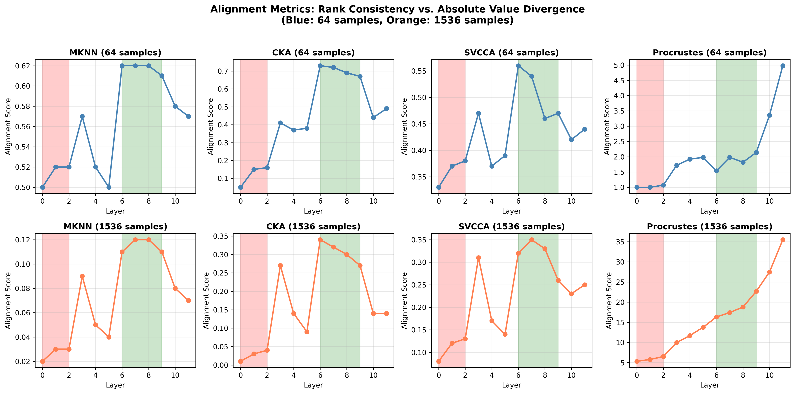
</figure>


## 20.10
currently running more rigorous experiments on the correlation between num_samples in dataset and K and metrics, that I can directly report them to my thesis. also includes time findings.
This analysis is done while the finetuning step of pretrained models is trained for three seeds a three tasks (9) per pretrained.


results are below:
The analysis was done for 49 models (15/15/19: mm_imdb/upmc_food/hateful_memes)

- running time for num_samples= 512: 14.12s ± 5.12 (std)
- running time for num_samples=1536: 42.64s ± 4.82 (std) on uni-gpu, on my gpu way worse as cpu has to be used. over 5 minutes for it.
also


for metrics of interest (cka, procrustes,svcca, mknn ), inter-model correlation was high.
| Metric      | Mean (within-model) | Std Dev    | Mean p-value | Std Dev (p-value) |
|-------------|---------------------|------------|--------------|-------------------|
| mknn        | 0.9077              | 0.1240     | 0.0051       | 0.0169            |
| procrustes  | 0.9957              | 0.0058     | 0.0000       | 0.0000            |
| cka         | 0.9869              | 0.0284     | 0.0000       | 0.0002            |
| svcca       | 0.9264              | 0.0869     | 0.0024       | 0.0142            |


also the new correlation between metrics was similar to the results with fewer metrics:

<figure>
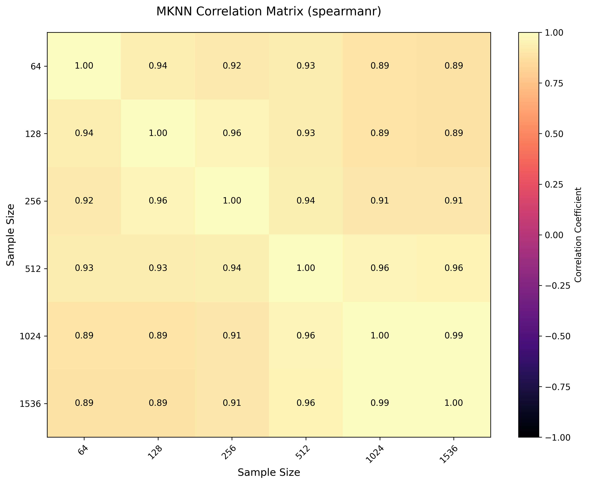
</figure>


---

## 18.10 & 17.10
**summary**:
to sum my current thesis: Basically this thesis studies representational alignment in two-stream architectures (ViLBERT).

i) How do cross-attention layer between the streams affect the representational alignment?

ii) is there a corerlationbetween performance (acc) and alignment? is it task dependent?

iii) Is there an correlation between representational alignment and coattention placement? (how to measure this??)

iv) optimal alignment for archicture, how is the overall performance?

**past ⁊ current experiments**:
i) best performing architectures for mm_imdb and hateful memes, searched via optuna.

ii) pretraining for the below architectures. (early, mid, late, asymmetric, optuna1, optuna2, [optuna3 is still todo])

iii) correlation analysis of num_dataset and k (kNN mesures) and between measurements.

iv) currently: finetuning on all three tasks (mmimdb, hm, upmcfood) for each three seeds ($6\cdot3\cdot3$)
- correlation analysis for repr measures and performance


**additional things**:
i) is representational alignment really increasing after coattns?

ii) directly optimize for alignment measures (like cka)


---
## 21.10

found imbalances in the hm dataset:
train data: class balance: 0.3551764705882353
Positive samples: 3019, Negative samples: 5481

validation data: class balance: 0.42980769230769234
Positive samples: 447, Negative samples: 593


## 17.10

This comparision is on the two tasks `mm_imdb` and `upmc_food`, each with 15 finetune-only models. this pools the models here for one task and evaluates it for the test and train set. Here different architectures where used. This is a analysis of predictability of performance from alignment measures in general.
<details closed>

	mm_imdb: test loss=0.1897, test acc=0.9233
	mm_imdb: val loss=0.1803, val acc=0.9279
	mm_imdb: test loss=0.1897, test acc=0.9233
	mm_imdb:  val loss=0.1803,  val acc=0.9279
	mm_imdb: test loss=0.1887, test acc=0.9236
	mm_imdb:  val loss=0.1783,  val acc=0.9286
	mm_imdb: test loss=0.1880, test acc=0.9248
	mm_imdb:  val loss=0.1775,  val acc=0.9297
	mm_imdb: test loss=0.1854, test acc=0.9253
	mm_imdb:  val loss=0.1743,  val acc=0.9304
	mm_imdb: test loss=0.1836, test acc=0.9269
	mm_imdb:  val loss=0.1710,  val acc=0.9325
	mm_imdb: test loss=0.1853, test acc=0.9259
	mm_imdb:  val loss=0.1748,  val acc=0.9307
	mm_imdb: test loss=0.1814, test acc=0.9277
	mm_imdb:  val loss=0.1686,  val acc=0.9334
	mm_imdb: test loss=0.1858, test acc=0.9261
	mm_imdb:  val loss=0.1741,  val acc=0.9314
	mm_imdb: test loss=0.1795, test acc=0.9290
	mm_imdb:  val loss=0.1685,  val acc=0.9339
	mm_imdb: test loss=0.1874, test acc=0.9245
	mm_imdb:  val loss=0.1777,  val acc=0.9291
	mm_imdb: test loss=0.1866, test acc=0.9247
	mm_imdb:  val loss=0.1749,  val acc=0.9302
	mm_imdb: test loss=0.1880, test acc=0.9244
	mm_imdb:  val loss=0.1777,  val acc=0.9290
	mm_imdb: test loss=0.1805, test acc=0.9271
	mm_imdb:  val loss=0.1675,  val acc=0.9334
	mm_imdb: test loss=0.1843, test acc=0.9263
	mm_imdb:  val loss=0.1721,  val acc=0.9319
	mm_imdb: test loss=0.1787, test acc=0.9284
	mm_imdb:  val loss=0.1644,  val acc=0.9346
=========================
test dataset
corr. of mknn           with acc : r=+0.739, p=0.002
corr. of mknn           with loss: r=+0.693, p=0.004
corr. of cka            with acc : r=+0.704, p=0.003
corr. of cka            with loss: r=+0.655, p=0.008
corr. of cka_rbf        with acc : r=-0.023, p=0.935
corr. of cka_rbf        with loss: r=-0.235, p=0.400
corr. of unbiased_cka   with acc : r=+0.703, p=0.003
corr. of unbiased_cka   with loss: r=+0.654, p=0.008
corr. of svcca          with acc : r=+0.755, p=0.001
corr. of svcca          with loss: r=+0.729, p=0.002
corr. of cknna          with acc : r=+0.771, p=0.001
corr. of cknna          with loss: r=+0.730, p=0.002
corr. of cycle_knn      with acc : r=+0.052, p=0.855
corr. of cycle_knn      with loss: r=+0.126, p=0.656
corr. of procrustes     with acc : r=-0.263, p=0.344
corr. of procrustes     with loss: r=-0.071, p=0.803
corr. of jaccard        with acc : r=+0.734, p=0.002
corr. of jaccard        with loss: r=+0.682, p=0.005
corr. of rsa            with acc : r=+0.753, p=0.001
corr. of rsa            with loss: r=+0.723, p=0.002
corr. of r2             with acc : r=+0.683, p=0.005
corr. of r2             with loss: r=+0.644, p=0.010
=========================
corr. of mknn           with acc : r=+0.711, p=0.003
corr. of mknn           with loss: r=+0.671, p=0.006
corr. of cka            with acc : r=+0.707, p=0.003
corr. of cka            with loss: r=+0.675, p=0.006
corr. of cka_rbf        with acc : r=+0.186, p=0.508
corr. of cka_rbf        with loss: r=+0.004, p=0.990
corr. of unbiased_cka   with acc : r=+0.707, p=0.003
corr. of unbiased_cka   with loss: r=+0.675, p=0.006
corr. of svcca          with acc : r=+0.689, p=0.004
corr. of svcca          with loss: r=+0.579, p=0.024
corr. of cknna          with acc : r=+0.711, p=0.003
corr. of cknna          with loss: r=+0.664, p=0.007
corr. of cycle_knn      with acc : r=-0.059, p=0.834
corr. of cycle_knn      with loss: r=+0.028, p=0.922
corr. of procrustes     with acc : r=-0.182, p=0.516
corr. of procrustes     with loss: r=+0.014, p=0.960
corr. of jaccard        with acc : r=+0.711, p=0.003
corr. of jaccard        with loss: r=+0.671, p=0.006
corr. of rsa            with acc : r=+0.732, p=0.002
corr. of rsa            with loss: r=+0.689, p=0.004
corr. of r2             with acc : r=+0.704, p=0.003
corr. of r2             with loss: r=+0.632, p=0.011
=========================
validation dataset
corr. of mknn           with acc : r=+0.746, p=0.001
corr. of mknn           with loss: r=+0.696, p=0.004
corr. of cka            with acc : r=+0.711, p=0.003
corr. of cka            with loss: r=+0.658, p=0.008
corr. of cka_rbf        with acc : r=-0.117, p=0.678
corr. of cka_rbf        with loss: r=-0.258, p=0.353
corr. of unbiased_cka   with acc : r=+0.709, p=0.003
corr. of unbiased_cka   with loss: r=+0.656, p=0.008
corr. of svcca          with acc : r=+0.780, p=0.001
corr. of svcca          with loss: r=+0.736, p=0.002
corr. of cknna          with acc : r=+0.783, p=0.001
corr. of cknna          with loss: r=+0.735, p=0.002
corr. of cycle_knn      with acc : r=+0.107, p=0.705
corr. of cycle_knn      with loss: r=+0.156, p=0.579
corr. of procrustes     with acc : r=-0.178, p=0.525
corr. of procrustes     with loss: r=-0.040, p=0.888
corr. of jaccard        with acc : r=+0.739, p=0.002
corr. of jaccard        with loss: r=+0.685, p=0.005
corr. of rsa            with acc : r=+0.774, p=0.001
corr. of rsa            with loss: r=+0.733, p=0.002
corr. of r2             with acc : r=+0.672, p=0.006
corr. of r2             with loss: r=+0.626, p=0.013
=========================
corr. of mknn           with acc : r=+0.714, p=0.003
corr. of mknn           with loss: r=+0.693, p=0.004
corr. of cka            with acc : r=+0.714, p=0.003
corr. of cka            with loss: r=+0.700, p=0.004
corr. of cka_rbf        with acc : r=+0.139, p=0.621
corr. of cka_rbf        with loss: r=+0.046, p=0.869
corr. of unbiased_cka   with acc : r=+0.714, p=0.003
corr. of unbiased_cka   with loss: r=+0.700, p=0.004
corr. of svcca          with acc : r=+0.668, p=0.007
corr. of svcca          with loss: r=+0.639, p=0.010
corr. of cknna          with acc : r=+0.714, p=0.003
corr. of cknna          with loss: r=+0.693, p=0.004
corr. of cycle_knn      with acc : r=+0.008, p=0.978
corr. of cycle_knn      with loss: r=-0.055, p=0.845
corr. of procrustes     with acc : r=-0.125, p=0.657
corr. of procrustes     with loss: r=-0.021, p=0.940
corr. of jaccard        with acc : r=+0.714, p=0.003
corr. of jaccard        with loss: r=+0.693, p=0.004
corr. of rsa            with acc : r=+0.736, p=0.002
corr. of rsa            with loss: r=+0.704, p=0.003
corr. of r2             with acc : r=+0.689, p=0.004
corr. of r2             with loss: r=+0.657, p=0.008


	upmc_food: test loss=0.4185, test acc=0.9040
	upmc_food:  val loss=0.4039,  val acc=0.9065
	upmc_food: test loss=0.4067, test acc=0.9079
	upmc_food:  val loss=0.4000,  val acc=0.9092
	upmc_food: test loss=0.4244, test acc=0.9020
	upmc_food:  val loss=0.4286,  val acc=0.9035
	upmc_food: test loss=0.3638, test acc=0.9203
	upmc_food:  val loss=0.3543,  val acc=0.9194
	upmc_food: test loss=0.3651, test acc=0.9187
	upmc_food:  val loss=0.3651,  val acc=0.9188
	upmc_food: test loss=0.3748, test acc=0.9179
	upmc_food:  val loss=0.3628,  val acc=0.9168
	upmc_food: test loss=0.2812, test acc=0.9367
	upmc_food:  val loss=0.2733,  val acc=0.9388
	upmc_food: test loss=0.2854, test acc=0.9367
	upmc_food:  val loss=0.2777,  val acc=0.9369
	upmc_food: test loss=0.2879, test acc=0.9371
	upmc_food:  val loss=0.2809,  val acc=0.9374
	upmc_food: test loss=0.3408, test acc=0.9261
	upmc_food:  val loss=0.3276,  val acc=0.9245
	upmc_food: test loss=0.3326, test acc=0.9272
	upmc_food:  val loss=0.3309,  val acc=0.9237
	upmc_food: test loss=0.3343, test acc=0.9272
	upmc_food:  val loss=0.3311,  val acc=0.9261
	upmc_food: test loss=0.3362, test acc=0.9249
	upmc_food:  val loss=0.3367,  val acc=0.9259
	upmc_food: test loss=0.3308, test acc=0.9299
	upmc_food:  val loss=0.3276,  val acc=0.9281
=========================
test dataset
corr. of mknn           with acc : r=+0.751, p=0.002
corr. of mknn           with loss: r=+0.798, p=0.001
corr. of cka            with acc : r=+0.724, p=0.003
corr. of cka            with loss: r=+0.780, p=0.001
corr. of cka_rbf        with acc : r=+0.729, p=0.003
corr. of cka_rbf        with loss: r=+0.703, p=0.005
corr. of unbiased_cka   with acc : r=+0.728, p=0.003
corr. of unbiased_cka   with loss: r=+0.784, p=0.001
corr. of svcca          with acc : r=+0.729, p=0.003
corr. of svcca          with loss: r=+0.751, p=0.002
corr. of cknna          with acc : r=+0.743, p=0.002
corr. of cknna          with loss: r=+0.784, p=0.001
corr. of cycle_knn      with acc : r=+0.394, p=0.164
corr. of cycle_knn      with loss: r=+0.424, p=0.131
corr. of procrustes     with acc : r=-0.401, p=0.156
corr. of procrustes     with loss: r=-0.485, p=0.079
corr. of jaccard        with acc : r=+0.753, p=0.002
corr. of jaccard        with loss: r=+0.802, p=0.001
corr. of rsa            with acc : r=+0.718, p=0.004
corr. of rsa            with loss: r=+0.772, p=0.001
corr. of r2             with acc : r=+0.585, p=0.028
corr. of r2             with loss: r=+0.644, p=0.013
=========================
corr. of mknn           with acc : r=+0.654, p=0.011
corr. of mknn           with loss: r=+0.688, p=0.007
corr. of cka            with acc : r=+0.709, p=0.005
corr. of cka            with loss: r=+0.723, p=0.003
corr. of cka_rbf        with acc : r=+0.760, p=0.002
corr. of cka_rbf        with loss: r=+0.728, p=0.003
corr. of unbiased_cka   with acc : r=+0.672, p=0.009
corr. of unbiased_cka   with loss: r=+0.684, p=0.007
corr. of svcca          with acc : r=+0.705, p=0.005
corr. of svcca          with loss: r=+0.701, p=0.005
corr. of cknna          with acc : r=+0.736, p=0.003
corr. of cknna          with loss: r=+0.780, p=0.001
corr. of cycle_knn      with acc : r=+0.580, p=0.030
corr. of cycle_knn      with loss: r=+0.606, p=0.022
corr. of procrustes     with acc : r=-0.295, p=0.306
corr. of procrustes     with loss: r=-0.270, p=0.350
corr. of jaccard        with acc : r=+0.654, p=0.011
corr. of jaccard        with loss: r=+0.688, p=0.007
corr. of rsa            with acc : r=+0.643, p=0.013
corr. of rsa            with loss: r=+0.666, p=0.009
corr. of r2             with acc : r=+0.623, p=0.017
corr. of r2             with loss: r=+0.657, p=0.011
=========================
validation dataset
corr. of mknn           with acc : r=+0.817, p=0.000
corr. of mknn           with loss: r=+0.779, p=0.001
corr. of cka            with acc : r=+0.792, p=0.001
corr. of cka            with loss: r=+0.782, p=0.001
corr. of cka_rbf        with acc : r=+0.698, p=0.006
corr. of cka_rbf        with loss: r=+0.711, p=0.004
corr. of unbiased_cka   with acc : r=+0.797, p=0.001
corr. of unbiased_cka   with loss: r=+0.784, p=0.001
corr. of svcca          with acc : r=+0.777, p=0.001
corr. of svcca          with loss: r=+0.734, p=0.003
corr. of cknna          with acc : r=+0.801, p=0.001
corr. of cknna          with loss: r=+0.764, p=0.001
corr. of cycle_knn      with acc : r=+0.451, p=0.106
corr. of cycle_knn      with loss: r=+0.382, p=0.177
corr. of procrustes     with acc : r=-0.474, p=0.087
corr. of procrustes     with loss: r=-0.530, p=0.051
corr. of jaccard        with acc : r=+0.820, p=0.000
corr. of jaccard        with loss: r=+0.784, p=0.001
corr. of rsa            with acc : r=+0.791, p=0.001
corr. of rsa            with loss: r=+0.767, p=0.001
corr. of r2             with acc : r=+0.673, p=0.008
corr. of r2             with loss: r=+0.641, p=0.014
=========================
corr. of mknn           with acc : r=+0.754, p=0.002
corr. of mknn           with loss: r=+0.556, p=0.039
corr. of cka            with acc : r=+0.789, p=0.001
corr. of cka            with loss: r=+0.697, p=0.006
corr. of cka_rbf        with acc : r=+0.744, p=0.002
corr. of cka_rbf        with loss: r=+0.821, p=0.000
corr. of unbiased_cka   with acc : r=+0.763, p=0.002
corr. of unbiased_cka   with loss: r=+0.662, p=0.010
corr. of svcca          with acc : r=+0.776, p=0.001
corr. of svcca          with loss: r=+0.596, p=0.025
corr. of cknna          with acc : r=+0.780, p=0.001
corr. of cknna          with loss: r=+0.640, p=0.014
corr. of cycle_knn      with acc : r=+0.682, p=0.007
corr. of cycle_knn      with loss: r=+0.455, p=0.102
corr. of procrustes     with acc : r=-0.305, p=0.288
corr. of procrustes     with loss: r=-0.398, p=0.159
corr. of jaccard        with acc : r=+0.754, p=0.002
corr. of jaccard        with loss: r=+0.556, p=0.039
corr. of rsa            with acc : r=+0.754, p=0.002
corr. of rsa            with loss: r=+0.596, p=0.025
corr. of r2             with acc : r=+0.723, p=0.003
corr. of r2             with loss: r=+0.530, p=0.051


</details>
$\Rightarrow$ negative correlation with procrustes, high correlation with cknna.
Interesting really low (highly significant) values for mm_imdb, while upmc_food shows moderate correlations with high p-values (not significant).
Seems to be task dependent.


Here's a concise analysis you can add:


The following metrics show strong, significant correlations (r > 0.7, p < 0.01) across both tasks:

| Metric | MM-IMDB (test) | UPMC-Food (test) |
|--------|----------------|------------------|
| cknna| r=0.771, p=0.001 | r=0.743, p=0.002 |
| mknn | r=0.739, p=0.002 | r=0.751, p=0.002 |
| svcca | r=0.755, p=0.001 | r=0.729, p=0.003 |
| jaccard | r=0.734, p=0.002 | r=0.753, p=0.002 |
| rsa | r=0.753, p=0.001 | r=0.718, p=0.004 |
| cka (linear) | r=0.704, p=0.003 | r=0.724, p=0.003 |

**Conclusion**: These 6 metrics reliably predict performance across diverse architectures and tasks.

**cka_rbf** shows dramatically different performance:
- MM-IMDB: r=-0.023 (p=0.935) - **fails completely**
- UPMC-Food: r=+0.729 (p=0.003) - **strong predictor**


---


is CLS in BERT even the same as CLS in ViT?

implemented test sets for all datasets. now in `experimentTracker.evaluate(model, task)` the test sets are used for computing accuracies.

Problem: hateful memes is too small for meaningful alignment analysis with 512, i have to adjust to 500. `dev.jsonl` contains only 500 samples

implemented sanity check for the measures:
```
SVCCA:           identical=0.8797, random=0.1669
CKA:             identical=1.0000, random=0.0548
CKA normed:      identical=1.0000, random=0.0552
CKA unbiased:    identical=1.0000, random=0.0290
Mutual KNN:      identical=1.0000, random=0.0618
CKNNA:           identical=1.0000, random=0.0194
Cycle KNN:       identical=0.8848, random=0.6484
LCS KNN:         identical=8.0000, random=0.3789
Edit Distance:   identical=1.0000, random=0.7501
Jaccard:         identical=1.0000, random=0.0406
Procrustes:      identical=nan, random=82.1158
RSA:             identical=1.0000, random=0.0286
```
weirdly, svcca has 0.87 even for identical measures, and 0.16 for random. Seems not to be quite in the range of $[0,1]$.

Problem here:
```
0: v-v: 0.9742729933317914, t-t: 0.9047365303899584, c-c: 0.13146975382067233
1: v-v: 0.9538666934372777, t-t: 0.855300764183276, c-c: 0.14771491771396944
2: v-v: 0.9437303334795629, t-t: 0.7867630363653866, c-c: 0.1734919959929184
3: v-v: 0.8232363334222592, t-t: 0.8860326698559919, c-c: 0.5732621813327985
4: v-v: 0.7557494530616364, t-t: 0.8556820596575738, c-c: 0.47956998649240273
5: v-v: 0.7959809675239169, t-t: 0.9044626923547732, c-c: 0.40650191487462395
6: v-v: 0.920212235651318, t-t: 0.8345659617976542, c-c: 0.6030498543079044
7: v-v: 0.8347529077031177, t-t: 0.8586370697752859, c-c: 0.49550097506102564
8: v-v: 0.8238978509428844, t-t: 0.8547694013716522, c-c: 0.4029174003196152
9: v-v: 0.8246623019834024, t-t: 0.8581564826585076, c-c: 0.3787406480808941
10:v-v: 0.8131022050219533, t-t: 0.8672419515501189, c-c: 0.31508022616828846
11:v-v: 0.8049661072054934, t-t: 0.878885846839872, c-c: 0.3102150474189421
```

`v-v`, `t-t` directly compares the embeddings of intra model matrix where `i==j` (both embedings are identical), but still only 0.87.


## 14.10 current configurations under investigation

| name              | t_biatt_id | v_biatt_id | path  | notes |
|-------------------|------------|------------|-------|-------|
| baseline          | []         | []         |res/checkpoints/pretrains/20251010-085859_pretrained_baseline.pt           |maybe more epochs needed, as there is  |
| early_fusion      | [3,4,5]    | [3,4,5]    |res/checkpoints/pretrains/20251010-234252_pretrained_early_fusion.pt       | |
| middle_fusion     | [6,7,8]    | [6,7,8]    |res/checkpoints/pretrains/20251011-234349_pretrained_middle_fusion.pt      | |
| late_fusion       | [9,10,11]  | [9,10,11]  |res/checkpoints/pretrains/20251013-010227_pretrained_late_fusion.pt        | |
| asymmetric_fusion | [6,7,8,9]  | [3,5,7,9]  |res/checkpoints/pretrains/20251014-034432_pretrained_asymmetric_fusion.pt  | |
| optuna1           | [3,6]      | [6,8]      |res/checkpoints/pretrains/20251015-081211_pretrained_optuna1.pt            |good run for hm, trial  21 |
| optuna2           | [7,9,10,11]| [6,7,9,10] |res/checkpoints/pretrains/20251016-062038_pretrained_optuna2.pt            | trade-off run for mm-imdb and hm, trial 11|


still optuna 3 needed! good archicture for mm_imdb alone!


## 13.10

---
next steps:
- wait for pretraining run (5 architectures) to finish and start analysis
- correlation between representational alignment metrics and performance


**MM-IMDB (Val Acc @ Epoch 5):**

| Architecture          | Mean ± Std |
|-----------------------|-----------|
|**optuna2 [6,7,9,10]** | **0.9274 ± 0.0012** |
| **late [9,10,11]**    | **0.9270 ± 0.0011** |
| **middle [5,6,7]**    | 0.9258 ± 0.0008 |
| optuna1 [6,8]         | 0.9248 ± 0.0006 |
| early [3,4,6]         | 0.9242 ± 0.0006 |
| **baseline []**       | 0.9211 (1 seed) |

**UPMC Food (Val Acc @ Epoch 5):**

| Architecture | Mean ± Std |
|--------------|-----------|
| **late [9,10,11]** | **0.9377 ± 0.0010** |
| **baseline []** | **0.9363 (1 seed)** |
| optuna2 [6,7,9,10] | 0.9267 ± 0.0012 |
| optuna1 [6,8] | 0.9252 ± 0.0020 |
| middle [5,6,7] | 0.9183 ± 0.0013 |
| early [3,4,6] | 0.9064 ± 0.0029 |


$\Rightarrow$ UPMC-food does not really benefit from multimodality?


---

optuna run finished in `multi_task_study_20251004-131802 (id=3)`

<figure>
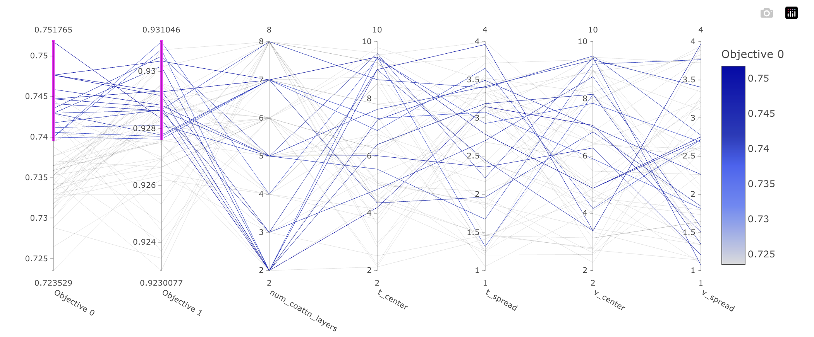
<figcaption>parallel coordinate</figcaption>


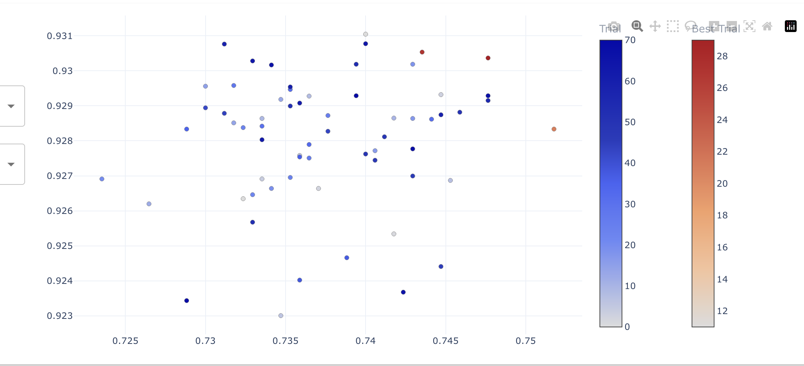
<figcaption>pareto front</figcaption>


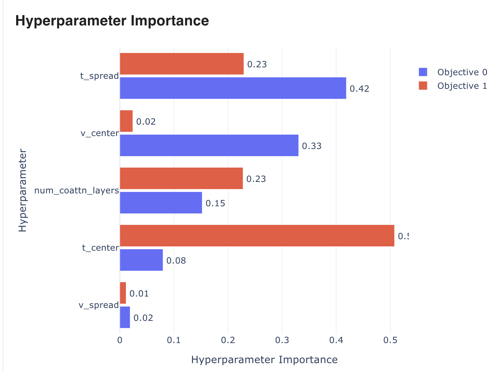
<figcaption>parameter importance</figcaption>


</figure>


---

<details closed>
<summary><b>Paths</b></summary>
Those are the paths of finetuned models without pretraining. To be used for correlation analysis.

```
model saved to res/checkpoints/20251012-163839_finetuned_upmc_food.pt
Saved finetuned model to res/checkpoints/20251012-163839_finetuned_upmc_food.pt
[
'res/checkpoints/20251010-090441_finetuned_mm_imdb.pt',
'res/checkpoints/20251010-095244_finetuned_upmc_food.pt',
'res/checkpoints/20251010-130016_finetuned_mm_imdb.pt',
'res/checkpoints/20251010-134820_finetuned_upmc_food.pt',
'res/checkpoints/20251010-165605_finetuned_mm_imdb.pt',
'res/checkpoints/20251010-174413_finetuned_upmc_food.pt',
'res/checkpoints/20251010-205147_finetuned_mm_imdb.pt',
'res/checkpoints/20251010-213953_finetuned_upmc_food.pt',
'res/checkpoints/20251011-004735_finetuned_mm_imdb.pt',
'res/checkpoints/20251011-013540_finetuned_upmc_food.pt',
'res/checkpoints/20251011-044319_finetuned_mm_imdb.pt',
'res/checkpoints/20251011-053123_finetuned_upmc_food.pt',
'res/checkpoints/20251011-083858_finetuned_mm_imdb.pt',
'res/checkpoints/20251011-092703_finetuned_upmc_food.pt',
'res/checkpoints/20251011-123449_finetuned_mm_imdb.pt',
'res/checkpoints/20251011-132257_finetuned_upmc_food.pt',
'res/checkpoints/20251011-163056_finetuned_mm_imdb.pt',
'res/checkpoints/20251011-171905_finetuned_upmc_food.pt',
'res/checkpoints/20251011-202657_finetuned_mm_imdb.pt',
'res/checkpoints/20251011-211506_finetuned_upmc_food.pt',
'res/checkpoints/20251012-000323_finetuned_mm_imdb.pt',
'res/checkpoints/20251012-004732_finetuned_upmc_food.pt',
'res/checkpoints/20251012-033945_finetuned_mm_imdb.pt',
'res/checkpoints/20251012-042355_finetuned_upmc_food.pt',
'res/checkpoints/20251012-071611_finetuned_mm_imdb.pt',
'res/checkpoints/20251012-080813_finetuned_upmc_food.pt',
'res/checkpoints/20251012-113121_finetuned_mm_imdb.pt',
'res/checkpoints/20251012-122323_finetuned_upmc_food.pt',
'res/checkpoints/20251012-154634_finetuned_mm_imdb.pt',
'res/checkpoints/20251012-163839_finetuned_upmc_food.pt',
'res/checkpoints/20251013-094844_finetuned_mm_imdb.pt',
'res/checkpoints/20251013-094844_finetuned_upmc_food.pt,
]
```
</details>

## 09.10

<details closed>

need to include the new directory `res/checkpoints/ftonly_for_correlation-analysis` in the paths
```
# on gaming pc
# "res/checkpoints/20251007-200007_finetuned_hateful_memes.pt",
# "res/checkpoints/20251007-201826_finetuned_mm_imdb.pt",
# "res/checkpoints/20251008-141240_finetuned_hateful_memes.pt",
# "res/checkpoints/20251008-144350_finetuned_mm_imdb.pt",
# "res/checkpoints/20251008-154319_finetuned_hateful_memes.pt",
# "res/checkpoints/20251008-160257_finetuned_mm_imdb.pt",
# "res/checkpoints/20251008-170044_finetuned_hateful_memes.pt"

# ---------------------------------------------------------
#uni gpus
"res/checkpoints/20251006-211344_finetuned_hateful_memes.pt",
"res/checkpoints/20251006-211344_finetuned_mm_imdb.pt",
"res/checkpoints/20251006-224233_finetuned_hateful_memes.pt",
"res/checkpoints/20251006-224233_finetuned_mm_imdb.pt",
"res/checkpoints/20251007-160301_finetuned_hateful_memes.pt",
"res/checkpoints/20251007-160855_finetuned_hateful_memes.pt",
"res/checkpoints/20251007-160855_finetuned_mm_imdb.pt",
"res/checkpoints/20251007-162505_finetuned_mm_imdb.pt",
"res/checkpoints/20251007-172924_finetuned_hateful_memes.pt",
"res/checkpoints/20251007-173620_finetuned_hateful_memes.pt",
"res/checkpoints/20251008-113042_finetuned_hateful_memes.pt",
"res/checkpoints/20251008-113042_finetuned_mm_imdb.pt",
#not sure about them above, could be bad runs
"res/checkpoints/20251008-131105_finetuned_mm_imdb.pt",
"res/checkpoints/20251008-143741_finetuned_hateful_memes.pt",
"res/checkpoints/20251008-143741_finetuned_mm_imdb.pt",
"res/checkpoints/20251008-161701_finetuned_hateful_memes.pt",
"res/checkpoints/20251008-161701_finetuned_mm_imdb.pt",
"res/checkpoints/20251008-174253_finetuned_hateful_memes.pt",
"res/checkpoints/20251008-174253_finetuned_mm_imdb.pt",
"res/checkpoints/20251008-193456_finetuned_hateful_memes.pt",
"res/checkpoints/20251008-193456_finetuned_mm_imdb.pt",
"res/checkpoints/20251008-211323_finetuned_hateful_memes.pt",
"res/checkpoints/20251008-211323_finetuned_mm_imdb.pt",
"res/checkpoints/20251008-223850_finetuned_hateful_memes.pt",
"res/checkpoints/20251008-223850_finetuned_mm_imdb.pt",
"res/checkpoints/20251009-004449_finetuned_hateful_memes.pt",
"res/checkpoints/20251009-004449_finetuned_mm_imdb.pt",
"res/checkpoints/20251009-023655_finetuned_hateful_memes.pt",
"res/checkpoints/20251009-023655_finetuned_mm_imdb.pt",
"res/checkpoints/20251009-042241_finetuned_hateful_memes.pt",
"res/checkpoints/20251009-042241_finetuned_mm_imdb.pt",
"res/checkpoints/20251009-060800_finetuned_hateful_memes.pt",
"res/checkpoints/20251009-060800_finetuned_mm_imdb.pt",
"res/checkpoints/20251009-075441_finetuned_hateful_memes.pt",
"res/checkpoints/20251009-075441_finetuned_mm_imdb.pt",
```

</details>

Easy vqa has acc=1 => really good! but shows decreasing alignment metrics, but thats okay.
```
Epoch 1/4, Train Loss: 0.8763, Val Loss: 0.3202, Val Acc: 0.8712
layer  0: mknn = 0.07, cka(lin)=  0.01, svcca= 0.17, cka(rbf)=  0.03, cka(unb)=  0.00, cknn-a= 0.05, cycleknn= 0.79
layer  1: mknn = 0.07, cka(lin)=  0.02, svcca= 0.16, cka(rbf)=  0.16, cka(unb)=  0.02, cknn-a= 0.05, cycleknn= 0.78
layer  2: mknn = 0.07, cka(lin)=  0.02, svcca= 0.17, cka(rbf)=  0.25, cka(unb)=  0.01, cknn-a= 0.05, cycleknn= 0.79
layer  3: mknn = 0.08, cka(lin)=  0.04, svcca= 0.21, cka(rbf)=  0.64, cka(unb)=  0.02, cknn-a= 0.05, cycleknn= 0.75
layer  4: mknn = 0.08, cka(lin)=  0.05, svcca= 0.20, cka(rbf)=  0.84, cka(unb)=  0.02, cknn-a= 0.05, cycleknn= 0.77
layer  5: mknn = 0.29, cka(lin)=  0.49, svcca= 0.52, cka(rbf)=  1.00, cka(unb)=  0.44, cknn-a= 0.26, cycleknn= 0.91
layer  6: mknn = 0.30, cka(lin)=  0.52, svcca= 0.53, cka(rbf)=  1.00, cka(unb)=  0.46, cknn-a= 0.26, cycleknn= 0.90
layer  7: mknn = 0.27, cka(lin)=  0.50, svcca= 0.46, cka(rbf)=  1.00, cka(unb)=  0.45, cknn-a= 0.23, cycleknn= 0.86
layer  8: mknn = 0.24, cka(lin)=  0.45, svcca= 0.43, cka(rbf)=  1.00, cka(unb)=  0.39, cknn-a= 0.20, cycleknn= 0.86
layer  9: mknn = 0.35, cka(lin)=  0.66, svcca= 0.58, cka(rbf)=  1.00, cka(unb)=  0.62, cknn-a= 0.32, cycleknn= 0.87
layer 10: mknn = 0.27, cka(lin)=  0.40, svcca= 0.49, cka(rbf)=  1.00, cka(unb)=  0.35, cknn-a= 0.24, cycleknn= 0.85
layer 11: mknn = 0.23, cka(lin)=  0.32, svcca= 0.45, cka(rbf)=  1.00, cka(unb)=  0.28, cknn-a= 0.19, cycleknn= 0.84
```

```
Epoch 3/4, Train Loss: 0.0142, Val Loss: 0.0005, Val Acc: 1.0000
layer  0: mknn = 0.07, cka(lin)=  0.01, svcca= 0.15, cka(rbf)=  0.03, cka(unb)= -0.02, cknn-a= 0.05, cycleknn= 0.81
layer  1: mknn = 0.07, cka(lin)=  0.02, svcca= 0.17, cka(rbf)=  0.15, cka(unb)=  0.01, cknn-a= 0.05, cycleknn= 0.79
layer  2: mknn = 0.07, cka(lin)=  0.02, svcca= 0.18, cka(rbf)=  0.24, cka(unb)=  0.01, cknn-a= 0.05, cycleknn= 0.76
layer  3: mknn = 0.08, cka(lin)=  0.04, svcca= 0.20, cka(rbf)=  0.62, cka(unb)=  0.02, cknn-a= 0.05, cycleknn= 0.77
layer  4: mknn = 0.08, cka(lin)=  0.06, svcca= 0.19, cka(rbf)=  0.81, cka(unb)=  0.03, cknn-a= 0.05, cycleknn= 0.76
layer  5: mknn = 0.31, cka(lin)=  0.52, svcca= 0.52, cka(rbf)=  1.00, cka(unb)=  0.47, cknn-a= 0.28, cycleknn= 0.91
layer  6: mknn = 0.32, cka(lin)=  0.54, svcca= 0.55, cka(rbf)=  1.00, cka(unb)=  0.49, cknn-a= 0.29, cycleknn= 0.92
layer  7: mknn = 0.30, cka(lin)=  0.51, svcca= 0.50, cka(rbf)=  1.00, cka(unb)=  0.45, cknn-a= 0.25, cycleknn= 0.88
layer  8: mknn = 0.25, cka(lin)=  0.44, svcca= 0.44, cka(rbf)=  1.00, cka(unb)=  0.38, cknn-a= 0.21, cycleknn= 0.87
layer  9: mknn = 0.32, cka(lin)=  0.58, svcca= 0.52, cka(rbf)=  1.00, cka(unb)=  0.53, cknn-a= 0.28, cycleknn= 0.89
layer 10: mknn = 0.24, cka(lin)=  0.21, svcca= 0.48, cka(rbf)=  1.00, cka(unb)=  0.18, cknn-a= 0.19, cycleknn= 0.88
layer 11: mknn = 0.21, cka(lin)=  0.18, svcca= 0.47, cka(rbf)=  1.00, cka(unb)=  0.15, cknn-a= 0.17, cycleknn= 0.86
```
---

Same experiment as yesterday, but symmetric coattention placement at `[5,6,9]`.

<details open>
<summary><b>Results</b></summary>

<figure>
  <figcaption><b>CKA — Non-contrastive vs. Contrastive</b></figcaption>
  <div align="center">
    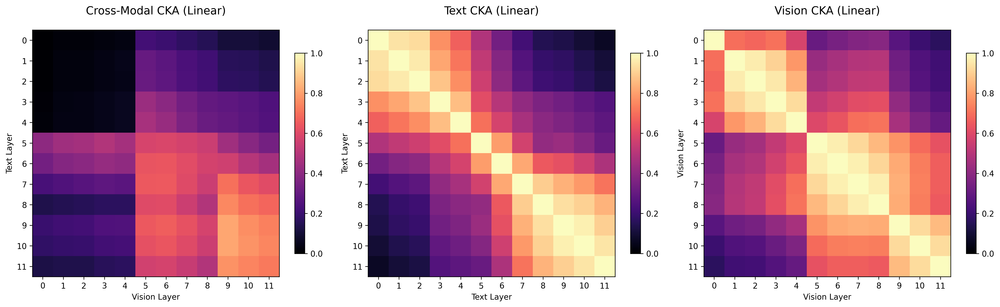
    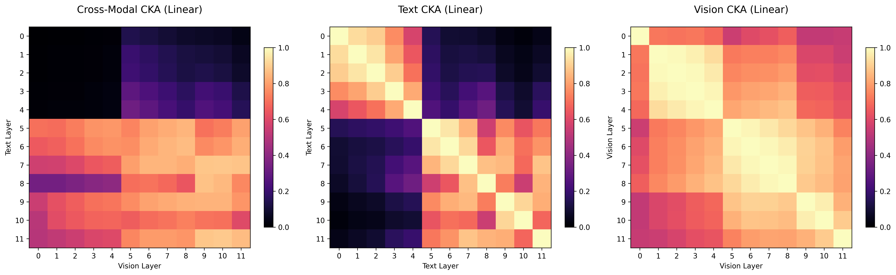
  </div>

  <hr>

  <figcaption><b>SVCCA</b></figcaption>
  <div align="center">
    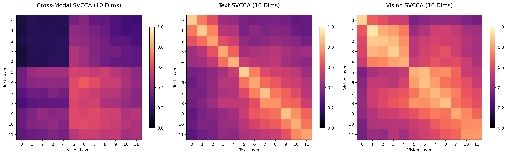
    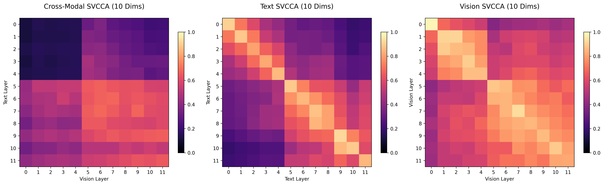
  </div>

  <small><i>Preliminary pattern: both similarity structures behave consistently across methods.</i></small>
</figure>
</details>

---

## 08.10
Finetune: contrastive vs non-contrastive on HM with late fusion (symmetric coattns at `[9,10,11]`).

<details open>
<summary><b>Results</b></summary>

<figure>
  <figcaption><b>CKA — Non-contrastive vs. Contrastive</b></figcaption>

  <div align="center">
    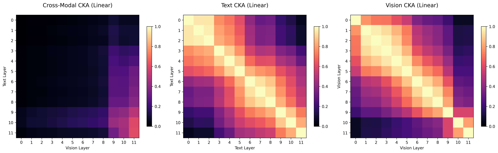
    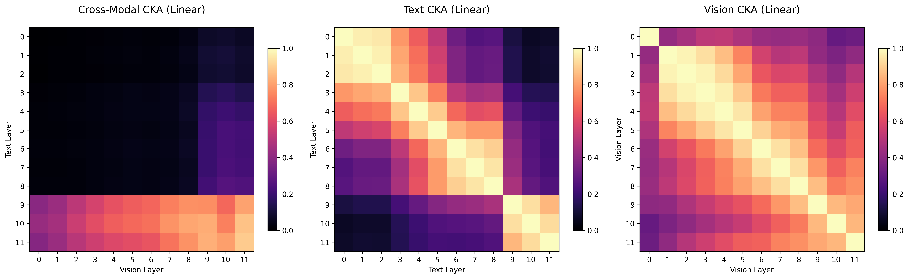
  </div>

  <blockquote>
    <b>Observation:</b> The contrastive term results in more alignment.
    In the contrastive run, text layers 9–11 are highly similar to all vision layers (decreasing from 11→0).
    The non-contrastive model shows the inverse pattern.
    Vision–vision similarity is also globally higher in the contrastive case.
  </blockquote>

  <hr>

  <figcaption><b>SVCCA</b></figcaption>

  <div align="center">
    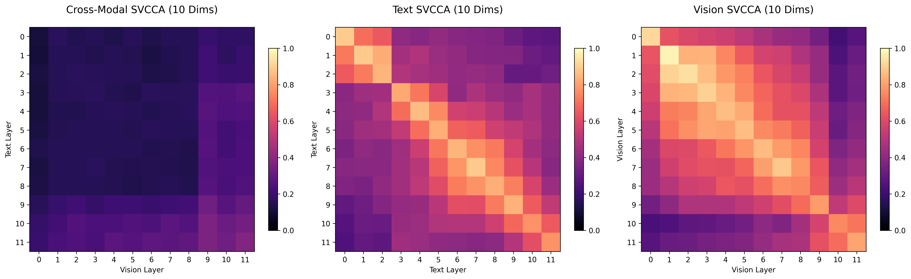
    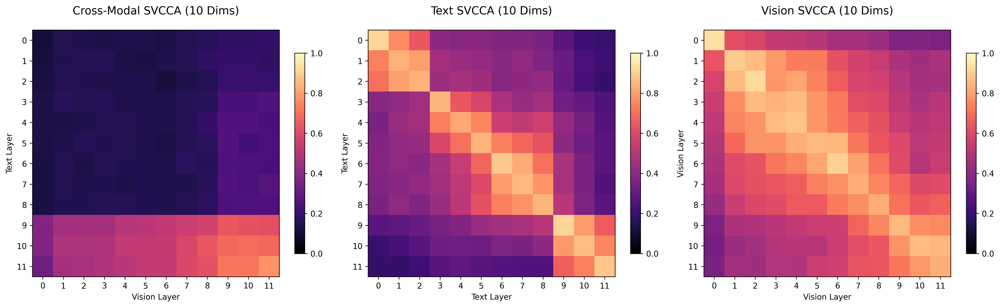
  </div>

  <small><i>Similar outcome as for CKA — SVCCA confirms the same layer-level trends.</i></small>
</figure>
</details>

---

## KNN-K Importance

<details open>
<summary><b>Spearman correlations between different K values</b></summary>

```text
K=  5 vs K= 10: r=0.9938, p=0.0000
...
K=  5 vs K=256: r=0.9074, p=0.0000
K= 10 vs K= 16: r=0.9978, p=0.0000
...
K=128 vs K=256: r=0.9872, p=0.0000

------------------------------------------------------------
Within-model K consistency (mean across models):
K=  5 vs K= 10: mean r=0.9668 ± 0.0215
...
K=  5 vs K=128: mean r=0.9021 ± 0.0715
...
K=128 vs K=256: mean r=0.9694 ± 0.0313
```

<blockquote>
  <b>Conclusion:</b> K choice is not crucial — correlations remain consistently high across values.
</blockquote>
</details>

---

## Correlation Analysis Between Metrics

<figure>
  <div align="center">
    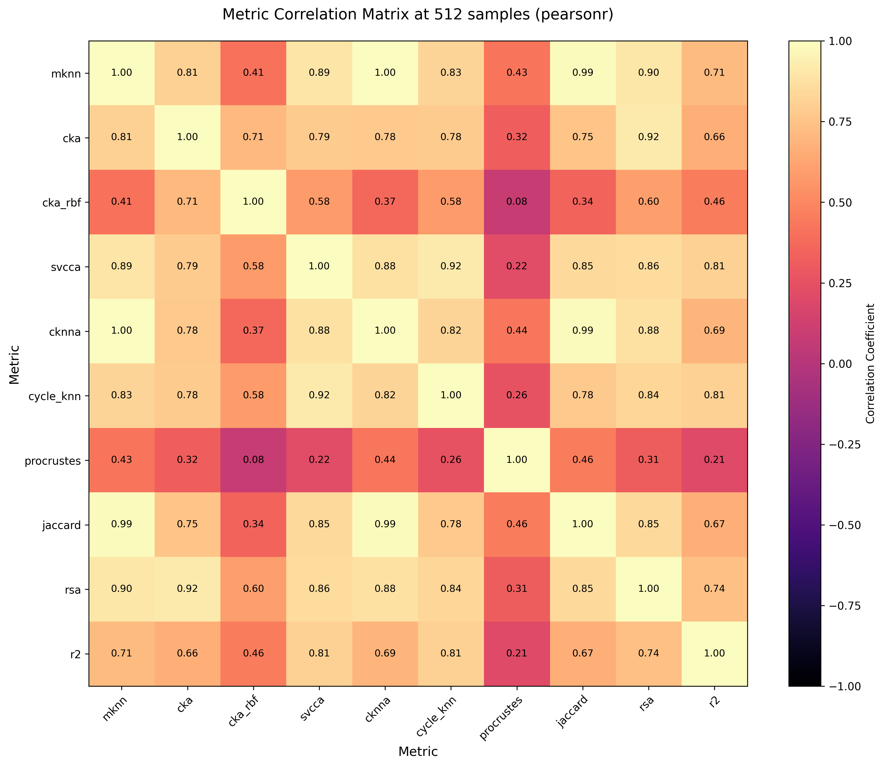
    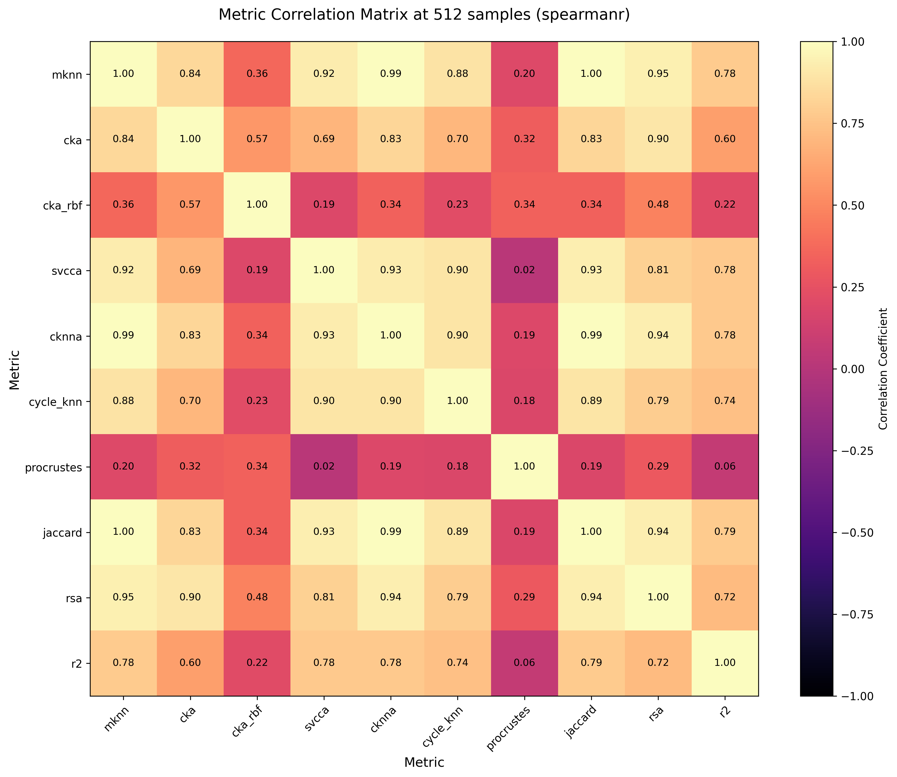
  </div>

  <blockquote>
    <b>Observation:</b> Many metrics appear redundant.
    Proceeding with the following four:
    <ul>
      <li><b>mknn</b> – similar to cknna, jaccard</li>
      <li><b>cka</b></li>
      <li><b>svcca</b> – similar to rsa and cycle_knn</li>
      <li><b>procrustes</b></li>
    </ul>
    <small><i>Excluding <code>r2</code> and <code>cka_rbf</code>.</i></small>
  </blockquote>
</figure>


## 07.10

Also adapted visualizations to the new metrics calculation with proper normalization. The following shows the resulting visualization comparing initialized to epoch 6:
```
Epoch 6/6, Train Loss: 0.4473, Val Loss: 0.5459, Val Acc: 0.7347
```

<figure>

**cka**: untrained vs e6 <br>
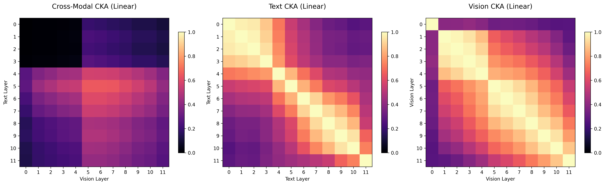
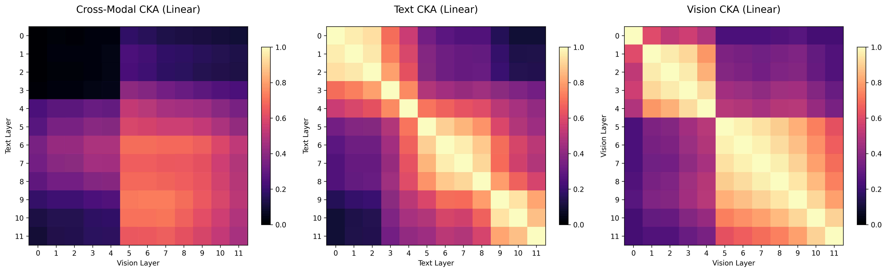

**mknn**: untrained vs e6<br>
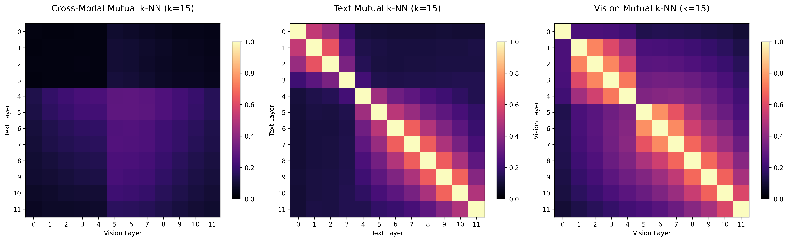
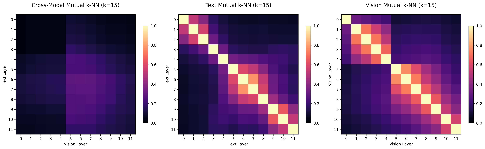


</figure>

---

Currently two experiments:
- c703i-gpu10: optuna multi-objective optimization of coattn-placement (still running, but paused and resumed to collect data for correlation analysis)
- c703i-gpu5: train 12 models (different architecture&seeds) for metric analysis.


Experiment on dataset size for alignment representations with only two different pretrains on random architectures, it showed that:
- r2 and cycle_knn are not statistically significant.
    ```
    Warning: correlation between 64 and 512 for cycle_knn is not significant (p=0.273, r=0.233)
    Warning: correlation between 64 and 1024 for cycle_knn is not significant (p=0.708, r=0.081)
    Warning: correlation between 256 and 64 for cycle_knn is not significant (p=0.078, r=0.367)
    Warning: correlation between 1024 and 64 for cycle_knn is not significant (p=0.708, r=0.081)
    ...
    ```

    ```
    Warning: correlation between 512 and 1024 for r2 is not significant (p=0.176, r=0.286)
    Warning: correlation between 1024 and 64 for r2 is not significant (p=0.123, r=0.323)
    Warning: correlation between 1024 and 128 for r2 is not significant (p=0.735, r=0.073)
    ```

- really high correlation for the other metrics, but cka_rbf needs higher sample sizes like 512; all visualizations are stored in `res/markdown_res/hm_two_arch-sample_size_corr-0710`.
<figure>
pearsonr vs spearmanr:
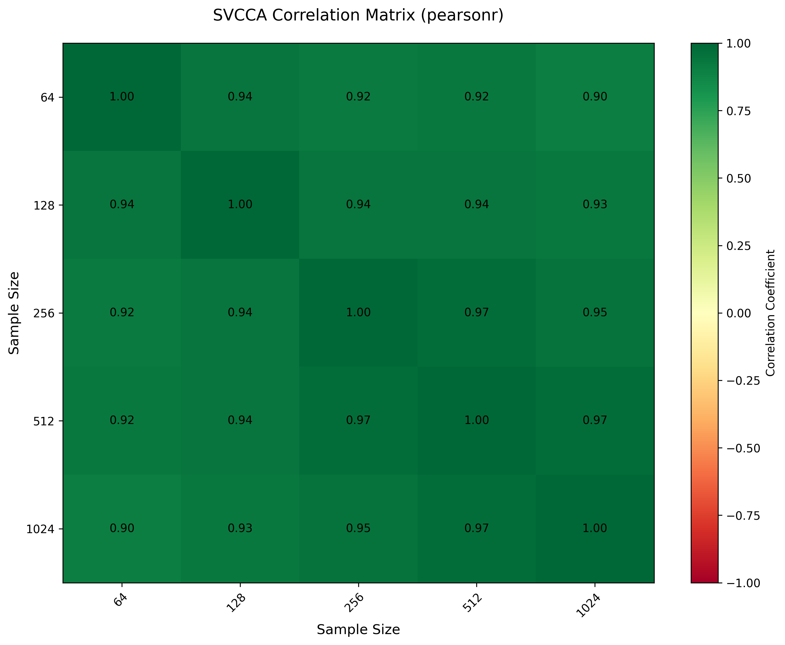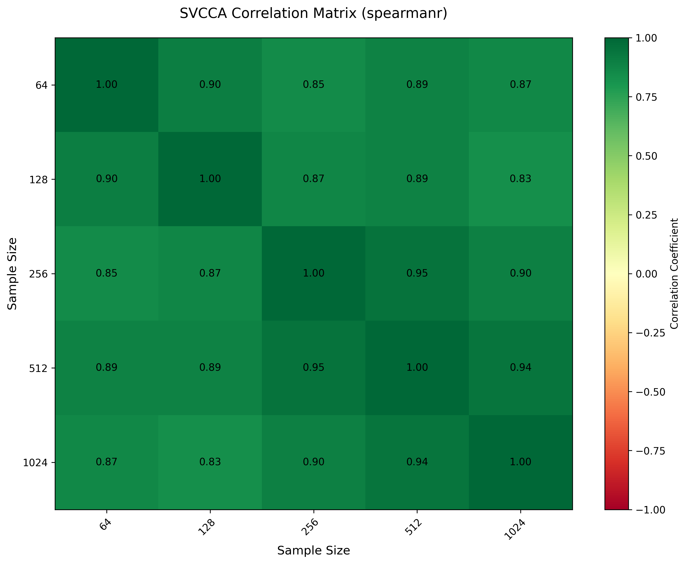

<br>
both show really good corerlation with pvals < 0.002

<br>
same results for *mknn*:
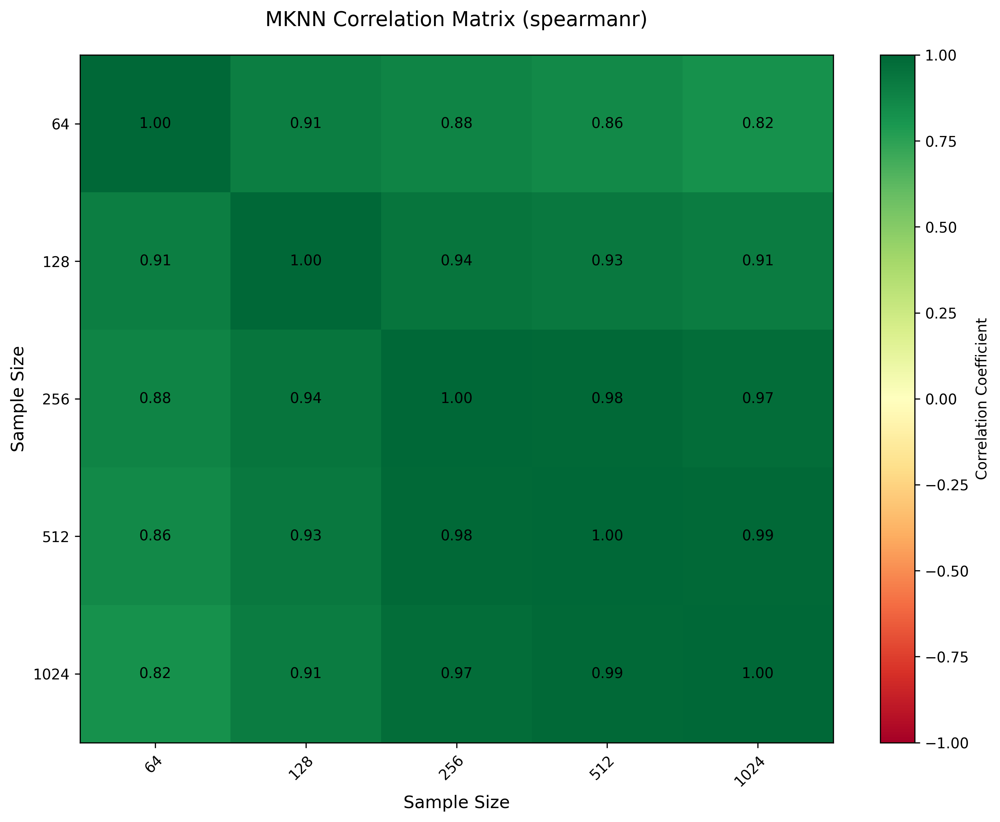

</figure>

$\Rightarrow$ `num_samples=512` seems to be a good size!


## 06.10

fixed normalization for alignment metrix. All the neighborhood based metrics (mknn, rank, procrustes) are now calculated on normalized embeddings. This should give more stable results!

also added new similarities:
- linear r2 alginment: $\hat Y = WX$, how good is simple revertible transformation $W$?
- representational similarity analysis (rsa): correlation of distance metrics

also rewrote the logic for collecting data for repr. alignment with simpler steps:
1) collect data batches from the alignment set in `get_alignment_data`
2) caluculate metrics
3) return them for saving

in addition I found the libraries for metrics from the papers:
- https://github.com/mklabunde/llm_repsim/blob/main/llmcomp/measures/procrustes.py  (towards understanding representational similarity in neural networks)
- https://github.com/minyoungg/platonic-rep/ (platonic representation)

Those repositories have well tested code already for this purpose. my implementations were a bit off (mknn was totally off, also cka lib I was using). As they tested their code, I'm going forward with their code for now, with a handful of metrics still relying on my implementation.


Also worked further towards a correlation analysis of the different metrics and batchsizes


## 05.10 comparison with contrastive loss:


### Visualizations for the below experiments
Analysis of ealry fusion and mid fusion in terms of all the alignment metrics collected:
<figure>
<!-- TODO: for one metric, all 4 different configs in one plot => better comparison -->
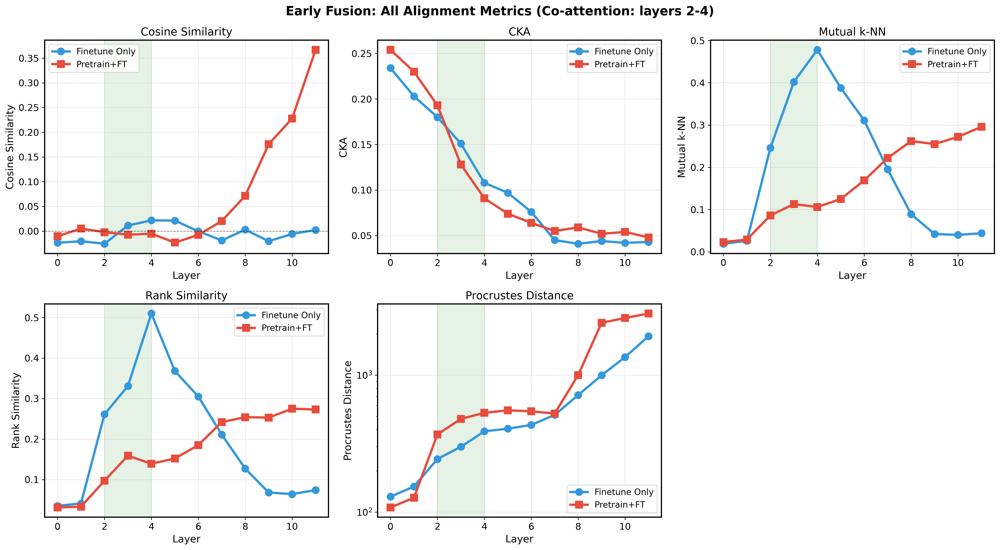

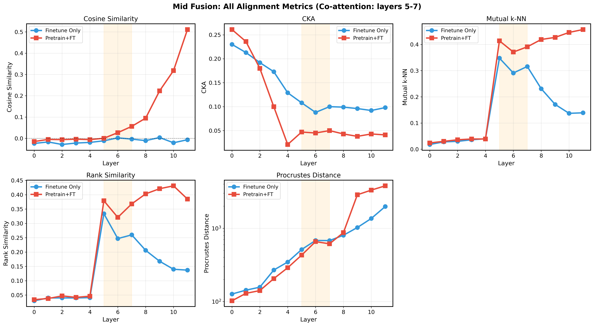
</figure>


comparison of mknn for all architectures:
<figure>
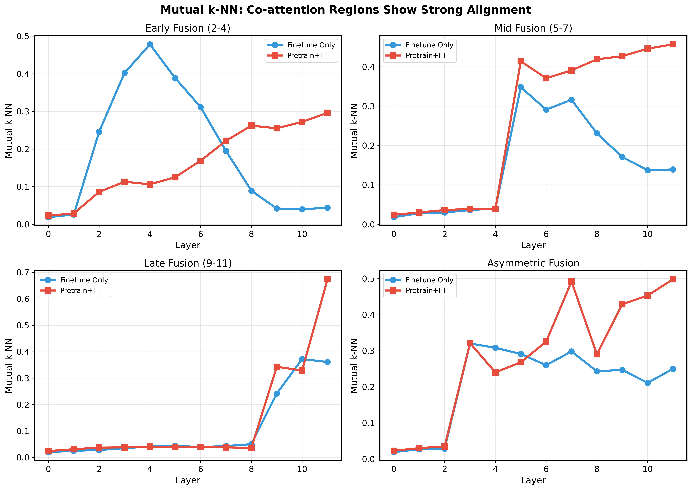
</figure>

Interesting finding: cosine similarity increases in pretrained model (with contrastive loss in pretraining) and reaches maximum in final representation.
But as the contrastive loss term directly optimizes cosine-sim, this is pretty clear. Anyhow, the final concattenation of `text_embedding` and `vision_embedding` directly optimizes those representations. But still the final values are different for different models. While early fusion achieves only 0.3 cosine in the last layer, the late fusion achieves 0.6 cosine similarity in the last layer. This is non-trivial

<figure>
    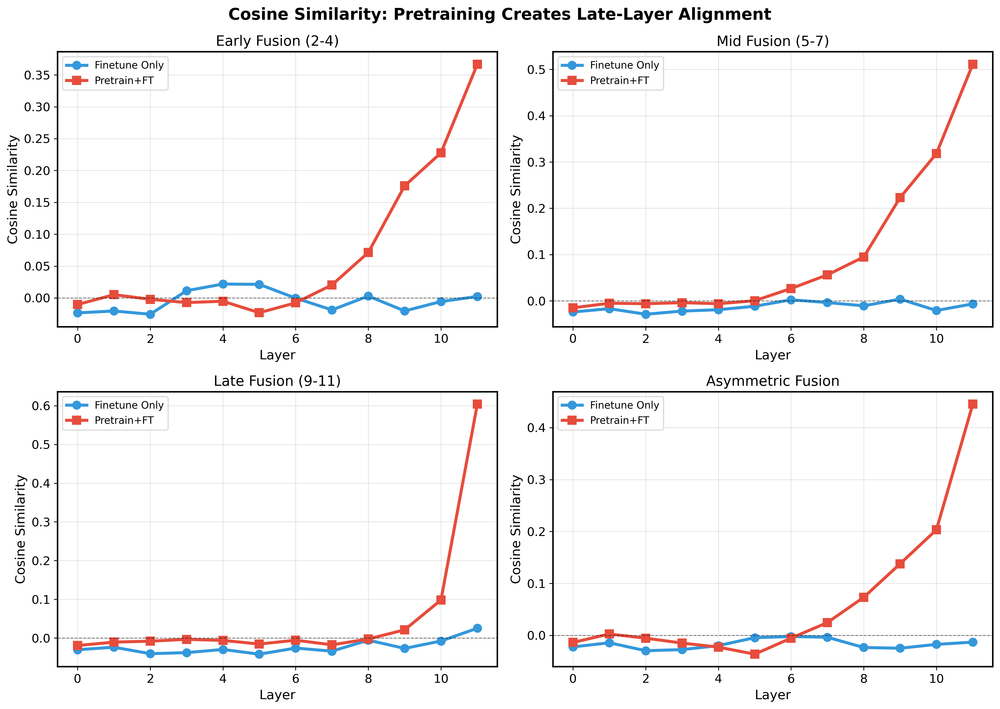
    also visible in th architecture comparison: <br>
    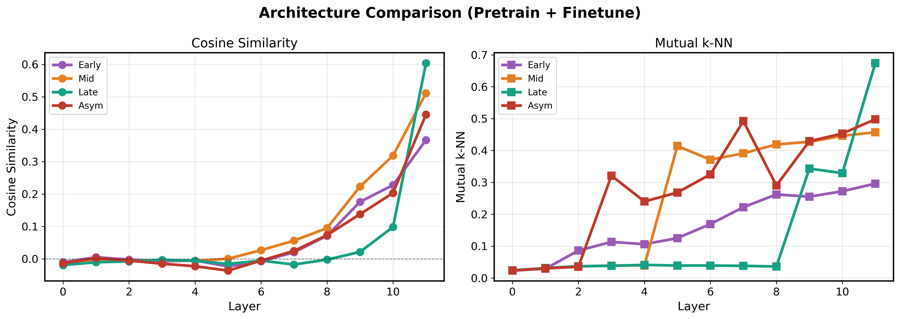


</figure>


### contrastive loss: alignment metrics
the best performing epoch (loss) was chosen here.
<figure>
    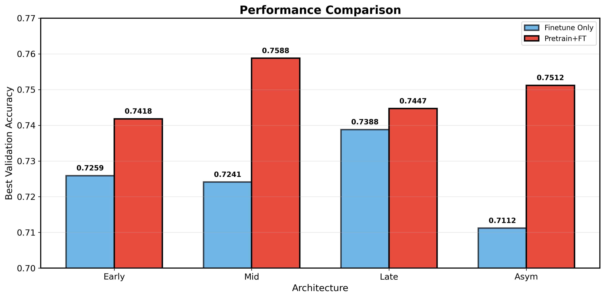
    in comparison to pretraining without contrastive loss: <br>
    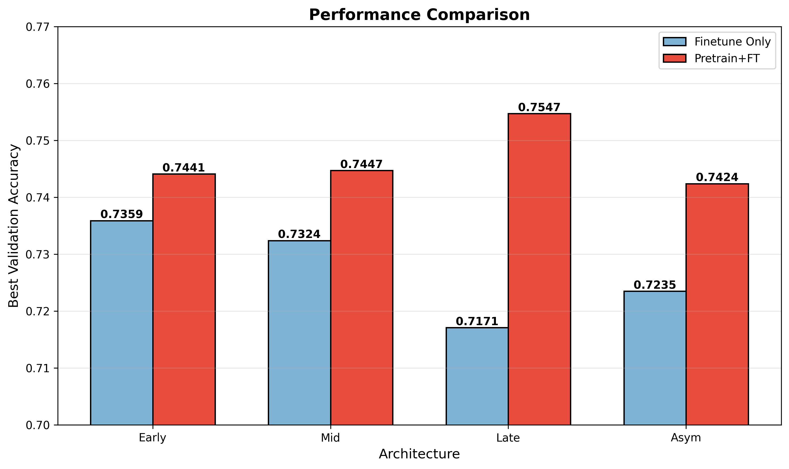
</figure>

**early fusion**:
<figure>
finetune only:

```
Epoch 5/9, Train Loss: 0.5056, Val Loss: 0.5574, Val Acc: 0.7259
layer0  (co-attn- 0): cosine=-0.0235, CKA=0.234, SVCCA=0.000, mknn=0.019, rank=0.035, procrustes=129.51
layer1  (co-attn- 0): cosine=-0.0205, CKA=0.203, SVCCA=0.000, mknn=0.026, rank=0.041, procrustes=153.52
layer2  (co-attn- 1): cosine=-0.0256, CKA=0.180, SVCCA=0.000, mknn=0.246, rank=0.261, procrustes=243.90
layer3  (co-attn- 1): cosine= 0.0113, CKA=0.151, SVCCA=0.000, mknn=0.402, rank=0.331, procrustes=299.74
layer4  (co-attn- 1): cosine= 0.0218, CKA=0.108, SVCCA=0.000, mknn=0.478, rank=0.510, procrustes=388.62
layer5  (co-attn- 0): cosine= 0.0213, CKA=0.097, SVCCA=0.000, mknn=0.388, rank=0.368, procrustes=406.17
layer6  (co-attn- 0): cosine=-0.0003, CKA=0.076, SVCCA=0.000, mknn=0.311, rank=0.305, procrustes=432.57
layer7  (co-attn- 0): cosine=-0.0188, CKA=0.045, SVCCA=0.000, mknn=0.195, rank=0.211, procrustes=512.33
layer8  (co-attn- 0): cosine= 0.0029, CKA=0.041, SVCCA=0.000, mknn=0.089, rank=0.127, procrustes=715.27
layer9  (co-attn- 0): cosine=-0.0204, CKA=0.044, SVCCA=0.000, mknn=0.042, rank=0.068, procrustes=997.47
layer10 (co-attn- 0): cosine=-0.0057, CKA=0.042, SVCCA=0.000, mknn=0.040, rank=0.064, procrustes=1353.76
layer11 (co-attn- 0): cosine= 0.0023, CKA=0.043, SVCCA=0.000, mknn=0.044, rank=0.074, procrustes=1925.59
```

contrastive pretrain + non-contrastive finetune:

```
Epoch 4/9, Train Loss: 0.5157, Val Loss: 0.5414, Val Acc: 0.7418
layer0  (co-attn- 0): cosine=-0.0104, CKA=0.254, SVCCA=0.000, mknn=0.023, rank=0.031, procrustes=107.97
layer1  (co-attn- 0): cosine= 0.0051, CKA=0.230, SVCCA=0.000, mknn=0.029, rank=0.033, procrustes=127.30
layer2  (co-attn- 1): cosine=-0.0021, CKA=0.193, SVCCA=0.000, mknn=0.086, rank=0.097, procrustes=368.72
layer3  (co-attn- 1): cosine=-0.0073, CKA=0.128, SVCCA=0.000, mknn=0.113, rank=0.159, procrustes=479.01
layer4  (co-attn- 1): cosine=-0.0052, CKA=0.091, SVCCA=0.000, mknn=0.106, rank=0.139, procrustes=530.17
layer5  (co-attn- 0): cosine=-0.0232, CKA=0.074, SVCCA=0.000, mknn=0.125, rank=0.152, procrustes=553.71
layer6  (co-attn- 0): cosine=-0.0077, CKA=0.064, SVCCA=0.000, mknn=0.169, rank=0.185, procrustes=543.59
layer7  (co-attn- 0): cosine= 0.0204, CKA=0.055, SVCCA=0.000, mknn=0.222, rank=0.242, procrustes=524.69
layer8  (co-attn- 0): cosine= 0.0713, CKA=0.059, SVCCA=0.000, mknn=0.262, rank=0.254, procrustes=1001.63
layer9  (co-attn- 0): cosine= 0.1759, CKA=0.052, SVCCA=0.000, mknn=0.255, rank=0.253, procrustes=2411.57
layer10 (co-attn- 0): cosine= 0.2277, CKA=0.054, SVCCA=0.000, mknn=0.272, rank=0.275, procrustes=2613.87
layer11 (co-attn- 0): cosine= 0.3667, CKA=0.048, SVCCA=0.000, mknn=0.296, rank=0.273, procrustes=2816.96
```
</figure>

**mid-fusion**:

<figure>
finetune only:

```
Epoch 5/9, Train Loss: 0.4628, Val Loss: 0.5496, Val Acc: 0.7241
layer0  (co-attn- 0): cosine=-0.0240, CKA=0.230, SVCCA=0.000, mknn=0.018, rank=0.030, procrustes=126.81
layer1  (co-attn- 0): cosine=-0.0169, CKA=0.213, SVCCA=0.000, mknn=0.028, rank=0.040, procrustes=143.13
layer2  (co-attn- 0): cosine=-0.0289, CKA=0.192, SVCCA=0.000, mknn=0.030, rank=0.040, procrustes=157.24
layer3  (co-attn- 0): cosine=-0.0221, CKA=0.173, SVCCA=0.000, mknn=0.036, rank=0.040, procrustes=269.30
layer4  (co-attn- 0): cosine=-0.0191, CKA=0.129, SVCCA=0.000, mknn=0.040, rank=0.041, procrustes=346.34
layer5  (co-attn- 1): cosine=-0.0116, CKA=0.108, SVCCA=0.000, mknn=0.348, rank=0.334, procrustes=513.05
layer6  (co-attn- 1): cosine= 0.0023, CKA=0.088, SVCCA=0.000, mknn=0.291, rank=0.247, procrustes=681.48
layer7  (co-attn- 1): cosine=-0.0036, CKA=0.100, SVCCA=0.000, mknn=0.316, rank=0.260, procrustes=678.74
layer8  (co-attn- 0): cosine=-0.0107, CKA=0.099, SVCCA=0.000, mknn=0.231, rank=0.206, procrustes=802.18
layer9  (co-attn- 0): cosine= 0.0038, CKA=0.096, SVCCA=0.000, mknn=0.171, rank=0.168, procrustes=1023.46
layer10 (co-attn- 0): cosine=-0.0208, CKA=0.092, SVCCA=0.000, mknn=0.137, rank=0.140, procrustes=1359.32
layer11 (co-attn- 0): cosine=-0.0065, CKA=0.098, SVCCA=0.000, mknn=0.139, rank=0.137, procrustes=1977.33

```

contrastive pretrain + non-contrastive finetune:

```
Epoch 4/9, Train Loss: 0.4884, Val Loss: 0.5345, Val Acc: 0.7482
layer0  (co-attn- 0): cosine=-0.0150, CKA=0.261, SVCCA=0.000, mknn=0.024, rank=0.034, procrustes=102.52
layer1  (co-attn- 0): cosine=-0.0051, CKA=0.236, SVCCA=0.000, mknn=0.030, rank=0.038, procrustes=129.53
layer2  (co-attn- 0): cosine=-0.0061, CKA=0.180, SVCCA=0.000, mknn=0.036, rank=0.047, procrustes=141.25
layer3  (co-attn- 0): cosine=-0.0039, CKA=0.100, SVCCA=0.000, mknn=0.039, rank=0.042, procrustes=205.60
layer4  (co-attn- 0): cosine=-0.0061, CKA=0.021, SVCCA=0.000, mknn=0.039, rank=0.046, procrustes=289.49
layer5  (co-attn- 1): cosine= 0.0003, CKA=0.047, SVCCA=0.000, mknn=0.414, rank=0.379, procrustes=430.11
layer6  (co-attn- 1): cosine= 0.0267, CKA=0.045, SVCCA=0.000, mknn=0.371, rank=0.321, procrustes=657.18
layer7  (co-attn- 1): cosine= 0.0562, CKA=0.050, SVCCA=0.000, mknn=0.391, rank=0.368, procrustes=613.38
layer8  (co-attn- 0): cosine= 0.0949, CKA=0.043, SVCCA=0.000, mknn=0.419, rank=0.403, procrustes=872.27
layer9  (co-attn- 0): cosine= 0.2230, CKA=0.038, SVCCA=0.000, mknn=0.427, rank=0.421, procrustes=2859.72
layer10 (co-attn- 0): cosine= 0.3183, CKA=0.043, SVCCA=0.000, mknn=0.446, rank=0.431, procrustes=3312.24
layer11 (co-attn- 0): cosine= 0.5112, CKA=0.041, SVCCA=0.000, mknn=0.457, rank=0.385, procrustes=3785.06
```
</figure>

**late-fusion**:

<figure>
finetune only:

```
Epoch 4/9, Train Loss: 0.4636, Val Loss: 0.5544, Val Acc: 0.7388
layer layer0  (co-attn- 0): cosine=-0.0301, CKA=0.228, SVCCA=0.000, mknn=0.020, rank=0.029, procrustes=118.17
layer layer1  (co-attn- 0): cosine=-0.0236, CKA=0.196, SVCCA=0.000, mknn=0.025, rank=0.034, procrustes=156.84
layer layer2  (co-attn- 0): cosine=-0.0403, CKA=0.173, SVCCA=0.000, mknn=0.028, rank=0.037, procrustes=163.78
layer layer3  (co-attn- 0): cosine=-0.0376, CKA=0.157, SVCCA=0.000, mknn=0.035, rank=0.036, procrustes=249.37
layer layer4  (co-attn- 0): cosine=-0.0294, CKA=0.130, SVCCA=0.000, mknn=0.041, rank=0.042, procrustes=280.17
layer layer5  (co-attn- 0): cosine=-0.0416, CKA=0.090, SVCCA=0.000, mknn=0.044, rank=0.052, procrustes=355.62
layer layer6  (co-attn- 0): cosine=-0.0258, CKA=0.046, SVCCA=0.000, mknn=0.039, rank=0.046, procrustes=558.61
layer layer7  (co-attn- 0): cosine=-0.0338, CKA=0.046, SVCCA=0.000, mknn=0.043, rank=0.049, procrustes=570.69
layer layer8  (co-attn- 0): cosine=-0.0054, CKA=0.052, SVCCA=0.000, mknn=0.050, rank=0.055, procrustes=701.44
layer layer9  (co-attn- 1): cosine=-0.0267, CKA=0.092, SVCCA=0.000, mknn=0.242, rank=0.281, procrustes=749.84
layer layer10 (co-attn- 1): cosine=-0.0076, CKA=0.080, SVCCA=0.000, mknn=0.372, rank=0.300, procrustes=1128.46
layer layer11 (co-attn- 1): cosine= 0.0254, CKA=0.084, SVCCA=0.000, mknn=0.361, rank=0.322, procrustes=1651.32
```

contrastive pretrain + non-contrastive finetune:

```
Epoch 3/9, Train Loss: 0.5136, Val Loss: 0.5200, Val Acc: 0.7447
layer layer0  (co-attn- 0): cosine=-0.0192, CKA=0.261, SVCCA=0.000, mknn=0.024, rank=0.032, procrustes=94.28
layer layer1  (co-attn- 0): cosine=-0.0105, CKA=0.252, SVCCA=0.000, mknn=0.031, rank=0.039, procrustes=121.10
layer layer2  (co-attn- 0): cosine=-0.0080, CKA=0.199, SVCCA=0.000, mknn=0.037, rank=0.045, procrustes=130.70
layer layer3  (co-attn- 0): cosine=-0.0033, CKA=0.142, SVCCA=0.000, mknn=0.038, rank=0.047, procrustes=183.84
layer layer4  (co-attn- 0): cosine=-0.0060, CKA=0.060, SVCCA=0.000, mknn=0.041, rank=0.045, procrustes=199.85
layer layer5  (co-attn- 0): cosine=-0.0154, CKA=0.030, SVCCA=0.000, mknn=0.039, rank=0.045, procrustes=274.81
layer layer6  (co-attn- 0): cosine=-0.0055, CKA=0.017, SVCCA=0.000, mknn=0.039, rank=0.053, procrustes=427.67
layer layer7  (co-attn- 0): cosine=-0.0174, CKA=0.017, SVCCA=0.000, mknn=0.038, rank=0.053, procrustes=457.30
layer layer8  (co-attn- 0): cosine=-0.0024, CKA=0.018, SVCCA=0.000, mknn=0.036, rank=0.043, procrustes=691.56
layer layer9  (co-attn- 1): cosine= 0.0213, CKA=0.046, SVCCA=0.000, mknn=0.343, rank=0.372, procrustes=552.76
layer layer10 (co-attn- 1): cosine= 0.0984, CKA=0.048, SVCCA=0.000, mknn=0.329, rank=0.290, procrustes=810.04
layer layer11 (co-attn- 1): cosine= 0.6039, CKA=0.036, SVCCA=0.000, mknn=0.674, rank=0.466, procrustes=1532.46
```
</figure>

**asymmetric_fusion fusion**:
<figure>
finetune only:

```
Epoch 5/9, Train Loss: 0.4469, Val Loss: 0.5655, Val Acc: 0.7112
layer layer0  (co-attn- 0): cosine=-0.0223, CKA=0.235, SVCCA=0.000, mknn=0.019, rank=0.034, procrustes=131.01
layer layer1  (co-attn- 0): cosine=-0.0143, CKA=0.209, SVCCA=0.000, mknn=0.027, rank=0.042, procrustes=146.59
layer layer2  (co-attn- 0): cosine=-0.0296, CKA=0.184, SVCCA=0.000, mknn=0.029, rank=0.043, procrustes=162.70
layer layer3  (co-attn- 1): cosine=-0.0275, CKA=0.175, SVCCA=0.000, mknn=0.320, rank=0.314, procrustes=290.92
layer layer4  (co-attn- 0): cosine=-0.0198, CKA=0.143, SVCCA=0.000, mknn=0.308, rank=0.315, procrustes=322.93
layer layer5  (co-attn- 1): cosine=-0.0045, CKA=0.124, SVCCA=0.000, mknn=0.291, rank=0.295, procrustes=450.90
layer layer6  (co-attn- 1): cosine=-0.0023, CKA=0.101, SVCCA=0.000, mknn=0.260, rank=0.247, procrustes=589.91
layer layer7  (co-attn- 1): cosine=-0.0037, CKA=0.093, SVCCA=0.000, mknn=0.298, rank=0.274, procrustes=584.31
layer layer8  (co-attn- 1): cosine=-0.0234, CKA=0.089, SVCCA=0.000, mknn=0.243, rank=0.216, procrustes=786.33
layer layer9  (co-attn- 1): cosine=-0.0248, CKA=0.082, SVCCA=0.000, mknn=0.247, rank=0.246, procrustes=809.71
layer layer10 (co-attn- 0): cosine=-0.0174, CKA=0.073, SVCCA=0.000, mknn=0.211, rank=0.213, procrustes=1101.21
layer layer11 (co-attn- 0): cosine=-0.0131, CKA=0.068, SVCCA=0.000, mknn=0.250, rank=0.194, procrustes=2030.20
```

contrastive pretrain + non-contrastive finetune:

```
Epoch 4/9, Train Loss: 0.4841, Val Loss: 0.5321, Val Acc: 0.7412
layer layer0  (co-attn- 0): cosine=-0.0137, CKA=0.257, SVCCA=0.000, mknn=0.023, rank=0.037, procrustes=97.30
layer layer1  (co-attn- 0): cosine= 0.0026, CKA=0.226, SVCCA=0.000, mknn=0.030, rank=0.036, procrustes=124.13
layer layer2  (co-attn- 0): cosine=-0.0055, CKA=0.171, SVCCA=0.000, mknn=0.035, rank=0.044, procrustes=143.09
layer layer3  (co-attn- 1): cosine=-0.0149, CKA=0.162, SVCCA=0.000, mknn=0.321, rank=0.356, procrustes=203.34
layer layer4  (co-attn- 0): cosine=-0.0227, CKA=0.123, SVCCA=0.000, mknn=0.240, rank=0.285, procrustes=240.80
layer layer5  (co-attn- 1): cosine=-0.0363, CKA=0.104, SVCCA=0.000, mknn=0.268, rank=0.324, procrustes=338.81
layer layer6  (co-attn- 1): cosine=-0.0054, CKA=0.088, SVCCA=0.000, mknn=0.325, rank=0.343, procrustes=435.42
layer layer7  (co-attn- 1): cosine= 0.0246, CKA=0.077, SVCCA=0.000, mknn=0.492, rank=0.448, procrustes=512.82
layer layer8  (co-attn- 1): cosine= 0.0733, CKA=0.068, SVCCA=0.000, mknn=0.290, rank=0.343, procrustes=1121.45
layer layer9  (co-attn- 1): cosine= 0.1378, CKA=0.054, SVCCA=0.000, mknn=0.429, rank=0.394, procrustes=975.34
layer layer10 (co-attn- 0): cosine= 0.2034, CKA=0.032, SVCCA=0.000, mknn=0.453, rank=0.419, procrustes=1091.84
layer layer11 (co-attn- 0): cosine= 0.4452, CKA=0.042, SVCCA=0.000, mknn=0.498, rank=0.417, procrustes=1636.19
```
</figure>


### Direct comparison: contrastive vs non-contrastive
both are pretrained+finetune
<figure>

**early fusion**:

non-contrastive:

```
Epoch 1/9, Train Loss: 0.6387, Val Loss: 0.6144, Val Acc: 0.6647
Epoch 2/9, Train Loss: 0.5947, Val Loss: 0.5833, Val Acc: 0.7018
Epoch 3/9, Train Loss: 0.5440, Val Loss: 0.5458, Val Acc: 0.7318
Epoch 4/9, Train Loss: 0.5056, Val Loss: 0.5456, Val Acc: 0.7441
Epoch 5/9, Train Loss: 0.4614, Val Loss: 0.5546, Val Acc: 0.7265
Epoch 6/9, Train Loss: 0.4292, Val Loss: 0.5636, Val Acc: 0.7235
Epoch 7/9, Train Loss: 0.3917, Val Loss: 0.5910, Val Acc: 0.7235
Epoch 8/9, Train Loss: 0.3775, Val Loss: 0.6165, Val Acc: 0.7071
Epoch 9/9, Train Loss: 0.3581, Val Loss: 0.6256, Val Acc: 0.7065
```

<br>
contrastive:

```
Epoch 1/9, Train Loss: 0.6540, Val Loss: 0.6384, Val Acc: 0.6418
Epoch 2/9, Train Loss: 0.6033, Val Loss: 0.5823, Val Acc: 0.7035
Epoch 3/9, Train Loss: 0.5486, Val Loss: 0.5498, Val Acc: 0.7459
Epoch 4/9, Train Loss: 0.5157, Val Loss: 0.5414, Val Acc: 0.7418
Epoch 5/9, Train Loss: 0.4743, Val Loss: 0.5503, Val Acc: 0.7318
Epoch 6/9, Train Loss: 0.4492, Val Loss: 0.5474, Val Acc: 0.7300
Epoch 7/9, Train Loss: 0.4193, Val Loss: 0.5652, Val Acc: 0.7253
Epoch 8/9, Train Loss: 0.3939, Val Loss: 0.5728, Val Acc: 0.7247
Epoch 9/9, Train Loss: 0.3777, Val Loss: 0.5939, Val Acc: 0.7212
```
</figure>


<figure>

**mid-fusion**:

non-contrastive:
```
Epoch 1/9, Train Loss: 0.6381, Val Loss: 0.6272, Val Acc: 0.6559
Epoch 2/9, Train Loss: 0.5806, Val Loss: 0.5645, Val Acc: 0.7159
Epoch 3/9, Train Loss: 0.5195, Val Loss: 0.5283, Val Acc: 0.7447
Epoch 4/9, Train Loss: 0.4702, Val Loss: 0.5368, Val Acc: 0.7435
Epoch 5/9, Train Loss: 0.4224, Val Loss: 0.5454, Val Acc: 0.7388
Epoch 6/9, Train Loss: 0.3892, Val Loss: 0.5509, Val Acc: 0.7347
Epoch 7/9, Train Loss: 0.3490, Val Loss: 0.5728, Val Acc: 0.7435
Epoch 8/9, Train Loss: 0.3255, Val Loss: 0.5849, Val Acc: 0.7324
Epoch 9/9, Train Loss: 0.3080, Val Loss: 0.6075, Val Acc: 0.7347
```
<br>
contrastive:

```
Epoch 1/9, Train Loss: 0.6628, Val Loss: 0.6153, Val Acc: 0.6688
Epoch 2/9, Train Loss: 0.5876, Val Loss: 0.5713, Val Acc: 0.7082
Epoch 3/9, Train Loss: 0.5316, Val Loss: 0.5433, Val Acc: 0.7353
Epoch 4/9, Train Loss: 0.4884, Val Loss: 0.5345, Val Acc: 0.7482
Epoch 5/9, Train Loss: 0.4405, Val Loss: 0.5364, Val Acc: 0.7588
Epoch 6/9, Train Loss: 0.4046, Val Loss: 0.5407, Val Acc: 0.7400
Epoch 7/9, Train Loss: 0.3710, Val Loss: 0.5522, Val Acc: 0.7488
Epoch 8/9, Train Loss: 0.3413, Val Loss: 0.5577, Val Acc: 0.7400
Epoch 9/9, Train Loss: 0.3285, Val Loss: 0.5795, Val Acc: 0.7412
```

</figure>


**waiting still for data below!**

<figure>

**late fusion**:

non-contrastive:

```
Epoch 1/9, Train Loss: 0.6470, Val Loss: 0.6426, Val Acc: 0.6371
Epoch 2/9, Train Loss: 0.5864, Val Loss: 0.5747, Val Acc: 0.7012
Epoch 3/9, Train Loss: 0.5149, Val Loss: 0.5340, Val Acc: 0.7435
Epoch 4/9, Train Loss: 0.4523, Val Loss: 0.5290, Val Acc: 0.7535
Epoch 5/9, Train Loss: 0.3981, Val Loss: 0.5523, Val Acc: 0.7459
Epoch 6/9, Train Loss: 0.3512, Val Loss: 0.5634, Val Acc: 0.7541
Epoch 7/9, Train Loss: 0.3070, Val Loss: 0.6012, Val Acc: 0.7547
Epoch 8/9, Train Loss: 0.2778, Val Loss: 0.6168, Val Acc: 0.7465
Epoch 9/9, Train Loss: 0.2567, Val Loss: 0.6364, Val Acc: 0.7476
```

<br>

contrastive:

```
Epoch 1/9, Train Loss: 0.6473, Val Loss: 0.6349, Val Acc: 0.6394
Epoch 2/9, Train Loss: 0.5830, Val Loss: 0.5544, Val Acc: 0.7418
Epoch 3/9, Train Loss: 0.5136, Val Loss: 0.5200, Val Acc: 0.7447
Epoch 4/9, Train Loss: 0.4485, Val Loss: 0.5342, Val Acc: 0.7482
Epoch 5/9, Train Loss: 0.3928, Val Loss: 0.5397, Val Acc: 0.7441
Epoch 6/9, Train Loss: 0.3438, Val Loss: 0.5516, Val Acc: 0.7524
Epoch 7/9, Train Loss: 0.2940, Val Loss: 0.5828, Val Acc: 0.7488
Epoch 8/9, Train Loss: 0.2621, Val Loss: 0.5912, Val Acc: 0.7429
Epoch 9/9, Train Loss: 0.2390, Val Loss: 0.6240, Val Acc: 0.7418
```

</figure>

<figure>

**asymmetric_fusion**:

non-contrastive:

```
Epoch 1/9, Train Loss: 0.6417, Val Loss: 0.6292, Val Acc: 0.6500
Epoch 2/9, Train Loss: 0.5896, Val Loss: 0.5708, Val Acc: 0.7147
Epoch 3/9, Train Loss: 0.5329, Val Loss: 0.5483, Val Acc: 0.7394
Epoch 4/9, Train Loss: 0.4880, Val Loss: 0.5358, Val Acc: 0.7429
Epoch 5/9, Train Loss: 0.4368, Val Loss: 0.5468, Val Acc: 0.7382
Epoch 6/9, Train Loss: 0.4018, Val Loss: 0.5689, Val Acc: 0.7424
Epoch 7/9, Train Loss: 0.3700, Val Loss: 0.5749, Val Acc: 0.7382
Epoch 8/9, Train Loss: 0.3451, Val Loss: 0.5971, Val Acc: 0.7335
Epoch 9/9, Train Loss: 0.3297, Val Loss: 0.6135, Val Acc: 0.7324
```
<br>

contrastive:

```
Epoch 1/9, Train Loss: 0.6414, Val Loss: 0.6096, Val Acc: 0.6806
Epoch 2/9, Train Loss: 0.5840, Val Loss: 0.5738, Val Acc: 0.7276
Epoch 3/9, Train Loss: 0.5278, Val Loss: 0.5350, Val Acc: 0.7512
Epoch 4/9, Train Loss: 0.4841, Val Loss: 0.5321, Val Acc: 0.7412
Epoch 5/9, Train Loss: 0.4476, Val Loss: 0.5373, Val Acc: 0.7406
Epoch 6/9, Train Loss: 0.4121, Val Loss: 0.5540, Val Acc: 0.7400
Epoch 7/9, Train Loss: 0.3787, Val Loss: 0.5575, Val Acc: 0.7388
Epoch 8/9, Train Loss: 0.3632, Val Loss: 0.5836, Val Acc: 0.7271
Epoch 9/9, Train Loss: 0.3448, Val Loss: 0.5978, Val Acc: 0.7353

```

</figure>


### Comparison of contrastive
finetune only (no contrastive) vs. pretrain+finetune (with contrastive)
<figure>

**early fusion**:

finetune only:

```
Epoch 1/9, Train Loss: 0.6611, Val Loss: 0.6398, Val Acc: 0.6329
Epoch 2/9, Train Loss: 0.6132, Val Loss: 0.6032, Val Acc: 0.6882
Epoch 3/9, Train Loss: 0.5744, Val Loss: 0.6052, Val Acc: 0.6900
Epoch 4/9, Train Loss: 0.5426, Val Loss: 0.5747, Val Acc: 0.7176
Epoch 5/9, Train Loss: 0.5056, Val Loss: 0.5574, Val Acc: 0.7259
Epoch 6/9, Train Loss: 0.4831, Val Loss: 0.5579, Val Acc: 0.7276
Epoch 7/9, Train Loss: 0.4610, Val Loss: 0.5761, Val Acc: 0.7259
Epoch 8/9, Train Loss: 0.4430, Val Loss: 0.5616, Val Acc: 0.7206
Epoch 9/9, Train Loss: 0.4317, Val Loss: 0.5724, Val Acc: 0.7276
```

<br>
pretrain+finetune:

```
Epoch 1/9, Train Loss: 0.6540, Val Loss: 0.6384, Val Acc: 0.6418
Epoch 2/9, Train Loss: 0.6033, Val Loss: 0.5823, Val Acc: 0.7035
Epoch 3/9, Train Loss: 0.5486, Val Loss: 0.5498, Val Acc: 0.7459
Epoch 4/9, Train Loss: 0.5157, Val Loss: 0.5414, Val Acc: 0.7418
Epoch 5/9, Train Loss: 0.4743, Val Loss: 0.5503, Val Acc: 0.7318
Epoch 6/9, Train Loss: 0.4492, Val Loss: 0.5474, Val Acc: 0.7300
Epoch 7/9, Train Loss: 0.4193, Val Loss: 0.5652, Val Acc: 0.7253
Epoch 8/9, Train Loss: 0.3939, Val Loss: 0.5728, Val Acc: 0.7247
Epoch 9/9, Train Loss: 0.3777, Val Loss: 0.5939, Val Acc: 0.7212
```
</figure>


<figure>

**mid-fusion**:

finetune only:
```
Epoch 1/9, Train Loss: 0.6658, Val Loss: 0.6512, Val Acc: 0.6312
Epoch 2/9, Train Loss: 0.6160, Val Loss: 0.5974, Val Acc: 0.6912
Epoch 3/9, Train Loss: 0.5563, Val Loss: 0.5798, Val Acc: 0.7135
Epoch 4/9, Train Loss: 0.5086, Val Loss: 0.5506, Val Acc: 0.7388
Epoch 5/9, Train Loss: 0.4628, Val Loss: 0.5496, Val Acc: 0.7241
Epoch 6/9, Train Loss: 0.4281, Val Loss: 0.5578, Val Acc: 0.7247
Epoch 7/9, Train Loss: 0.4020, Val Loss: 0.5890, Val Acc: 0.7265
Epoch 8/9, Train Loss: 0.3681, Val Loss: 0.5752, Val Acc: 0.7159
Epoch 9/9, Train Loss: 0.3558, Val Loss: 0.5942, Val Acc: 0.7206
```
<br>
pretrain+finetune:

```
Epoch 1/9, Train Loss: 0.6628, Val Loss: 0.6153, Val Acc: 0.6688
Epoch 2/9, Train Loss: 0.5876, Val Loss: 0.5713, Val Acc: 0.7082
Epoch 3/9, Train Loss: 0.5316, Val Loss: 0.5433, Val Acc: 0.7353
Epoch 4/9, Train Loss: 0.4884, Val Loss: 0.5345, Val Acc: 0.7482
Epoch 5/9, Train Loss: 0.4405, Val Loss: 0.5364, Val Acc: 0.7588
Epoch 6/9, Train Loss: 0.4046, Val Loss: 0.5407, Val Acc: 0.7400
Epoch 7/9, Train Loss: 0.3710, Val Loss: 0.5522, Val Acc: 0.7488
Epoch 8/9, Train Loss: 0.3413, Val Loss: 0.5577, Val Acc: 0.7400
Epoch 9/9, Train Loss: 0.3285, Val Loss: 0.5795, Val Acc: 0.7412
```

</figure>


<figure>

**late fusion**:

finetune only:

```
Epoch 1/9, Train Loss: 0.6508, Val Loss: 0.6391, Val Acc: 0.6329
Epoch 2/9, Train Loss: 0.5907, Val Loss: 0.5904, Val Acc: 0.6888
Epoch 3/9, Train Loss: 0.5199, Val Loss: 0.5623, Val Acc: 0.7329
Epoch 4/9, Train Loss: 0.4636, Val Loss: 0.5544, Val Acc: 0.7388
Epoch 5/9, Train Loss: 0.4006, Val Loss: 0.5661, Val Acc: 0.7235
Epoch 6/9, Train Loss: 0.3515, Val Loss: 0.6019, Val Acc: 0.7141
Epoch 7/9, Train Loss: 0.3095, Val Loss: 0.6535, Val Acc: 0.7253
Epoch 8/9, Train Loss: 0.2736, Val Loss: 0.6691, Val Acc: 0.7082
Epoch 9/9, Train Loss: 0.2513, Val Loss: 0.7202, Val Acc: 0.7147
```

<br>

pretrain+finetune:

```
Epoch 1/9, Train Loss: 0.6473, Val Loss: 0.6349, Val Acc: 0.6394
Epoch 2/9, Train Loss: 0.5830, Val Loss: 0.5544, Val Acc: 0.7418
Epoch 3/9, Train Loss: 0.5136, Val Loss: 0.5200, Val Acc: 0.7447
Epoch 4/9, Train Loss: 0.4485, Val Loss: 0.5342, Val Acc: 0.7482
Epoch 5/9, Train Loss: 0.3928, Val Loss: 0.5397, Val Acc: 0.7441
Epoch 6/9, Train Loss: 0.3438, Val Loss: 0.5516, Val Acc: 0.7524
Epoch 7/9, Train Loss: 0.2940, Val Loss: 0.5828, Val Acc: 0.7488
Epoch 8/9, Train Loss: 0.2621, Val Loss: 0.5912, Val Acc: 0.7429
Epoch 9/9, Train Loss: 0.2390, Val Loss: 0.6240, Val Acc: 0.7418
```

</figure>

<figure>

**asymmetric_fusion**:

finetune only:

```
Epoch 1/9, Train Loss: 0.6529, Val Loss: 0.6290, Val Acc: 0.6435
Epoch 2/9, Train Loss: 0.5928, Val Loss: 0.5847, Val Acc: 0.6988
Epoch 3/9, Train Loss: 0.5398, Val Loss: 0.5805, Val Acc: 0.7253
Epoch 4/9, Train Loss: 0.4882, Val Loss: 0.5676, Val Acc: 0.7124
Epoch 5/9, Train Loss: 0.4469, Val Loss: 0.5655, Val Acc: 0.7112
Epoch 6/9, Train Loss: 0.3976, Val Loss: 0.5848, Val Acc: 0.7124
Epoch 7/9, Train Loss: 0.3678, Val Loss: 0.6138, Val Acc: 0.7041
Epoch 8/9, Train Loss: 0.3395, Val Loss: 0.6349, Val Acc: 0.7024
Epoch 9/9, Train Loss: 0.3170, Val Loss: 0.6598, Val Acc: 0.7012
```
<br>

pretrain+finetune:

```
Epoch 1/9, Train Loss: 0.6414, Val Loss: 0.6096, Val Acc: 0.6806
Epoch 2/9, Train Loss: 0.5840, Val Loss: 0.5738, Val Acc: 0.7276
Epoch 3/9, Train Loss: 0.5278, Val Loss: 0.5350, Val Acc: 0.7512
Epoch 4/9, Train Loss: 0.4841, Val Loss: 0.5321, Val Acc: 0.7412
Epoch 5/9, Train Loss: 0.4476, Val Loss: 0.5373, Val Acc: 0.7406
Epoch 6/9, Train Loss: 0.4121, Val Loss: 0.5540, Val Acc: 0.7400
Epoch 7/9, Train Loss: 0.3787, Val Loss: 0.5575, Val Acc: 0.7388
Epoch 8/9, Train Loss: 0.3632, Val Loss: 0.5836, Val Acc: 0.7271
Epoch 9/9, Train Loss: 0.3448, Val Loss: 0.5978, Val Acc: 0.7353
```

</figure>


## 04.10

### long pretrain (600k samples - 7 epochs)

**mutual knn**
<figure>

*epoch 0 vs. epoch 7*
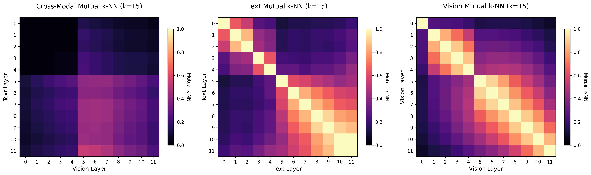

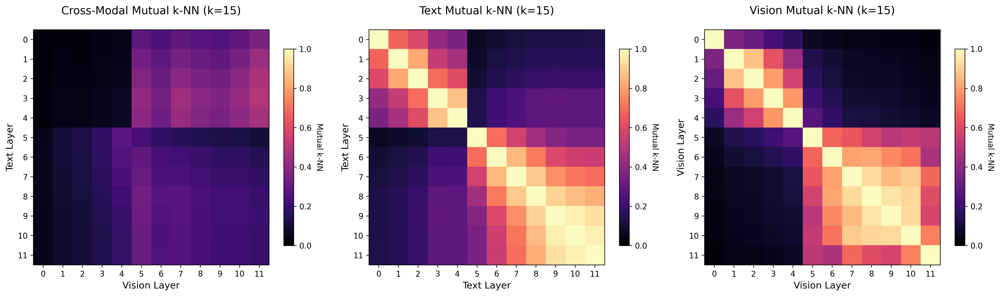

</figure>

**cka**
<figure>
*epoch 0 vs. epoch 7*
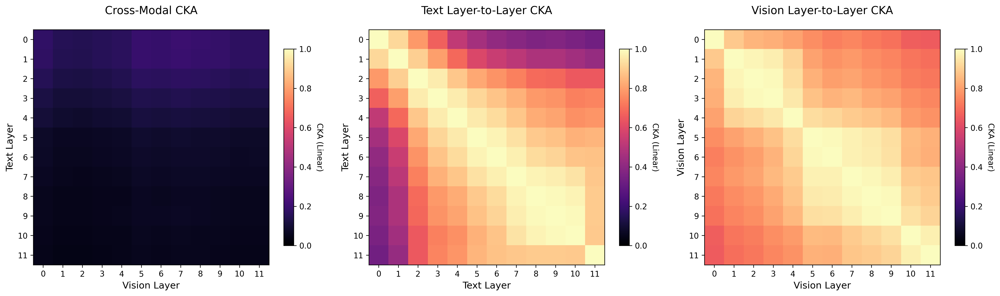

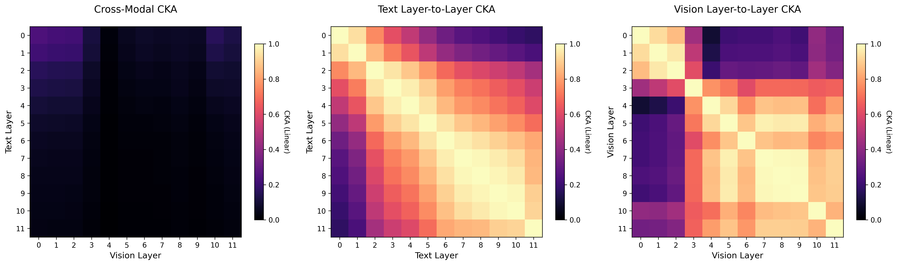

</figure>


**rank-sim & procrustes**
<figure>
*epoch 0 vs. epoch 7*
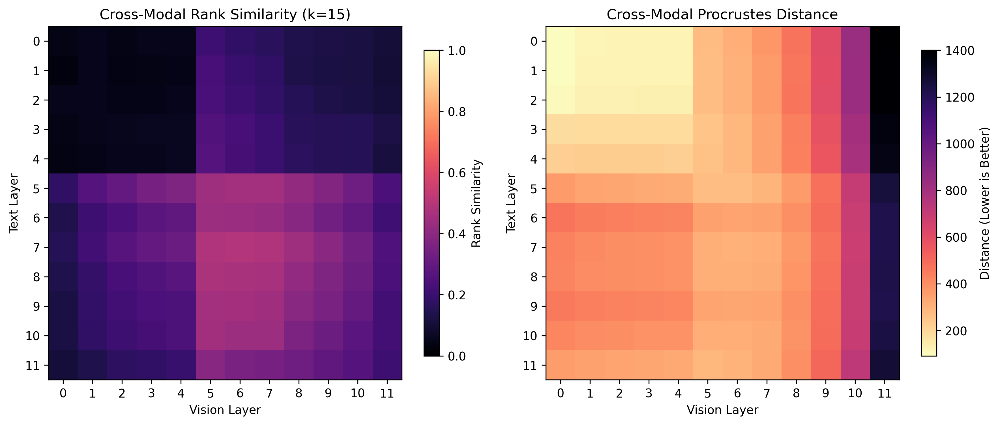

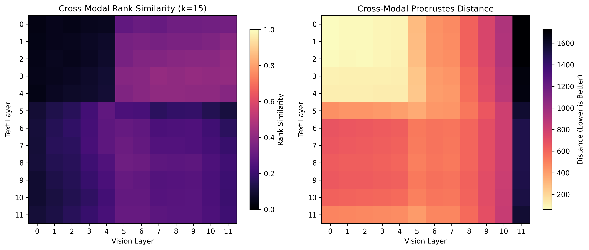

</figure>


### visual analysis of yesterday's results
for each configuration the visualizations of the best validation accuracy are shown. Ergo, for *early-fusion finetune-only* `epoch 5` is chosen, as it has the highest acc, `val. acc: 0.7359`.

<figure>

**early fusion**:

finetune only:

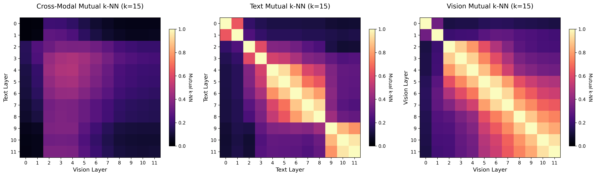


<br>
pretrain+finetune:

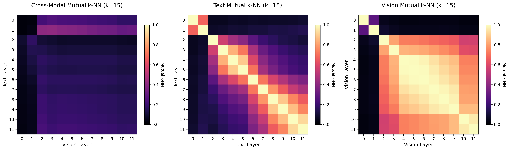

</figure>


<figure>

**mid-fusion**:

finetune only:
<!-- ```
Epoch 1/9, Train Loss: 0.6654, Val Loss: 0.6309, Val Acc: 0.6465
Epoch 2/9, Train Loss: 0.6023, Val Loss: 0.5760, Val Acc: 0.7165
Epoch 3/9, Train Loss: 0.5367, Val Loss: 0.5566, Val Acc: 0.7312
Epoch 4/9, Train Loss: 0.4844, Val Loss: 0.5562, Val Acc: 0.7253
Epoch 5/9, Train Loss: 0.4399, Val Loss: 0.5627, Val Acc: 0.7324
Epoch 6/9, Train Loss: 0.3993, Val Loss: 0.5765, Val Acc: 0.7106
Epoch 7/9, Train Loss: 0.3716, Val Loss: 0.5760, Val Acc: 0.7212
Epoch 8/9, Train Loss: 0.3407, Val Loss: 0.6163, Val Acc: 0.7188
Epoch 9/9, Train Loss: 0.3179, Val Loss: 0.6525, Val Acc: 0.7224
``` -->

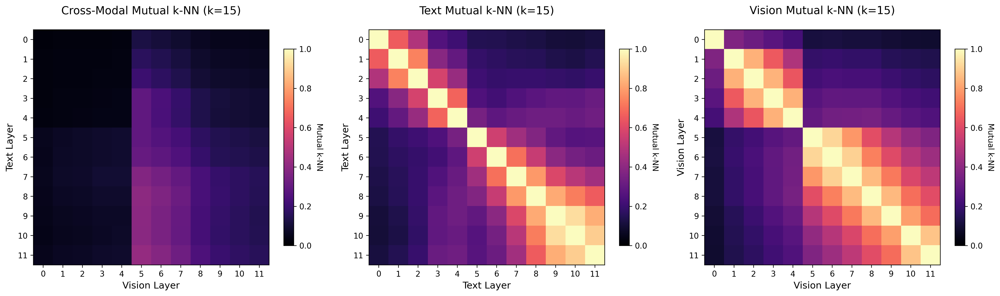
<br>
pretrain+finetune:
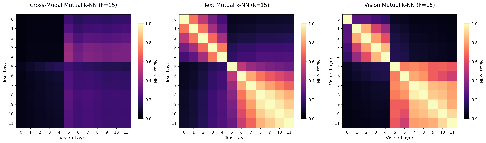

</figure>


<figure>

**late fusion**:

finetune only:
<!--
```
Epoch 1/9, Train Loss: 0.6492, Val Loss: 0.6186, Val Acc: 0.6647
Epoch 2/9, Train Loss: 0.5813, Val Loss: 0.6058, Val Acc: 0.6665
Epoch 3/9, Train Loss: 0.5195, Val Loss: 0.5627, Val Acc: 0.7106
Epoch 4/9, Train Loss: 0.4436, Val Loss: 0.5760, Val Acc: 0.7094
Epoch 5/9, Train Loss: 0.3860, Val Loss: 0.6176, Val Acc: 0.6906
Epoch 6/9, Train Loss: 0.3439, Val Loss: 0.6235, Val Acc: 0.7118
Epoch 7/9, Train Loss: 0.2888, Val Loss: 0.6880, Val Acc: 0.7165
Epoch 8/9, Train Loss: 0.2510, Val Loss: 0.7209, Val Acc: 0.6971
Epoch 9/9, Train Loss: 0.2274, Val Loss: 0.8106, Val Acc: 0.7171
``` -->
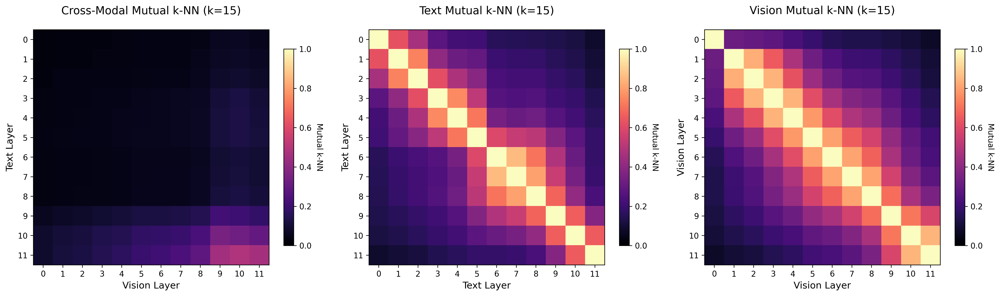
<br>

pretrain+finetune:

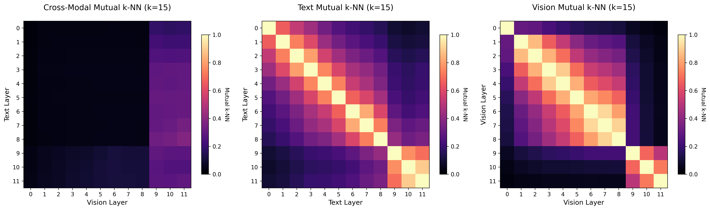

</figure>

<figure>

**asymmetric_fusion**:

finetune only:

<!-- ```
Epoch 1/9, Train Loss: 0.6534, Val Loss: 0.6224, Val Acc: 0.6565
Epoch 2/9, Train Loss: 0.5891, Val Loss: 0.5786, Val Acc: 0.7059
Epoch 3/9, Train Loss: 0.5282, Val Loss: 0.5505, Val Acc: 0.7276
Epoch 4/9, Train Loss: 0.4707, Val Loss: 0.6187, Val Acc: 0.6806
Epoch 5/9, Train Loss: 0.4409, Val Loss: 0.5517, Val Acc: 0.7235
Epoch 6/9, Train Loss: 0.3793, Val Loss: 0.5924, Val Acc: 0.7000
Epoch 7/9, Train Loss: 0.3554, Val Loss: 0.6132, Val Acc: 0.7165
Epoch 8/9, Train Loss: 0.3166, Val Loss: 0.6373, Val Acc: 0.7141
Epoch 9/9, Train Loss: 0.2876, Val Loss: 0.6868, Val Acc: 0.7165
``` -->
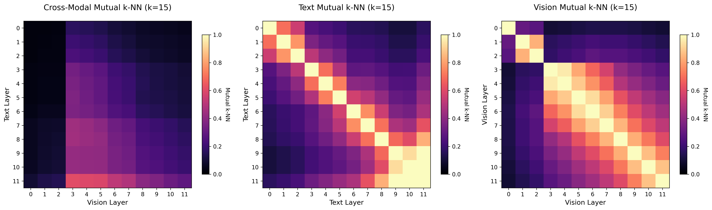
<br>


pretrain+finetune:

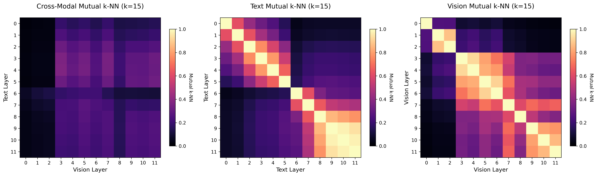

</figure>


### Pretrain validation loss discrepancies
Validation loss is lower then train loss supposedly because of different applications of data augmentation. But still further investigation is necessary.

```
Epoch 1/10,
    train loss MLM: 8.6090,
    test loss MLM: 6.8610,
    train loss AP: 1.1787,
    test loss AP: 2.0275,
    accuracy AP: 0.2557
    train loss MIM: 5.2101,
    test loss MIM: 4.0759

Epoch 2/10,
    train loss MLM: 6.0135,
    test loss MLM: 5.3457,
    train loss AP: 1.0411,
    test loss AP: 0.7532,
    accuracy AP: 0.9408
    train loss MIM: 3.2613,
    test loss MIM: 2.5418

Epoch 3/10,
    train loss MLM: 5.0081,
    test loss MLM: 4.7833,
    train loss AP: 0.9024,
    test loss AP: 0.3898,
    accuracy AP: 0.9962
    train loss MIM: 1.9494,
    test loss MIM: 1.3295
```

## 03.10 - comparision: pretrain+finetune vs. finetune-only

plot of the results of this experiment:
<figure>

</figure>

temp:
- currently running on GPU10: pretrain & pretrain+finetune for 4 different configurations
- currently running on gamingpc: finetune only for the same configs.
will report here my findings

<figure>

**early fusion**:

finetune only:

```
Epoch 1/9, Train Loss: 0.6614, Val Loss: 0.6427, Val Acc: 0.6318
Epoch 2/9, Train Loss: 0.6114, Val Loss: 0.5991, Val Acc: 0.6859
Epoch 3/9, Train Loss: 0.5621, Val Loss: 0.5745, Val Acc: 0.7112
Epoch 4/9, Train Loss: 0.5244, Val Loss: 0.5609, Val Acc: 0.7318
Epoch 5/9, Train Loss: 0.4817, Val Loss: 0.5553, Val Acc: 0.7359
Epoch 6/9, Train Loss: 0.4717, Val Loss: 0.5617, Val Acc: 0.7135
Epoch 7/9, Train Loss: 0.4531, Val Loss: 0.5607, Val Acc: 0.7306
Epoch 8/9, Train Loss: 0.4216, Val Loss: 0.5618, Val Acc: 0.7347
Epoch 9/9, Train Loss: 0.4030, Val Loss: 0.5745, Val Acc: 0.7324
```

<br>
pretrain+finetune:

```
Epoch 1/9, Train Loss: 0.6387, Val Loss: 0.6144, Val Acc: 0.6647
Epoch 2/9, Train Loss: 0.5947, Val Loss: 0.5833, Val Acc: 0.7018
Epoch 3/9, Train Loss: 0.5440, Val Loss: 0.5458, Val Acc: 0.7318
Epoch 4/9, Train Loss: 0.5056, Val Loss: 0.5456, Val Acc: 0.7441
Epoch 5/9, Train Loss: 0.4614, Val Loss: 0.5546, Val Acc: 0.7265
Epoch 6/9, Train Loss: 0.4292, Val Loss: 0.5636, Val Acc: 0.7235
Epoch 7/9, Train Loss: 0.3917, Val Loss: 0.5910, Val Acc: 0.7235
Epoch 8/9, Train Loss: 0.3775, Val Loss: 0.6165, Val Acc: 0.7071
Epoch 9/9, Train Loss: 0.3581, Val Loss: 0.6256, Val Acc: 0.7065
```
</figure>


<figure>

**mid-fusion**:

finetune only:
```
Epoch 1/9, Train Loss: 0.6654, Val Loss: 0.6309, Val Acc: 0.6465
Epoch 2/9, Train Loss: 0.6023, Val Loss: 0.5760, Val Acc: 0.7165
Epoch 3/9, Train Loss: 0.5367, Val Loss: 0.5566, Val Acc: 0.7312
Epoch 4/9, Train Loss: 0.4844, Val Loss: 0.5562, Val Acc: 0.7253
Epoch 5/9, Train Loss: 0.4399, Val Loss: 0.5627, Val Acc: 0.7324
Epoch 6/9, Train Loss: 0.3993, Val Loss: 0.5765, Val Acc: 0.7106
Epoch 7/9, Train Loss: 0.3716, Val Loss: 0.5760, Val Acc: 0.7212
Epoch 8/9, Train Loss: 0.3407, Val Loss: 0.6163, Val Acc: 0.7188
Epoch 9/9, Train Loss: 0.3179, Val Loss: 0.6525, Val Acc: 0.7224
```
<br>
pretrain+finetune:

```
Epoch 1/9, Train Loss: 0.6381, Val Loss: 0.6272, Val Acc: 0.6559
Epoch 2/9, Train Loss: 0.5806, Val Loss: 0.5645, Val Acc: 0.7159
Epoch 3/9, Train Loss: 0.5195, Val Loss: 0.5283, Val Acc: 0.7447
Epoch 4/9, Train Loss: 0.4702, Val Loss: 0.5368, Val Acc: 0.7435
Epoch 5/9, Train Loss: 0.4224, Val Loss: 0.5454, Val Acc: 0.7388
Epoch 6/9, Train Loss: 0.3892, Val Loss: 0.5509, Val Acc: 0.7347
Epoch 7/9, Train Loss: 0.3490, Val Loss: 0.5728, Val Acc: 0.7435
Epoch 8/9, Train Loss: 0.3255, Val Loss: 0.5849, Val Acc: 0.7324
Epoch 9/9, Train Loss: 0.3080, Val Loss: 0.6075, Val Acc: 0.7347
```

</figure>


<figure>

**late fusion**:

finetune only:

```
Epoch 1/9, Train Loss: 0.6492, Val Loss: 0.6186, Val Acc: 0.6647
Epoch 2/9, Train Loss: 0.5813, Val Loss: 0.6058, Val Acc: 0.6665
Epoch 3/9, Train Loss: 0.5195, Val Loss: 0.5627, Val Acc: 0.7106
Epoch 4/9, Train Loss: 0.4436, Val Loss: 0.5760, Val Acc: 0.7094
Epoch 5/9, Train Loss: 0.3860, Val Loss: 0.6176, Val Acc: 0.6906
Epoch 6/9, Train Loss: 0.3439, Val Loss: 0.6235, Val Acc: 0.7118
Epoch 7/9, Train Loss: 0.2888, Val Loss: 0.6880, Val Acc: 0.7165
Epoch 8/9, Train Loss: 0.2510, Val Loss: 0.7209, Val Acc: 0.6971
Epoch 9/9, Train Loss: 0.2274, Val Loss: 0.8106, Val Acc: 0.7171
```

<br>

pretrain+finetune:

```
Epoch 1/9, Train Loss: 0.6470, Val Loss: 0.6426, Val Acc: 0.6371
Epoch 2/9, Train Loss: 0.5864, Val Loss: 0.5747, Val Acc: 0.7012
Epoch 3/9, Train Loss: 0.5149, Val Loss: 0.5340, Val Acc: 0.7435
Epoch 4/9, Train Loss: 0.4523, Val Loss: 0.5290, Val Acc: 0.7535
Epoch 5/9, Train Loss: 0.3981, Val Loss: 0.5523, Val Acc: 0.7459
Epoch 6/9, Train Loss: 0.3512, Val Loss: 0.5634, Val Acc: 0.7541
Epoch 7/9, Train Loss: 0.3070, Val Loss: 0.6012, Val Acc: 0.7547
Epoch 8/9, Train Loss: 0.2778, Val Loss: 0.6168, Val Acc: 0.7465
Epoch 9/9, Train Loss: 0.2567, Val Loss: 0.6364, Val Acc: 0.7476
```

</figure>

<figure>

**asymmetric_fusion**:

finetune only:

```
Epoch 1/9, Train Loss: 0.6534, Val Loss: 0.6224, Val Acc: 0.6565
Epoch 2/9, Train Loss: 0.5891, Val Loss: 0.5786, Val Acc: 0.7059
Epoch 3/9, Train Loss: 0.5282, Val Loss: 0.5505, Val Acc: 0.7276
Epoch 4/9, Train Loss: 0.4707, Val Loss: 0.6187, Val Acc: 0.6806
Epoch 5/9, Train Loss: 0.4409, Val Loss: 0.5517, Val Acc: 0.7235
Epoch 6/9, Train Loss: 0.3793, Val Loss: 0.5924, Val Acc: 0.7000
Epoch 7/9, Train Loss: 0.3554, Val Loss: 0.6132, Val Acc: 0.7165
Epoch 8/9, Train Loss: 0.3166, Val Loss: 0.6373, Val Acc: 0.7141
Epoch 9/9, Train Loss: 0.2876, Val Loss: 0.6868, Val Acc: 0.7165
```
<br>

pretrain+finetune:

```
Epoch 1/9, Train Loss: 0.6417, Val Loss: 0.6292, Val Acc: 0.6500
Epoch 2/9, Train Loss: 0.5896, Val Loss: 0.5708, Val Acc: 0.7147
Epoch 3/9, Train Loss: 0.5329, Val Loss: 0.5483, Val Acc: 0.7394
Epoch 4/9, Train Loss: 0.4880, Val Loss: 0.5358, Val Acc: 0.7429
Epoch 5/9, Train Loss: 0.4368, Val Loss: 0.5468, Val Acc: 0.7382
Epoch 6/9, Train Loss: 0.4018, Val Loss: 0.5689, Val Acc: 0.7424
Epoch 7/9, Train Loss: 0.3700, Val Loss: 0.5749, Val Acc: 0.7382
Epoch 8/9, Train Loss: 0.3451, Val Loss: 0.5971, Val Acc: 0.7335
Epoch 9/9, Train Loss: 0.3297, Val Loss: 0.6135, Val Acc: 0.7324

```

</figure>

$\Rightarrow$*Pretraining impact varies by architecture:*
- Late fusion: +3.8% improvement (huge)
- Mid fusion: +1.3%
- Early fusion: +0.8%
- Asymmetric: +1.5%


## 02.10
new optuna run on hateful memes to discover good configurations. new method on the distributional approach, with concat-fusion stored in `res/experiments/multi_task_optim.db` in the study `single_task_study_hateful_memes_20251001-212440`

<figure>
    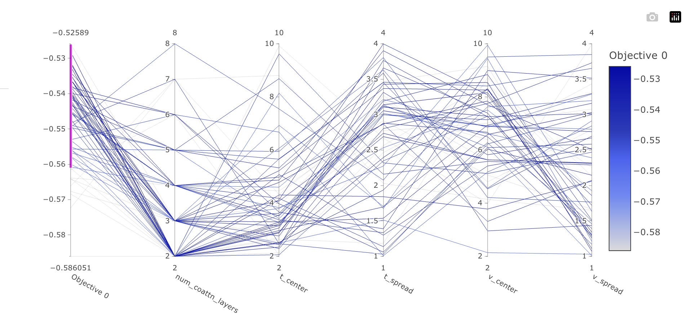
</figure>

Apparently for hateful memes configs with only 2 or 3 coattention placements work best. In the following week I will conduct further experiments with both (or even all) tasks (hateful_memes, mm_imdb, (upmcfood))

Even though the optimization was focused on validation loss, the accuracy varied widely.

<figure>


```
Epoch 1/10, Train Loss: 0.6559, Val Loss: 0.6582, Val Acc: 0.6312
Epoch 2/10, Train Loss: 0.6220, Val Loss: 0.6131, Val Acc: 0.6724
Epoch 3/10, Train Loss: 0.5767, Val Loss: 0.5939, Val Acc: 0.7041
Epoch 4/10, Train Loss: 0.5420, Val Loss: 0.5925, Val Acc: 0.6824
Epoch 5/10, Train Loss: 0.5091, Val Loss: 0.5782, Val Acc: 0.6971
Epoch 6/10, Train Loss: 0.4689, Val Loss: 0.5709, Val Acc: 0.7135
Epoch 7/10, Train Loss: 0.4407, Val Loss: 0.5616, Val Acc: 0.7218
Epoch 8/10, Train Loss: 0.3988, Val Loss: 0.5770, Val Acc: 0.7235
Epoch 9/10, Train Loss: 0.3670, Val Loss: 0.5925, Val Acc: 0.7165
Epoch 10/10, Train Loss: 0.3389, Val Loss: 0.6151, Val Acc: 0.7088
trial 19: params={'num_coattn_layers': 6, 't_center': 2.0449647792314796, 't_spread': 2.4642271321601306, 'v_center': 7.976648823538334, 'v_spread': 2.254911831081765}, result=-0.5616
```

*vs.*

```
Epoch 1/10, Train Loss: 0.6482, Val Loss: 0.6408, Val Acc: 0.6312
Epoch 2/10, Train Loss: 0.5885, Val Loss: 0.5578, Val Acc: 0.7353
Epoch 3/10, Train Loss: 0.5190, Val Loss: 0.5323, Val Acc: 0.7459
Epoch 4/10, Train Loss: 0.4674, Val Loss: 0.5332, Val Acc: 0.7518
Epoch 5/10, Train Loss: 0.4089, Val Loss: 0.5422, Val Acc: 0.7406
Epoch 6/10, Train Loss: 0.3511, Val Loss: 0.5889, Val Acc: 0.7294
Epoch 7/10, Train Loss: 0.3004, Val Loss: 0.6102, Val Acc: 0.7241
Epoch 8/10, Train Loss: 0.2568, Val Loss: 0.6704, Val Acc: 0.7135
Epoch 9/10, Train Loss: 0.2285, Val Loss: 0.7105, Val Acc: 0.7182
Epoch 10/10, Train Loss: 0.1857, Val Loss: 0.7572, Val Acc: 0.7088
2025-10-02 15:01:39 - INFO  - experiment_tracker.py:objective:307 - trial 43: params={'num_coattn_layers': 2, 't_center': 2.9097000545536047, 't_spread': 3.1395032914365864, 'v_center': 8.1633063105181, 'v_spread': 1.2579536681542476}, result=-0.5323
```


</figure>


## 01.10
How to define baseline for my experiments?
- VILT: embedding fusion at the strat
- ViLBERT without coattention layers; but still has fusion at the top! Late fusion when performing finetuning on downstream task.
    - could argue, that even though there is fusion, the comparision is strict between no coattention and coattention.


- Compare Haramard vs simply summing vs concat


### Comparison: Haramard vs simply summing vs concat
Comparison of hadamard vs concat on hm, with parameteres:
```python
econf = experiment_tracker.ExperimentConfig(
    t_biattention_ids=[6,7,8,9, 10,11],
    v_biattention_ids=[6,7,8,9, 10,11],
    use_contrastive_loss=False,
    epochs=8,
    learning_rate=3.4e-5,
)
```
<figure>

**hadamard**

```
Epoch 1/8, Train Loss: 0.6469, Val Loss: 0.6277, Val Acc: 0.6606
Epoch 2/8, Train Loss: 0.6134, Val Loss: 0.6162, Val Acc: 0.6794
Epoch 3/8, Train Loss: 0.5521, Val Loss: 0.5670, Val Acc: 0.7259
Epoch 4/8, Train Loss: 0.4950, Val Loss: 0.5631, Val Acc: 0.7153
Epoch 5/8, Train Loss: 0.4573, Val Loss: 0.5593, Val Acc: 0.7312
Epoch 6/8, Train Loss: 0.4147, Val Loss: 0.5724, Val Acc: 0.7176
Epoch 7/8, Train Loss: 0.3918, Val Loss: 0.5972, Val Acc: 0.7271
```

**concat**:

```
Epoch 1/8, Train Loss: 0.6566, Val Loss: 0.6598, Val Acc: 0.6312
Epoch 2/8, Train Loss: 0.6410, Val Loss: 0.6552, Val Acc: 0.6300
Epoch 3/8, Train Loss: 0.5994, Val Loss: 0.6308, Val Acc: 0.6335
Epoch 4/8, Train Loss: 0.5519, Val Loss: 0.6108, Val Acc: 0.6594
Epoch 5/8, Train Loss: 0.5057, Val Loss: 0.5978, Val Acc: 0.6894
Epoch 6/8, Train Loss: 0.4746, Val Loss: 0.5914, Val Acc: 0.6988
Epoch 7/8, Train Loss: 0.4516, Val Loss: 0.5883, Val Acc: 0.6982
Epoch 8/8, Train Loss: 0.4358, Val Loss: 0.5822, Val Acc: 0.7141
```

**sum**:

```
Epoch 1/8, Train Loss: 0.6432, Val Loss: 0.6351, Val Acc: 0.6424
Epoch 2/8, Train Loss: 0.5896, Val Loss: 0.6453, Val Acc: 0.6212
Epoch 3/8, Train Loss: 0.5463, Val Loss: 0.5627, Val Acc: 0.7335
Epoch 4/8, Train Loss: 0.4717, Val Loss: 0.5546, Val Acc: 0.7253
Epoch 5/8, Train Loss: 0.4185, Val Loss: 0.5717, Val Acc: 0.7282
Epoch 6/8, Train Loss: 0.3822, Val Loss: 0.5889, Val Acc: 0.7371
Epoch 7/8, Train Loss: 0.3508, Val Loss: 0.6030, Val Acc: 0.7306
Epoch 8/8, Train Loss: 0.3394, Val Loss: 0.6086, Val Acc: 0.7229
```

$\Rightarrow:$ concat converges more slowly

all of those experiments where conducted with cosine lr scheduler with warmup with final lr of `0.1*initial_learning_rate`. Decided to increase the fraction to `0.5`, what lead to better results for hadamard, sum and concat.


### 30.09
apparently my archicture redesign had a critical bug: the vision transformer was passed two times! In the forward pass, I thought I extracted the vision embeddings using `self.vit.forward_features(image_pixel_values)`. But this was wrong according to the [documentation](https://huggingface.co/docs/timm/en/feature_extraction#forwardfeatures)
Fixed it with:
```python

def forward(self, *args, **kwargs):

    extended_attention_mask = self.get_extended_attention_mask(
        text_attention_mask,
        dtype=next(self.bert.parameters()).dtype)
    text_embedding = self.bert_embeddings(input_ids=text_input_ids,token_type_ids=text_token_type_ids,)

    # #this is wrong, according to the sourcecode, this simply skips the head
    # and skips the pooling stage in the transformer:
    # https://github.com/huggingface/pytorch-image-models/blob/0645384b3a68d0ddf4657400125bb2c68c42bc60/timm/models/vision_transformer.py#L935
    # vit_outputs = self.vit.forward_features(
    #     image_pixel_values,
    # )


    #applies conv2d to image with kernel_sz=16 and stride = 16
    #=> 14x14 patches = 196
    x = self.vit.patch_embed(image_pixel_values)
    cls = self.vit.cls_token.expand(x.shape[0], -1, -1)
    x = torch.cat((cls, x), dim=1)
    x = self.vit.pos_drop(x + self.vit.pos_embed)
    vision_embeddings = self.vision_embeddings(x)
```

Here the correct method to get embedded patches is to use `self.vit.patch_embed` and add the cls token and positional embeddings manually.
Basically [`vit.patch_embed`](https://huggingface.co/spaces/Roll20/pet_score/blame/main/lib/timm/models/layers/patch_embed.py) applies conv2d to the image and creates 14x14 patches.


## 29.09 - current progress and plan
two main experiments for my thesis:
1) use optuna to optimize for alignment or loss. Run only on one task, like 300 configs runnable, should take only a few days

2) use best configurations and do pretrain + finetune on all tasks
    - 5 pretrains;
    - compute full alignment metrics
    - correlation between evaluation metrics (acc) and alignment (pearson matrix for each task)
    - grad-cam investigation of data
        - alignment for each image + text in layer, maybe also a plot for both
        - alignment vs performance


3) (maybe alternative to point 1) compare performance vs representational alignment. Find best configuration of layers to get highest ( or lowest ) metric (loss or acc)
    - compare good performing representational alignment with bad performing, also baseline
    - what are the correlations? maybe with matrix (pearson correlation m.)


4) are representational alignment measures directly after coattention always higher/bett
er in terms of alignment


---

**comparision representational measures**

comparison of representational measures for different tasks.
configuration: `VISION_CROSS_ATTENTION_LAYERS = [0,1,2,3,4,5]`
`TEXT_CROSS_ATTENTION_LAYERS   = [6,7,8,9, 10,11]`

<figure>

**jaccard-matrix**:
initialized vs trained<br>
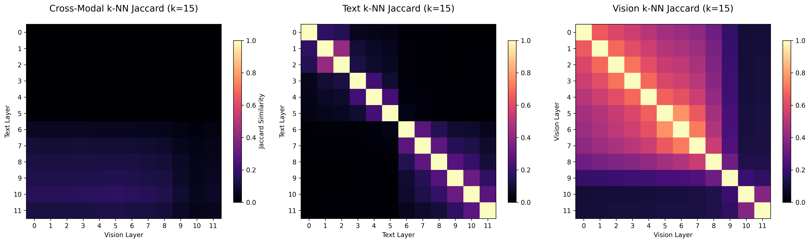
<br>
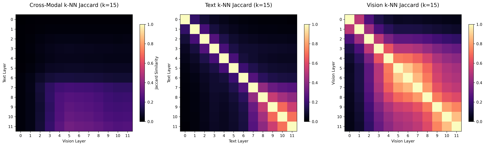

**mutual knn**:
initialized vs trained<br>
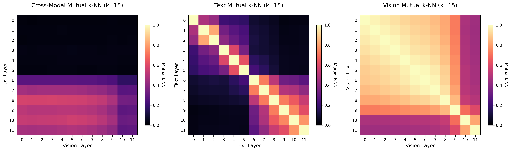
<br>
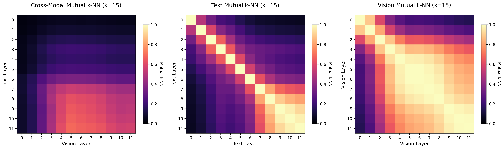
</figure>

**rank similarity&procrustes**:
initialized vs trained<br>
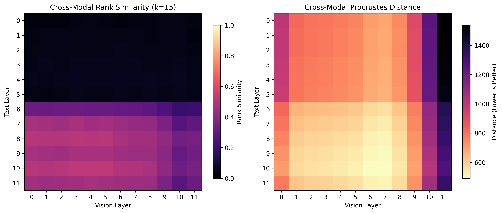
<br>
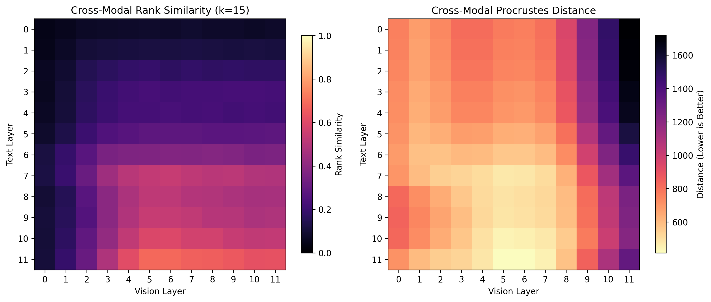


---

comparison with pretrained model. first attn plots on pretrained+fnetuned model:
for the image
with text "restaurants and coffee shops at the seafront of town"
<figure>
input image: <br>
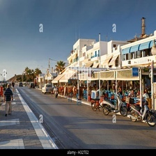<br><br>
</figure>

**avg over all layers:**
<figure>
finetuned vs untrained: <br>
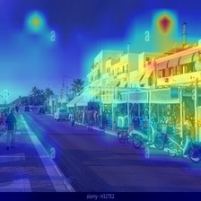
</figure>


## 23.09
today I implemented grad-cam to follow gradients of activations on multimidal input. Here I compared the attention maps of a finetuned model vs. an untrained model.

results are pretty good for some inputs, for other not so. Note that coattention-config is `vi_biattention_ids = [4,8]`, `t_biattention_ids = [10,11]`.

<figure>
input image: <br>
<br><br>
</figure>

**layer4**:
<figure>
finetuned vs untrained: <br>
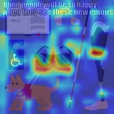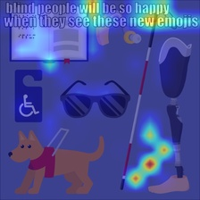

</figure>

**layer11:**
<figure>
finetuned vs untrained: <br>
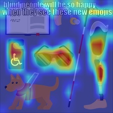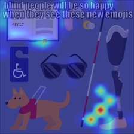
</figure>

**avg over all layers:**
<figure>
finetuned vs untrained: <br>
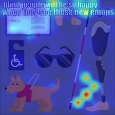
</figure>


## 24.09
hm hyperparam optim on lr and fusion strat in `res/experiments/multi_task_optim_20250922-205905.db`.

## 22.09
finished run for hyperparam optim for hm and mm-imdb in `res/experiments/multi_task_optim_20250918-134352.db`.

<!--

### Archive
the entries below are with quite different architectures. By now (4.10.25) the code base changed quite a lot.

## 15.09
**interesting observation**:
baseline (only hadamard between vit and BERT) has really high performance in comparison to the more complex vilbert!

baseline:
```bash
before training, evaluating on uninitialized model
alignment for hateful memes:
layer layer0 (co-attn-False): cosine=-0.0055, CKA=0.0618, SVCCA=0.0000, mknn=0.0956, rank=0.0711, procrustes=1948.8162

Epoch 1/4, train loss: 0.6449, test loss: 0.5963,  accuracy: 0.7082
alignment for hateful memes:
layer layer0 (co-attn-False): cosine=-0.0107, CKA=0.0621, SVCCA=0.0000, mknn=0.0592, rank=0.0674, procrustes=1049.5791

Epoch 2/4, train loss: 0.5617, test loss: 0.5412,  accuracy: 0.7306
alignment for hateful memes:
layer layer0 (co-attn-False): cosine=-0.0012, CKA=0.0823, SVCCA=0.0000, mknn=0.0639, rank=0.0710, procrustes=1270.4775

Epoch 3/4, train loss: 0.5074, test loss: 0.5379,  accuracy: 0.7341
alignment for hateful memes:
layer layer0 (co-attn-False): cosine=0.0095, CKA=0.0818, SVCCA=0.0000, mknn=0.0675, rank=0.0678, procrustes=1502.3615

Epoch 4/4, train loss: 0.4817, test loss: 0.5386,  accuracy: 0.7394
alignment for hateful memes:
layer layer0 (co-attn-False): cosine=0.0056, CKA=0.0822, SVCCA=0.0000, mknn=0.0673, rank=0.0757, procrustes=1581.5077
```

*vs:*

vilbert:
```bash
python src/evaluate.py
Pretrained model path None does not exist, using fresh model.
trainable params: 296755552/296755552
bs_alignment_analysis: 128, batchsize: 8
dirname:  res/data/hateful_memes_data
dirname:  res/data/hateful_memes_data
using contrastive: False


before training, evaluating on uninitialized model
alignment for hateful memes:
layer layer0 (co-attn-True): cosine=-0.0056, CKA=0.0628, SVCCA=0.0000, mknn=0.3674, rank=0.3002, procrustes=889.1853
layer layer1 (co-attn-True): cosine=-0.0049, CKA=0.0625, SVCCA=0.0000, mknn=0.4345, rank=0.3842, procrustes=839.5596
layer layer2 (co-attn-False): cosine=-0.0029, CKA=0.0615, SVCCA=0.0000, mknn=0.4267, rank=0.3579, procrustes=841.2892
layer layer3 (co-attn-False): cosine=-0.0006, CKA=0.0624, SVCCA=0.0000, mknn=0.4204, rank=0.3894, procrustes=845.1613
layer layer4 (co-attn-True): cosine=-0.0033, CKA=0.0625, SVCCA=0.0000, mknn=0.4759, rank=0.4327, procrustes=797.9229
simulated batchsize: 512, actual batchsize: 8
training:   0%|                                                               | 0/850 [00:00<?, ?it/s]/home/cedric/coding/github/bachelor-thesis/bsc-code/venv310/lib/python3.10/site-packages/torch/_inductor/compile_fx.py:236: UserWarning: TensorFloat32 tensor cores for float32 matrix multiplication available but not enabled. Consider setting `torch.set_float32_matmul_precision('high')` for better performance.
  warnings.warn(

Epoch 1/4, train loss: 0.6306, test loss: 0.6117,  accuracy: 0.6535
alignment for hateful memes:
layer layer0 (co-attn-True): cosine=-0.0316, CKA=0.0489, SVCCA=0.0000, mknn=0.1419, rank=0.1735, procrustes=947.6616
layer layer1 (co-attn-True): cosine=-0.0228, CKA=0.0484, SVCCA=0.0000, mknn=0.1749, rank=0.1994, procrustes=870.5939
layer layer2 (co-attn-False): cosine=-0.0345, CKA=0.0475, SVCCA=0.0000, mknn=0.1820, rank=0.2260, procrustes=833.2436
layer layer3 (co-attn-False): cosine=-0.0228, CKA=0.0483, SVCCA=0.0000, mknn=0.1871, rank=0.2318, procrustes=795.6479
layer layer4 (co-attn-True): cosine=-0.0336, CKA=0.0476, SVCCA=0.0000, mknn=0.2268, rank=0.2759, procrustes=697.4583

Epoch 2/4, train loss: 0.5227, test loss: 0.5356,  accuracy: 0.7465
alignment for hateful memes:
layer layer0 (co-attn-True): cosine=-0.0172, CKA=0.0540, SVCCA=0.0000, mknn=0.1589, rank=0.1660, procrustes=1058.3779
layer layer1 (co-attn-True): cosine=-0.0166, CKA=0.0536, SVCCA=0.0000, mknn=0.1990, rank=0.1759, procrustes=982.0504
layer layer2 (co-attn-False): cosine=-0.0314, CKA=0.0529, SVCCA=0.0000, mknn=0.2046, rank=0.2072, procrustes=949.4791
layer layer3 (co-attn-False): cosine=-0.0272, CKA=0.0540, SVCCA=0.0000, mknn=0.2137, rank=0.2014, procrustes=917.3548
layer layer4 (co-attn-True): cosine=-0.0396, CKA=0.0535, SVCCA=0.0000, mknn=0.2601, rank=0.2679, procrustes=813.4399

Epoch 3/4, train loss: 0.4364, test loss: 0.5425,  accuracy: 0.7453
alignment for hateful memes:
layer layer0 (co-attn-True): cosine=-0.0219, CKA=0.0534, SVCCA=0.0000, mknn=0.1808, rank=0.1645, procrustes=1047.8995
layer layer1 (co-attn-True): cosine=-0.0203, CKA=0.0532, SVCCA=0.0000, mknn=0.2207, rank=0.1923, procrustes=976.6376
layer layer2 (co-attn-False): cosine=-0.0323, CKA=0.0526, SVCCA=0.0000, mknn=0.2253, rank=0.2112, procrustes=951.6035
layer layer3 (co-attn-False): cosine=-0.0296, CKA=0.0537, SVCCA=0.0000, mknn=0.2303, rank=0.2133, procrustes=927.0833
layer layer4 (co-attn-True): cosine=-0.0454, CKA=0.0533, SVCCA=0.0000, mknn=0.2810, rank=0.2693, procrustes=828.4471

Epoch 4/4, train loss: 0.3921, test loss: 0.5487,  accuracy: 0.7394
alignment for hateful memes:
layer layer0 (co-attn-True): cosine=-0.0220, CKA=0.0540, SVCCA=0.0000, mknn=0.1748, rank=0.1499, procrustes=1048.1293
layer layer1 (co-attn-True): cosine=-0.0210, CKA=0.0538, SVCCA=0.0000, mknn=0.2150, rank=0.1910, procrustes=978.0315
layer layer2 (co-attn-False): cosine=-0.0330, CKA=0.0532, SVCCA=0.0000, mknn=0.2178, rank=0.2080, procrustes=954.5532
layer layer3 (co-attn-False): cosine=-0.0299, CKA=0.0543, SVCCA=0.0000, mknn=0.2269, rank=0.2106, procrustes=931.1603
layer layer4 (co-attn-True): cosine=-0.0462, CKA=0.0539, SVCCA=0.0000, mknn=0.2760, rank=0.2586, procrustes=834.6483
```


hateful memes: contrastive vs. non-contrastive training (with alignment analysis):
```
before training, evaluating on uninitialized model
alignment for hateful memes:
layer layer0 (co-attn-True): cosine=-0.0111, CKA=0.0647, SVCCA=0.0000, mknn=0.3555, rank=0.3063, procrustes=889.0625
layer layer1 (co-attn-True): cosine=-0.0158, CKA=0.0634, SVCCA=0.0000, mknn=0.4302, rank=0.3481, procrustes=837.0211
layer layer2 (co-attn-False): cosine=0.0037, CKA=0.0629, SVCCA=0.0000, mknn=0.4402, rank=0.3542, procrustes=837.7579
layer layer3 (co-attn-False): cosine=-0.0094, CKA=0.0631, SVCCA=0.0000, mknn=0.4275, rank=0.3582, procrustes=840.1173
layer layer4 (co-attn-True): cosine=-0.0193, CKA=0.0620, SVCCA=0.0000, mknn=0.5005, rank=0.4117, procrustes=780.5077

Epoch 1/4, train loss: 0.6406, test loss: 0.5981,  accuracy: 0.6912
alignment for hateful memes:
layer layer0 (co-attn-True): cosine=-0.0172, CKA=0.0694, SVCCA=0.0000, mknn=0.2463, rank=0.2246, procrustes=940.3904
layer layer1 (co-attn-True): cosine=-0.0278, CKA=0.0686, SVCCA=0.0000, mknn=0.3056, rank=0.2745, procrustes=883.2986
layer layer2 (co-attn-False): cosine=-0.0064, CKA=0.0675, SVCCA=0.0000, mknn=0.3123, rank=0.2872, procrustes=872.7472
layer layer3 (co-attn-False): cosine=-0.0143, CKA=0.0676, SVCCA=0.0000, mknn=0.3109, rank=0.2876, procrustes=864.3787
layer layer4 (co-attn-True): cosine=-0.0222, CKA=0.0661, SVCCA=0.0000, mknn=0.3793, rank=0.3351, procrustes=797.9633

Epoch 2/4, train loss: 0.5507, test loss: 0.5576,  accuracy: 0.7206
alignment for hateful memes:
layer layer0 (co-attn-True): cosine=-0.0064, CKA=0.0774, SVCCA=0.0000, mknn=0.2041, rank=0.1798, procrustes=997.1100
layer layer1 (co-attn-True): cosine=-0.0159, CKA=0.0767, SVCCA=0.0000, mknn=0.2514, rank=0.2290, procrustes=931.9759
layer layer2 (co-attn-False): cosine=-0.0001, CKA=0.0753, SVCCA=0.0000, mknn=0.2544, rank=0.2226, procrustes=925.4233
layer layer3 (co-attn-False): cosine=-0.0040, CKA=0.0752, SVCCA=0.0000, mknn=0.2544, rank=0.2176, procrustes=927.3590
layer layer4 (co-attn-True): cosine=-0.0125, CKA=0.0742, SVCCA=0.0000, mknn=0.3194, rank=0.2590, procrustes=861.3385

Epoch 3/4, train loss: 0.4926, test loss: 0.5535,  accuracy: 0.7218
alignment for hateful memes:
layer layer0 (co-attn-True): cosine=-0.0074, CKA=0.0771, SVCCA=0.0000, mknn=0.1935, rank=0.1762, procrustes=1000.3672
layer layer1 (co-attn-True): cosine=-0.0166, CKA=0.0764, SVCCA=0.0000, mknn=0.2453, rank=0.2207, procrustes=935.7963
layer layer2 (co-attn-False): cosine=-0.0022, CKA=0.0752, SVCCA=0.0000, mknn=0.2498, rank=0.2243, procrustes=932.4207
layer layer3 (co-attn-False): cosine=-0.0047, CKA=0.0750, SVCCA=0.0000, mknn=0.2487, rank=0.2137, procrustes=938.6042
layer layer4 (co-attn-True): cosine=-0.0138, CKA=0.0741, SVCCA=0.0000, mknn=0.3141, rank=0.2649, procrustes=875.0054

Epoch 4/4, train loss: 0.4747, test loss: 0.5541,  accuracy: 0.7282
alignment for hateful memes:
layer layer0 (co-attn-True): cosine=-0.0064, CKA=0.0770, SVCCA=0.0000, mknn=0.1983, rank=0.1767, procrustes=1003.5676
layer layer1 (co-attn-True): cosine=-0.0154, CKA=0.0763, SVCCA=0.0000, mknn=0.2444, rank=0.2203, procrustes=939.5178
layer layer2 (co-attn-False): cosine=-0.0013, CKA=0.0751, SVCCA=0.0000, mknn=0.2536, rank=0.2170, procrustes=936.4628
layer layer3 (co-attn-False): cosine=-0.0037, CKA=0.0750, SVCCA=0.0000, mknn=0.2496, rank=0.2193, procrustes=943.2543
layer layer4 (co-attn-True): cosine=-0.0139, CKA=0.0742, SVCCA=0.0000, mknn=0.3127, rank=0.2676, procrustes=880.3727
❯ python src/evaluate.py --use-constrastive
Pretrained model path None does not exist, using fresh model.
trainable params: 297148768/297148768
bs_alignment_analysis: 128, batchsize: 8
dirname:  res/data/hateful_memes_data
dirname:  res/data/hateful_memes_data
using contrastive: True
using contrastive loss: True, using cosine loss: False


before training, evaluating on uninitialized model
alignment for hateful memes:
layer layer0 (co-attn-True): cosine=-0.0111, CKA=0.0647, SVCCA=0.0000, mknn=0.3555, rank=0.3063, procrustes=889.0625
layer layer1 (co-attn-True): cosine=-0.0158, CKA=0.0634, SVCCA=0.0000, mknn=0.4302, rank=0.3481, procrustes=837.0211
layer layer2 (co-attn-False): cosine=0.0037, CKA=0.0629, SVCCA=0.0000, mknn=0.4402, rank=0.3542, procrustes=837.7579
layer layer3 (co-attn-False): cosine=-0.0094, CKA=0.0631, SVCCA=0.0000, mknn=0.4275, rank=0.3582, procrustes=840.1173
layer layer4 (co-attn-True): cosine=-0.0193, CKA=0.0620, SVCCA=0.0000, mknn=0.5005, rank=0.4117, procrustes=780.5077
simulated batchsize: 512, actual batchsize: 8
training:   0%|                                                                                                                | 0/850 [00:00<?, ?it/s]W0915 13:20:15.148000 14098 torch/_inductor/utils.py:1250] [0/2] Not enough SMs to use max_autotune_gemm mode
training: 100%|██████████████████████████████████████████████████████████████████████████████████████████████████████| 850/850 [03:35<00:00,  3.95it/s]
Epoch 1/4, train loss: 1.2018, test loss: 0.6125,  accuracy: 0.6606
alignment for hateful memes:
layer layer0 (co-attn-True): cosine=0.0195, CKA=0.0732, SVCCA=0.0000, mknn=0.3556, rank=0.2702, procrustes=899.3615
layer layer1 (co-attn-True): cosine=0.0291, CKA=0.0717, SVCCA=0.0000, mknn=0.4185, rank=0.2961, procrustes=844.7163
layer layer2 (co-attn-False): cosine=0.0652, CKA=0.0706, SVCCA=0.0000, mknn=0.4246, rank=0.3090, procrustes=845.7498
layer layer3 (co-attn-False): cosine=0.0856, CKA=0.0705, SVCCA=0.0000, mknn=0.4250, rank=0.3107, procrustes=848.6807
layer layer4 (co-attn-True): cosine=0.1310, CKA=0.0696, SVCCA=0.0000, mknn=0.4873, rank=0.3411, procrustes=792.5574
simulated batchsize: 512, actual batchsize: 8
training: 100%|██████████████████████████████████████████████████████████████████████████████████████████████████████| 850/850 [03:16<00:00,  4.32it/s]
Epoch 2/4, train loss: 0.8464, test loss: 0.5748,  accuracy: 0.7147
alignment for hateful memes:
layer layer0 (co-attn-True): cosine=0.0551, CKA=0.0756, SVCCA=0.0000, mknn=0.4521, rank=0.3073, procrustes=833.6205
layer layer1 (co-attn-True): cosine=0.0963, CKA=0.0744, SVCCA=0.0000, mknn=0.5226, rank=0.3633, procrustes=773.4784
layer layer2 (co-attn-False): cosine=0.1747, CKA=0.0729, SVCCA=0.0000, mknn=0.5431, rank=0.3657, procrustes=771.3981
layer layer3 (co-attn-False): cosine=0.2642, CKA=0.0727, SVCCA=0.0000, mknn=0.5533, rank=0.3839, procrustes=771.6022
layer layer4 (co-attn-True): cosine=0.4028, CKA=0.0719, SVCCA=0.0000, mknn=0.6259, rank=0.4472, procrustes=713.6843
simulated batchsize: 512, actual batchsize: 8
training: 100%|██████████████████████████████████████████████████████████████████████████████████████████████████████| 850/850 [03:17<00:00,  4.31it/s]
Epoch 3/4, train loss: 0.6900, test loss: 0.5619,  accuracy: 0.7200
alignment for hateful memes:
layer layer0 (co-attn-True): cosine=0.0590, CKA=0.0756, SVCCA=0.0000, mknn=0.4637, rank=0.3183, procrustes=823.3411
layer layer1 (co-attn-True): cosine=0.1091, CKA=0.0746, SVCCA=0.0000, mknn=0.5353, rank=0.3590, procrustes=759.4251
layer layer2 (co-attn-False): cosine=0.1972, CKA=0.0730, SVCCA=0.0000, mknn=0.5620, rank=0.3776, procrustes=757.6245
layer layer3 (co-attn-False): cosine=0.3008, CKA=0.0728, SVCCA=0.0000, mknn=0.5747, rank=0.4059, procrustes=758.6730
layer layer4 (co-attn-True): cosine=0.4565, CKA=0.0721, SVCCA=0.0000, mknn=0.6460, rank=0.4579, procrustes=696.7313
simulated batchsize: 512, actual batchsize: 8
training: 100%|██████████████████████████████████████████████████████████████████████████████████████████████████████| 850/850 [03:17<00:00,  4.31it/s]
Epoch 4/4, train loss: 0.6611, test loss: 0.5607,  accuracy: 0.7218
alignment for hateful memes:
layer layer0 (co-attn-True): cosine=0.0624, CKA=0.0756, SVCCA=0.0000, mknn=0.4728, rank=0.3157, procrustes=824.0780
layer layer1 (co-attn-True): cosine=0.1136, CKA=0.0746, SVCCA=0.0000, mknn=0.5496, rank=0.3581, procrustes=759.1529
layer layer2 (co-attn-False): cosine=0.2032, CKA=0.0730, SVCCA=0.0000, mknn=0.5776, rank=0.3800, procrustes=756.7299
layer layer3 (co-attn-False): cosine=0.3075, CKA=0.0728, SVCCA=0.0000, mknn=0.5919, rank=0.3883, procrustes=758.0289
layer layer4 (co-attn-True): cosine=0.4631, CKA=0.0722, SVCCA=0.0000, mknn=0.6614, rank=0.4299, procrustes=695.6163
```

## 13.09
Implemented optuna param optimization aswell as an experiment tracker to track all experiments wit proper directories.
Currently running on two gpus, two experiments:

i) hyperparam optimization with fixed depth

ii) optimization for coattns for different depths but fixed hyperparams. Takes way longer, as both models are evaluated.

Today a run from yesterday finished for hyperparam optim. here are the results:
<figure>
    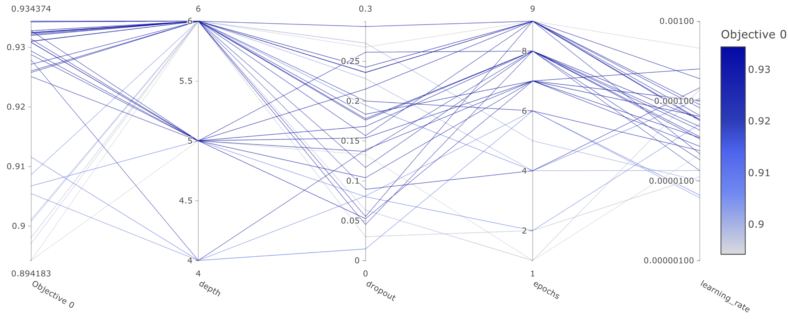<br>
    - learning_rate 5.8761790368610554e-05<br>
    - dropout 0.04505446623027967<br>
    - epochs 8<br>
    - depth 6<br><br>
    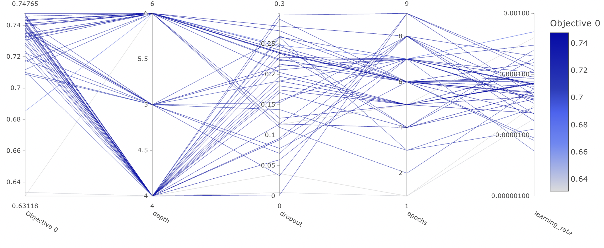<br>
    - learning_rate 4.4085342730658045e-05<br>
    - dropout 0.23424687497949043<br>
    - epochs 6<br>
    - depth 6<br>
</figure>


**from the paper "understanding the emergence of multimodal representation alignment**:
its not simply *bigger models/more params => better alignment**

its more nuanced:
- performance and alignment are dependent on task. some tasks dont need strong alignment to perform well on downstream tasks. Others are extremly reliant on the alignment.
- models capture multi-modal correspondence when there is shared information. They measured heterogenity of modalities using uniqueness $U$.
$U$ increases $\rightarrow$ alignment decreases

$\Rightarrow$ increasing alignment is not always good.


## 04.09

```bash
2025-09-03 20:18:33 - INFO  - trainer.py:train:841 - training with tasks: [<Task.MASKED_IM: 3>, <Task.MASKED_LM: 2>, <Task.ALIGNMENT_PREDICTION: 1>]
2025-09-03 21:03:36 - INFO  - trainer.py:train:890 - Epoch 1/4,
    train loss MLM: 6.7365,
    test loss MLM: 5.5988,
    train loss AP: 1.3250,
    test loss AP: 0.3271,
    accuracy AP: 0.9998
    train loss MIM: 6.4775,
    test loss MIM: 5.4615
2025-09-03 21:04:06 - INFO  - trainer.py:__save_checkpoint:957 - Checkpoint saved to res/checkpoints/pretrained_epoch1_task123.pt
2025-09-03 21:04:06 - INFO  - trainer.py:train:915 - alignment for hateful memes:
2025-09-03 21:04:19 - INFO  - analysis.py:analyse:556 - layer layer0 (co-attn-False): cosine=-0.0354, CKA=0.0494, max_sim_tp=0.0310, max_sim_pt=0.0672, SVCCA=0.0000, mknn_full_epoch=0.0280
2025-09-03 21:04:19 - INFO  - analysis.py:analyse:556 - layer layer1 (co-attn-True): cosine=0.4888, CKA=0.0459, max_sim_tp=0.4816, max_sim_pt=0.4745, SVCCA=0.0000, mknn_full_epoch=0.5510
2025-09-03 21:04:19 - INFO  - analysis.py:analyse:556 - layer layer2 (co-attn-False): cosine=0.6984, CKA=0.0393, max_sim_tp=0.6926, max_sim_pt=0.6853, SVCCA=0.0000, mknn_full_epoch=0.6374
2025-09-03 21:04:19 - INFO  - analysis.py:analyse:556 - layer layer3 (co-attn-True): cosine=0.9364, CKA=0.0370, max_sim_tp=0.8760, max_sim_pt=0.8870, SVCCA=0.0000, mknn_full_epoch=0.9070
2025-09-03 21:04:19 - INFO  - trainer.py:train:920 - alignment for conceptual captions:
2025-09-03 21:04:32 - INFO  - analysis.py:analyse:556 - layer layer0 (co-attn-False): cosine=0.0052, CKA=0.0724, max_sim_tp=0.0400, max_sim_pt=0.0570, SVCCA=0.0000, mknn_full_epoch=0.0166
2025-09-03 21:04:32 - INFO  - analysis.py:analyse:556 - layer layer1 (co-attn-True): cosine=0.5594, CKA=0.0718, max_sim_tp=0.5201, max_sim_pt=0.5009, SVCCA=0.0000, mknn_full_epoch=0.5683
2025-09-03 21:04:32 - INFO  - analysis.py:analyse:556 - layer layer2 (co-attn-False): cosine=0.7489, CKA=0.0689, max_sim_tp=0.7242, max_sim_pt=0.7110, SVCCA=0.0000, mknn_full_epoch=0.6108
2025-09-03 21:04:32 - INFO  - analysis.py:analyse:556 - layer layer3 (co-attn-True): cosine=0.9553, CKA=0.0648, max_sim_tp=0.9092, max_sim_pt=0.9123, SVCCA=0.0000, mknn_full_epoch=0.9645
2025-09-03 21:49:35 - INFO  - trainer.py:train:890 - Epoch 2/4,
    train loss MLM: 5.2464,
    test loss MLM: 5.0590,
    train loss AP: 0.5156,
    test loss AP: 0.2663,
    accuracy AP: 1.0000
    train loss MIM: 5.5609,
    test loss MIM: 5.2549
2025-09-03 21:50:05 - INFO  - trainer.py:__save_checkpoint:957 - Checkpoint saved to res/checkpoints/pretrained_epoch2_task123.pt
2025-09-03 21:50:05 - INFO  - trainer.py:train:915 - alignment for hateful memes:
2025-09-03 21:50:18 - INFO  - analysis.py:analyse:556 - layer layer0 (co-attn-False): cosine=0.0277, CKA=0.0283, max_sim_tp=0.0514, max_sim_pt=0.0737, SVCCA=0.0000, mknn_full_epoch=0.0316
2025-09-03 21:50:18 - INFO  - analysis.py:analyse:556 - layer layer1 (co-attn-True): cosine=0.6144, CKA=0.0266, max_sim_tp=0.5220, max_sim_pt=0.4824, SVCCA=0.0000, mknn_full_epoch=0.6469
2025-09-03 21:50:18 - INFO  - analysis.py:analyse:556 - layer layer2 (co-attn-False): cosine=0.8265, CKA=0.0246, max_sim_tp=0.7570, max_sim_pt=0.7115, SVCCA=0.0000, mknn_full_epoch=0.7800
2025-09-03 21:50:18 - INFO  - analysis.py:analyse:556 - layer layer3 (co-attn-True): cosine=0.9615, CKA=0.0249, max_sim_tp=0.8930, max_sim_pt=0.8774, SVCCA=0.0000, mknn_full_epoch=0.9477
2025-09-03 21:50:18 - INFO  - trainer.py:train:920 - alignment for conceptual captions:
2025-09-03 21:50:31 - INFO  - analysis.py:analyse:556 - layer layer0 (co-attn-False): cosine=0.0156, CKA=0.0308, max_sim_tp=0.0501, max_sim_pt=0.0675, SVCCA=0.0000, mknn_full_epoch=0.0164
2025-09-03 21:50:31 - INFO  - analysis.py:analyse:556 - layer layer1 (co-attn-True): cosine=0.6589, CKA=0.0307, max_sim_tp=0.5852, max_sim_pt=0.5363, SVCCA=0.0000, mknn_full_epoch=0.6040
2025-09-03 21:50:31 - INFO  - analysis.py:analyse:556 - layer layer2 (co-attn-False): cosine=0.8524, CKA=0.0281, max_sim_tp=0.8001, max_sim_pt=0.7547, SVCCA=0.0000, mknn_full_epoch=0.7573
2025-09-03 21:50:31 - INFO  - analysis.py:analyse:556 - layer layer3 (co-attn-True): cosine=0.9744, CKA=0.0270, max_sim_tp=0.9205, max_sim_pt=0.9007, SVCCA=0.0000, mknn_full_epoch=0.9784
2025-09-03 22:35:34 - INFO  - trainer.py:train:890 - Epoch 3/4,
    train loss MLM: 4.8794,
    test loss MLM: 4.7345,
    train loss AP: 0.4102,
    test loss AP: 0.2216,
    accuracy AP: 1.0000
    train loss MIM: 5.3468,
    test loss MIM: 5.1598
2025-09-03 22:36:04 - INFO  - trainer.py:__save_checkpoint:957 - Checkpoint saved to res/checkpoints/pretrained_epoch3_task123.pt
2025-09-03 22:36:04 - INFO  - trainer.py:train:915 - alignment for hateful memes:
2025-09-03 22:36:17 - INFO  - analysis.py:analyse:556 - layer layer0 (co-attn-False): cosine=0.0273, CKA=0.0167, max_sim_tp=0.0624, max_sim_pt=0.0836, SVCCA=0.0000, mknn_full_epoch=0.0268
2025-09-03 22:36:17 - INFO  - analysis.py:analyse:556 - layer layer1 (co-attn-True): cosine=0.6496, CKA=0.0159, max_sim_tp=0.5326, max_sim_pt=0.4747, SVCCA=0.0000, mknn_full_epoch=0.6815
2025-09-03 22:36:17 - INFO  - analysis.py:analyse:556 - layer layer2 (co-attn-False): cosine=0.8502, CKA=0.0146, max_sim_tp=0.7471, max_sim_pt=0.6955, SVCCA=0.0000, mknn_full_epoch=0.8310
2025-09-03 22:36:17 - INFO  - analysis.py:analyse:556 - layer layer3 (co-attn-True): cosine=0.9679, CKA=0.0148, max_sim_tp=0.8706, max_sim_pt=0.8531, SVCCA=0.0000, mknn_full_epoch=0.9636
2025-09-03 22:36:17 - INFO  - trainer.py:train:920 - alignment for conceptual captions:
2025-09-03 22:36:31 - INFO  - analysis.py:analyse:556 - layer layer0 (co-attn-False): cosine=0.0126, CKA=0.0140, max_sim_tp=0.0498, max_sim_pt=0.0706, SVCCA=0.0000, mknn_full_epoch=0.0133
2025-09-03 22:36:31 - INFO  - analysis.py:analyse:556 - layer layer1 (co-attn-True): cosine=0.6781, CKA=0.0142, max_sim_tp=0.5799, max_sim_pt=0.5300, SVCCA=0.0000, mknn_full_epoch=0.6561
2025-09-03 22:36:31 - INFO  - analysis.py:analyse:556 - layer layer2 (co-attn-False): cosine=0.8708, CKA=0.0128, max_sim_tp=0.7858, max_sim_pt=0.7458, SVCCA=0.0000, mknn_full_epoch=0.8142
2025-09-03 22:36:31 - INFO  - analysis.py:analyse:556 - layer layer3 (co-attn-True): cosine=0.9773, CKA=0.0134, max_sim_tp=0.8948, max_sim_pt=0.8789, SVCCA=0.0000, mknn_full_epoch=0.9849
2025-09-03 23:21:36 - INFO  - trainer.py:train:890 - Epoch 4/4,
    train loss MLM: 4.6339,
    test loss MLM: 4.6339,
    train loss AP: 0.3408,
    test loss AP: 0.1895,
    accuracy AP: 1.0000
    train loss MIM: 5.2118,
    test loss MIM: 5.0339
2025-09-03 23:22:07 - INFO  - trainer.py:__save_checkpoint:957 - Checkpoint saved to res/checkpoints/pretrained_epoch4_task123.pt
2025-09-03 23:22:07 - INFO  - trainer.py:train:915 - alignment for hateful memes:
2025-09-03 23:22:20 - INFO  - analysis.py:analyse:556 - layer layer0 (co-attn-False): cosine=0.0248, CKA=0.0131, max_sim_tp=0.0600, max_sim_pt=0.0854, SVCCA=0.0000, mknn_full_epoch=0.0273
2025-09-03 23:22:20 - INFO  - analysis.py:analyse:556 - layer layer1 (co-attn-True): cosine=0.6576, CKA=0.0127, max_sim_tp=0.5013, max_sim_pt=0.4317, SVCCA=0.0000, mknn_full_epoch=0.6533
2025-09-03 23:22:20 - INFO  - analysis.py:analyse:556 - layer layer2 (co-attn-False): cosine=0.8523, CKA=0.0117, max_sim_tp=0.7057, max_sim_pt=0.6458, SVCCA=0.0000, mknn_full_epoch=0.8238
2025-09-03 23:22:20 - INFO  - analysis.py:analyse:556 - layer layer3 (co-attn-True): cosine=0.9676, CKA=0.0126, max_sim_tp=0.8401, max_sim_pt=0.8162, SVCCA=0.0000, mknn_full_epoch=0.9621
2025-09-03 23:22:20 - INFO  - trainer.py:train:920 - alignment for conceptual captions:
2025-09-03 23:22:34 - INFO  - analysis.py:analyse:556 - layer layer0 (co-attn-False): cosine=0.0141, CKA=0.0125, max_sim_tp=0.0499, max_sim_pt=0.0721, SVCCA=0.0000, mknn_full_epoch=0.0134
2025-09-03 23:22:34 - INFO  - analysis.py:analyse:556 - layer layer1 (co-attn-True): cosine=0.6770, CKA=0.0129, max_sim_tp=0.5449, max_sim_pt=0.4896, SVCCA=0.0000, mknn_full_epoch=0.5926
2025-09-03 23:22:34 - INFO  - analysis.py:analyse:556 - layer layer2 (co-attn-False): cosine=0.8696, CKA=0.0116, max_sim_tp=0.7468, max_sim_pt=0.7020, SVCCA=0.0000, mknn_full_epoch=0.7874
2025-09-03 23:22:34 - INFO  - analysis.py:analyse:556 - layer layer3 (co-attn-True): cosine=0.9742, CKA=0.0125, max_sim_tp=0.8639, max_sim_pt=0.8460, SVCCA=0.0000, mknn_full_epoch=0.9718
2025-09-03 23:22:34 - INFO  - utils.py:plot_losses:358 - saved plot to res/plots/training_losses-1756934554.png
2025-09-03 23:22:34 - INFO  - main.py:pretrain_:164 - finished training.

 --------------------
2025-09-03 23:23:26 - INFO  - evaluate.py:train_and_eval_on_downstream_task:53 - Loaded model from res/checkpoints/pretrained_epoch1_task123.pt with config: {'embedding_dim': 768, 'vocab_size': 30522, 'num_hidden_layers': 12, 'num_attention_heads': 12, 'dropout_prob': 0.4, 'learning_rate': 3e-06, 'img_size': (224, 224), 'preprocessed_path': 'res/preprocessed.pkl', 'train_test_ratio': 0.8, 'batch_size': 48, 'depth': 4, 'pretraining_tasks': [3, 2, 1], 'cross_attention_layers': [1, 3]}
2025-09-03 23:23:36 - INFO  - trainer.py:train:289 -

before training, evaluating on uninitialized model
2025-09-03 23:23:36 - INFO  - trainer.py:train:292 - alignment for hateful memes:
2025-09-03 23:23:49 - INFO  - analysis.py:analyse:556 - layer layer0 (co-attn-False): cosine=-0.0337, CKA=0.0436, max_sim_tp=0.0322, max_sim_pt=0.0675, SVCCA=0.0000, mknn_full_epoch=0.0283
2025-09-03 23:23:49 - INFO  - analysis.py:analyse:556 - layer layer1 (co-attn-True): cosine=0.4902, CKA=0.0398, max_sim_tp=0.4820, max_sim_pt=0.4745, SVCCA=0.0000, mknn_full_epoch=0.5365
2025-09-03 23:23:49 - INFO  - analysis.py:analyse:556 - layer layer2 (co-attn-False): cosine=0.6996, CKA=0.0328, max_sim_tp=0.6933, max_sim_pt=0.6857, SVCCA=0.0000, mknn_full_epoch=0.6315
2025-09-03 23:23:49 - INFO  - analysis.py:analyse:556 - layer layer3 (co-attn-True): cosine=0.9362, CKA=0.0302, max_sim_tp=0.8751, max_sim_pt=0.8861, SVCCA=0.0000, mknn_full_epoch=0.9089
2025-09-03 23:23:49 - INFO  - trainer.py:train:297 - alignment for conceptual captions:
2025-09-03 23:24:03 - INFO  - analysis.py:analyse:556 - layer layer0 (co-attn-False): cosine=0.0052, CKA=0.0724, max_sim_tp=0.0399, max_sim_pt=0.0560, SVCCA=0.0000, mknn_full_epoch=0.0155
2025-09-03 23:24:03 - INFO  - analysis.py:analyse:556 - layer layer1 (co-attn-True): cosine=0.5591, CKA=0.0715, max_sim_tp=0.5195, max_sim_pt=0.4988, SVCCA=0.0000, mknn_full_epoch=0.5853
2025-09-03 23:24:03 - INFO  - analysis.py:analyse:556 - layer layer2 (co-attn-False): cosine=0.7501, CKA=0.0672, max_sim_tp=0.7252, max_sim_pt=0.7105, SVCCA=0.0000, mknn_full_epoch=0.6359
2025-09-03 23:24:03 - INFO  - analysis.py:analyse:556 - layer layer3 (co-attn-True): cosine=0.9556, CKA=0.0622, max_sim_tp=0.9089, max_sim_pt=0.9112, SVCCA=0.0000, mknn_full_epoch=0.9629
2025-09-03 23:24:03 - INFO  - trainer.py:train:302 - finished!
--------------------
2025-09-03 23:25:50 - INFO  - trainer.py:train:309 - Epoch 1/9, train loss: 0.6562, test loss: 0.6617,  accuracy: 0.6182
2025-09-03 23:25:50 - INFO  - trainer.py:train:314 - alignment for hateful memes:
2025-09-03 23:26:04 - INFO  - analysis.py:analyse:556 - layer layer0 (co-attn-False): cosine=-0.0307, CKA=0.0474, max_sim_tp=0.0276, max_sim_pt=0.0607, SVCCA=0.0000, mknn_full_epoch=0.0272
2025-09-03 23:26:04 - INFO  - analysis.py:analyse:556 - layer layer1 (co-attn-True): cosine=0.5113, CKA=0.0432, max_sim_tp=0.4987, max_sim_pt=0.4881, SVCCA=0.0000, mknn_full_epoch=0.5716
2025-09-03 23:26:04 - INFO  - analysis.py:analyse:556 - layer layer2 (co-attn-False): cosine=0.7166, CKA=0.0361, max_sim_tp=0.7022, max_sim_pt=0.6955, SVCCA=0.0000, mknn_full_epoch=0.6683
2025-09-03 23:26:04 - INFO  - analysis.py:analyse:556 - layer layer3 (co-attn-True): cosine=0.9399, CKA=0.0329, max_sim_tp=0.8702, max_sim_pt=0.8836, SVCCA=0.0000, mknn_full_epoch=0.9300
2025-09-03 23:26:04 - INFO  - trainer.py:train:319 - alignment for conceptual captions:
2025-09-03 23:26:19 - INFO  - analysis.py:analyse:556 - layer layer0 (co-attn-False): cosine=0.0019, CKA=0.0753, max_sim_tp=0.0358, max_sim_pt=0.0523, SVCCA=0.0000, mknn_full_epoch=0.0196
2025-09-03 23:26:19 - INFO  - analysis.py:analyse:556 - layer layer1 (co-attn-True): cosine=0.5555, CKA=0.0754, max_sim_tp=0.5096, max_sim_pt=0.4881, SVCCA=0.0000, mknn_full_epoch=0.5960
2025-09-03 23:26:19 - INFO  - analysis.py:analyse:556 - layer layer2 (co-attn-False): cosine=0.7530, CKA=0.0726, max_sim_tp=0.7196, max_sim_pt=0.7090, SVCCA=0.0000, mknn_full_epoch=0.6491
2025-09-03 23:26:19 - INFO  - analysis.py:analyse:556 - layer layer3 (co-attn-True): cosine=0.9544, CKA=0.0690, max_sim_tp=0.8964, max_sim_pt=0.9042, SVCCA=0.0000, mknn_full_epoch=0.9680
2025-09-03 23:28:05 - INFO  - trainer.py:train:309 - Epoch 2/9, train loss: 0.6346, test loss: 0.6279,  accuracy: 0.6629
2025-09-03 23:28:05 - INFO  - trainer.py:train:314 - alignment for hateful memes:
2025-09-03 23:28:20 - INFO  - analysis.py:analyse:556 - layer layer0 (co-attn-False): cosine=-0.0388, CKA=0.0506, max_sim_tp=0.0304, max_sim_pt=0.0656, SVCCA=0.0000, mknn_full_epoch=0.0250
2025-09-03 23:28:20 - INFO  - analysis.py:analyse:556 - layer layer1 (co-attn-True): cosine=0.4700, CKA=0.0462, max_sim_tp=0.4627, max_sim_pt=0.4574, SVCCA=0.0000, mknn_full_epoch=0.5244
2025-09-03 23:28:20 - INFO  - analysis.py:analyse:556 - layer layer2 (co-attn-False): cosine=0.6862, CKA=0.0388, max_sim_tp=0.6691, max_sim_pt=0.6685, SVCCA=0.0000, mknn_full_epoch=0.6144
2025-09-03 23:28:20 - INFO  - analysis.py:analyse:556 - layer layer3 (co-attn-True): cosine=0.9209, CKA=0.0349, max_sim_tp=0.8417, max_sim_pt=0.8589, SVCCA=0.0000, mknn_full_epoch=0.8916
2025-09-03 23:28:20 - INFO  - trainer.py:train:319 - alignment for conceptual captions:
2025-09-03 23:28:34 - INFO  - analysis.py:analyse:556 - layer layer0 (co-attn-False): cosine=-0.0072, CKA=0.0810, max_sim_tp=0.0368, max_sim_pt=0.0548, SVCCA=0.0000, mknn_full_epoch=0.0189
2025-09-03 23:28:34 - INFO  - analysis.py:analyse:556 - layer layer1 (co-attn-True): cosine=0.5275, CKA=0.0803, max_sim_tp=0.4853, max_sim_pt=0.4661, SVCCA=0.0000, mknn_full_epoch=0.5808
2025-09-03 23:28:34 - INFO  - analysis.py:analyse:556 - layer layer2 (co-attn-False): cosine=0.7351, CKA=0.0758, max_sim_tp=0.7021, max_sim_pt=0.6936, SVCCA=0.0000, mknn_full_epoch=0.6478
2025-09-03 23:28:34 - INFO  - analysis.py:analyse:556 - layer layer3 (co-attn-True): cosine=0.9430, CKA=0.0721, max_sim_tp=0.8811, max_sim_pt=0.8918, SVCCA=0.0000, mknn_full_epoch=0.9614
2025-09-03 23:30:21 - INFO  - trainer.py:train:309 - Epoch 3/9, train loss: 0.6075, test loss: 0.6256,  accuracy: 0.6571
2025-09-03 23:30:21 - INFO  - trainer.py:train:314 - alignment for hateful memes:
2025-09-03 23:30:35 - INFO  - analysis.py:analyse:556 - layer layer0 (co-attn-False): cosine=-0.0398, CKA=0.0558, max_sim_tp=0.0302, max_sim_pt=0.0672, SVCCA=0.0000, mknn_full_epoch=0.0289
2025-09-03 23:30:35 - INFO  - analysis.py:analyse:556 - layer layer1 (co-attn-True): cosine=0.4621, CKA=0.0507, max_sim_tp=0.4582, max_sim_pt=0.4538, SVCCA=0.0000, mknn_full_epoch=0.5374
2025-09-03 23:30:35 - INFO  - analysis.py:analyse:556 - layer layer2 (co-attn-False): cosine=0.6783, CKA=0.0426, max_sim_tp=0.6611, max_sim_pt=0.6632, SVCCA=0.0000, mknn_full_epoch=0.6290
2025-09-03 23:30:35 - INFO  - analysis.py:analyse:556 - layer layer3 (co-attn-True): cosine=0.9100, CKA=0.0383, max_sim_tp=0.8262, max_sim_pt=0.8466, SVCCA=0.0000, mknn_full_epoch=0.9003
2025-09-03 23:30:35 - INFO  - trainer.py:train:319 - alignment for conceptual captions:
2025-09-03 23:30:49 - INFO  - analysis.py:analyse:556 - layer layer0 (co-attn-False): cosine=-0.0100, CKA=0.0800, max_sim_tp=0.0390, max_sim_pt=0.0561, SVCCA=0.0000, mknn_full_epoch=0.0167
2025-09-03 23:30:49 - INFO  - analysis.py:analyse:556 - layer layer1 (co-attn-True): cosine=0.5032, CKA=0.0783, max_sim_tp=0.4624, max_sim_pt=0.4451, SVCCA=0.0000, mknn_full_epoch=0.5923
2025-09-03 23:30:49 - INFO  - analysis.py:analyse:556 - layer layer2 (co-attn-False): cosine=0.7209, CKA=0.0728, max_sim_tp=0.6834, max_sim_pt=0.6769, SVCCA=0.0000, mknn_full_epoch=0.6524
2025-09-03 23:30:49 - INFO  - analysis.py:analyse:556 - layer layer3 (co-attn-True): cosine=0.9319, CKA=0.0693, max_sim_tp=0.8599, max_sim_pt=0.8765, SVCCA=0.0000, mknn_full_epoch=0.9576
2025-09-03 23:32:36 - INFO  - trainer.py:train:309 - Epoch 4/9, train loss: 0.5824, test loss: 0.5939,  accuracy: 0.6906
2025-09-03 23:32:36 - INFO  - trainer.py:train:314 - alignment for hateful memes:
2025-09-03 23:32:50 - INFO  - analysis.py:analyse:556 - layer layer0 (co-attn-False): cosine=-0.0259, CKA=0.0607, max_sim_tp=0.0427, max_sim_pt=0.0688, SVCCA=0.0000, mknn_full_epoch=0.0292
2025-09-03 23:32:50 - INFO  - analysis.py:analyse:556 - layer layer1 (co-attn-True): cosine=0.4277, CKA=0.0552, max_sim_tp=0.4250, max_sim_pt=0.4220, SVCCA=0.0000, mknn_full_epoch=0.4784
2025-09-03 23:32:50 - INFO  - analysis.py:analyse:556 - layer layer2 (co-attn-False): cosine=0.6403, CKA=0.0465, max_sim_tp=0.6156, max_sim_pt=0.6219, SVCCA=0.0000, mknn_full_epoch=0.5650
2025-09-03 23:32:50 - INFO  - analysis.py:analyse:556 - layer layer3 (co-attn-True): cosine=0.8816, CKA=0.0407, max_sim_tp=0.7870, max_sim_pt=0.8095, SVCCA=0.0000, mknn_full_epoch=0.8594
2025-09-03 23:32:50 - INFO  - trainer.py:train:319 - alignment for conceptual captions:
2025-09-03 23:33:04 - INFO  - analysis.py:analyse:556 - layer layer0 (co-attn-False): cosine=0.0090, CKA=0.0819, max_sim_tp=0.0467, max_sim_pt=0.0553, SVCCA=0.0000, mknn_full_epoch=0.0167
2025-09-03 23:33:04 - INFO  - analysis.py:analyse:556 - layer layer1 (co-attn-True): cosine=0.4976, CKA=0.0798, max_sim_tp=0.4476, max_sim_pt=0.4349, SVCCA=0.0000, mknn_full_epoch=0.6039
2025-09-03 23:33:04 - INFO  - analysis.py:analyse:556 - layer layer2 (co-attn-False): cosine=0.7043, CKA=0.0756, max_sim_tp=0.6581, max_sim_pt=0.6572, SVCCA=0.0000, mknn_full_epoch=0.6797
2025-09-03 23:33:04 - INFO  - analysis.py:analyse:556 - layer layer3 (co-attn-True): cosine=0.9206, CKA=0.0713, max_sim_tp=0.8393, max_sim_pt=0.8615, SVCCA=0.0000, mknn_full_epoch=0.9576
2025-09-03 23:34:51 - INFO  - trainer.py:train:309 - Epoch 5/9, train loss: 0.5551, test loss: 0.5925,  accuracy: 0.6929
2025-09-03 23:34:51 - INFO  - trainer.py:train:314 - alignment for hateful memes:
2025-09-03 23:35:05 - INFO  - analysis.py:analyse:556 - layer layer0 (co-attn-False): cosine=-0.0332, CKA=0.0682, max_sim_tp=0.0376, max_sim_pt=0.0698, SVCCA=0.0000, mknn_full_epoch=0.0289
2025-09-03 23:35:05 - INFO  - analysis.py:analyse:556 - layer layer1 (co-attn-True): cosine=0.4270, CKA=0.0626, max_sim_tp=0.4285, max_sim_pt=0.4243, SVCCA=0.0000, mknn_full_epoch=0.4902
2025-09-03 23:35:05 - INFO  - analysis.py:analyse:556 - layer layer2 (co-attn-False): cosine=0.6411, CKA=0.0536, max_sim_tp=0.6250, max_sim_pt=0.6299, SVCCA=0.0000, mknn_full_epoch=0.5990
2025-09-03 23:35:05 - INFO  - analysis.py:analyse:556 - layer layer3 (co-attn-True): cosine=0.8816, CKA=0.0474, max_sim_tp=0.7952, max_sim_pt=0.8176, SVCCA=0.0000, mknn_full_epoch=0.8679
2025-09-03 23:35:05 - INFO  - trainer.py:train:319 - alignment for conceptual captions:
2025-09-03 23:35:20 - INFO  - analysis.py:analyse:556 - layer layer0 (co-attn-False): cosine=0.0008, CKA=0.0875, max_sim_tp=0.0434, max_sim_pt=0.0551, SVCCA=0.0000, mknn_full_epoch=0.0175
2025-09-03 23:35:20 - INFO  - analysis.py:analyse:556 - layer layer1 (co-attn-True): cosine=0.4889, CKA=0.0858, max_sim_tp=0.4423, max_sim_pt=0.4320, SVCCA=0.0000, mknn_full_epoch=0.5805
2025-09-03 23:35:20 - INFO  - analysis.py:analyse:556 - layer layer2 (co-attn-False): cosine=0.7024, CKA=0.0819, max_sim_tp=0.6597, max_sim_pt=0.6615, SVCCA=0.0000, mknn_full_epoch=0.6588
2025-09-03 23:35:20 - INFO  - analysis.py:analyse:556 - layer layer3 (co-attn-True): cosine=0.9177, CKA=0.0781, max_sim_tp=0.8421, max_sim_pt=0.8664, SVCCA=0.0000, mknn_full_epoch=0.9503
2025-09-03 23:37:07 - INFO  - trainer.py:train:309 - Epoch 6/9, train loss: 0.5344, test loss: 0.5698,  accuracy: 0.7235
2025-09-03 23:37:07 - INFO  - trainer.py:train:314 - alignment for hateful memes:
2025-09-03 23:37:20 - INFO  - analysis.py:analyse:556 - layer layer0 (co-attn-False): cosine=-0.0413, CKA=0.0668, max_sim_tp=0.0345, max_sim_pt=0.0677, SVCCA=0.0000, mknn_full_epoch=0.0290
2025-09-03 23:37:20 - INFO  - analysis.py:analyse:556 - layer layer1 (co-attn-True): cosine=0.3885, CKA=0.0618, max_sim_tp=0.4024, max_sim_pt=0.3995, SVCCA=0.0000, mknn_full_epoch=0.4995
2025-09-03 23:37:20 - INFO  - analysis.py:analyse:556 - layer layer2 (co-attn-False): cosine=0.5964, CKA=0.0537, max_sim_tp=0.5976, max_sim_pt=0.6036, SVCCA=0.0000, mknn_full_epoch=0.5840
2025-09-03 23:37:20 - INFO  - analysis.py:analyse:556 - layer layer3 (co-attn-True): cosine=0.8610, CKA=0.0477, max_sim_tp=0.7859, max_sim_pt=0.8094, SVCCA=0.0000, mknn_full_epoch=0.8509
2025-09-03 23:37:20 - INFO  - trainer.py:train:319 - alignment for conceptual captions:
2025-09-03 23:37:34 - INFO  - analysis.py:analyse:556 - layer layer0 (co-attn-False): cosine=0.0005, CKA=0.0781, max_sim_tp=0.0431, max_sim_pt=0.0557, SVCCA=0.0000, mknn_full_epoch=0.0188
2025-09-03 23:37:34 - INFO  - analysis.py:analyse:556 - layer layer1 (co-attn-True): cosine=0.4772, CKA=0.0776, max_sim_tp=0.4337, max_sim_pt=0.4238, SVCCA=0.0000, mknn_full_epoch=0.5982
2025-09-03 23:37:34 - INFO  - analysis.py:analyse:556 - layer layer2 (co-attn-False): cosine=0.6886, CKA=0.0748, max_sim_tp=0.6509, max_sim_pt=0.6538, SVCCA=0.0000, mknn_full_epoch=0.6771
2025-09-03 23:37:34 - INFO  - analysis.py:analyse:556 - layer layer3 (co-attn-True): cosine=0.9049, CKA=0.0727, max_sim_tp=0.8381, max_sim_pt=0.8636, SVCCA=0.0000, mknn_full_epoch=0.9409
2025-09-03 23:39:20 - INFO  - trainer.py:train:309 - Epoch 7/9, train loss: 0.5167, test loss: 0.6069,  accuracy: 0.6776
2025-09-03 23:39:20 - INFO  - trainer.py:train:314 - alignment for hateful memes:
2025-09-03 23:39:34 - INFO  - analysis.py:analyse:556 - layer layer0 (co-attn-False): cosine=-0.0281, CKA=0.0754, max_sim_tp=0.0410, max_sim_pt=0.0698, SVCCA=0.0000, mknn_full_epoch=0.0319
2025-09-03 23:39:34 - INFO  - analysis.py:analyse:556 - layer layer1 (co-attn-True): cosine=0.3889, CKA=0.0702, max_sim_tp=0.4004, max_sim_pt=0.3978, SVCCA=0.0000, mknn_full_epoch=0.4945
2025-09-03 23:39:34 - INFO  - analysis.py:analyse:556 - layer layer2 (co-attn-False): cosine=0.5997, CKA=0.0618, max_sim_tp=0.5940, max_sim_pt=0.6013, SVCCA=0.0000, mknn_full_epoch=0.5852
2025-09-03 23:39:34 - INFO  - analysis.py:analyse:556 - layer layer3 (co-attn-True): cosine=0.8510, CKA=0.0551, max_sim_tp=0.7736, max_sim_pt=0.7982, SVCCA=0.0000, mknn_full_epoch=0.8506
2025-09-03 23:39:34 - INFO  - trainer.py:train:319 - alignment for conceptual captions:
2025-09-03 23:39:49 - INFO  - analysis.py:analyse:556 - layer layer0 (co-attn-False): cosine=0.0011, CKA=0.0832, max_sim_tp=0.0397, max_sim_pt=0.0551, SVCCA=0.0000, mknn_full_epoch=0.0174
2025-09-03 23:39:49 - INFO  - analysis.py:analyse:556 - layer layer1 (co-attn-True): cosine=0.4540, CKA=0.0813, max_sim_tp=0.4160, max_sim_pt=0.4099, SVCCA=0.0000, mknn_full_epoch=0.5856
2025-09-03 23:39:49 - INFO  - analysis.py:analyse:556 - layer layer2 (co-attn-False): cosine=0.6656, CKA=0.0773, max_sim_tp=0.6304, max_sim_pt=0.6377, SVCCA=0.0000, mknn_full_epoch=0.6806
2025-09-03 23:39:49 - INFO  - analysis.py:analyse:556 - layer layer3 (co-attn-True): cosine=0.8904, CKA=0.0728, max_sim_tp=0.8191, max_sim_pt=0.8495, SVCCA=0.0000, mknn_full_epoch=0.9386
2025-09-03 23:41:35 - INFO  - trainer.py:train:309 - Epoch 8/9, train loss: 0.5003, test loss: 0.5989,  accuracy: 0.7000
2025-09-03 23:41:35 - INFO  - trainer.py:train:314 - alignment for hateful memes:
2025-09-03 23:41:49 - INFO  - analysis.py:analyse:556 - layer layer0 (co-attn-False): cosine=-0.0269, CKA=0.0780, max_sim_tp=0.0396, max_sim_pt=0.0687, SVCCA=0.0000, mknn_full_epoch=0.0326
2025-09-03 23:41:49 - INFO  - analysis.py:analyse:556 - layer layer1 (co-attn-True): cosine=0.3830, CKA=0.0733, max_sim_tp=0.3943, max_sim_pt=0.3903, SVCCA=0.0000, mknn_full_epoch=0.4883
2025-09-03 23:41:49 - INFO  - analysis.py:analyse:556 - layer layer2 (co-attn-False): cosine=0.5888, CKA=0.0654, max_sim_tp=0.5893, max_sim_pt=0.5944, SVCCA=0.0000, mknn_full_epoch=0.5856
2025-09-03 23:41:49 - INFO  - analysis.py:analyse:556 - layer layer3 (co-attn-True): cosine=0.8424, CKA=0.0598, max_sim_tp=0.7768, max_sim_pt=0.7985, SVCCA=0.0000, mknn_full_epoch=0.8561
2025-09-03 23:41:49 - INFO  - trainer.py:train:319 - alignment for conceptual captions:
2025-09-03 23:42:03 - INFO  - analysis.py:analyse:556 - layer layer0 (co-attn-False): cosine=0.0045, CKA=0.0861, max_sim_tp=0.0414, max_sim_pt=0.0554, SVCCA=0.0000, mknn_full_epoch=0.0171
2025-09-03 23:42:03 - INFO  - analysis.py:analyse:556 - layer layer1 (co-attn-True): cosine=0.4618, CKA=0.0849, max_sim_tp=0.4226, max_sim_pt=0.4125, SVCCA=0.0000, mknn_full_epoch=0.5877
2025-09-03 23:42:03 - INFO  - analysis.py:analyse:556 - layer layer2 (co-attn-False): cosine=0.6686, CKA=0.0807, max_sim_tp=0.6371, max_sim_pt=0.6399, SVCCA=0.0000, mknn_full_epoch=0.6783
2025-09-03 23:42:03 - INFO  - analysis.py:analyse:556 - layer layer3 (co-attn-True): cosine=0.8881, CKA=0.0776, max_sim_tp=0.8294, max_sim_pt=0.8531, SVCCA=0.0000, mknn_full_epoch=0.9440
2025-09-03 23:43:50 - INFO  - trainer.py:train:309 - Epoch 9/9, train loss: 0.4817, test loss: 0.6108,  accuracy: 0.6971
2025-09-03 23:43:50 - INFO  - trainer.py:train:314 - alignment for hateful memes:
2025-09-03 23:44:04 - INFO  - analysis.py:analyse:556 - layer layer0 (co-attn-False): cosine=-0.0290, CKA=0.0793, max_sim_tp=0.0394, max_sim_pt=0.0670, SVCCA=0.0000, mknn_full_epoch=0.0314
2025-09-03 23:44:04 - INFO  - analysis.py:analyse:556 - layer layer1 (co-attn-True): cosine=0.3614, CKA=0.0749, max_sim_tp=0.3821, max_sim_pt=0.3796, SVCCA=0.0000, mknn_full_epoch=0.4771
2025-09-03 23:44:04 - INFO  - analysis.py:analyse:556 - layer layer2 (co-attn-False): cosine=0.5628, CKA=0.0670, max_sim_tp=0.5753, max_sim_pt=0.5816, SVCCA=0.0000, mknn_full_epoch=0.5858
2025-09-03 23:44:04 - INFO  - analysis.py:analyse:556 - layer layer3 (co-attn-True): cosine=0.8260, CKA=0.0611, max_sim_tp=0.7697, max_sim_pt=0.7917, SVCCA=0.0000, mknn_full_epoch=0.8504
2025-09-03 23:44:04 - INFO  - trainer.py:train:319 - alignment for conceptual captions:
2025-09-03 23:44:18 - INFO  - analysis.py:analyse:556 - layer layer0 (co-attn-False): cosine=0.0142, CKA=0.0837, max_sim_tp=0.0494, max_sim_pt=0.0580, SVCCA=0.0000, mknn_full_epoch=0.0215
2025-09-03 23:44:18 - INFO  - analysis.py:analyse:556 - layer layer1 (co-attn-True): cosine=0.4581, CKA=0.0832, max_sim_tp=0.4218, max_sim_pt=0.4126, SVCCA=0.0000, mknn_full_epoch=0.5778
2025-09-03 23:44:18 - INFO  - analysis.py:analyse:556 - layer layer2 (co-attn-False): cosine=0.6632, CKA=0.0809, max_sim_tp=0.6334, max_sim_pt=0.6364, SVCCA=0.0000, mknn_full_epoch=0.6660
2025-09-03 23:44:18 - INFO  - analysis.py:analyse:556 - layer layer3 (co-attn-True): cosine=0.8763, CKA=0.0796, max_sim_tp=0.8243, max_sim_pt=0.8481, SVCCA=0.0000, mknn_full_epoch=0.9312
2025-09-03 23:44:18 - INFO  - evaluate.py:train_and_eval_on_downstream_task:166 - Training and evaluation on downstream task finished, cleaning up memory
```

problem here: way bigger loss on other tasks  => contrastive term in ap is too strong!
```
2025-08-17 13:32:24 - INFO  - trainer.py:train:519 - training with tasks: [<Task.MASKED_IM: 3>, <Task.MASKED_LM: 2>, <Task.ALIGNMENT_PREDICTION: 1>]
2025-08-17 14:58:02 - INFO  - trainer.py:train:567 - Epoch 1/4,
    train loss MLM: 4.0558,
    test loss MLM: 3.3473,
    train loss AP: 0.4205,
    test loss AP: 0.3026,
    accuracy AP: 0.8753
    train loss MIM: 4.7985,
    test loss MIM: 4.1964
2025-08-17 14:58:27 - INFO  - trainer.py:__save_checkpoint:613 - Checkpoint saved to res/checkpoints/pretrained_1.pt
2025-08-17 16:23:56 - INFO  - trainer.py:train:567 - Epoch 2/4,
    train loss MLM: 3.0375,
    test loss MLM: 2.9314,
    train loss AP: 0.2538,
    test loss AP: 0.2559,
    accuracy AP: 0.8925
    train loss MIM: 3.4866,
    test loss MIM: 2.6705
2025-08-17 16:24:28 - INFO  - trainer.py:__save_checkpoint:613 - Checkpoint saved to res/checkpoints/pretrained_2.pt
2025-08-17 17:49:49 - INFO  - trainer.py:train:567 - Epoch 3/4,
    train loss MLM: 2.7003,
    test loss MLM: 2.7334,
    train loss AP: 0.2161,
    test loss AP: 0.2396,
    accuracy AP: 0.9009
    train loss MIM: 2.5160,
    test loss MIM: 1.8306
2025-08-17 17:50:15 - INFO  - trainer.py:__save_checkpoint:613 - Checkpoint saved to res/checkpoints/pretrained_3.pt
2025-08-17 19:15:31 - INFO  - trainer.py:train:567 - Epoch 4/4,
    train loss MLM: 2.5139,
    test loss MLM: 2.6055,
    train loss AP: 0.1928,
    test loss AP: 0.2409,
    accuracy AP: 0.9085
    train loss MIM: 2.0645,
    test loss MIM: 1.5126
2025-08-17 19:15:57 - INFO  - trainer.py:__save_checkpoint:613 - Checkpoint saved to res/checkpoints/pretrained_4.pt
2025-08-17 19:15:57 - INFO  - utils.py:plot_losses:356 - saved plot to res/training_losses-1755450957.png
2025-08-17 19:15:57 - INFO  - main.py:pretrain_:245 - finished training.
```

### plots on this issue:
<figure>
    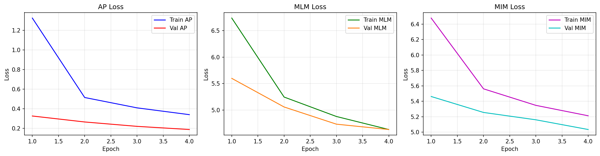<br>
    vs. <br>
    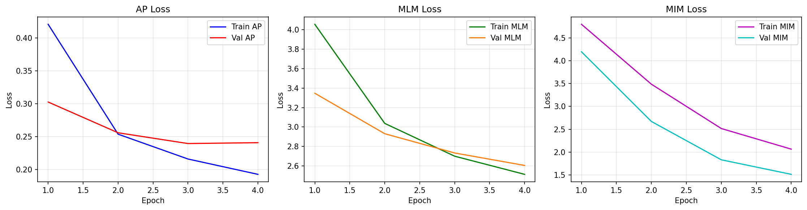<br>


</figure>

## 24.08
pretraining with ap alone does not work. over 300k samples and 4 epochs it does not learn anything:

```bash
2025-08-23 22:35:30 - INFO  - trainer.py:train:691 - Epoch 4/4,
    train loss MLM: 0.0000,
    test loss MLM: 10.5104,
    train loss AP: 0.6946,oss AP: 0.6946,
    accuracy AP: 0.4986
    train loss MIM: 0.0000,
```

ion: AP alone is too hard to train for. needs the other pretraining tasks!


```bash

Epoch 1/5, train loss: 0.6454, test loss: 0.6212,  accuracy: 0.6535
Layer 0 CKA alignment score: 0.0704
Layer 1 CKA alignment score: 0.0727
Layer 2 CKA alignment score: 0.0731
Layer 3 CKA alignment score: 0.0720
Layer 0 (cross-attn: False): CKA = 0.0704
Layer 1 (cross-attn: True): CKA = 0.0727
Layer 2 (cross-attn: False): CKA = 0.0731
Layer 3 (cross-attn: True): CKA = 0.0720
Epoch 2/5, train loss: 0.5965, test loss: 0.5645,  accuracy: 0.7229
Layer 0 CKA alignment score: 0.0759
Layer 1 CKA alignment score: 0.0746
Layer 2 CKA alignment score: 0.0779
Layer 3 CKA alignment score: 0.0776
Layer 0 (cross-attn: False): CKA = 0.0759
Layer 1 (cross-attn: True): CKA = 0.0746
Layer 2 (cross-attn: False): CKA = 0.0779
Layer 3 (cross-attn: True): CKA = 0.0776
Epoch 3/5, train loss: 0.5528, test loss: 0.5626,  accuracy: 0.7412
Layer 0 CKA alignment score: 0.0787
Layer 1 CKA alignment score: 0.0817
Layer 2 CKA alignment score: 0.0811
Layer 3 CKA alignment score: 0.0760
Layer 0 (cross-attn: False): CKA = 0.0787
Layer 1 (cross-attn: True): CKA = 0.0817
Layer 2 (cross-attn: False): CKA = 0.0811
Layer 3 (cross-attn: True): CKA = 0.0760
Epoch 4/5, train loss: 0.5223, test loss: 0.5519,  accuracy: 0.7353
Layer 0 CKA alignment score: 0.0811
Layer 1 CKA alignment score: 0.0862
Layer 2 CKA alignment score: 0.0805
Layer 3 CKA alignment score: 0.0831
Layer 0 (cross-attn: False): CKA = 0.0811
Layer 1 (cross-attn: True): CKA = 0.0862
Layer 2 (cross-attn: False): CKA = 0.0805
Layer 3 (cross-attn: True): CKA = 0.0831
Epoch 5/5, train loss: 0.4917, test loss: 0.5586,  accuracy: 0.7359
Layer 0 (cross-attn: False): CKA = 0.0868
Layer 1 (cross-attn: True): CKA = 0.0841:11<00:00,  3.97s/it]
Layer 2 (cross-attn: False): CKA = 0.0875
Layer 3 (cross-attn: True): CKA = 0.0848
Layer 0 CKA alignment score: 0.0868
Layer 1 CKA alignment score: 0.0841
Layer 2 CKA alignment score: 0.0875
Layer 3 CKA alignment score: 0.0848


Epoch 1/5, train loss: 0.6515, test loss: 0.6571,  accuracy: 0.6312:12<00:00,  4.02s/it]
Layer 0 CKA alignment score: 0.0153
Layer 1 CKA alignment score: 0.0183
Layer 2 CKA alignment score: 0.0179
Layer 3 CKA alignment score: 0.0157
Layer 0 (cross-attn: False): CKA = 0.0153
Layer 1 (cross-attn: True): CKA = 0.0183
Layer 2 (cross-attn: False): CKA = 0.0179
Layer 3 (cross-attn: True): CKA = 0.0157
Epoch 2/5, train loss: 0.6348, test loss: 0.6428,  accuracy: 0.6359
Layer 0 CKA alignment score: 0.0162
Layer 1 CKA alignment score: 0.0186
Layer 2 CKA alignment score: 0.0154
Layer 3 CKA alignment score: 0.0159
Layer 0 (cross-attn: False): CKA = 0.0162
Layer 1 (cross-attn: True): CKA = 0.0186
Layer 2 (cross-attn: False): CKA = 0.0154
Layer 3 (cross-attn: True): CKA = 0.0159
Epoch 3/5, train loss: 0.6070, test loss: 0.6238,  accuracy: 0.6647
Layer 0 CKA alignment score: 0.0162
Layer 1 CKA alignment score: 0.0170
Layer 2 CKA alignment score: 0.0173
Layer 3 CKA alignment score: 0.0142
Layer 0 (cross-attn: False): CKA = 0.0162
Layer 1 (cross-attn: True): CKA = 0.0170
Layer 2 (cross-attn: False): CKA = 0.0173
Layer 3 (cross-attn: True): CKA = 0.0142
Epoch 4/5, train loss: 0.5768, test loss: 0.6099,  accuracy: 0.6912
Layer 0 CKA alignment score: 0.0148
Layer 1 CKA alignment score: 0.0190
Layer 2 CKA alignment score: 0.0164
Layer 3 CKA alignment score: 0.0150
Layer 0 (cross-attn: False): CKA = 0.0148
Layer 1 (cross-attn: True): CKA = 0.0190
Layer 2 (cross-attn: False): CKA = 0.0164
Layer 3 (cross-attn: True): CKA = 0.0150
Epoch 5/5, train loss: 0.5560, test loss: 0.5981,  accuracy: 0.7018
Layer 0 CKA alignment score: 0.0166
Layer 1 CKA alignment score: 0.0181
Layer 2 CKA alignment score: 0.0164
Layer 3 CKA alignment score: 0.0160
Layer 0 (cross-attn: False): CKA = 0.0166
Layer 1 (cross-attn: True): CKA = 0.0181
Layer 2 (cross-attn: False): CKA = 0.0164
Layer 3 (cross-attn: True): CKA = 0.0160
```

lower alignment with pretraining! cosine similarity is higher after pretraining, also for hateful memes, where it was not pretrained, but cka is really lower.

Also implemented ckatorch integration.
the modules in `cka_wrapper.py`  wrap vilbert to one modality, so i can use ckatorch library. this library takes two models as input and calculates the batch cka for them. however, my tests found, that this is more or less the same as using cka_batch in my own implementation. the only point: they efficently use pytorch hooks to save memory.

## 18.08
easy similarity implementation with cosine-similarity lead to poor results on hatefulmemes:
```bash
2025-08-18 18:40:27 - INFO  - analysis.py:analyse:124 - Layer layer0 (cross attention): avg cosine similarity: -0.0169
2025-08-18 18:40:27 - INFO  - analysis.py:analyse:124 - Layer layer1 (cross attention): avg cosine similarity: -0.0050
2025-08-18 18:40:27 - INFO  - analysis.py:analyse:124 - Layer layer2 (cross attention): avg cosine similarity: 0.0123
2025-08-18 18:40:27 - INFO  - analysis.py:analyse:124 - Layer layer3 (cross attention): avg cosine similarity: 0.0212
2025-08-18 18:40:27 - INFO  - trainer.py:train:87 - Epoch 4/4, train loss: 0.4890, test loss: 0.5661,  accuracy: 0.7224
2025-08-18 18:40:27 - INFO  - evaluate.py:train_and_eval_on_downstream_task:118 - Training and evaluation on downstream task finished, cleaning up memory

```
- nearly no similarity, layers 0 and 2 are coattentions, the other dualselfattention
- tried comparison of cls and global avg pool => same bad results

=> problem of dataset? hateful memes might have complex alignment, more complex than conceptual captions?
- also: only small pretraining on home gpu, might need longer runs for real results; alignment might not happened yet?


## 17.08 - comparing different pretraining tasks
with frozen encoders in pretraining.


**Task Combinations Tested:**
1. **Baseline**: No pretraining
2. **All Tasks**: MIM + MLM + AP
3. **Two Tasks**: MLM + AP (no MIM)
4. **Single Task**: AP only

**Findings:**

| Pretraining Tasks | Downstream Accuracy (Final) | Improvement over Baseline |
|-------------------|----------------------------|--------------------------|
| **None (Baseline)** | 67.5% ± 0.7% | - |
| **All (MIM+MLM+AP)** | **69.7%** | **+2.2%** |
| **MLM + AP** | **71.0%** | **+3.5%** |
| **AP Only** | **70.8%** | **+3.3%** |


**Pretraining Task Analysis:**

**Alignment Prediction (AP) Performance:**
- All tasks: 80% → 86% accuracy
- MLM + AP: 82% → 87% accuracy
- AP only: 83% → **88%** accuracy (best)


running the pretraining on 125k images with all three pretraining tasks resulted in this pretraining loss:

<figure>
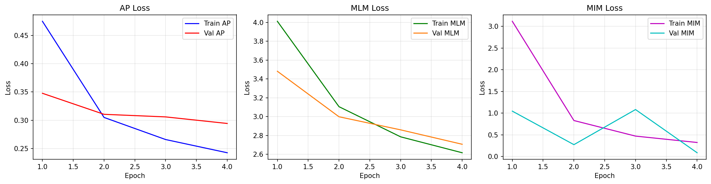
</figure>

```
2025-08-13 15:45:10 - INFO  - trainer.py:train:518 - training with tasks: [<Task.ALIGNMENT_PREDICTION: 1>, <Task.MASKED_LM: 2>, <Task.MASKED_IM: 3>]
2025-08-13 17:41:13 - INFO  - trainer.py:train:566 - Epoch 1/4,
    train loss MLM: 4.0114,
    test loss MLM: 3.4809,
    train loss AP: 0.4748,
    test loss AP: 0.3476,
    accuracy AP: 0.8484
    train loss MIM: 3.1180,
    test loss MIM: 1.0458
2025-08-13 17:41:16 - INFO  - trainer.py:__save_checkpoint:612 - Checkpoint saved to res/checkpoints/pretrained_1.pt
2025-08-13 19:37:17 - INFO  - trainer.py:train:566 - Epoch 2/4,
    train loss MLM: 3.1049,
    test loss MLM: 2.9979,
    train loss AP: 0.3050,
    test loss AP: 0.3105,
    accuracy AP: 0.8682
    train loss MIM: 0.8290,
    test loss MIM: 0.2725
2025-08-13 19:37:20 - INFO  - trainer.py:__save_checkpoint:612 - Checkpoint saved to res/checkpoints/pretrained_2.pt
2025-08-13 21:33:23 - INFO  - trainer.py:train:566 - Epoch 3/4,
    train loss MLM: 2.7849,
    test loss MLM: 2.8589,
    train loss AP: 0.2659,
    test loss AP: 0.3059,
    accuracy AP: 0.8666
    train loss MIM: 0.4698,
    test loss MIM: 1.0823
2025-08-13 21:33:26 - INFO  - trainer.py:__save_checkpoint:612 - Checkpoint saved to res/checkpoints/pretrained_3.pt
2025-08-13 23:29:30 - INFO  - trainer.py:train:566 - Epoch 4/4,
    train loss MLM: 2.6156,
    test loss MLM: 2.7057,
    train loss AP: 0.2426,
    test loss AP: 0.2943,
    accuracy AP: 0.8787
    train loss MIM: 0.3226,
    test loss MIM: 0.0857
```


on the downstream task it achieved, with encoders frozen:
```
❯ python src/evaluate.py --path res/checkpoints/pretrained_4.pt
Model loaded from res/checkpoints/pretrained_4.pt, epoch 3
Loaded model from res/checkpoints/pretrained_4.pt with config: {'embedding_dim': 768, 'vocab_size': 30522, 'num_hidden_layers': 12, 'num_attention_heads': 12, 'dropout_prob': 0.1, 'learning_rate': 3e-05, 'img_size': (224, 224), 'preprocessed_path': 'res/preprocessed.pkl', 'train_test_ratio': 0.8, 'batch_size': 32}
trainable params: 42705468/237986364
Epoch 1/4, train loss: 0.6365, test loss: 0.6183,  accuracy: 0.6576
Epoch 2/4, train loss: 0.5943, test loss: 0.5932,  accuracy: 0.6753
Epoch 3/4, train loss: 0.5659, test loss: 0.5823,  accuracy: 0.6818
Epoch 4/4, train loss: 0.5404, test loss: 0.5725,  accuracy: 0.7035
❯ python src/evaluate.py --path res/checkpoints/pretrained_1.pt
Model loaded from res/checkpoints/pretrained_1.pt, epoch 0
Loaded model from res/checkpoints/pretrained_1.pt with config: {'embedding_dim': 768, 'vocab_size': 30522, 'num_hidden_layers': 12, 'num_attention_heads': 12, 'dropout_prob': 0.1, 'learning_rate': 3e-05, 'img_size': (224, 224), 'preprocessed_path': 'res/preprocessed.pkl', 'train_test_ratio': 0.8, 'batch_size': 32}
trainable params: 42705468/237986364
dirname:  res/data/hateful_memes_data
Epoch 1/4, train loss: 0.6353, test loss: 0.6286,  accuracy: 0.6535
Epoch 2/4, train loss: 0.5980, test loss: 0.6170,  accuracy: 0.6665
Epoch 3/4, train loss: 0.5668, test loss: 0.5937,  accuracy: 0.7000
Epoch 4/4, train loss: 0.5389, test loss: 0.5853,  accuracy: 0.7041
```


Running `train_and_eval_on_downstream_task` with randomly initialized cross-attentions and 4 epochs gives the following results.
```
Epoch 1/4, train loss: 0.6354, test loss: 0.6107,  accuracy: 0.6829
Epoch 2/4, train loss: 0.5859, test loss: 0.5861,  accuracy: 0.6994
Epoch 3/4, train loss: 0.5509, test loss: 0.5803,  accuracy: 0.7076
Epoch 4/4, train loss: 0.5324, test loss: 0.5775,  accuracy: 0.7100
```


Then I pretrained on 200k subset from CC for 4 epochs.
Afterwards I trained again for 4 epochs on the downstream task, which gives the following results:
```
# pretrain
Epoch 4/4,
        train loss AP: 0.2628,
        train loss MLM: 3.2051,
        test loss AP: 0.2891,
        test loss MLM: 3.1713,
        accuracy AP: 0.8816
# finetune
Epoch 1/4, train loss: 0.6208, test loss: 0.5848,  accuracy: 0.6935
Epoch 2/4, train loss: 0.5514, test loss: 0.5547,  accuracy: 0.7118
Epoch 3/4, train loss: 0.5058, test loss: 0.5308,  accuracy: 0.7335
Epoch 4/4, train loss: 0.4704, test loss: 0.5292,  accuracy: 0.7371
``` -->
